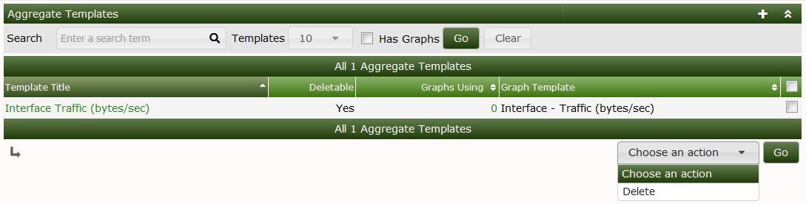
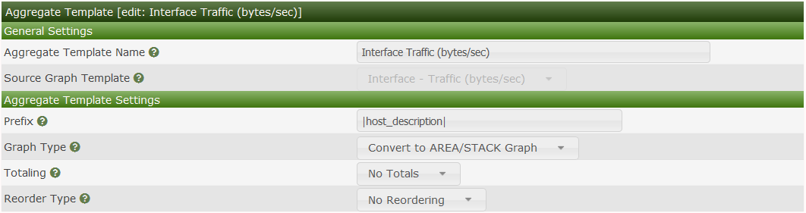
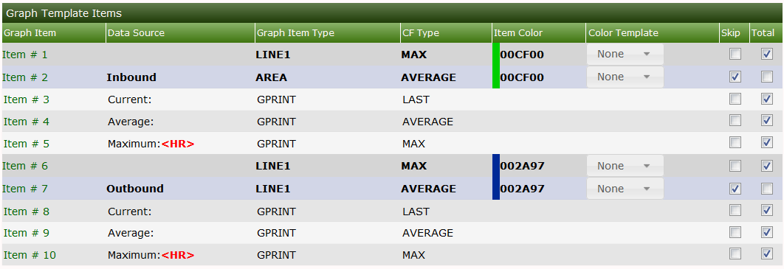
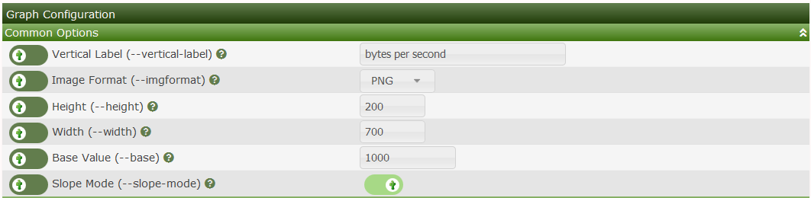
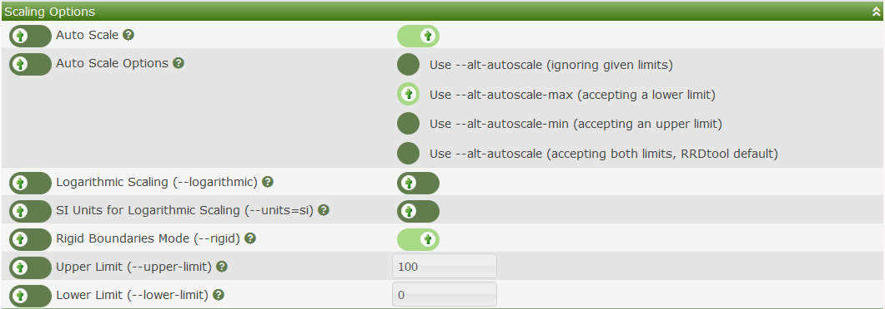
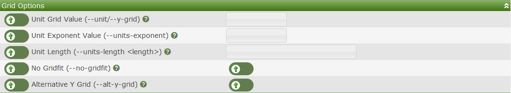
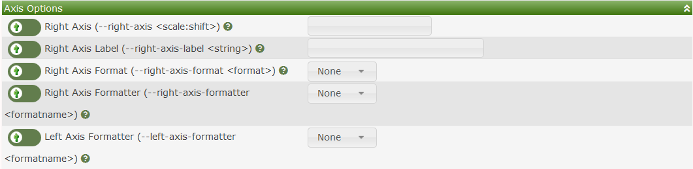
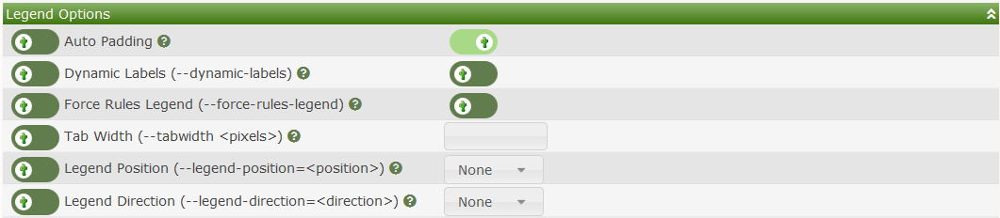

# Aggregate Templates

## Aggregate Overview

**Aggregate Templates** are a special form of a **Graph Template**.  They
allow you to easily create **Graphs** that combine data from multiple common
**Graphs** from multiple **Devices**, and allow you to easily manage the
resulting **Aggregate Graphs** to add and remove elements from other
common **Graphs**.

To create **Aggregate Graphs** that are managed through a Template, you first
must create the **Aggregate Template**, and then from the Cacti
**Graphs** page, you can select the **Graphs** that you want used as part of
the **Aggregate**, and then select `Create Aggregate from Template` from the
Cacti Actions drop-down.

Once you have created your **Aggregate Graphs**, they behave like any other
Cacti Graph, they can be a part of a Tree, zoomed, etc.  They have an added
bonus, that you can add and remove **Graphs** from there in a very controlled
way, reducing the effort to maintain them during their life-cycle.

If you wish to change settings for **Graphs** managed by the
**Aggregate Template**, simply make the changes there, and they will cascade to
**Aggregate Graphs** managed by the Template.

## Aggregate Template Interface

The images below shows an Aggregate Template for Traffic.

When you edit the **Aggregate Template**, you are presented with an interface
that allows you to define the Graph Canvas as well as it's formatting.
You should experiment until you find the mechanism that works best to suite
your needs.

The `Aggregate Template` `Prefix` setting allows you to provide a pattern to
be applied to the **Aggregate Graph** legend items.  Any `host`, `query` or `input`
references can be used in the `Prefix` section in order to uniquely identify
the **Graph Item**.

There are several `Graph Types` transformations that deal with how `AREA`, `LINEX`
and `STACK` items are handled in the resulting **Aggeregate Graph**, they include:

- **Keep Graph Types** - No transformation will occur.  All `AREA`, `LINE`, and `STACKS`
  will be unchanged.
- **Keep Type and Stack** - Which means the types will be preserved, but all data
  will be stacked instead of simply LINEX it will be transformed to LINEX:STACK
- **Convert to Area/STACK Graph** - All `LINEX` will be converted to `AREA` and
  stacked.
- **Convert to LINE1** - All **Graph Items** will be converted to `LINE1`
- **Convert to LINE2** - All **Graph Items** will be converted to `LINE2`
- **Convert to LINE3** - All **Graph Items** will be converted to `LINE3`
- **Convert to LINE1/Stack** - All **Graph Items** will be converted to `LINE1`
  and stacked.
- **Convert to LINE2/Stack** - All **Graph Items** will be converted to `LINE2`
  and stacked.
- **Convert to LINE3/Stack** - All **Graph Items** will be converted to `LINE3`
  and stacked.

The `Totaling` setting has multiple values.  They include:

- **No Totals** - There will be no Summation of Data in the Legend
- **Print All Legend Items** - Means that all Legend Items selected will be
  included with a Total
- **Print Totaling Legend Items Only** - This option means that the Legend will
  total all the Legend items into a single Legend.

The `Total Type` - Will create groupings of common elements on the **Graph**,
and reset stacking rules when a change in the common element occurs.  The
options include:

- **Total Similar Data Sources** - Means that you will Total legend items and
  **Data Sources** through similar **Data Source** names, for example `traffic_out`
  and `traffic_in`.
- **Total All Data Sources** - It means that you will sum the values for all
  **Data Sources** regardless of their **Data Source** name.

When using `Total Type`, you are provided an option to additionally prefix your
legends using the `Prefix for GPRINT Totals` with a text value.  The default
works in most cases.

The `Reorder Type` will re-order the **Data Sources** within their respective
grouping on the Graph so that they are ordered in a common way, in alphabetic
order.  The options include:

- **No Reordering** - Don't make any changes in ordering.
- **Data Source, Graph** - Order by **Data Source** name and then by **Graph** name
- **Graph, Data Source** - Order by **Graph** name and then by **Data Source** name
- **Base Graph Order** - Focus on the **Graph** name only

The `Graph Template Items` section allows you to either Skip or Total (aka include)
The **Graph Items** in the resulting **Aggregate Graphs**.  When you think about
how a resulting **Aggregate** graph will look, there are some elements that simply
will not result in a very well looking **Graph**.  So, in those cases, you will
want to remove them from the resulting **Aggregate Graphs**.

The `Color Template` option allows you to use differing Color rotations when
displaying elements on the resulting **Aggregate Graphs**.  **Color Templates**
can be added and removed from the **Color Templates** menu pick
under `Console > Templates`.

The several sections allow you to override any of the common **Graph Template**
elements from the resulting **Aggregate Graph**.  We will not explain those options
here, only let you know that you can override them in your resulting
**Aggregate Graph**.

## Summary

As previously mentioned, there are several combinations of options that you
can use when working with an **Aggregate Template**.  Some of these options will
results in horrible and unexpected outcomes, so you will have to experiment
until you come up with a desirable **Aggregate Template**.

---
Copyright (c) 2004-2021 The Cacti Group
