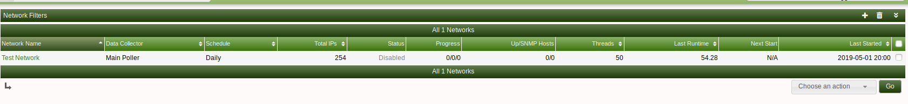

# Automation Networks

This section will describe **Automation Networks** in Cacti.

Adding a network to scan in the automation plugin is easy. On the main console
click Automation. Once on the below page click the + on the top right of the page.

You will now see the below page. If you want to scan 192.168.1.0/24, you would
 enter that in the subnet range textbox then enter the subnet in CIDR format.

Other important options are

Optiom | Descriptiom
--- | ---
Schedule type | How often you want to scan this subnet for devices
Discovery threads | How many proccessess to spawn during the scan
Max Runtime | to prevent the scan from running indefinitely
Automatically add to Cacti | If a device is SNMP reachable and matches a rule from this subnet the device will be added
Netbios | Attempt to resolve the hostname by netbios

After you are done adding your network details, ensure you enable the rule and
save.

Ensure that if you have a SNMP rule for this part of the network to select the
SNMP option set this will tie the network to the SNMP rules

To begin the scanner click on the bottom right drop down and select "Discover
Now" this will start the discovery

Here is the flow of the automation scan

---
<copy>Copyright (c) 2004-2023 The Cacti Group</copy>
