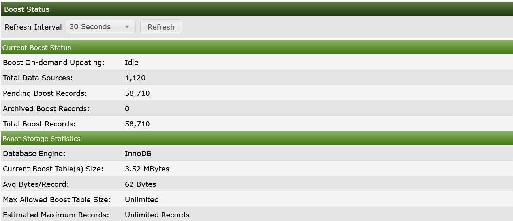
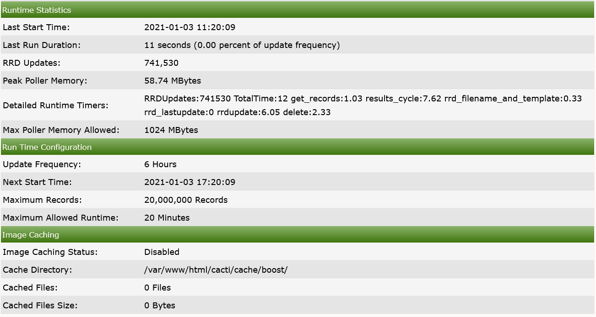
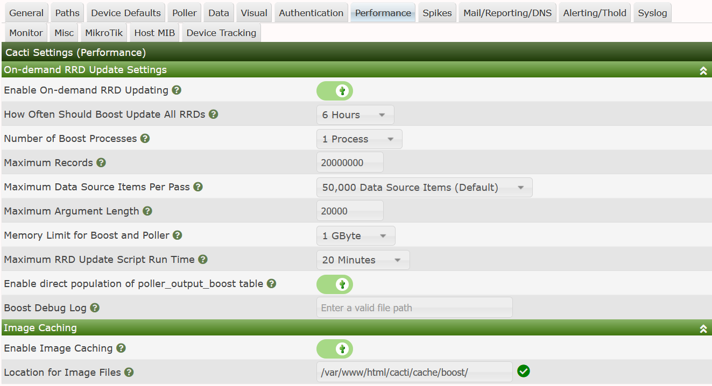

# Performance Boosting Settings

## Summary

Cacti Performance Settings, formally known as `boost` are available to support
very large Cacti installations, and are required for supporting the multiple
**Data Collector** architecture that Cacti affords.  Designed years ago,
Boosts intent was to reduce the the main data collectors cycle time by caching
writes to disk, and those writes would be handled by an out of band process
currently known as `poller_boost.php`.  Since these Large Sites had
potentially well over one million **Data Sources**, there was previously
no way to write all that data every 5 minutes.  So, the buffering helped
with maintaining a consistent run-time, and minimizing the user experience
disruption from all that blocking Disk I/O.

In the modern Data Center, where we find an abundance of NVMe, Flash,
and SSD's, the impact of all that I/O has been reduced. However, Boost now
serves as a way to extend the life of your Flash media and therefore increase
the availability of your Cacti server over its lifetime.

The Boost function in Cacti has several features that can be enabled or
disabled on demand by the Cacti Administrator.  They include:

- **On Demand RRD Updates** - Required in ALL multiple **Data Collector**
  installs and control the mass update of RRDfiles through periodic dumping
  of Cacti's Boost cache.
- **Image Caching** - caches PNG and SVG representations of the
  Cacti **Graphs** to reduce the overall CPU utilization of the Cacti server
  infrastructure.

## Prerequisites

In its initial design the Boost process leveraged MySQL Memory Tables to
increase overall performance, and to reduce writing data to disk.  This is
still a valid case however, with improvements in InnoDB performance over the
years combined with Flash storage, the need for using MySQL Memory Tables
has diminshed.  In some cases, for example when using MariaDB Galera, or
MySQL Master/Slave replication, it can not be used.

If you do wish to use Memory you have to pay close attention to the
amount of data that will be cached in your design.  You should periodically
check that you have sufficient memory available to cache all the data in the
Boost cache.  The MySQL/MariaDB setting that controls the maximum size of a
memory table is the `max_heap_table_size` setting in your
`/etc/my.cnf.d/server.cnf` file.

To change the `max_heap_table_size` setting you require a restart of 
MySQL/MariaDB.  So you won't want to make these changes often, 
as some systems have little time between mass updates to perform a restart.  
If you restart MySQL/MariaDB when the cache is full, you will lose those 
updates upon restart unless you first change the ENGINE of the Boost cache 
table to InnoDB or MyISAM before restarting.

When using Memory Tables you have to be cognizant of the maximum output
width of the Cache table called `poller_output_boost`.  By default, it's set
to 512 bytes, which allows for very wide output from your **Data Collectors**.
MySQL Memory Tables do not allow for variable sized columns in memory - 
which means if you write one byte to it, it will take 512 bytes.  So, tuning
this width is very important.  That will be explained in more detail later on
in this chapter.

To see how your system is configured, you can goto
`Console > Utilityes > System Utilities > View Boost Status` option, when you
go there, you will see an image similar to that below.

From this image, we can tell a few things:

- Boost is Idle, or flushing the Cache
- The system has 1,120 Data Sources in total
- There are currently 58,710 Boost records cached in all tables

Additionally, you can tell

- Our Current Database Engine is InnoDB
- The size of the current table is 3.52 MBytes
- The average 'Bytes/Record' is 62
- We have unlimited Records that can be stored there

From that Data, we know if we were to use a Memory Table, at present
it's width could be say 100 Bytes and we could cut memory use by 80%.

We can also estimate from this interface, how large our `max_heap_table_size`
would ultimately have to be, keeping in mind that the
`Current Boost Table Size` is misleading since even though each record
can be in excess of 512 bytes, it's presently only using 62 bytes of
total storage per record.



In the image below, you can see runtime statistics, update frequencies, and
Image Caching settings, which are currently disabled.

From this setup, you can see that mass RRDfile updates are only
happening roughly every 6 hours to minimize wear and tear on the SSD
storage in use.



## Enabling Boost

To find and Enable the Boost settings, you first go to
`Console > Configuration > Settings > Performance`.
From this interface, in the image below, you can setup Boost.



As an exercise, lets look at a fictitious setup and determine what
the `max_heap_table_size` should be.  Let's say, for example, that your
Cacti systems **Poller Cache** contains 200k rows, and the maximum length
of any rows output is 20 bytes, about the size of a 64bit counter value.

If you are running scripts, ones that return very long results,
like the MySQL statistics plugin, you should consider carefully the
next step.

In this case, we will assume that even though the largest value returned
is 20 bytes, we will elect to maintain a maximum output column
width of 50 bytes.

The important thing here is that memory tables store the full size of
the column, even though the column type is `varchar()`. By default it's
`varchar(512)`. Therefore, if your system only needs 50 bytes, you will
have 90% waste in your `poller_output_boost` table.

The next step would me to modify the structure of your `poller_output`
and `poller_output_boost` tables. You would do this by doing the following:

```sql
ALTER TABLE poller_output,
	MODIFY column output varchar(50) NOT NULL default ""
	ENGINE=memory;

ALTER TABLE poller_output_boost,
	MODIFY column output varchar(50) NOT NULL default ""
	ENGINE=memory;
```

As previously mentioned, its also important that the `poller_output` table
is converted to memory, eliminate any disk I/O related to poller updates.

Now, you need to determine how many polling cycles will fit into your
`poller_output_boost` table. In this case, when sizing the `poller_output_boost`
table, you take the output column width and add 34 bytes per record.
So, in this case, each data source result to be stored in the
`poller_output_boost` table would take 84bytes.

Then, with the Maximum Heap Table size in hand, and let's say the
default is 16MBytes for the largest table (the MySQL default), you can
calculate the number of poller intervals that you can store without
running out of MySQL memory. So, let's take our example:

```console
200k Cache Entries x 84 Bytes Per Poller Cache Row = 1,680,000 Bytes per Poll
```

This means that your `poller_output_boost` can handle 10 Cacti polling cycles,
or roughly 4/5 of an hour of poller data before it must be cleared by the system.

As all things go, you should not want to take your system to the edge.
So, it is best to increase the `max_heap_table_size` of your system to ensure
you have buffer in cases where say for example, your disks become degraded over
time and the Boost cycle is extended as a result.

But let's look at the problem a different way. Let's say that you wish to
perform major updates every 4 hours. With a 50% memory reserve, we should
plan for 6 hours of updates. This way, we need to have size for 72 poller
cycles in your `poller_output_boost` table. This means that the
`max_heap_table_size` must be at least 131,040,000 Bytes.

So, let's call it a deal. Provided you have enough memory, and I expect
that you do, you would edit the /etc/my.cnf.d/server.cnf and add/modify
the following line:

```console
max_heap_table_size=132M
```

Then, save the file, and restart MySQL. Once this is done, you are ready
to “enable” Boost as described above.

## Flushing the Boost Cache

If you are planning on system maintenance if you are using MEMORY storage
in MySQL or MariaDB, you should flush your Boost Cache before your system
is taken offline for maintenance.  To do this, you simply login to the
Cacti system as root, and flush the Cache using the commands below

```console
cd /var/www/html/cacti
php -q poller_boost.php --force
```

This operation will take several minutes to complete, at which time there
will be additional records in the `poller_output_boost` table.  So, it
might be better that after the `poller_boost.php` process is complete,
to modify the `poller_output_boost` table to InnoDB before reboot,
and then convert it back to memory after they system maintenance is
complete.
