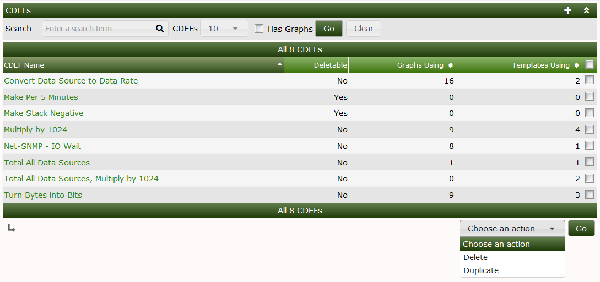
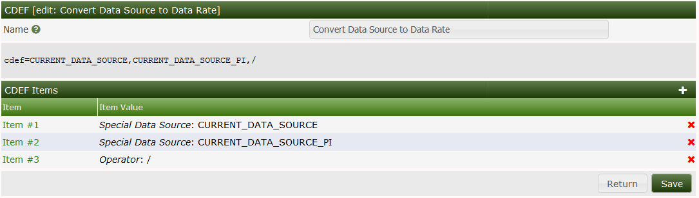
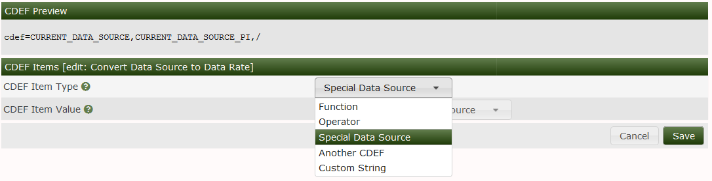
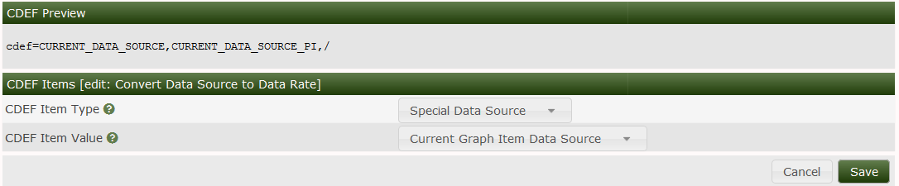

# CDEFs

## Background

CDEF's in Cacti are a one to one analog to CDEF's in RRDtool.  Cacti
simply provides an interface to create and manage them.  Once the
CDEF's are created in Cacti they can be imported and exported globally.

CDEF's are mathematical formulas that either modify the numeric data from
one to many data sources or VNAMES that you have in your **Graph Template**.

The format of the mathematical formulas is called Reverse Polish Notation (RPN).
RPN was and is an early form of how Engineers entered equations into early
HP and other Calculators to solve Engineering problems.  The reason we still
use it today is that it follows a simple Stack principle.  In other words,
it's not broken.

CDEF's can get very complex as there are several mathematical functions
available in the RRDtool command set.

## CDEF Interface

In the image below, you can see all the CDEF's that are included in Cacti by
default.  There are quite a few of them.  Many of the formulas in use are quite
simple.  If you want to view Tutorials on how to work with CDEF's you should
go to the [RRDtool Tutorial](https://oss.oetiker.ch/rrdtool/tut/cdeftutorial.en.html).
There is also documentation at the [RRDtool Website](https://oss.oetiker.ch/rrdtool/doc/rrdgraph_data.en.html#CDEF).

In this image you can see that you have the ability to Delete or Duplicate a CDEF,
but note you will not be able to Delete any CDEF that is associated with a Cacti
**Graph** or **Graph Template**.

When you Click on the CDEF's name, you will enter into an Edit screen.  From there
you will see an ordered list of your Stack.  It normally will begin with something
like the CURRENT_DATA_SOURCE which means that when you Add a **Graph Item** to
either a **Graph Template** or **Graph**, you can select a CDEF.  The
**Data Source** associated with that **Graph Item** is the CURRENT_DATA_SOURCE.

After that, you may see a number, followed by a math operator.  That is the
simplest form of a CDEF.  If you have drag & drop enabled, you can re-order the
CDEF items using drag & drop.  Otherwise you will see arrows that allow you
to move the CDEF Items up and down.

When editing a CDEF, the first decision is what Type of Data you want to put on
the Stack.  Your options are shown in the image below.  They include:

Name | Description
--- | ---
Function | A mathematical function that we will describe below
Operator | Common mathematical operators including (+, -, *, /, and %)
Another CDEF | Another Cacti CDEF.  That could be confusing
Special Data Source | A value drawn from the Graph, the Data Source, or the poller, described below
Custom String | Something like a number, a 'U' or 'Nan' for example

## Special Data Sources

In this next image, you will find a CDEF Item in the process of being added.  Note
that when you pick `Special Data Source` you have a drop-down that appears with
the flavor of `Special Data Source`.  There are many.  They include:

Name | Description
--- | ---
Current Graph Item Data Source | The value of the Data Source associated with the Graph Item
Current Graph Item Polling Interval | This value is otherwise known as the Step in RRDtool terminology
All Data Sources (Do not Include Duplicates) | The total of all Data Sources removing any duplicate DEF's
All Data Sources (Include Duplicates) | Add the values from all the Data Sources whether or not they are duplicated
All Similar Data Sources (Do not Include Duplicates) | Means all Data Sources with the same RRDtool Data Source name like traffic_in, and traffic_out
All Similar Data Sources (Do not Include Duplicates) Polling Interval | The max of the poller intervals returned from all similar Data Sources
All Similar Data Sources (Include Duplicates) | Add the values from all similar Data Sources whether or not they are duplicated
Current Data Source Item: Minimum Value | The RRDtool minimum value of the Current Data Source
Current Data Source Item: Maximum Value | The RRDtool maximum value of the Current Data Source
Current Data Source Item: Least Squares Line Function | The RRDtool LSLINT, LSLSLOPE and LSLCORREL set as a least squares line
Current Data Source Item: Least Squares Line Y-intercept | The y-intercept of the least squares line for the Current Data Source
Current Data Source Item: Least Squares Line Slope | The slope of the least squares line for the Current Data Source
Current Data Source Item: Least Squares Line Correlation Coefficient | The correlation coefficient of that least squares line
Graph: Lower Limit | The lower Limit of the Graph
Graph: Upper Limit | The upper Limit of the Graph
Count of All Data Sources (Do not Include Duplicates) | The total count of all Data Sources without Duplication
Count of All Data Sources (Include Duplicates) | The total count of all Data Sources including Duplicates
Count of All Similar Data Sources (Do not Include Duplicates) | The total count of Data Sources with the same RRDtool Data Source Name, counted once each
Count of All Similar Data Sources (Include Duplicates) | The total count of Data Sources with the same RRDtool Data Source Name, including Duplicates

As you can see there is quite a bit of information that can be pulled from
RRDtool for performing Graphical manipulation of Data.

## CDEF Functions

This list of CDEF functions is long and it's best to refer directly to the
[RRDtool Manual](https://oss.oetiker.ch/rrdtool/doc/rrdgraph_rpn.en.html) for meanings
and examples of their use.  Cacti supports most of them.  If you find one that
is not supported, open an [Issue on GitHub](https://github.com/Cacti/cacti/issues).

---
Copyright (c) 2004-2026 The Cacti Group
