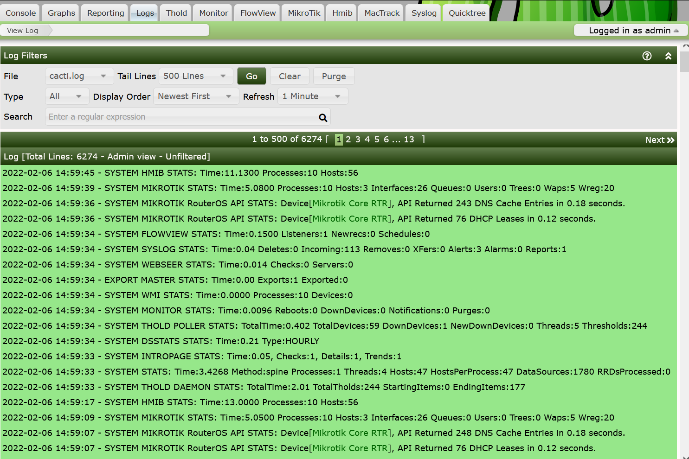

# The Cacti Log Interface

## Summary

The Cacti Log is where all Cacti statistics, warnings, errors and other log messages
are sent to. Cacti can optionally log some information to your syslog or event log
depending on your OS type.

The Cacti Log is by default ordered from newest event to oldest event, a
nd the Cacti Log is rotated by Cacti itself once a day.

If you have the User Level permission, you can view any available Cacti Stadard
Output or Standard Error log. If you have the Administrative level access,
you may additionally purge information from the logs.

As a Cacti Administrator, you have the ability to filter out some message types
from users for example, one message type that people like to filter out is
"AUTH" messages that tell you who is logging into the Cacti Web Site.
You can edit these removal rules from the Cacti Settings page.

An image of the Cacti Log file can be seen below.

## Cacti Log Filters

What we like to see in the Cacti Log is a lot of Green, which means good. By default,
WARNINGS are yellow, and ERRORS are red. But there are other types of messages
that highlight differently. Generally, you can filter for these message types.
The filters include:

- **File** - The Cacti Log file to view. They are suffixed by a data when they were rotated
  using the following pattern: YYYY-MM-DD.
- **Tail Lines** - The number of lines to view from the selected Cacti Log.
- **Types** - The message types to view. These will be explained below.
- **Display Order** - The order to display the Log lines, either *Newest First* or *Oldest First*.
- **Refresh** - How often to Auto-refresh the interface.
- **Search** - A perl compatible Regular Expression to search the log with.

The Cacti Log **Types** include the following:

- **Stats** - Anything that includes the word **STATS**
- **Warnings** - Anything that includes the word **WARNING**
- **Warnings++** - Anything of each **WARNING**, **ERROR**, **DEBUG**, and **SQL**
  this one is good for debugging, and it will include most important
  errors to the Cacti Administrator.

- **Errors** - Anything that includes the word **ERROR**
- **Errors++** - Anything of each **ERROR**, **DEBUG**, and **SQL**
- **Debug** - Anything that includes the word **DEBUG**
- **AutoM8** - Anything that includes the word **AUTOM8**. These message come from
              Cacti automation of Devices, Graphs, and Trees
- **Non Stats** - Anything that does not include the word **STATS**.
- **Boost** - Anything that contains the word **BOOST**.
- **Device Up/Down** - Any device Up/Down notification including t
                       hose that come from *Thold* or *Monitor* Plugins.
- **Recaches** - Any Device Recache Events.
- **Threshold** - If the *Thold* plugins is installed,
                  any of it's threshold breach and restoration events.

## Differences between User and Administrative Views

As previously mentioned, the Cacti log has two permission levels,
the User Permission level will not include the *Purge* button,
and can have some information hidden from public view
whereas the Administrative view includes all Log messages and a *Purge** button.

---
Copyright (c) 2004-2023 The Cacti Group
