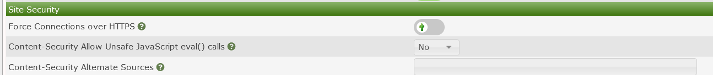

### Configuring and enabling SSL for Cacti with a self signed certificate

Enabling SSL for cacti is mostly done at the webserver level an example SSL configuration
for Http is as follows


```console
yum install -y mod_ssl -y

openssl genrsa -out ca.key 2048 
openssl req -new -key ca.key -out ca.csr
openssl x509 -req -days 700 -in ca.csr -signkey ca.key -out ca.crt
cp ca.crt /etc/pki/tls/certs
cp ca.key /etc/pki/tls/private/ca.key
cp ca.csr /etc/pki/tls/private/ca.csr
```

Then we need to update the Apache SSL configuration file

```console
vi +/SSLCertificateFile /etc/httpd/conf.d/ssl.conf
SSLCertificateFile /etc/pki/tls/certs/ca.crt
SSLCertificateKeyFile /etc/pki/tls/private/ca.key
```

restart the httpd service

```console
systemctl restart httpd
```

After you have configured the web server to accept https you can force https in the Cacti GUI
#### Warning if you are using multiple pollers ensure all pollers have HTTPS enabled or remote polling feature will not work




#### Note: If your Cacti system is public it is recomended to get a certificate from a trusted certificate provider
