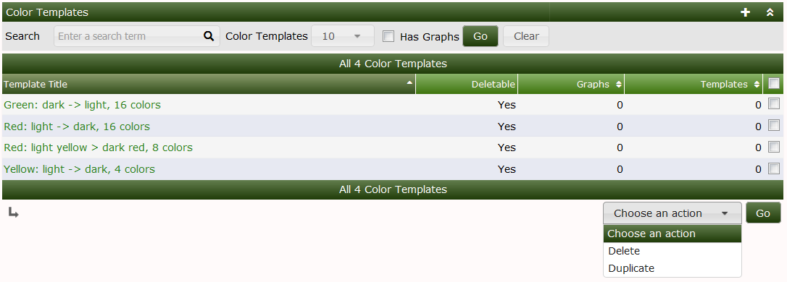
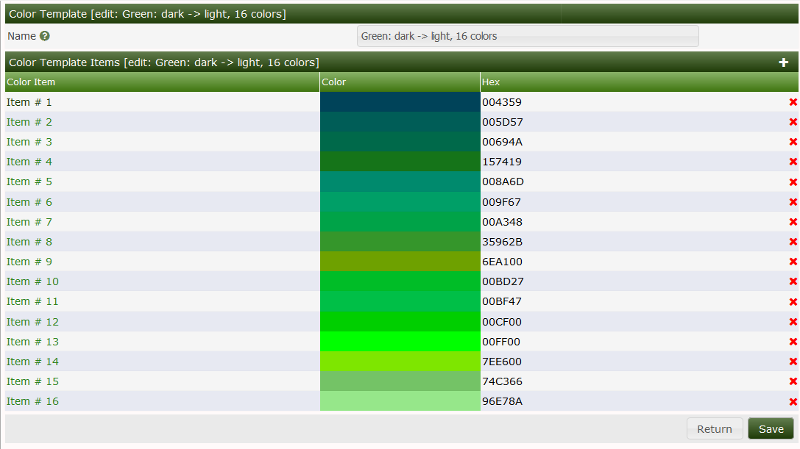
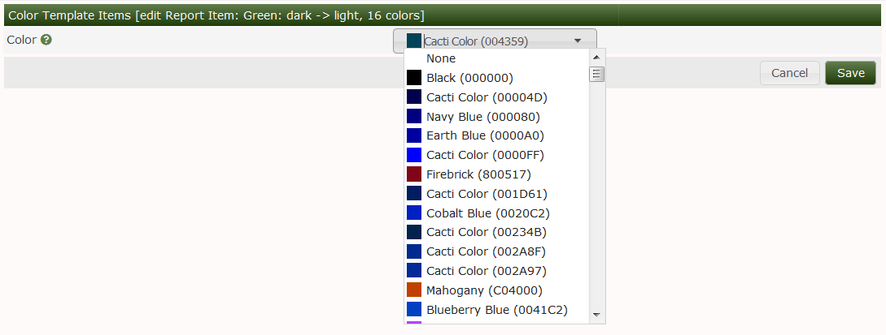

# Color Templates

**Color Templates** define a list of Colors to be used for **Aggregate Graphs**
in Cacti.  As you add **Graphs** to an **Aggregate Graph**, you need to
distinguish one **Graph** from the next within the **Aggregate Graph**.  These
**Color Templates** are a list of colors that will be looped through in Round
Robin fashion to render the **Aggregate Graph**.

So, for example, if your **Color Template** uses 8 differing **Colors**, and
your **Aggregate Graph** includes 16 *Graph Items*, then each color will be used
twice in the **Aggregate Graph**.

Below, you can see the four standard **Color Templates**, you can see that you
have the ability to either *Delete* or *Duplicate* the **Color Templates**.  As
with other Cacti objects, you will not be allowed to *Delete* a **Color
Template** in use.

In the image below, you can see the **Color Template** edit screen.  This simply
screen allows you to add, remove and re-order colors in the list.

Shown in the image below, only Cacti **Colors** are allowed to be selected for
Aggregate **Color Templates**.  The **Color** drop down can by typed into if you
wish to search through the list of approximately 340 legacy and *Named Colors*.

---
Copyright (c) 2004-2023 The Cacti Group
