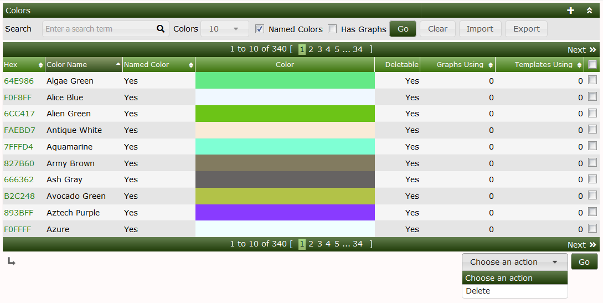
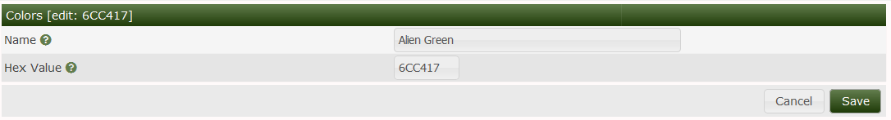
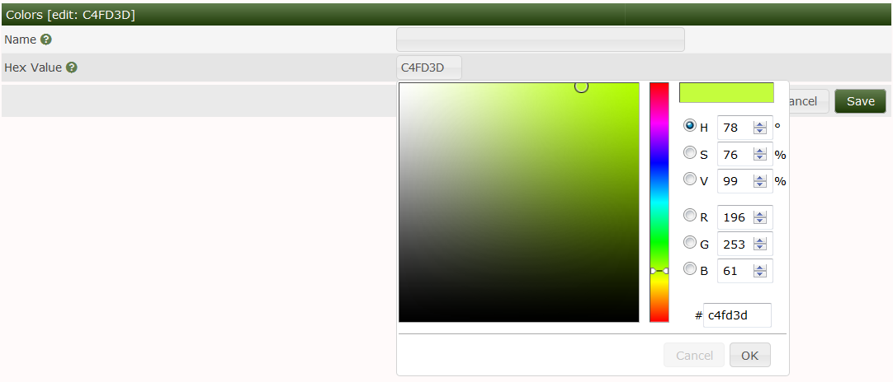

# Colors

Colors in Cacti come in two types and used to maintain a list of colors that can
be used in Cacti for **Graph Templates** and **Graphs**.

The first type are the legacy Cacti colors imported from earlier versions of
Cacti. Starting with Cacti 1.0, Cacti started to support the concept of *Named
Colors* which come from a well known dictionary of well defined colors.  *Named
Colors* are read only in Cacti. While the legacy Cacti colors can be named as
the Cacti administrator desires.

The image below shows a list of Cacti *Named Colors*.  You can see that there is
a search bar and check boxes for showing just *Named Colors* or all colors, and
another check box for showing Colors that are used in **Graph Templates** and
*Graphs*.  You can not remove either the *Named Colors* or Colors that are in
use by either a **Graph Template** or **Graph**.

The image below is the Color edit screen.  If the color is read only, you can
open this page, but not change any of the details.  For legacy Cacti colors, or
for Colors added by the Cacti Administrator, you can change the name and the
Color hex value.

Below, you can see the color picker that allows you to visually find the
appealing color.  You can also use hex values that were previously supported in
earlier Cacti version.

---
Copyright (c) 2004-2019 The Cacti Group
