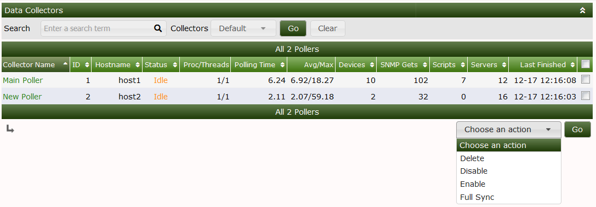
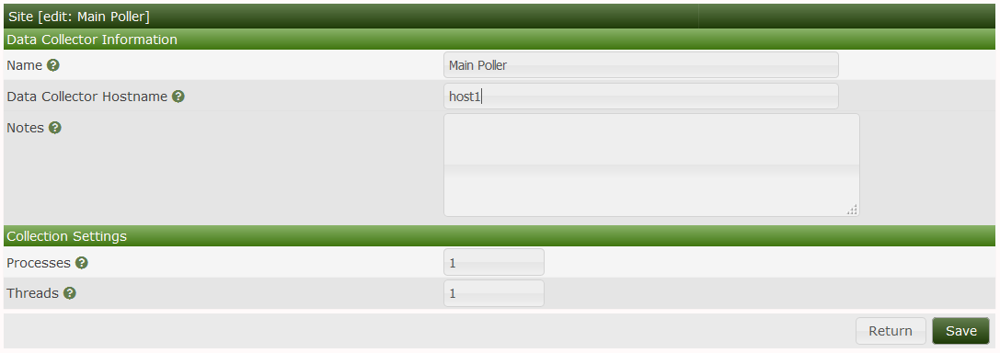
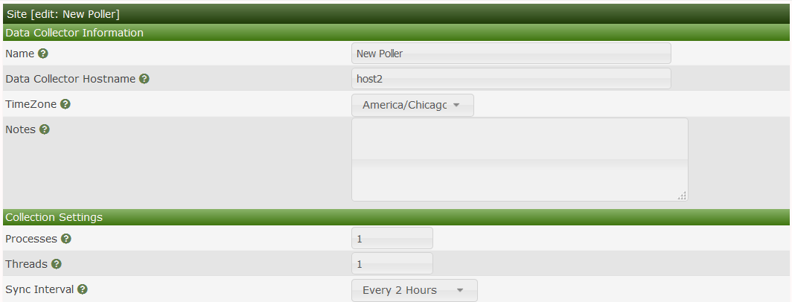
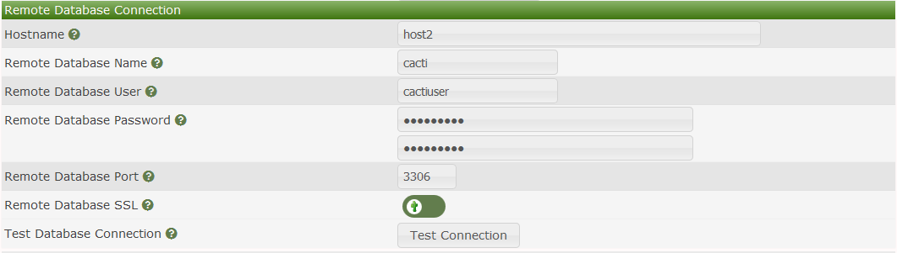
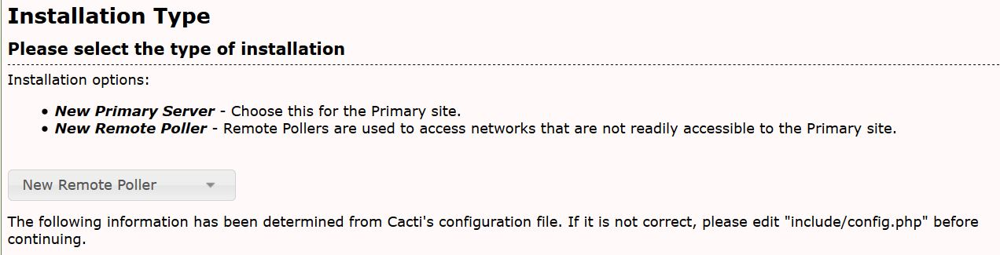

# Data Collectors

## Data Collector Background

Cacti can support from one to many **Data Collectors**.  There are two types
of **Data Collectors** they are:

- **Main Data Collector** - This is essentially your core Cacti server
  and database.  The **Main Data Collector** is also referred to as
  the **Primary Server**.
- **Remote Data Collector** - These Data Collectors are located in
  distant locations, or where reaching devices is blocked due to
  firewall or security policies.  The **Remote Data Collectors** are
  also referred to as **Remote Pollers**.

Due to the design of the Cacti **Remote Data Collector**, somone at the
remote site, can actually login to that **Data Collector** and interact
with it as if their **Data Collector** was the **Main Data Collector**.
Additionally, if for some reason the **Main Data Collector** becomes
unavailable due to a WAN outage for example, the data for the **Devices**
it manages will be cached locally until such time as the
**Main Data Collector** is reachable again.

Once the **Main Data Collector** becomes reachable, the **Remote Data Collector**
will flush it cache back to the **Main Data Collector** and the system
will normalize.  Therefore, this is generally considered to be a more
Highly Available (HA) design.

A good Enterprise Architecture for Cacti would include three **Main Data Collectors**
which cactid systemd service was managed by keepalived, using GlusterFS as
fully replicated File system for the Web Server, the logs, and the RRDfiles
using MariaDB Galera as the fully fault tolerant database server.

Then, either using keepalived to a load balancer, you could load balance
the connections across all three **Main Data Collectors**, using the
MariaDB Galera database to maintain login session data.  There are many
good articles on setting up and using MariaDB Galera along with HAProxy
or load balancers from Citrix and others to direct read and write traffic
to the correct Galera instance server.  The bottom line is that Cacti
provides the opportunity to have a Highly Available (HA) setup today.

That HA setup will not be covered in this chapter, but may be included
at a later date.

When using multiple **Data Collectors**, Cacti requires the use of the
`boost` module, which is now included in the main Cacti package.  Therefore if
you are planning on deploying multiple **Data Collectors**, you should become
familiar with its use and why it is critical to a HA design.

In order for a **Remote Data Collector** to work with a **Main Data Collector**
the **Remote Data Collector** must be able to talk to the **Main Data Collector**
over both https and the MySQL protocol in a bidirectional fashion.  Therefore,
there are only two ports that are required to be open in order to fully
leverage the multiple **Data Collector** architecture in Cacti.

## Data Collector User Interface

The image below shows the current online collector (aka pollers).  On this page,
we can see the current, average, and max data collection times, the
**Data Collector** processes and threads used, the number of **Devices** as well
as what those **Devices** are polling.  The Actions drop-down allows your to
Enable, Disable, and Delete **Remote Data Collectors**.  There is also a
`Full Sync` option there.  The `Full Sync` option will replicate key Cacti
tables to the selected **Remote Data Collectors** for things like authentication,
global settings, etc.

In the current Cacti design, you should not have to perform a `Full Sync`
very often.  It would mainly be used to push the user database and global
settings to the remotes, after an outage if there were database changes
during that outage.



The **Main Data Collector** resides on the central Cacti server.  It also
serves as the master **Data Collector** performing key maintenance operations
for the entire system.

In the edit page below, you can see what options are available when editing the
**Main Data Collector**.  It is important the the hostname used is resolvable
by the **Remote Data Collectors**.



When editing the **Remote Data Collector** in the images below, you can see that
it shares many of the settings of the **Main Data Collector** with the addition
of a `TimeZone` setting and MySQL/MariaDB credentials and a `Test Connection`
button.  Generally, these setting are only use during the initial setup
of Cacti, and afterwards for diagnostics only.





## Setup Main Data Collector to accept connections Remotes

We will need to make some config changes to the MySQL configuration to allow
the **Remote Data Collector** to talk to the **Main Data Collector**.

```console
mysql -u root mysql -e "GRANT ALL ON cacti.* TO cactidb@<ip of remote poller host>  IDENTIFIED BY 'password';"
mysql -u root mysql -e "GRANT SELECT ON mysql.time_zone_name TO cacti@<ip of remote poller host> IDENTIFIED BY 'password';"
```

Next setup the **Remote Data Collectors** config.php located in
`<path_cacti>/include/config.php` with the remote database details and credentials.
Generally, you will not have to do this as part of the direct maintenance of the
**Remote Data Collector**, the **Remote Data Collector** install process will force
you to take these steps to complete the install.  However, it's provided here for
reference so that you understand the process.

```console
#$rdatabase_type     = 'mysql';
#$rdatabase_default  = 'cacti';
#$rdatabase_hostname = 'localhost'; <<< IP/Hostname of main server
#$rdatabase_username = 'cactiuser';
#$rdatabase_password = 'cactiuser';
#$rdatabase_port     = '3306';
#$rdatabase_retries  = 5;
#$rdatabase_ssl      = false;
#$rdatabase_ssl_key  = '';
#$rdatabase_ssl_cert = '';
#$rdatabase_ssl_ca   = '';
```

You will now need to install Cacti on the remote server selecting the
**New Remote Poller** install option as shown below.



---
Copyright (c) 2004-2024 The Cacti Group
