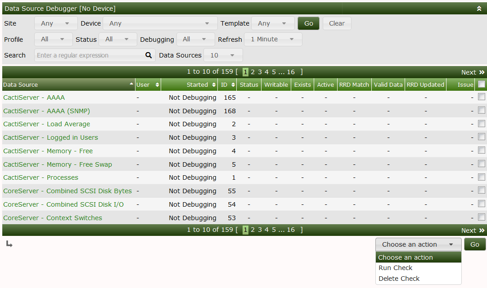
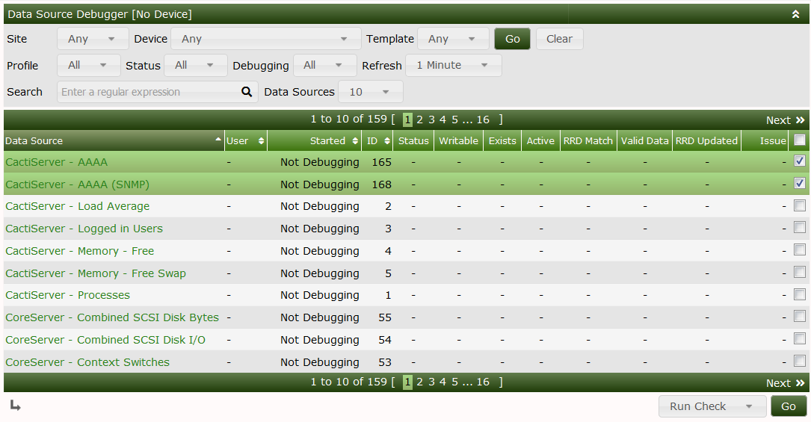
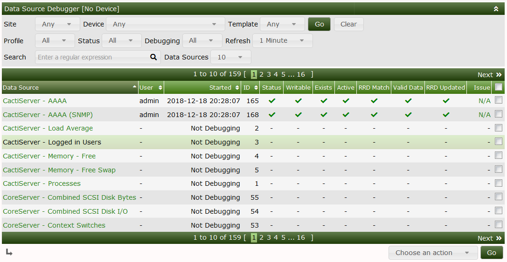
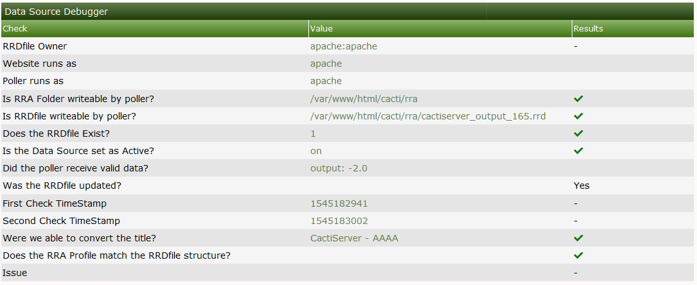

# Data Source Debugging

If you are having issues with blank graphs and have done the basic checks such as permissions\
the Data source debug tool can help troubleshoot what information is coming into Cacti.

The debug tool will check the data source as well as the graph as well as permissions\
The tool will also check for new data coming into the data source as well as graph settings\
such as step count to ensure it matches the profile of the data source amongst other things.

The tool allows you to run a debug on multiple data sources or just a single data source

In order to start a debug you will select all of the applicable data sources you are interested in\
on the dropdown select run check this will put all of the selected data sources into debug mode.

For a single data source you can click the data source name which will also put it into debug mode.

You are able to see that status of the debug along with all of the checks run \
successful checks give you a green check mark failed shows a red X\
depending on the issue a recomendation will be provided for a failed check\

A summary of the checks as well as the propertise of the data source\
can be displayed if you click on the data source name this is useful\
for a single page view of the data source and graph details.

This page also shows what the last values come from when the poller\
This is also useful for troubleshooting as if the data comes in out of\
Range of your data source template or Graph template this could point you\
into the right direction

---
Copyright (c) 2004-2021 The Cacti Group
