# Data Input Methods

Data input methods allow Cacti to retrieve data to insert into data sources and
ultimately put on a graph. There are different ways for Cacti to retrieve data,
the most popular being through an external script or from SNMP.

## Creating a Data Input Method

To create a new data input method, select the Data Input Methods option under
the Management heading. Once on that screen, click Add on the right. You will
be presented with a few fields to populate on the following screen.

###### Table 11-1. Field Description: Data Input Methods

Name | Description
--- | ---
Name | Give the data query a name that you will use to identify it
Input Type | Select the type of data input method you are trying to create
Input String | This field is only used when the Input Type is set to 'Script/Command'
Output String | This field is only here for legacy purposes and will probably go away in a future version of Cacti

The `Name` specified will be used throughout Cacti to identify the data input
method.  Careful consideration should be made to help uniquely identify the
data source.  Having very similar names can lead to confusion when utilising
them.

Valid options for `Input Type` are 'Script/Command', 'SNMP', 'SNMP Query', and
'Script Query'.

When the type is set to `Script/Command`, the `Input String` specifies the full
path to the script including any per data source variables inside <>'s from the
user. For instance, if you are passing an IP address to a script, your input
string might look something like: `/path/to/script.pl <ip>` When the user
creates a data source based on this data input method, they will be prompted
for an IP address to pass onto the script.

When you are finished filling in all necessary fields, click the Create button
to continue. You will be redirected back to the same page, but this time with
two new boxes, `Input Fields` and `Output Fields`.

The `Input Fields` box is used to define any fields that require information
from the user. Any input fields referenced to in the input string must be
defined here.

The `Output Fields` box is used to define each field that you expect back
from the script.

*All data input methods must have at least one output field defined*, but
may have more than one depending on the type.

### Data Input Fields

To define a new field, click Add next to the input or output field boxes. You
will be presented with some or all of the fields below depending on whether you
are adding an input or output field.

###### Table 11-2. Field Description: Data Input Fields

Name | Description
--- | ---
Field/Field Name | Either select or type in the name of the field you want to define
Friendly Name | Enter a more descriptive name for this field
Regular Expression Match (Input Only) | Enter a valid regular expression
Allow Empty Input (Input Only) | Can the input value of this field blank or not
Special Type Code (Input Only) | Reference to an internal field
Update RRD File (Output Only) | Checked to store the result

The `Field Name` must contain no spaces or other non-alphanumeric characters
(except '-' or '_').

If you want to enforce a certain regular expression pattern when the user
enters a value into `Regular Expression Match (Input Only)` for this Data
Input Field, it must follow POSIX syntax as it will be passed to PHP's
preg() functions.

If the Data Input Field needs to reference another field internally, you
can enter this into the `Special Type Code`. For instance, if your field
requires an IP address from the user, you can enter 'management_ip' here
and Cacti will fill this field in with the current IP address of the
selected host.

###### Table 11-3. Special Type Codes

Field Name | Description
--- | ---
hostname | The hostname
management_ip | The ip
snmp_community | The SNMP community
snmp_username | The SNMP username
snmp_password | The SNMP version

If you enable the `Update RRD File`, Cacti will insert the return value from
this field into the RRD file. Obviously, this box needs to be checked for at
least one output field per data input source, but can be left blank to have
Cacti store the value only in the database instead.

When you are finished filling in all necessary fields, click the Create button
to continue. You will be redirected back to the data input method edit page.
From here you can continue to add additional fields, or click Save on this
screen when finished.

## Making Your Scripts Work With Cacti

The simplest way to extend Cacti's data gathering functionality is through
external scripts. Cacti comes with a number of scripts out of the box which are
located in the `scripts/` directory. These scripts are used by the data input
methods that are present in a new installation of Cacti.

To have Cacti call an external script to gather data you must create a new data
input method, making sure to specify Script/Command for the Input Type field.
See the previous section, [Creating a Data Input Method](data_input_methods.html)
for more information about how to create a data input method. To gather data
using your data input method, Cacti simply executes the shell command specified
in the Input String field. Because of this, you can have Cacti run any shell
command or call any script which can be written in almost any language.

What Cacti is concerned with is the output of the script. When you define your
data input method, you are required to define one or more output fields. The
number of output fields that you define here is important to your script's
output. For a data input method with only one output field, your script should
output its value in the following format:

```xml
<value_1>
```

So if I wrote a script that outputs the number of running processes, its output
might look like the following:

`67`

Data input methods with more than one output field are handled a bit
differently when writing scripts. Scripts that output more than one value
should be formatted like the following:

```xml
<fieldname_1>:<value_1> <fieldname_2>:<value_2> ... <fieldname_n>:<value_n>
```

Lets say that I write a script that outputs the 1, 5, and 10 minute load
average of a Unix machine. In Cacti, I name the output fields '1min', '5min',
and '10min', respectively. Based on these two things, the output of the script
should look like the following:

`1min:0.40 5min:0.32 10min:0.01`

One last thing to keep in mind when writing scripts for Cacti is that they will
be executed as the user the data gatherer runs as. Sometimes a script may work
correctly when executed as root, but fails due to permissions problems when
executed as a less privileged user.

## Walkthrough: My First Data Input Method

### Data Input Method returning a single value

Lets start with a simple script, that takes a hostname or IP address as input
parameter, returning a single value. You may find this one as
`<path_cacti>/scripts/ping.pl`:

```shell
#!/usr/bin/perl

# take care for tcp:hostname or TCP:ip@
$host = $ARGV[0];
$host =~ s/tcp:/$1/gis;

# old linux version use "icmp_seq"
# newer use "icmp_req" instead
open(PROCESS, "ping -c 1 $host | grep 'icmp_[s|r]eq' | grep time |");
$ping = <PROCESS>;
close(PROCESS);
$ping =~ m/(.*time=)(.*) (ms|usec)/;

if ($2 == "") {
        print "U";              # avoid cacti errors, but do not fake rrdtool stats
}elsif ($3 eq "usec") {
        print $2/1000;  # re-calculate in units of "ms"
}else{
        print $2;
}
```

To define this script as a **Data Input Method** to cacti, please go to **Data
Input Methods** and click **Add**. You should see:

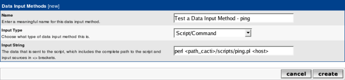

Please fill in **Name**, select **Script/Command** as Input Type and provide
the command that should be used to retrieve the data. You may use
`<path_cacti>` as a symbolical name for the path_to_your_cacti_installation.
Those commands will be executed from crontab; so pay attention to providing
full path to binaries if required (e.g. `/usr/bin/perl` instead of `perl`).
Enter all **Input Parameters** in `<>` brackets. Click create to see:

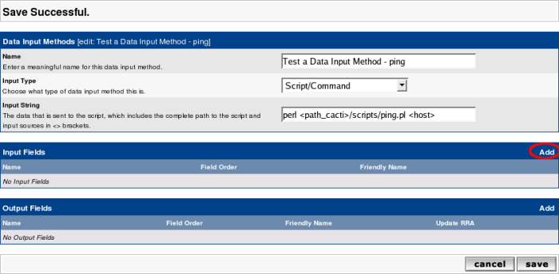

Now lets define the **Input Fields**. Click **Add** as given above to see:

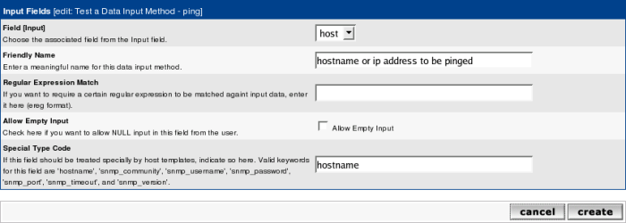

The DropDown **Field [Input]** contains one single value only. This is taken
from the **Input String** `<host>` above. Fill **Friendly Name** to serve your
needs. The **Special Type** Code allows you to provide parameters from the
current Device to be queried. In this case, the **hostname** will be taken from
the current device. Click create to see:

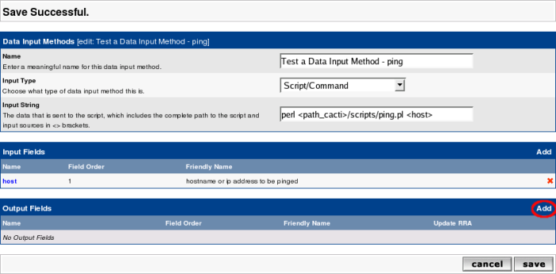

At least, define the **Output Fields**. Again, click **Add** as described above:

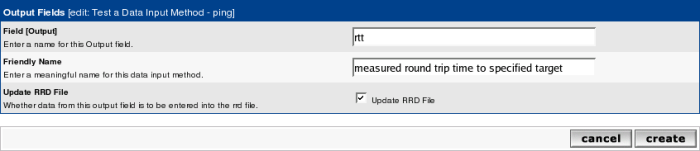

Provide a short **Field [Output]** name and a more meaningful **Friendly
Name**. As you will want to save those data, select **Update RRD File**. Create
to see:

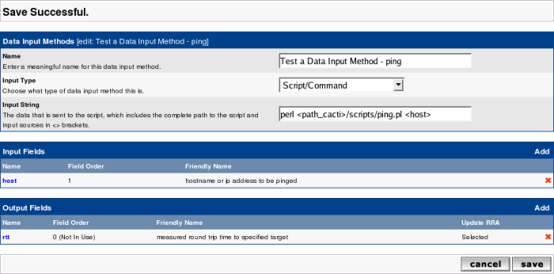

Click **Save** and you're done.

#### Create the Data Template

Now you want to tell cacti, how to store the data retrieved from this script.
Please go to Data Templates and click Add. You should see:

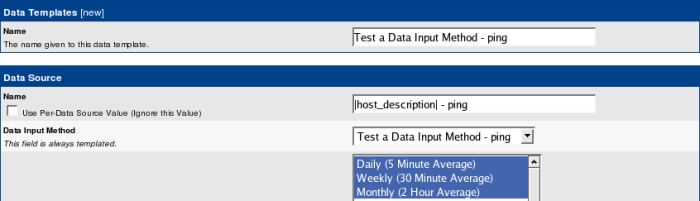

Fill in the **Data Templates Name** with a reasonable text. This name will be
used to find this Template among others. Then, please fill in the **Data Source
Name**. This is the name given to the host-specific Data Source. The variable
**|host_description|** is taken from the actual **Device**. This is to
distinguish data sources for different devices. The **Data Input Method** is a
DropDown containing all known scripts and the like. Select the Data Input
Method you just created. The **Associated RRA's** is filled by default. At the
moment there's no need to change this. The lower part of the screen looks like:

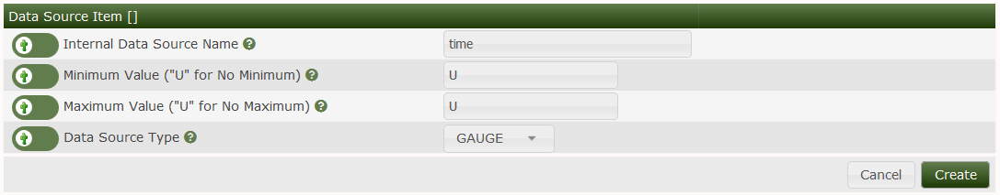

The **Internal Data Source Name** may be defined at your wish. There's no need
to use the same name as the Output Field of the Data Input Method, but it may
look nicer. Click create to see:

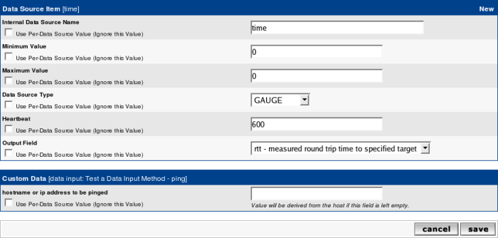

Notice the new DropDown **Output Field**. As there is only one Output Field
defined by our Data Input Method, you'll see only this. Here's how to connect
the Data Source Name (used in the rrd file) to the Output Field of the Script.
Click **Save** and you're done.

#### Create the Graph Template

Now you want to tell cacti, how to present the data retrieved from this script.
Please go to **Graph Templates** and click **Add**. You should see:

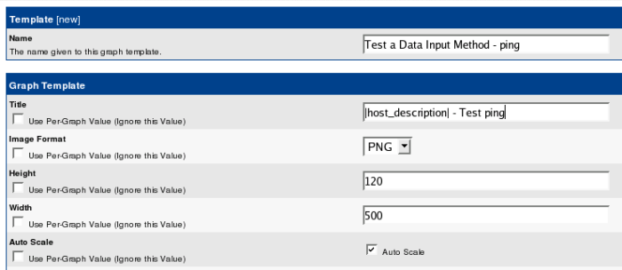

Fill in **Name** and **Title**. The variable `|host_description|` will again be
filled from the Device's definition when generating the Graph. Keep the rest as
is and **Create**. See:

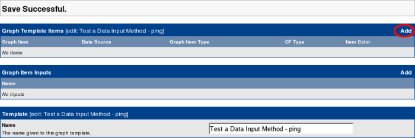

Now click **Add** to select the first item to be shown on the Graphs:

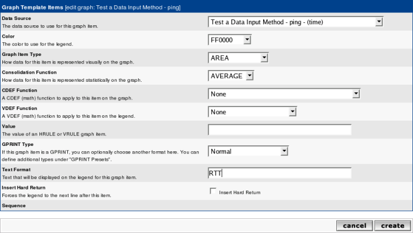

Select the correct **Data Source** from the DropDown, fill in a color of your
liking and select AREA as a **Graph Item Type**. You want to fill in a **Text
Format** that will be shown underneath the Graph as a legend. Again,
**Create**:

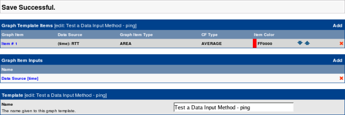

Notice, that not only an entry was made under **Graph Template Items**, but
under **Graph Item Inputs** as well. Don't bother with that now. Lets fill some
more nice legends, see:


Notice, that the **Data Source** is filled in automagically. Select LEGEND as
**Graph Item Type** (it is not really a Graph Item Type in rrdtool-speak, but a
nice time-saver), and click **Create** to see:


Wow! Three items filled with one action! You may want to define a **Vertical
Label** at the very bottom of the screen and **Save**.

#### Apply the Graph Template to a Host

Now go to the **Devices** and select the one of your choice. See the
**Associated Graph Templates** in the middle of this page:

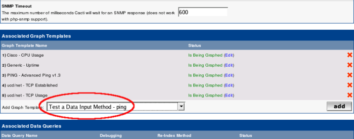

Select your newly created Graph template from the Add Graph Template DropDown.
Click Add to see:

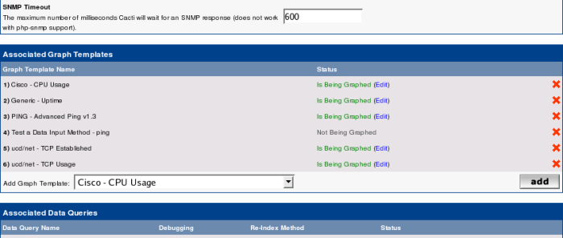

The Template is added and shown as Not Being Graphed. On the top of the page
you'll find the Create Graphs for this Host link. Click this to see:

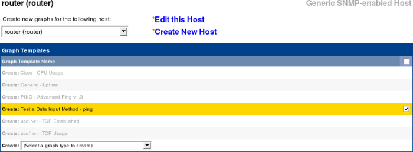

Check the box that belongs to the new template and Create. See the results:

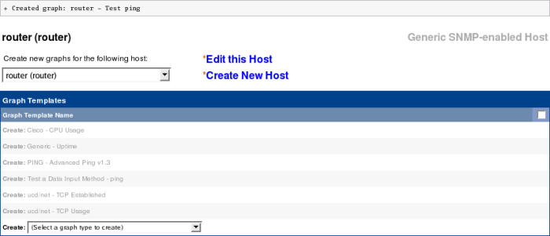

This will automatically

- create the needed Graph Description from the Graph Template. As you may
 notice from the success message, this Graph takes the hosts name in it:
 **router - Test ping** (router is the hosts name of this example).
- create the needed Data Sources Description from the Data Template. Again,
 you will find the Hosts name replaced for |host_description|
- create the needed rrd file with definitions from the Data Template.
 The name of this file is derived from the Host and the Data Template in
 conjunction with an auto-incrementing number.
- create an entry to the poller_table to instruct cacti to gather data on
 each polling cycle

You'll have to wait at least for two polling cycles to find data in the Graph.
Find your Graph by going to **Graph Management**, filtering for your host and
selecting the appropriate Graph (there are other methods as well). This may
look like:

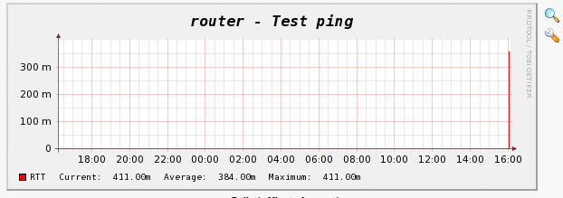

## Walkthrough: Script with more Output Parameters

The script will be implemented in perl (as I have no profound knowledge of
php). As such, it should execute on most platforms.

```shell
#!/usr/bin/perl -w

# --------------------------------------------------
# ARGV[0] = &lt;hostname&gt;     required
# ARGV[1] = &lt;snmp port&gt;    required
# ARGV[2] = &lt;community&gt;    required
# ARGV[3] = &lt;version&gt;      required
# --------------------------------------------------
use Net::SNMP;

# verify input parameters
my $in_hostname         = $ARGV[0] if defined $ARGV[0];
my $in_port             = $ARGV[1] if defined $ARGV[1];
my $in_community        = $ARGV[2] if defined $ARGV[2];
my $in_version          = $ARGV[3] if defined $ARGV[3];

# usage notes
if (
        ( ! defined $in_hostname ) ||
        ( ! defined $in_port ) ||
        ( ! defined $in_community ) ||
        ( ! defined $in_version )
        ) {
        print   "usage:\n\n
                $0 &lt;host&gt; &lt;port&gt; &lt;community&gt; &lt;version&gt;\n\n";
        exit;
}

# list all OIDs to be queried
my $udpInDatagrams      = ".1.3.6.1.2.1.7.1.0";
my $udpOutDatagrams     = ".1.3.6.1.2.1.7.4.0";

# get information via SNMP
# create session object
my ($session, $error) = Net::SNMP->session(
                        -hostname      => $in_hostname,
                        -port          => $in_port,
                        -version       => $in_version,
                        -community     => $in_community,
                        # please add more parameters if there's a need for them:
                        #   [-localaddr     => $localaddr,]
                        #   [-localport     => $localport,]
                        #   [-nonblocking   => $boolean,]
                        #   [-domain        => $domain,]
                        #   [-timeout       => $seconds,]
                        #   [-retries       => $count,]
                        #   [-maxmsgsize    => $octets,]
                        #   [-translate     => $translate,]
                        #   [-debug         => $bitmask,]
                        #   [-username      => $username,]    # v3
                        #   [-authkey       => $authkey,]     # v3
                        #   [-authpassword  => $authpasswd,]  # v3
                        #   [-authprotocol  => $authproto,]   # v3
                        #   [-privkey       => $privkey,]     # v3
                        #   [-privpassword  => $privpasswd,]  # v3
                        #   [-privprotocol  => $privproto,]   # v3
                        );

# on error: exit
if (!defined($session)) {
        printf("ERROR: %s.\n", $error);
        exit 1;
        }

# perform get requests for all wanted OIDs
my $result = $session->get_request(
                         -varbindlist      => [$udpInDatagrams, $udpOutDatagrams]
                       );

# on error: exit
if (!defined($result)) {
        printf("ERROR: %s.\n", $session->error);
        $session->close;
        exit 1;
        }

# print results
printf("udpInDatagrams:%s udpOutDatagrams:%s", # <<< cacti requires this format!
        $result->{$udpInDatagrams},
        $result->{$udpOutDatagrams},
        );

$session->close;
```

It should produce following output, when executed from command line:

```console
[prompt]> perl udp_packets.pl localhost 161 public 1
udpInDatagrams:10121 udpOutDatagrams:11102
```

Where “public” may be replaced by your community string. Of course, the numbers
will vary.

### The Data Input Method

To define this script as a **Data Input Method** to cacti, please go to **Data
Input Methods** and click **Add**.

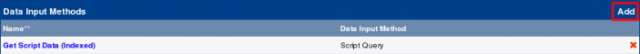

You should see:

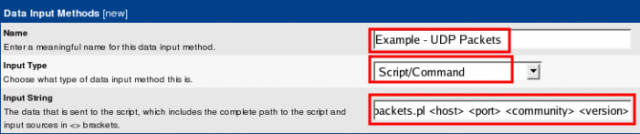

Enter the name of the new Data Input Method, select **Script/Command** and type
in the command to call the script. Please use the **full path to the command
interpreter**. Instead of entering the specific parameters, type `<symbolic
variable name>` for each parameter the script needs. **Save**:


Now **Add** each of the input parameters in the **Input Fields** section, one
after the other. All of them are listed in sequence, starting with `<host>`:

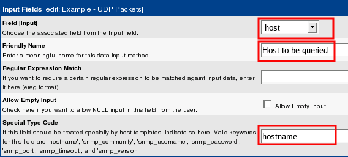

`<port>`

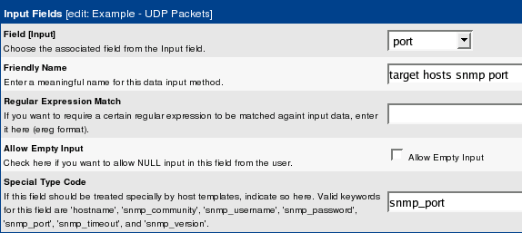

`<community>`


`<version>`

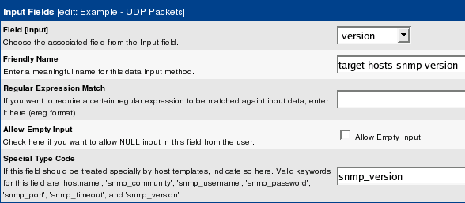

We've used some of cacti builtin parameters. When applied to a host, those
variables will be replaced by the hosts actual settings. Then, this command
will be stored in the poller_command table. Now **Save** your work to see

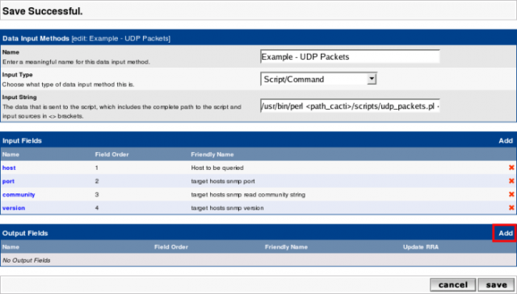

After having entered all **Input Fields**, let's now turn to the **Output
Fields**, respectively. Add the first one, udpInDatagrams:

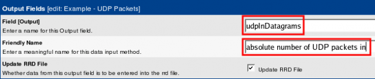

Now udpOutDatagrams:

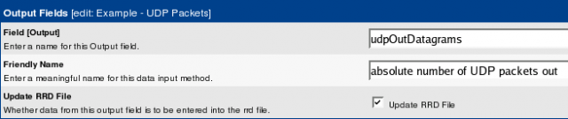

Be careful to avoid typos. The strings entered here must **exactly** match
those spitted out by the script. **Double check Output Fields**! Now, results
should be like

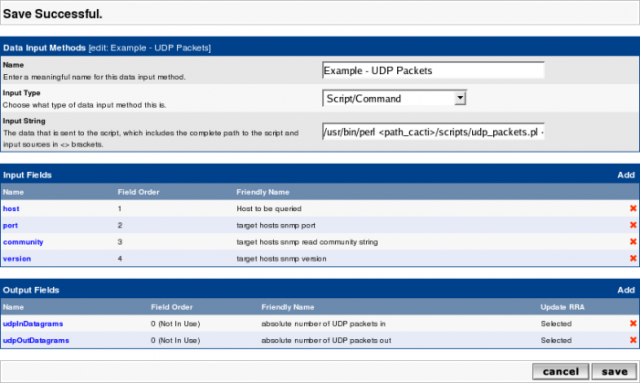

Finally Save and be proud!

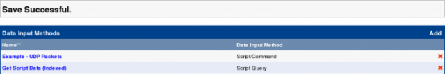

### The Data Template

The previous step explained how to call the script that retrieves the data. Now
it's time to tell cacti, how to store them in rrd files. You will need a single
**Data Template** only, even if two different output fields will be stored. rrd
files are able to store more than one output fields; rrdtool's name for those
is **data source**. So we will create

1. one single **Data Template** representing one rrd file
2. two output fields/data sources

The first step is quite the same as Create the Data Template for a simple Data
Input Method. For sure, we provide a different name, **Example - UDP Packets**.
Now, let's enter the first data source. Again, its like above. But we now
provide the name of **udpInPackets**, enter a **Maximum value** of 100,000 and
select the **Data Source Type** of COUNTER.


Then save and find


Add the second data source by hitting **New** and provide data for
**udpOutPackets**. Pay attention to select the correct **Output Field** defined
by the Data Input Method.


Please pay attention, as **Maximum Value** for second and following data
sources defaults to 100! In most cases, this value won't fit. To deactivate
maximum checking, enter 0, else the desired number. Do not forget to select the
correct **Data Source Type** and the **Output Field**.

### The Graph Template

Again, most of this task was already described at Create the Graph Template of
the previous chapter. You will define the Graph Template's global data just as
in that example. But now, you will want to add both data sources to the graph.
Just copy the steps for data source **time** twice, one for **udpInPackets**
and for **udpOutPackets**. Add a **Legend** for both and you're happy.

---
Copyright (c) 2018 Cacti Group
