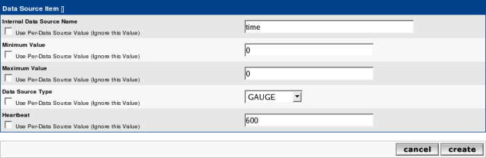
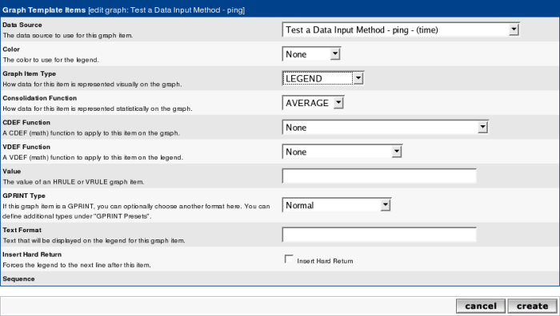

# Data Input Methods

Data Input Methods allow Cacti to retrieve data to insert into RRDfiles based
upon a mapping controlled by **Data Templates** and their corresponding **Data
Sources**.  These resulting **Data Templates** and **Data Sources** can then be
used to create **Graph Templates** and **Graphs**.

Cacti includes a number of build in **Data Input Methods** for **SNMP** data and
for **Script**, **Script Server** and **SNMP Data Queries**.

Outside of the built in **Data Input Methods**, the Cacti Administrator can
create virtually any **Data Input Method** based upon a **Script**, or a PHP
**Script Server** script.  The **Script** based **Data Input Method** allows
Cacti to virtually collect data from anywhere, though the built in **SNMP** and
**Script Server** methods provide the greatest scalability in Cacti.  Both
**Data Queries**, and PHP **Script Server** topics will be covered in later
sections of the documentation.

## Creating a Data Input Method

To create a new **Data Input Method**, from the Cacti Console, select **Data
Collection > Data Input Methods**. Once on that screen, click the plus (+) glyph
on the right which will allow you to add a new **Data Input Method**. You will
be presented with a few fields to populate on the following screen.

###### Table 11-1. Field Description: Data Input Methods

Name | Description
--- | ---
Name | Give the data query a name that you will use to identify it
Input Type | Select the type of **Data Input Method** you are trying to create
Input String | This field is only used when the Input Type is set to **Script/Command**

The `Name` specified will be used throughout Cacti to identify the human
readable name given to the **Data Input Method**.  Careful consideration should
be made to help uniquely identify the **Data Source**.  Having very similar
names can lead to confusion when utilizing them as your Cacti system grows.

Valid options for `Input Type` are **Script/Command**, and **Script Server**.
As mentioned previously, Cacti provides built in **Data Input Methods** for SNMP
data gathering and for SNMP, **Script**, and **Script Server** based **Data
Queries**.  Though present in the Cacti database, they are hidden from user
view.

When the type is set to `Script/Command`, the `Input String` specifies the full
path to the script including any per **Data Source** input variables.  **Data
Source** input variables must be enclosed in greater than and less than
characters. For instance, if you are passing an IP address to a script, your
input string might look something like: `/path/to/script.pl <ip>` When the user
creates a **Data Source** based on this **Data Input Method**, they will be
prompted for an IP address to pass onto the script.

When you are finished filling in all necessary fields, click the Create button
to continue. Upon saving the new **Data Input Method**, you will be presented
with two new sections to complete.  Those sections will instruct Cacti what to
pass to the Script, known as `Input Fields` otherwise known as `Input
Parameters` and how to handle the output data, which we refer to as `Output
Fields`.

The `Input Fields` box is used to define any fields that require information
from the user or from various data within the Cacti Database such as the
hostname, ip address, host id, etc. Any input fields referenced to in the input
string must be defined here.

The `Output Fields` box is used to define each field that you expect back from
the script and will be eventually stored in both the database and RRDfiles.

*All **Data Input Methods** must have at least one output field defined*, but
may have more than one depending on the type.

### Data Input Fields

To define a new field, click the plus sign (+) next to the input or output field
boxes. You will be presented with some or all of the fields below depending on
whether you are adding an input or output field.

###### Table 11-2. Field Description: Data Input Fields

Name | Description
--- | ---
Field/Field Name | You will be presented a drop down list of the unused braced input fields from the command
Friendly Name | Enter a more descriptive name for this field
Regular Expression Match (Input Only) | Enter a valid regular expression as to how to modify the output
Allow Empty Input (Input Only) | Can the input value of this field blank or not
Special Type Code (Input Only) | Pull the input data from the Cacti database and don't prompt the user for this input value
Update RRDfile (Output Only) | Checked if you intend this output data to be stored in an RRDfile

The `Field Name` must contain no spaces or other non-alphanumeric characters
(except '-' or '_').

If you want to enforce a certain regular expression pattern when the user enters
a value into `Regular Expression Match (Input Only)` for this Data Input Field,
it must follow POSIX syntax as it will be passed to PHP's preg() functions.

If the Data Input Field needs to reference another field internally, you can
enter this into the `Special Type Code`. For instance, if your field requires an
IP address from the user, you can enter 'management_ip' here and Cacti will fill
this field in with the current IP address of the selected host.

###### Table 11-3. Special Type Codes

Field Name | Description
--- | ---
hostname | The hostname
management_ip | The ip
snmp_community | The SNMP community
snmp_username | The SNMP username
snmp_password | The SNMP version

If you enable the `Update RRDfile`, Cacti will insert the return value from this
field into the RRDfile. This box needs to be checked for at least one output
field per data input source, but can be left blank to have Cacti store the value
only in the database instead.

When you are finished filling in all necessary fields, click the Create button
to continue. You will be redirected back to the **Data Input Method** edit page.
From here you can continue to add additional fields, or click Save on this
screen when finished.

## Making Your Scripts Work With Cacti

The simplest way to extend Cacti's data gathering functionality is through
external scripts. Cacti comes with a number of scripts out of the box which are
located in the `scripts/` directory. These scripts are used by the **Data Input
Methods** that are present in a new installation of Cacti.

To have Cacti call an external script to gather data you must create a new
**Data Input Method**, making sure to specify Script/Command for the Input Type
field. See the previous section, [Creating a Data Input
Method](data_input_methods.html) for more information about how to create a
**Data Input Method**. To gather data using your **Data Input Method**, Cacti
simply executes the shell command specified in the Input String field. Because
of this, you can have Cacti run any shell command or call any script which can
be written in almost any language.

What Cacti is concerned with is the output of the script. When you define your
**Data Input Method**, you are required to define one or more output fields. The
number of output fields that you define here is important to your script's
output. For a **Data Input Method** with only one output field, your script
should output its value in the following format:

```console
<numeric value>
```

So if I wrote a script that outputs the number of running processes, its output
might look like the following:

```console
67
```

Data Input Methods with more than one output field are handled a bit differently
when writing scripts. Scripts that output more than one value should be
formatted like the following:

```console
<fieldname_1>:<value_1> <fieldname_2>:<value_2> ... <fieldname_n>:<value_n>
```

If you wrote a script that outputs the 1, 5, and 10 minute load average of a
Unix machine and in Cacti named the output fields '1min', '5min', and '10min',
the output of the script should look like the following:

`1min:0.40 5min:0.32 10min:0.01`

One last thing to keep in mind when writing scripts for Cacti is that they will
be executed as the user the data gatherer runs as. Sometimes a script may work
correctly when executed as root, but fails due to permissions problems when
executed as a less privileged user.

## Walkthrough: My First Data Input Method

### Data Input Method returning a single value

Lets start with a simple script, that takes a hostname or IP address as input
parameter, returning a single value. You may find this one as

`<path_cacti>/scripts/ping.pl`:

```shell
#!/usr/bin/perl

# take care for tcp:hostname or TCP:ip@
$host = $ARGV[0];
$host =~ s/tcp:/$1/gis;

# old Linux version use "icmp_seq"
# newer use "icmp_req" instead
open(PROCESS, "ping -c 1 $host | grep 'icmp_[s|r]eq' | grep time |");
$ping = <PROCESS>;
close(PROCESS);
$ping =~ m/(.*time=)(.*) (ms|usec)/;

if ($2 == "") {
	print "U";              # avoid cacti errors, but do not fake RRDtool stats
}elsif ($3 eq "usec") {
	print $2/1000;  # re-calculate in units of "ms"
}else{
	print $2;
}
```

To define this script as a **Data Input Method** to Cacti, please go to **Data
Input Methods** and click **Add**. You should see:


Please fill in **Name**, select **Script/Command** as Input Type and provide the
command that should be used to retrieve the data. You may use `<path_cacti>` as
a symbolical name for the path_to_your_Cacti_installation. Those commands will
be executed from crontab; so pay attention to providing full path to binaries if
required (e.g. `/usr/bin/perl` instead of `perl`). Enter all **Input
Parameters** in `<>` brackets. Click create to see:


Now lets define the **Input Fields**. Click **Add** as given above to see:


The drop down **Field [Input]** contains one single value only. This is taken
from the **Input String** `<host>` above. Fill **Friendly Name** to serve your
needs. The **Special Type** Code allows you to provide parameters from the
current Device to be queried. In this case, the **hostname** will be taken from
the current device. Click create to see:


At least, define the **Output Fields**. Again, click **Add** as described above:


Provide a short **Field [Output]** name and a more meaningful **Friendly Name**.
As you will want to save those data, select **Update RRDfile**. Create to see:


Click **Save** and you're done.

#### Creating the Data Template

Now you want to tell Cacti, how to store the data retrieved from this script.
Please go to **Data Templates** and click Add. You should see:


Fill in the **Data Templates Name** with a reasonable text. This name will be
used to find this Template among others. Then, please fill in the **Data Source
Name**. This is the name given to the host-specific **Data Source**. The
variable **|host_description|** is taken from the actual **Device**. This is to
distinguish **Data Sources** for different devices. The **Data Input Method** is
a drop down containing all known scripts and the like. Select the **Data Input
Method** you just created. The **Associated RRA's** is filled by default. At the
moment there's no need to change this. The lower part of the screen looks like:



The **Internal Data Source Name** may be defined at your wish. There's no need
to use the same name as the Output Field of the **Data Input Method**, but it
may look nicer. Click create to see:


Notice the new drop down **Output Field**. As there is only one Output Field
defined by our **Data Input Method**, you'll see only this. Here's how to
connect the **Data Source Name** (used in the RRDfile) to the Output Field of
the Script. Click **Save** and you're done.

#### Creating the Graph Template

Now you want to tell Cacti, how to present the data retrieved from this script.
Please go to **Graph Templates** and click **Add**. You should see:


Fill in **Name** and **Title**. The variable `|host_description|` will again be
filled from the Device's definition when generating the **Graph**. Keep the rest
as is and **Create**. See:


Now click the plus (+) glyph to **Add** the first item to be shown on the
**Graphs**:


Select the correct **Data Source** from the drop down, fill in a color of your
liking and select AREA as a **Graph Item Type**. You want to fill in a **Text
Format** that will be shown underneath the **Graph** as a legend. Again,
**Create**:


Notice, that not only an entry was made under **Graph Template Items**, but
under **Graph Item Inputs** as well. Don't bother with that now. Lets fill some
more nice legends, see:



Notice, that the **Data Source** is filled in automagically. Select LEGEND as
**Graph Item Type** (it is not really a **Graph Item Type** in RRDtool-speak,
but a nice time-saver), and click **Create** to see:


Wow! Three items filled with one action!

#### Apply the Graph Template to a Device

Now go to the **Devices** and select the one of your choice. See the
**Associated Graph Templates** in the middle of this page:


Select your newly created **Graph Template** from the Add **Graph Template**
drop down. Click the plus (+) glyph to see:


By default, the **Graph Template** is added and shown as **Is Being Graphed**.
The reason for this is that Cacti now automatically creates **Graphs**
automatically, unless disabled.  If the **Graph Template** shows **Not Being
Graphed**, you can create the **Graph** by pressing the **Create Graphs** at the
top of the **Devices** page. Click this link to see:


Check the box that belongs to the new template and Create. See the results:


This will automatically

- Create the needed **Graph Description** from the **Graph Template**. As you
  may notice from the success message, this **Graph** takes the hosts name in
  it: **router - Test ping** (router is the hosts name of this example).

- Create the needed **Data Source Description** from the **Data Template**.
  Again, you will find the Hosts name replaced for |host_description|

- Create the needed RRDfile with definitions from the **Data Template**.  The
  name of this file is derived from the Host and the **Data Template** in
  conjunction with an auto-incrementing number.

- Create an entry to the poller_item to instruct Cacti to gather data on each
  polling cycle.

You'll have to wait at least two polling cycles to find data in the **Graph**.
Find your **Graph** by going to **Graph Management**, filtering for your host
and selecting the appropriate **Graph** (there are other methods as well). This
may look like:


## Walkthrough: Script with more Output Parameters

The script below will be implemented in perl.  Please note that any supported
language is supported using Cacti from direct command execution to scripts
written in perl, python, php, bash, etc.

```shell
#!/usr/bin/perl -w

# --------------------------------------------------
# ARGV[0] = &lt;hostname&gt;     required
# ARGV[1] = &lt;snmp port&gt;    required
# ARGV[2] = &lt;community&gt;    required
# ARGV[3] = &lt;version&gt;      required
# --------------------------------------------------
use Net::SNMP;

# verify input parameters
my $in_hostname         = $ARGV[0] if defined $ARGV[0];
my $in_port             = $ARGV[1] if defined $ARGV[1];
my $in_community        = $ARGV[2] if defined $ARGV[2];
my $in_version          = $ARGV[3] if defined $ARGV[3];

# usage notes
if (
	( ! defined $in_hostname ) ||
	( ! defined $in_port ) ||
	( ! defined $in_community ) ||
	( ! defined $in_version )
) {
	print "usage:\n\n
		$0 &lt;host&gt; &lt;port&gt; &lt;community&gt; &lt;version&gt;\n\n";
	exit;
}

# list all OIDs to be queried
my $udpInDatagrams      = ".1.3.6.1.2.1.7.1.0";
my $udpOutDatagrams     = ".1.3.6.1.2.1.7.4.0";

# get information via SNMP
# create session object
my ($session, $error) = Net::SNMP->session(
	-hostname      => $in_hostname,
	-port          => $in_port,
	-version       => $in_version,
	-community     => $in_community,
	# please add more parameters if there's a need for them:
	#   [-localaddr     => $localaddr,]
	#   [-localport     => $localport,]
	#   [-nonblocking   => $boolean,]
	#   [-domain        => $domain,]
	#   [-timeout       => $seconds,]
	#   [-retries       => $count,]
	#   [-maxmsgsize    => $octets,]
	#   [-translate     => $translate,]
	#   [-debug         => $bitmask,]
	#   [-username      => $username,]    # v3
	#   [-authkey       => $authkey,]     # v3
	#   [-authpassword  => $authpasswd,]  # v3
	#   [-authprotocol  => $authproto,]   # v3
	#   [-privkey       => $privkey,]     # v3
	#   [-privpassword  => $privpasswd,]  # v3
	#   [-privprotocol  => $privproto,]   # v3
);

# on error: exit
if (!defined($session)) {
	printf("ERROR: %s.\n", $error);
	exit 1;
}

# perform get requests for all wanted OIDs
my $result = $session->get_request(
	-varbindlist      => [$udpInDatagrams, $udpOutDatagrams]
);

# on error: exit
if (!defined($result)) {
	printf("ERROR: %s.\n", $session->error);
	$session->close;
	exit 1;
}

# print results
printf("udpInDatagrams:%s udpOutDatagrams:%s", # <<< cacti requires this format!
	$result->{$udpInDatagrams},
	$result->{$udpOutDatagrams},
);

$session->close;
```

It should produce following output, when executed from command line:

```console
[prompt]> perl udp_packets.pl localhost 161 public 1
udpInDatagrams:10121 udpOutDatagrams:11102
```

Where “public” would be replaced by your community string.  Those input
parameters again are controlled by the `Input Fields` in Cacti and the output
from the script will be mapped to `Output Fields`.  If you wish to return
multiple output values, they must be space delimited name value pairs in the
form of nameA:valueA nameB:valueB ...

### The Data Input Method

To define this script as a **Data Input Method** to Cacti, please go to **Data
Input Methods** and click the plus (+) glyph.


You should see:


Enter the name of the new **Data Input Method**, select **Script/Command** and
type in the command to call the script. Please use the **full path to the
command interpreter**. Instead of entering the specific parameters, type
`<symbolic variable name>` for each parameter the script needs. **Save**:


Now add each of the input parameters in the **Input Fields** section, one after
the other. All of them are listed in sequence, starting with `<host>`:


`<port>`


`<community>`


`<version>`


We've used some of Cacti builtin parameters. When applied to a host, those
variables will be replaced by the hosts actual settings. Then, this command will
be stored in the poller_command table. Now **Save** your work to see


After having entered all **Input Fields**, let's now turn to the **Output
Fields**, respectively. Add the first one, udpInDatagrams:


Now udpOutDatagrams:


Be careful to avoid typos. The strings entered here must **exactly** match those
spitted out by the script. **Double check Output Fields**! Now, results should
be like


Finally Save and be proud!


### The Data Template

The previous step explained how to call the script that retrieves the data. Now
it's time to tell Cacti, how to store them in RRDfiles. You will need a single
**Data Template** only, even if two different output fields will be stored. RRD
files are able to store more than one output fields; RRDtool's name for those is
**Data Source**. So we will create

1. One single **Data Template** representing one RRDfile

2. Two output fields/data sources

The first step is quite the same as Create the **Data Template** for a simple
**Data Input Method**. For sure, we provide a different name, **Example - UDP
Packets**. Now, let's enter the first **Data Source**. Again, its like above.
But we now provide the name of **udpInPackets**, enter a **Maximum value** of
100,000 and select the **Data Source Type** of COUNTER.


Then save and find with the exception that the *Output Field* will be set to
*None Selected*.  Therefore, before adding the second *Data Source Item*, make
sure you select the *Output Field* of *udpInDatagrams* and press the Save button
to create the association.


Then, add the second **Data Source** by pressing the plus (+) glyph and
providing data for *udpOutPackets*. Pay attention to select the correct *Output
Field* defined by the **Data Input Method** as we did with the *udpInDatagrams*.


To deactivate maximum checking, enter 'U', else the desired number. Do not
forget to select the correct *Data Source Type* and the *Output Field* as
before.

### The Graph Template

Most of this task of creating a **Graph Template** has already been covered in
our example.  You will basically create a new **Graph Template**, provide a
*Line* or an *Area Fill* followed by a *Legend* for both the *udpInDatagrams*
and *udpOutDatagrams*.  The result of those actions will be the image below:


After you have created your **Graph Template** you can proceed to Add the
**Graph Template** to your **Device**, and either allow the automation to create
the **Graph** for you, or to manually add it from the **New Graphs** menu pick.

---
Copyright (c) 2004-2021 The Cacti Group
