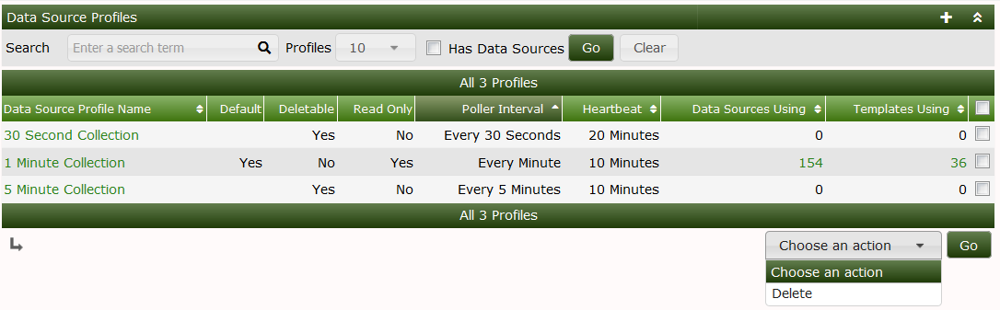
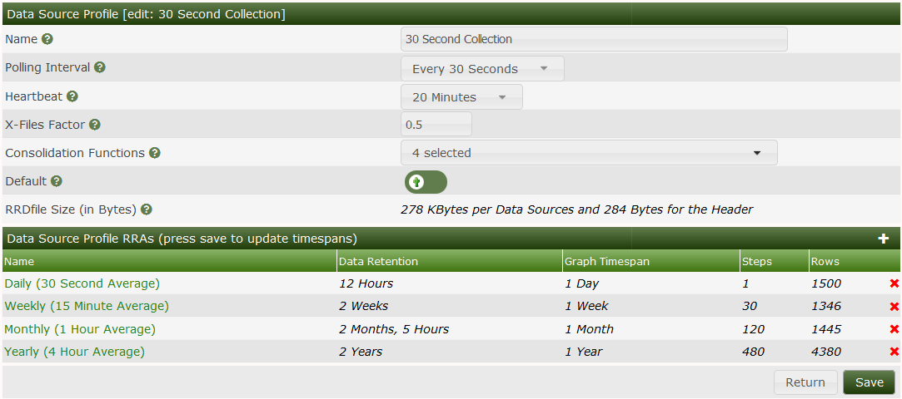
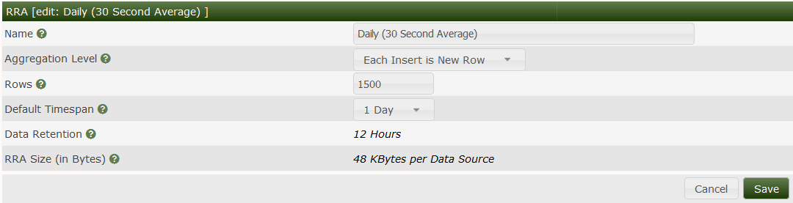

# Data Source Profiles

This section will describe **Data Source Profiles** in Cacti.

The following values are for the disk usage per Data source for the respective
data profile

### 30 second polling

Daily 48kb

Weekly 43kb

Monthly 46kb

Yearly 140kb

### 1 minute polling

Daily 93kb / data source

Weekly 45kb / data source

Monthly 47kb /datasource

Yearly 140KB/data source

### 5 minute polling

Daily 19kb / data source

Weekly 22kb / data source

Monthly 25kb / data source

Yearly 26kb / data source

### Changing data profile averages 

The Cacti GUI allows you to change the averages on a specific Data source profile
some setups require a higher resolution of data and you may want to change the averaging to
keep the most data this will come with a cost of storage due to the bigger sized RRD file

To do this follow these steps

#### Method 1: New system without any hosts

1. Login to Cacti

2. Click on Presets >> Data Profiles

3. Select the profile you want to edit i.e 1 minute collection

4. Select the period which you want to edit i.e weekly

5. If you wish to change the average select the aggregate level for 1 minute
you will be able to go as low as 5 Minutes

6. You will need to edit the Rows amount to match the data retention you want 
   to set after this period the data will be averaged out to the monthly graph

7. Save config and generate graphs

#### Method 2: Existing device on system ( Remove exisitng graphs)

This is a more data destructive route and it will depend on your situation
If you have graphs already on cacti you will not be able to use method 1
One option if you do not care about the graphs is to either remove the graphs via the gui
or run the following script `/cli/php remove_graphs.php with the --all` function which will REMOVE ALL THE GRAPHS
You can then follow the steps outlined in Method 1 to change the profile how you like

### Data profile Rows Calculation

The rows calculation take in to account the following 

Rows = Aggregate level * hours 

Example

1 Minute aggregate level storing for 3 days ( 72 hours) 

(Aggregate level)60 * 72 ( 72 hours) = 4,320

---
Copyright (c) 2004-2020 The Cacti Group
