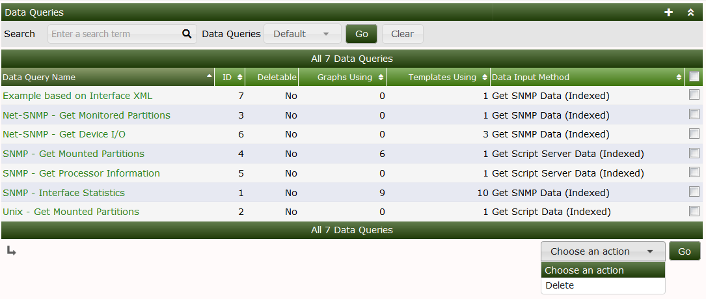
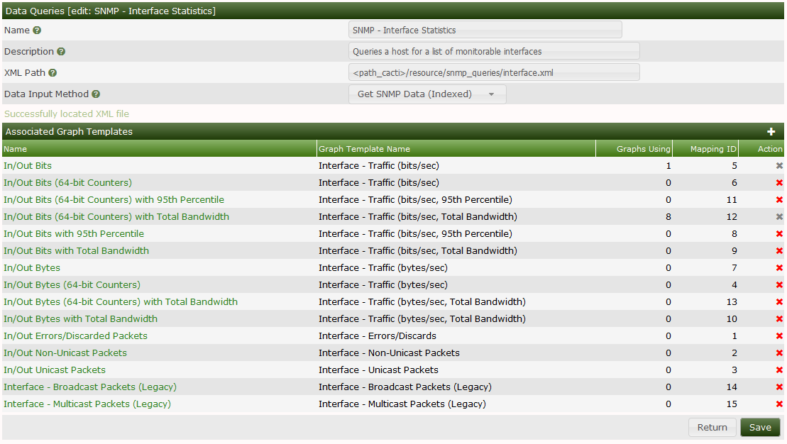
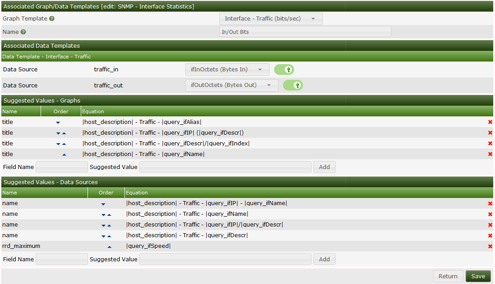

# Data Queries

## Overview

Cacti **Data Queries** are not a replacement for **Data Input Methods** in
Cacti. Instead they provide an easy way to extend Data Input methods to
interpret multidimensional objects, or list data based upon an index, making the
data easier to graph. The most common use of a \*\*Data Query within Cacti is to
retrieve a list of network interfaces via SNMP.

If you want to graph the traffic of a network interface, first Cacti must
retrieve a list of interfaces on the host. Second, Cacti can use that
information to create the necessary **Graphs** and **Data Sources**. **Data
Queries** are only concerned with the first step of the process, that is
obtaining a list of network interfaces and not creating the graphs/data sources
for them. While listing network interfaces is a common use for \*\*Data
Queries\*\*, they also have other uses such as listing partitions, processors,
or even cards in a router.

One requirement for any **Data Query** in Cacti, is that it has some unique
value that defines each row in the list. This concept follows that of a 'primary
key' in SQL, and makes sure that each row in the list can be uniquely
referenced. Examples of these index values are 'ifIndex' for SNMP network
interfaces or the device name for partitions.

There are three types of **Data queries** that you will see referred to
throughout Cacti. They are script queries, script server queries, and SNMP
queries. Script, Script Server and SNMP queries are virtually identical in their
functionality and only differ in how they obtain their information. Script and
Script Server queries will call an external command or script and an SNMP query
will make an SNMP call to retrieve a list of data.

## User Interface

Below, you can see Cacti's default **Data Queries** interface. From the
interface, you can see the Name, ID, Data Input Method, and other information
about the Data Query.



When you edit an existing Data Query, you will see an interface like the one
below. In that interface, you will note that there is an XML file path included.
The XML file is a key component of a Cacti **Data Query**. For Script based
**Data Queries**, there will also be a script that must be called to gather
information about the **Data Query**, the script name is included in the XML
file.



In this Interface, you can see the Name, Description, XML Path, and **Data Input
Method**. In the section below that, you have the `Associated Graph Templates`
section which includes all the various **Graph Templates** that can be used for
the **Data Query**.

Once a **Data Query** **Graph Template** is in use, it can not longer be removed
from Cacti. This feature is there to prevent **Graphs** from becoming
unrenderable if someone accidentally were to remove the **Graph Template**
association.

When you click on any of the `Associated Graph Template` name, you will be taken
to the interface below.



From here, you map the various matching **Data Template** RRDfile Data Source
names to Data Source names that exist in the XML file. There can be many Data
Source names in the XML file, but a Graph Template may only require a few of
them, which explains the reason for having the `Associated Data Templates`
section of the **Data Query**. To associate the XML field with the **Data
Templates** RRDfile Data Source, you simply select the correct one, and then
toggle on the checkbox to the right of the XML field Data Source name.

Below the `Associated Data Templates`, you will find two sections which are
referred to as `Suggested Values` for both the **Data Source** and the **Graph**
names. When creating **Graphs** and their associated **Data Sources** Cacti will
use the first name in the `Suggested Values` pattern that fully replaces all the
tags that are identified by opening and closing vertical bars. So, in the
example above, when creating an Interface Graph, if that Interface does not have
an ifAlias, Cacti will likely use the second `Suggested Value`, unless the
interface does not have an IP Address, in which case it will use the third
`Suggested Value`.

Cacti also allows `Suggested Values`, to replace both **Graph** and **Data
Source** values, as in the case above, the "rrd_maximum" column is replaced by
the Network Interfaces maximum speed, otherwise known as the "ifSpeed" from an
SNMP perspective.

All data queries have two parts, the XML file and the definition within Cacti.
An XML file must be created for each query, that defines where each piece of
information is and how to retrieve it. This could be thought of as the actual
query. The second part is a definition within Cacti, which tells Cacti where to
find the XML file and associates the data query with one or more graph
templates.

## Creating a Data Query

Once you have created the XML file that defines your data query, you must add
the data query within Cacti. To do this you must click on Data Queries under the
Data Gathering heading, and select Add. You will be prompted for some basic
information about the data query, described in more detail below.

###### Table 12-1. Field Description: Data Queries

| Name                   | Description                                                                                                                                                                                                                                            |
| ---------------------- | ------------------------------------------------------------------------------------------------------------------------------------------------------------------------------------------------------------------------------------------------------ |
| Name                   | Give the **Data Query** a name that you will use to identify it. This name will be used throughout Cacti when presented with a list of **Data Queries**.                                                                                               |
| Description (Optional) | Enter a more detailed description of the data query including the information it queries or additional requirements.                                                                                                                                   |
| XML Path               | Fill in the full path to the XML file that defines this query. You can optionally use the `path_cacti` variable that will be substituted with the full path to Cacti. On the next screen, Cacti will check to make sure that it can find the XML file. |
| Data Input Method      | This is how you tell Cacti to handle the data it receives from the data query. Typically, you will select `Get SNMP Data (Indexed)` for an SNMP query and `Get Script Data (Indexed)` for a script query.                                              |

When you are finished filling in all necessary fields, click the Create button
to continue. You will be redirected back to the same page, but this time with
some additional information to fill in. If you receive a red warning that says
'XML File Does Not Exist', correct the value specified in the 'XML Path' field.

### Associated Graph Templates

Every data query must have at least one graph template associated with it, and
possibly more depending on the number of output fields specified in the XML
file. This is where you get to choose what kind of graphs to generate from this
query. For instance, the interface data query has multiple graph template
associations, used to graph traffic, errors, or packets. To add a new graph
template association, simply click Add at the right of the Associated Graph
Templates box. You will be presented with a few fields to fill in:

###### Table 12-2. Field Description: Associated Graph Templates

| Name           | Description                                                                                                                                                                                                                 |
| -------------- | --------------------------------------------------------------------------------------------------------------------------------------------------------------------------------------------------------------------------- |
| Name           | Give a name describing what kind of data you are trying to represent or graph. When the user creates a graph using this data query, they will see a list of graph template associations that they will have to choose from. |
| Graph Template | Choose the actual graph template that you want to make the association with.                                                                                                                                                |

When you are finished filling in these fields, click the Create button. You will
be redirected back to the same page with some additional information to fill in.
Cacti will make a list of each **Data Template** referenced to in your selected
**Graph Template** and display them under the `Associated Data Templates` box.
As previously mentioned, for each **Data Source** item listed, you must selected
the **Data Query** output field that corresponds with it. _Do not forget to
check the checkbox to the right of each selection, or your settings will not be
saved._

The `Suggested Values` form provides you a way to control field values of **Data
Sources** and **Graphs** created using the **Data Query**. If you specify
multiple `Suggested Values` for the same field, Cacti will evaluate them in
order which you can control using the up or down arrow icons. For more
information about valid field names and variables, read the section on
`Suggested Values`.

When you are finished filling in all necessary fields on this form, click the
Save button to return to the data queries edit screen. Repeat the steps under
this heading as many times as necessary to represent all data in your XML file.
When you are finished with this, you should be ready to start adding your data
query to hosts.

### SNMP Query XML Syntax

```xml
<query>
   <name>Get SNMP Interfaces</name>
   <description>Queries a host for a list of monitorable interfaces</description>
   <oid_uptime>.1.3.x.x.x</oid_uptime>
   <oid_index>.1.3.6.1.2.1.2.2.1.1</oid_index>
   <oid_index_parse>OID/REGEXP:.*.([0-9]{1,3}.[0-9]{1,3})$</oid_index_parse>
   <oid_num_indexes>.1.3.6.1.2.1.2.1.0</oid_num_indexes>
   <index_order>ifDescr:ifName:ifIndex</index_order>
   <index_order_type>numeric</index_order_type>
   <index_title_format>|chosen_order_field|</index_title_format>

   <fields>
      <ifIndex>
         <name>Index</name>
         <method>walk</method>
         <source>value</source>
         <direction>input</direction>
         <oid>.1.3.6.1.2.1.2.2.1.1</oid>
      </ifIndex>
   </fields>
</query>
```

###### Table 12-3. SNMP Query XML Settings Reference

| Field              | Description                                                                                                                                                                                                                                                                                                                                                                                                                                                                                                                                                                                                                                                                                                              |
| ------------------ | ------------------------------------------------------------------------------------------------------------------------------------------------------------------------------------------------------------------------------------------------------------------------------------------------------------------------------------------------------------------------------------------------------------------------------------------------------------------------------------------------------------------------------------------------------------------------------------------------------------------------------------------------------------------------------------------------------------------------ |
| name               | (Optional) You can enter a "friendly name" for the SNMP Query here. It will not be used by Cacti, and is for identification only.                                                                                                                                                                                                                                                                                                                                                                                                                                                                                                                                                                                        |
| description        | (Optional) You can enter a description for the SNMP Query here. It will not be used by Cacti, and is for identification only.                                                                                                                                                                                                                                                                                                                                                                                                                                                                                                                                                                                            |
| oid_uptime         | If you have another OID that contains ticks (time), say for example a Java VM. Then, you can create a data query that specifies an alternate uptime OID. To implement this for a data query, simply add the oid_uptime XML parameter to your XML file. Then, if you select your re-index method to be Uptime Goes Backward, Cacti will use that OID to detect whether it is time to re-index the host instead of the standard SNMP OID for uptime.                                                                                                                                                                                                                                                                       |
| oid_index          | Every SNMP Query must have an OID that represents the index values for the query when walked. As described above, any data query in Cacti must contain a field that uniquely identifies each row returned by the query. In the example above, the oid_index points to the OID of ifIndex in the interface MIB. Note: Cacti is able to parse unique indexes from the OID itself. While the regular expression used for parsing the value from the OID is defined below, you must still specify an OID that can be walked by Cacti in order to obtain the list of OID's. Any OID defined for one of your input fields should work in this case. The values returned from the snmpwalk walk will be completely disregarded. |
| non_unique         | If set to true, Cacti will allow the Data Query index to be non-unique, and it will not attempt to change the index_order if for some reason, the chosen index field is not unique.                                                                                                                                                                                                                                                                                                                                                                                                                                                                                                                                      |
| oid_index_parse    | This field should only be used if you are trying to parse the unique index from the OID itself. If this field is defined, to obtain a list of indexes, Cacti walks the OID provided in the oid_index field above. It then applies the regular expression provided in this field to the list of OID's that are returned. The matched substrings that remain become the list of indexes for this SNMP Query.                                                                                                                                                                                                                                                                                                               |
| value_index_parse  | This field uses regular expressions to restrict the list of data returned from the get or walk method. For example: <oid_index>.1.3.6.1.2.1.2.2.1.8</oid_index> <value_index_parse>OID/REGEXP:1</value_index_parse> will only show the list of up-state interfaces. Tip - When using this field it is also worth using oid_index_parse, example: <oid_index_parse>OID/REGEXP:.\*\.([0-9]+)$</oid_index_parse>                                                                                                                                                                                                                                                                                                            |
| oid_num_indexes    | An OID that can be queried to determine the total number of available indexes. If specified, this will be used to determine when to automatically re-cache this SNMP Query when it is attached to a device.                                                                                                                                                                                                                                                                                                                                                                                                                                                                                                              |
| index_order        | Cacti will attempt to find the best field to index off of based on whether each row in the query is unique and non-null. If specified, Cacti will perform this check on the fields listed here in the order specified. Only input fields can be specified and multiple fields should be delimited with a colon.                                                                                                                                                                                                                                                                                                                                                                                                          |
| index_transient    | If set to 'true', this field instructs Cacti not to stop attempting to Graph an index if it disappears from the host cache as a result of a re-index. This setting is for indexes that come and go, for example PPPoE statistics or user statistics which appear when a user log's in, but disappear a few hours after the connection is terminated.                                                                                                                                                                                                                                                                                                                                                                      |
| index_order_type   | For sorting purposes, specify whether the index is numeric or alphanumeric. numeric: The indexes in this SNMP Query are to be sorted numerically (ie. 1,2,3,10,20,31) alphabetic: The indexes in this SNMP Query are to be sorted alphabetically (1,10,2,20,3,31).                                                                                                                                                                                                                                                                                                                                                                                                                                                       |
| index_title_format | Specify the title format to use when representing an index to the user. Any input field name can be used as a variable if enclosed in pipes (&#124;). The variable `&#124;chosen_order_field&#124;` will be substituted with the field chosen by Cacti to index off of (see index_order above).                                                                                                                                                                                                                                                                                                                                                                                                                          |

###### Table 12-4. SNMP Query XML Field Settings Reference

Each field contained within the SNMP Query must be defined under the field tag
as show in the example above. In addition, each defined field in the SNMP Query
must have a unique name given to it. Do not use spaces or any non-alphanumeric
characters, this name must be identifiable within Cacti.

| Field                   | Description                                                                                                                                                                                                                                                                                                                                                                                                                                                                                                                                                                                                                                                                                                                                                                                                                                                                                                                                                                                                                                                                            |
| ----------------------- | -------------------------------------------------------------------------------------------------------------------------------------------------------------------------------------------------------------------------------------------------------------------------------------------------------------------------------------------------------------------------------------------------------------------------------------------------------------------------------------------------------------------------------------------------------------------------------------------------------------------------------------------------------------------------------------------------------------------------------------------------------------------------------------------------------------------------------------------------------------------------------------------------------------------------------------------------------------------------------------------------------------------------------------------------------------------------------------- |
| name                    | Here you can specify a "friendly name" for the field. This name will be used by Cacti to help the user identify this field.                                                                                                                                                                                                                                                                                                                                                                                                                                                                                                                                                                                                                                                                                                                                                                                                                                                                                                                                                            |
| method                  | Tell Cacti how you want it to gather SNMP information for this field. get: The `get` method performs an snmpget for the OID specified for this field appended by the index values derived from `<oid_index>/<oid_index_parse>`. walk: The `walk` method does a walk of the OID specified for this field. If all OIDs belong to the same SNMP table, both methods will return the same values, even though the 'walk' method is typically more efficient.                                                                                                                                                                                                                                                                                                                                                                                                                                                                                                                                                                                                                               |
| source                  | When Cacti obtains a list for this field, you need to tell it how to derive its value for each row. value: The 'value' option simply returns the result of the snmpget for each row. **OID/REGEXP** (regexp_match): The **OID/REGEXP** modifier can be used when you need to use a POSIX-based regular expression to derive the value from the OID. The most common example of this is to retrieve the IP address of an interface, and can be seen in the 'interface.xml' file. **VALUE/REGEXP** (regexp_match): The **VALUE/REGEXP** modifier can be used to parse the value based on a regular expression, returning the first match. index: Simply use the value of the index for this row as the value. If the index is being parsed from the OID using the oid_index_parse field, you must specify index here. Omit the `<oid>...</oid>` field, then. **OID2HEX/REGEXP** (regexp_match): The **OID2HEX/REGEXP** modifier can be used to parse the OID to extract IPv6 addresses. This is useful for input type fields. It also supports the 'oid_index_parse' expression as well. |
| direction               | input: Input values are the "known" values that you will use to derive the output values, this is where the "query" part of SNMP query comes in. When you create a graph based on an SNMP query, Cacti will prompt you to choose the input value to base the graph on. output: Output values are "unknown" values that are returned from the script. An SNMP query may return multiple statistics for a single index. For instance, a single interface could return bytes/sec in, errors, packets/sec, etc. A rule of thumb is that input fields contain semi-static data that is not graphable, while the output fields contain the data that will be graphed.                                                                                                                                                                                                                                                                                                                                                                                                                        |
| oid                     | You must specify the actual OID that corresponds with the field. Each value for this field can be obtained by doing an snmpget on `oid.(each)snmpindex`.                                                                                                                                                                                                                                                                                                                                                                                                                                                                                                                                                                                                                                                                                                                                                                                                                                                                                                                               |
| oid_rewrite_pattern     | You can specify and **OID/REGEXP** string which will be replaced by the oid_rewrite_replacement string if found.                                                                                                                                                                                                                                                                                                                                                                                                                                                                                                                                                                                                                                                                                                                                                                                                                                                                                                                                                                       |
| oid_rewrite_replacement | You must specify the actual OID that corresponds with the field. Each value for this field can be obtained by doing an snmpget on `oid.(each)snmpindex`.                                                                                                                                                                                                                                                                                                                                                                                                                                                                                                                                                                                                                                                                                                                                                                                                                                                                                                                               |
| oid_suffix              | The suffix, if specified will be appended to the each oid from the walk or get response, prior to the oid_rewrite_pattern to oid_rewrite_replace regular expression replace. If the method is get, Cacti will issue an snmpget to obtain the resulting data.                                                                                                                                                                                                                                                                                                                                                                                                                                                                                                                                                                                                                                                                                                                                                                                                                           |
| rewrite_index           | Modifies the snmp values using the rewrite_index expression.                                                                                                                                                                                                                                                                                                                                                                                                                                                                                                                                                                                                                                                                                                                                                                                                                                                                                                                                                                                                                           |
| output_format           | Determines the output format of the column values. Options are 'ascii', 'hex'. If not specified, Cacti will allow SNMP to 'guess' the output format.                                                                                                                                                                                                                                                                                                                                                                                                                                                                                                                                                                                                                                                                                                                                                                                                                                                                                                                                   |

## Script Query XML Syntax

```xml
<query>
   <name>Get Unix Mounted Partitions</name>
   <description>Queries a list of mounted partitions on a unix-based host  with the 'df' command.</description>
   <script_path>perl |path_cacti|/scripts/query_unix_partitions.pl</script_path>
   <arg_index>index</arg_index>
   <arg_query>query</arg_query>
   <arg_get>get</arg_get>
   <arg_num_indexes>num_indexes</arg_num_indexes>
   <output_delimeter>:</output_delimeter>
   <index_order>dskDevice:dskMount</index_order>
   <index_order_type>alphabetic</index_order_type>
   <index_title_format>|chosen_order_field|</index_title_format>

   <fields>
      <dskDevice>
         <name>Device Name</name>
         <direction>input</direction>
         <query_name>device</query_name>
      </dskDevice>
   </fields>
</query>
```

###### Table 12-5. Script Query XML Settings

| Field              | Description                                                                                                                                                                                                                                                                                                                                         |
| ------------------ | --------------------------------------------------------------------------------------------------------------------------------------------------------------------------------------------------------------------------------------------------------------------------------------------------------------------------------------------------- |
| name               | (Optional) You can enter a "friendly name" for the script query here. It will not be used by Cacti, and is for identification only.                                                                                                                                                                                                                 |
| description        | (Optional) You can enter a description for the script query here. It will not be used by Cacti, and is for identification only.                                                                                                                                                                                                                     |
| script_path        | Enter the complete path to the script or executable that is going to handle your script query. When in doubt, specify the pull path to all binaries referenced in this path, the query may not execute otherwise.                                                                                                                                   |
| arg_index          | Enter the argument that is to be passed to the script to retrieve a list of indexes.                                                                                                                                                                                                                                                                |
| arg_query          | Enter the argument that is to be passed to the script to retrieve a list of values given a field name.                                                                                                                                                                                                                                              |
| arg_get            | Enter the argument that is to be passed to the script to retrieve a single value given a field name and index value.                                                                                                                                                                                                                                |
| arg_num_indexes    | Enter the argument that is to be passed to the script to determine the total number of available indexes. If specified, this will be used to determine when to automatically re-cache this script query when it is attached to a device.                                                                                                            |
| output_delimeter   | Enter the one character delimiter that will be used to separate output values. This is only used when you "query" the script in which case it outputs 'index(delimiter)value'.                                                                                                                                                                      |
| index_order        | Cacti will attempt to find the best field to index off of based on whether each row in the query is unique and non-null. If specified, Cacti will perform this check on the fields listed here in the order specified. Only input fields can be specified and multiple fields should be delimited with a comma.                                     |
| index_transient    | If set to 'true', this field instructs Cacti not to stop attempting to Graph an index if it disappears from the host cache as a result of a re-index. This setting is for indexes that come and go, for example PPPoE statistics or user statistics which appear when a user log's in, but disappear a few hours after the connection is terminated. |
| index_order_type   | For sorting purposes, specify whether the index is numeric or alphanumeric. numeric: The indexes in this script query are to be sorted numerically (ie. 1,2,3,10,20,31) alphabetic: The indexes in this script query are to be sorted alphabetically (1,10,2,20,3,31).                                                                              |
| index_title_format | Specify the title format to use when representing an index to the user. Any input field name can be used as a variable if enclosed in pipes (&#124;). The variable &#124;chosen_order_field&#124; will be substituted with the field chosen by Cacti to index off of (see index_order above).                                                       |

###### Table 12-6. Script Query XML Field Settings

Each field contained within the Script Query must be defined under the field tag
as show in the example above. In addition, each defined field in the Script
Query must have a unique name given to it. Do not use spaces or any
non-alphanumeric characters, this name must be identifiable within Cacti.

| Field      | Description                                                                                                                                                                                                                                                                                                                                                                                                                                                                                                                                                                                                                                                                                   |
| ---------- | --------------------------------------------------------------------------------------------------------------------------------------------------------------------------------------------------------------------------------------------------------------------------------------------------------------------------------------------------------------------------------------------------------------------------------------------------------------------------------------------------------------------------------------------------------------------------------------------------------------------------------------------------------------------------------------------- |
| name       | Here you can specify a "friendly name" for the field. This name will be used by Cacti to help the user identify this field.                                                                                                                                                                                                                                                                                                                                                                                                                                                                                                                                                                   |
| direction  | input: Input values are the "known" values that you will use to derive the output values, this is where the "query" part of script query comes in. When you create a graph based on a script query, Cacti will prompt you to choose the input value to base the graph on. output: Output values are "unknown" values that are returned from the script. A script query may return multiple statistics for a single index. For instance, a single partition could return free disk space, total disk space, fragmentation percentage, etc. A rule of thumb is that input fields contain semi-static data that is not graphable, while the output fields contain the data that will be graphed. |
| query_name | Enter the name that Cacti must use when asking the script for information about this field. For instance, the following should return values: '(script_name) query (query_name)'.                                                                                                                                                                                                                                                                                                                                                                                                                                                                                                             |

## Script Server XML Syntax

```xml
<query>
    <name>Get Host MIB CPUs</name>
    <script_path>|path_cacti|/scripts/ss_host_cpu.php</script_path>
    <script_function>ss_host_cpu</script_function>
    <script_server>php</script_server>
    <arg_prepend>|host_hostname| |host_id| |host_snmp_version|:|host_snmp_port|:|host_snmp_timeout|:|host_ping_retries|:|host_max_oids|:|host_snmp_community|:|host_snmp_username|:|host_snmp_password|:|host_snmp_auth_protocol|:|host_snmp_priv_passphrase|:|host_snmp_priv_protocol|:|host_snmp_context|</arg_prepend>
    <arg_index>index</arg_index>
    <arg_query>query</arg_query>
    <arg_get>get</arg_get>
    <arg_num_indexes>num_indexes</arg_num_indexes>
    <output_delimeter>!</output_delimeter>
    <index_order>hrProcessorFrwID</index_order>
    <index_order_type>numeric</index_order_type>
    <index_title_format>CPU#|chosen_order_field|</index_title_format>

    <fields>
        <hrProcessorFrwID>
            <name>Processor Index Number</name>
            <direction>input</direction>
            <query_name>index</query_name>
        </hrProcessorFrwID>

        <hrProcessorLoad>
            <name>Processor Usage</name>
            <direction>output</direction>
            <query_name>usage</query_name>
        </hrProcessorLoad>
    </fields>
</query>

```

###### Table 12-7. Script Server XML Settings

| Field              | Description                                                                                                                                                                                                                                                                                                                                         |
| ------------------ | --------------------------------------------------------------------------------------------------------------------------------------------------------------------------------------------------------------------------------------------------------------------------------------------------------------------------------------------------- |
| name               | (Optional) You can enter a "friendly name" for the script query here. It will not be used by Cacti, and is for identification only.                                                                                                                                                                                                                 |
| description        | (Optional) You can enter a description for the script query here. It will not be used by Cacti, and is for identification only.                                                                                                                                                                                                                     |
| script_path        | Enter the complete path to the script or executable that is going to handle your script query. When in doubt, specify the pull path to all binaries referenced in this path, the query may not execute otherwise.                                                                                                                                   |
| script_function    | The function within the script in the case where the script can be used for multiple data collection functions. Most script server scripts are associated with only one Data Query, but it's possible to have one script perform the collection for multiple Data Queries.                                                                          |
| arg_prepend        | A list of device variables from the host to prepend after the script function when calling the script. This information can be used to identify the device that is being monitored or pass certain device information to the script.                                                                                                                |
| arg_index          | Enter the argument that is to be passed to the script to retrieve a list of indexes.                                                                                                                                                                                                                                                                |
| arg_query          | Enter the argument that is to be passed to the script to retrieve a list of values given a field name.                                                                                                                                                                                                                                              |
| arg_get            | Enter the argument that is to be passed to the script to retrieve a single value given a field name and index value.                                                                                                                                                                                                                                |
| arg_num_indexes    | Enter the argument that is to be passed to the script to determine the total number of available indexes. If specified, this will be used to determine when to automatically re-cache this script query when it is attached to a device.                                                                                                            |
| output_delimeter   | Enter the one character delimiter that will be used to separate output values. This is only used when you "query" the script in which case it outputs 'index(delimiter)value'.                                                                                                                                                                      |
| index_order        | Cacti will attempt to find the best field to index off of based on whether each row in the query is unique and non-null. If specified, Cacti will perform this check on the fields listed here in the order specified. Only input fields can be specified and multiple fields should be delimited with a comma.                                     |
| index_transient    | If set to 'true', this field instructs Cacti not to stop attempting to Graph an index if it disappears from the host cache as a result of a re-index. This setting is for indexes that come and go, for example PPPoE statistics or user statistics which appear when a user log's in, but disappear a few hours after the connection is terminated. |
| index_order_type   | For sorting purposes, specify whether the index is numeric or alphanumeric. numeric: The indexes in this script query are to be sorted numerically (ie. 1,2,3,10,20,31) alphabetic: The indexes in this script query are to be sorted alphabetically (1,10,2,20,3,31).                                                                              |
| index_title_format | Specify the title format to use when representing an index to the user. Any input field name can be used as a variable if enclosed in pipes (&#124;). The variable &#124;chosen_order_field&#124; will be substituted with the field chosen by Cacti to index off of (see index_order above).                                                       |

###### Table 12-6. Script Server XML Field Settings

Each field contained within the Script Query must be defined under the field tag
as show in the example above. In addition, each defined field in the Script
Query must have a unique name given to it. Do not use spaces or any
non-alphanumeric characters, this name must be identifiable within Cacti.

| Field      | Description                                                                                                                                                                                                                                                                                                                                                                                                                                                                                                                                                                                                                                                                                   |
| ---------- | --------------------------------------------------------------------------------------------------------------------------------------------------------------------------------------------------------------------------------------------------------------------------------------------------------------------------------------------------------------------------------------------------------------------------------------------------------------------------------------------------------------------------------------------------------------------------------------------------------------------------------------------------------------------------------------------- |
| name       | Here you can specify a "friendly name" for the field. This name will be used by Cacti to help the user identify this field.                                                                                                                                                                                                                                                                                                                                                                                                                                                                                                                                                                   |
| direction  | input: Input values are the "known" values that you will use to derive the output values, this is where the "query" part of script query comes in. When you create a graph based on a script query, Cacti will prompt you to choose the input value to base the graph on. output: Output values are "unknown" values that are returned from the script. A script query may return multiple statistics for a single index. For instance, a single partition could return free disk space, total disk space, fragmentation percentage, etc. A rule of thumb is that input fields contain semi-static data that is not graphable, while the output fields contain the data that will be graphed. |
| query_name | Enter the name that Cacti must use when asking the script for information about this field. For instance, the following should return values: '(script_name) query (query_name)'.                                                                                                                                                                                                                                                                                                                                                                                                                                                                                                             |

---

Copyright (c) 2004-2023 The Cacti Group
