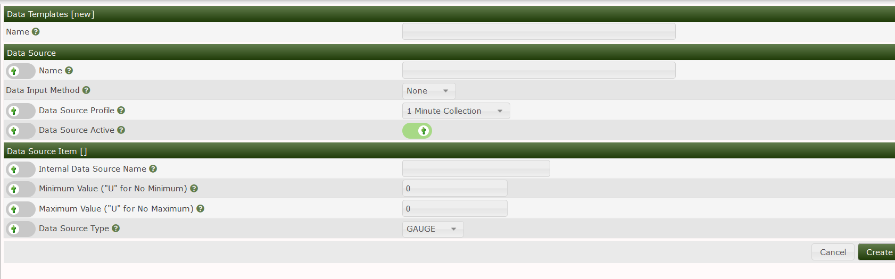
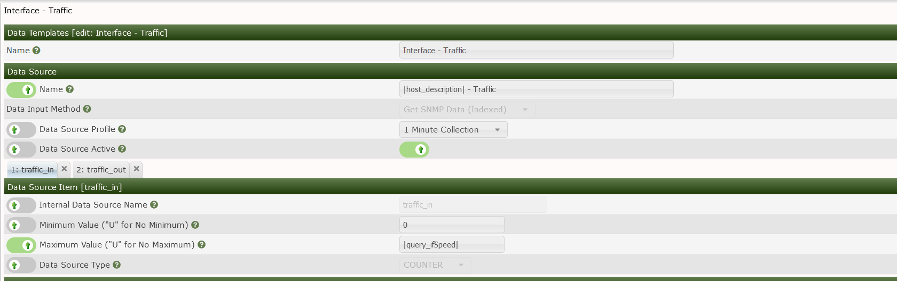
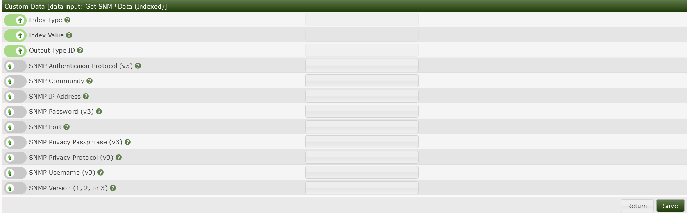

# Data Source Templates

Data sources serve an important role in Cacti data sources are data points
collected from the devices you monitor in Cacti.

Data sources take the data that has been collected by the poller.

The Data source then holds the value to be presented to the graph.

The Data source template is then associated with a graph template.

These data sources can be for example incoming traffic on an interface.
Cacti allows you to create data source templates to associate to data queries
the template allows you to describe what type of data Cacti should expect.

To create a Data source you will need to select the proper data input there are
several options but the most popular ones would be GET SNMP data or GET SNMP
data (indexed.)

You would use Get SNMP data (indexed) for interfaces for example as Cacti would
need to query the device to find the interface index.  You would use Get SNMP
data and put in a single OID for an OID that won't change for example CPU usage
generally does not have an index and the OID won't change

You will also need to tell the template what the data source type is.
The most common ones being Gauge and Counter.  These data types come from the
RRDtool its self here are the following supported data types and their uses

(Source <https://oss.oetiker.ch/rrdtool/doc/rrdcreate.en.html>)

GAUGE

    is for things like temperatures or number of people in a room or
    the value of a RedHat share.

COUNTER

    is for continuous incrementing counters like the ifInOctets counter in a router.
    The COUNTER data source assumes that the counter never decreases,
    except when a counter overflows.
    The update function takes the overflow into account.
    The counter is stored as a per-second rate.
    When the counter overflows, RRDtool checks if the overflow happened
    at the 32bit or 64bit border
    and acts accordingly by adding an appropriate value to the result.

DCOUNTER

    the same as COUNTER, but for quantities expressed as double-precision
    floating point number.
    Could be used to track quantities that increment by non-integer numbers, i.e.
    number of seconds that some routine has taken to run,
    total weight processed by some technology equipment etc.
    The only substantial difference is that DCOUNTER can either be upward counting
    or downward counting, but not both at the same time.
    The current direction is detected automatically on the second non-undefined
    counter update and any further change in the direction is considered a reset.
    The new direction is determined and locked in by the second update after
    reset and its difference to the value at reset.

DERIVE

    will store the derivative of the line going from the last to the current
    value of the data source. This can be useful for gauges,
    for example, to measure the rate of people entering or leaving a room.
    Internally, derive works exactly like COUNTER but without overflow checks.
    So if your counter does not reset at 32 or 64 bit you might want to use
    DERIVE and combine it with a MIN value of 0.

DDERIVE

    the same as DERIVE, but for quantities expressed as double-precision
    floating point number.

    NOTE on COUNTER vs DERIVE

    by Don Baarda <don.baarda@baesystems.com>

    If you cannot tolerate ever mistaking the occasional counter reset for a
    legitimate counter wrap, and would prefer "Unknowns" for all legitimate counter
    wraps and resets, always use DERIVE with min=0.
    Otherwise, using COUNTER with a suitable max will return correct values for
    all legitimate counter wraps,
    mark some counter resets as "Unknown", but can mistake some counter
    resets for a legitimate counter wrap.

    For a 5 minute step and 32-bit counter, the probability of mistaking a counter
    resetfor a legitimate wrap is arguably about 0.8% per 1Mbps of maximum bandwidth.
    Note that this equates to 80% for 100Mbps interfaces, so for high bandwidth
    interfaces and a 32bit counter, DERIVE with min=0 is probably preferable.
    If you are using a 64bit counter, just about any max setting will eliminate
    the possibility of mistaking a reset for a counter wrap.

ABSOLUTE

    is for counters which get reset upon reading. This is used for fast counters
    which tend to overflow.
    So instead of reading them normally you reset them after every read to make
    sure you have a maximum time available before the next overflow.
    Another usage is for things you count like number of messages since the
    last update.
COMPUTE

    is for storing the result of a formula applied to other data sources in the RRD.
    This data source is not supplied a value on update, but rather its Primary
    Data Points (PDPs) are computed from the PDPs of the data sources
    according to the rpn-expression that defines the formula.
    Consolidation functions are then applied normally to the PDPs of the COMPUTE
    data source (that is the rpn-expression is only applied to generate PDPs).
    In database software, such data sets are referred to as "virtual" or "computed"
    columns.

You are also able to use Variables to set the name for the data source.
The available Variables can be seen here

<https://github.com/Cacti/documentation/blob/develop/Variables.md>

What is also an important setting is the internal data source name.
This will be used to asociate the Data source with the Graph template.
so be sure to name is something that is recognizable.

---
Copyright (c) 2004-2023 The Cacti Group
