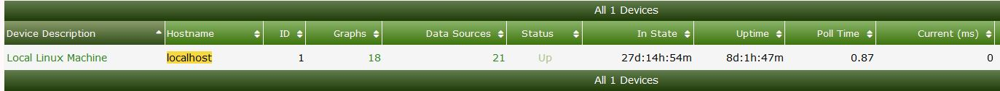
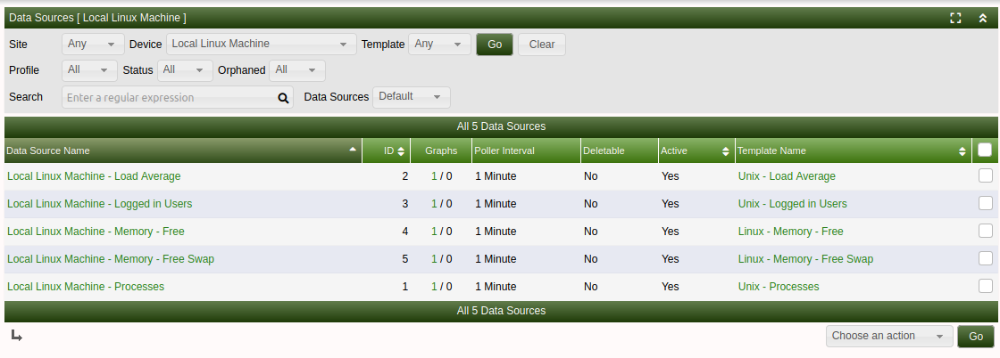

# Data Source Management

Data sources in Cacti are the points of data that Cacti will collect from a
device.  The following are examples of different sources that can be utililised
for graphing, though is just the surface of what is achievable:

- Monitoring a device via ping will usually count as 1 data source.

- A 24 port switch and you poll the device via snmp and graph all of
  the ports then there will be 24 data sources

> **Note**: if you add more graphs that base their data on the original
> **Data source** that would not count as another **Data Source** since
> it uses the already existing source.

For example, if you have a 24 port switch that you create an **In/Out Bits**
graph for each interface, and you then add the **In/Out Bits with 95th
Percentile** for each interface, you would still only have 24 data sources.

Keeping on top of the amount of data sources you have is important as the more
data sources you have the more resources you will need to allocate
to your server.

You can see how many data sources are associated with a single device by going
to management then clicking on devices.



You can also see the total amount of data sources by checking the poller stats
on the system. Click the log tab and filter by stats and lookout for the below
messege

```console
2019/05/24 17:21:11 - SYSTEM STATS: Time:9.5913 Method:spine Processes:2 Threads:2 Hosts:14 HostsPerProcess:7 DataSources:162 RRDsProcessed:117
```

This output tells us we have 162 data sources on the system.

### Storage considerations and datasources

The amount of data sources on your system has an impact on the amount of storage
you will need.  You will also need to consider what rate you are polling your
devices.  e.g. 1 minute or 5 Minute polls

Here is the approximate amount of storage you can expect to consume per data source

###### 30 second polling

Retention      | File size
------------- |:-------------:
Daily | 48kb
Weekly | 43kb
Monthly | 46kb
Yearly | 140kb

###### 1 minute polling

Retention | File size
------------- |:-------------:
Daily | 93kb
Weekly | 45kb
Monthly | 47kb
Yearly | 140kb

###### 5 minute polling

Retention | File size
------------- |:-------------:
Daily | 19b
Weekly | 22kb
Monthly | 25kb
Yearly | 26kb

### Viewing all Data sources by device

You are able to check the data sources associated to a specific device in the Console -> Management -> Data sources
You can then search based on a device you may be interested in to view the Data sources in use



You can also view Orphaned data sources in this view by setting Orphaned from All to Orphaned
Orphaned data sources are where the graph has been deleted but the data source was not deleted

---
<copy>Copyright (c) 2004-2023 The Cacti Group</copy>
