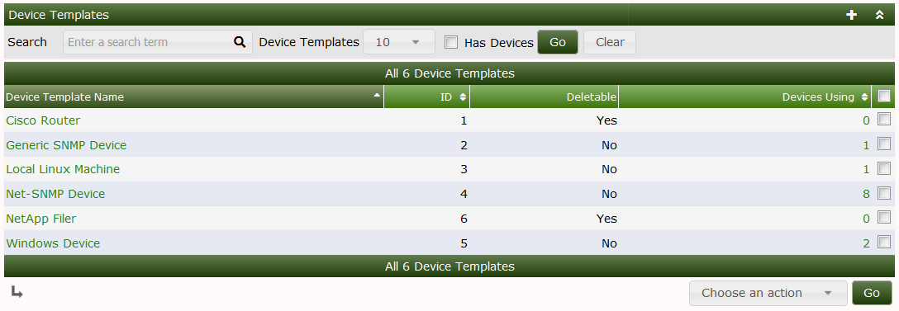
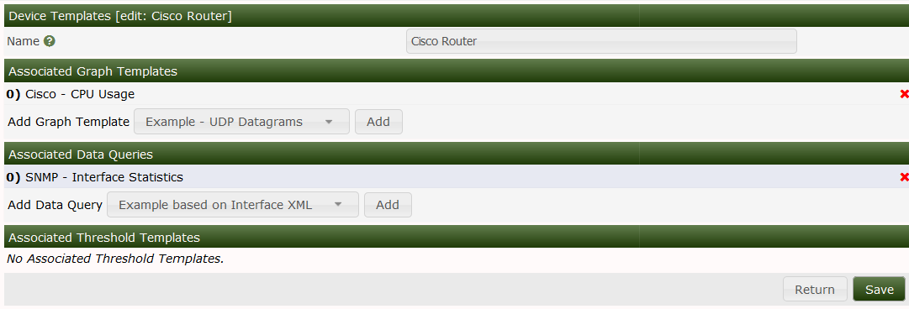

# Device Templates

**Device Templates** are Cacti objects that allows you to define classes of
**Devices** that includes from one to many **Graph Templates**, **Data Queries**
and other **Plugin** related object types.

The purpose of **Device Templates** is to simplify the **Automation** process by
pre-defining the **Graphs** that should be created for every **Device** that is
added to Cacti.  They work in conjunction with **Automation Templates** so that
when Cacti discovers a **Network** it knows what **Graphs** to create for each
**Device**.

The **Device Templates** main screen looks like the image below:

From this page, you can see the title of each **Device Template**, it's ID which
is important for the Cacti CLI scripts.  You can see if the **Device Template**
can be removed, and the number of **Devices** using the **Device Template**.
Templates that are used by **Devices** can not be removed and therefore if you
attempt to remove one of these Templates, you will receive and error message.

From the drop down there are three options, they are:

Option | Description
--- | ---
Delete | Remove the **Device Template** if it's *Deletable*
Duplicate | Make an exact copy of the **Device Template**.
Sync Devices | Update all **Devices** using this **Device Template** with the latest definition, adding, but not removing **Graph Templates**, and **Data Queries**.

When editing a **Device Template**, you will see the page as displayed below.
From this page, you can add and remove **Graph Templates**, **Data Queries**,
and other **Plugin** objects.  In the image below, you can see that the *Cisco
Router* has one **Graph Template** that of *Cisco - CPU Usage* and one **Data
Query** that of *SNMP - Interface Statistics*.  There are no **Threshold
Templates** defined on the system, so there is no way to select one.

To add a **Graph Template** or **Data Query** to the **Device Template**, simply
select it from the drop down, and press the *Add* button.  There is no need to
*Save* afterwards.  To removed one of these items, simply press the x glyph to
the right of the desired **Graph Template** or **Data Query**.

---
<copy>Copyright (c) 2004-2021 The Cacti Group</copy>
