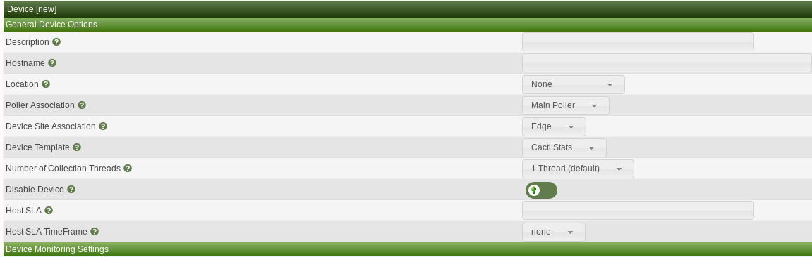

# Device Management

This section will describe **Device** management in Cacti.

Adding a **Device** to Cacti can be done in a few different ways, either via
the Web GUI, Cacti's Automation, or the Command Line Interface (CLI).

## Web GUI Option

To add a device via the Web GUI first click on `Console > Managment > Devices` and
you will see the below device console window which will show existing devices
if any


You will now select the + on the top right hand corner


Once you select the + otherwise known as the add device button you will see the
below screen which will ask you for device specific information

Some of the most important information about the device will be required in this
window which includes

- **Description** - The name that will appear on **Graphs** by default
- **IP/Hostname** - The DNS or IP address of the actual **Device**
- **Poller Association** - Defines which **Data Collector** is responsible for
  pulling information about the **Device**
- **Device Template** - Cisco, Net-SNMP, Linux, etc - The Cacti object that
  holds all the **Graph Templates** and **Data Queries** to be graphed
- **Site, Location** - Very important to performing Meta queries, or for
  Site level Graph organization on Cacti **Graph Trees**
- **Availability/Reachability** - Settings that describe **Device**
  timeouts and availability methods.
- **SNMP information** - SNMP Credentials for connecting to the **Device**
- **Device Notes** - Arbitrary unstructured information about the **Device**



Cacti requires this basic information to be able to monitor the device and once
entered, click save on the bottom right corner. With the device created you will
need to add graphs for the device by clicking **Create graphs for this device**
on the top right hand corner.

## Availability/Reachability Settings

Cacti prefers to use the Simple Network Management Protocol (SNMP) to communicate
with **Devices**.  Therefore, when creating a **Device**, you need to provide SNMP
credentials to obtain information about the **Device** in order to collect data from
it.  Before Cacti will query the **Device** for data, it first verifies that the
**Device** is up and responding.  When doing so, you have several options.
They include:

- **None** - Always assume the device is up.  This is generally reserved for **Device**
  objects that do not have a state.
- **SNMP Uptime** - Query the SNMP Uptime Instance OID
- **Ping and SNMP Uptime** - Ping the device but also check the SNMP Uptime
  Instance OID
- **Ping** - Either ICMP, TCP at a port, or UDP as a port
- **Ping or SNMP Uptime** - Only one needs to be working for Cacti to collect data
- **SNMP Desc** - Query the SNMP sysDecription in cases where the SNMP Uptime OID
  is not available
- **SNMP GetNext** - Query the first available OID in the OID tree for the **Device**
  Used for certain devices that have limited SNMP support.

## SNMP Credentials

When providing the SNMP credentials, Cacti currently supports the following versions:

- **Version 1** - Rarely used any more.  Reserved for very old hardware
- **Version 2** - Still very popular, and support 64 bit counters except on Windows
- **Version 3** - Support is provided, but there are presently limitations for example
  at the present time only MD5, and SHA1 Auth Protocols, and DES and AES128
  Privacy Protocols.  Higher level encryption is currently scheduled for a future
  release.

When providing the SNMP Credentials, Cacti will warn you if you have provided
incomplete information depending on the SNMP Version and SNMP Security Level
you have specified.

## Additional Important Options

There are some additional options that you should note before starting to use Cacti.
They include the following:

- **Device Threads** - If your device is far away, and can tolerate multiple threads
  querying information, you can increase this number to reduce the time it takes
  to collect all information.
- **Maximum OIDs Per Get Request** - Otherwise known as MaxOID's, this SNMP option
  will allow the SNMP client to gather more metrics per get request.  Please keep
  in mind that the higher you make this number, the longer a SNMP respond may take.
  So, you have to be sensitive about the SNMP timeout as the number get's larger.
  Since, by default SNMP is generally collected over UDP, you will also be limited
  in the number of responses depending on how many routers or VPN's you traverse
  to reach a device.  When traversing VPN connections, many VPN's limit the MTU
  to around 500 bytes, which will significantly limit how large the Max OID's can
  be.  In some cases, it may be better to deploy a **Remote Data Collector** when
  your device is either far way from a latency perspective, or that you must
  traverse VPN's to communicate with.
- **External ID** - This field is normally used for Asset Tracking information for
  the **Device**, but it use is entirely up to the System Administrator.

## Plugin Behavior

Many Cacti Plugins can and do add additional columns to the Device table in Cacti.
Depending on the Plugin you have installed, you will find other information that
you can provide about the device including things like:

- **Notification Settings** - Who to notify when the **Device** changes state
- **Criticality** - How important is the device
- **Failure and Recovery Counts** - How long till a device is treated as truely
  down.
- **Ping Thresholds** - What RTL is considered bad when reaching a device

## Creating devices via CLI script

You can also create device by using the CLI script located at /cactidir/cli/

```console
usage: add_device.php --description=[description] --ip=[IP] --template=[ID] [--notes="[]"] [--disable]
    [--poller=[id]] [--site=[id] [--external-id=[S]] [--proxy] [--threads=[1]
    [--avail=[ping]] --ping_method=[icmp] --ping_port=[N/A, 1-65534] --ping_timeout=[N] --ping_retries=[2]
    [--version=[0|1|2|3]] [--community=] [--port=161] [--timeout=500]
    [--username= --password=] [--authproto=] [--privpass= --privproto=] [--context=] [--engineid=]
    [--quiet]

Required:
    --description  the name that will be displayed by Cacti in the graphs
    --ip           self explanatory (can also be a FQDN)
```

To add a device using the bare minimum information would look something like this

```console
$ php add_device.php --description=test --ip=192.168.1.15
Adding test (192.168.1.15) as "Cacti Stats" using SNMP v3 with community "public"
Success - new device-id: (45)
```

---
Copyright (c) 2004-2021 The Cacti Group
