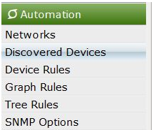
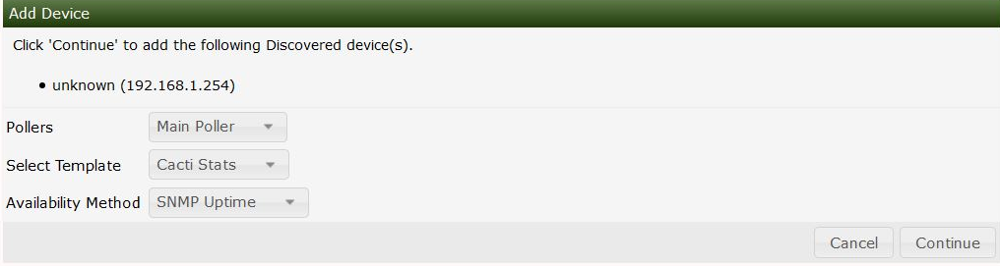

# Automation Discovered Devices

After you initiate a scan from automation Cacti will compare devices
found to the device rules and SNMP options you set.

If Cacti is unable to match the device to a device template or unable to
find a proper SNMP credential.

Also if you have the automatically add to Cacti set to off the devices will
also be put in this section.

The Discovered Devices section can be found by navigating to the
following area.

Below you can see devices that have been found during the scan that did
not meet a match criteria.

You will see the IP that was scanned as well if available the resolved
hostname either via DNS or netbios.

You can then select the device you are interested in adding click the
checkbox next to the device

on the dropdown you select add device this will bring up the below menu.
From this Menu you will be able to fill out the details of the new device.

---
Copyright (c) 2004-2024 The Cacti Group
