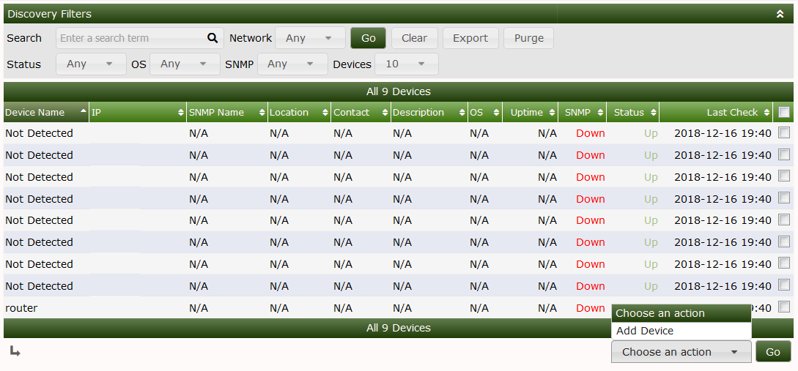

# Automation Discovered Devices

This section will describe **Discovered Devices** in Cacti.

During a network discovery if Cacti finds a device that is responding to ping but not SNMP the device will be placed
in the discovered devices view 

.

This can mean that you have properly setup your SNMP options with the proper string or incorrect credentials in the case of SNMP V3  or that the device is not configured for  SNMP. 

refer to [Automation SNMP Options](SNMP-Options.md) on how to properly setup SNMP options for automation

If the device does not support SNMP and you want to just have a ping uptime monitor you can still add the device 
select the checkbox next to the device you would like to add then select add device from the dropdown 

If you would like to clear all of the discovered devices select all of the devices and click purge on the top of the window

---
Copyright (c) 2004-2019 The Cacti Group
