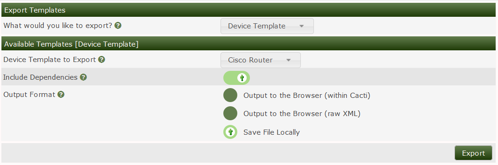

# Template Exporting

Cacti allows **Device**, **Graph**, and **Data** Templates to be exported in XML
format. You can access the screen below by going to
`Console > Import / Export > Template Export`. When you get to this page, the
most popular option is to export the **Device Template**, but the discretion is
upto the user. Once you pick the object type, the list of available templates is
presented. The most popular option is to save to a file, but you have additional
options.



Inside of the Template, Cacti uses a **hash** Global Uniqueue ID (GUID) to
uniquely identify every Template component. So, any Template that you export can
be shared with anyone around the globe without ambiguity. See the Linux Device
Template Example below.

In this Template thaere are Many Components:

1. The Device Template Name itself and it's GUID
2. All the Graph Templates and their GUID's
3. All the Graph Template inputs and their GUID's
4. All the Data Templates and their GUID's
5. All the Data Input Method's and their GUID's
6. All the GPrint Presets and their GUID's
7. All the CDEF's and VDEF's and their GUID's
8. All the Data Source Profiles and their GUID's

Although the output is human readable, some columns are encoded so as to not
cause problems with the XML output format. To read them, you must base64_decode
them in PHP or some other language.

Presently they are saved in XML format, but there are discussions with making
these templates YAML formatted.

```xml
<cacti>
	<hash_0201022d3e47f416738c2d22c87c40218cc55e>
		<name>Local Linux Machine</name>
		<graph_templates>hash_0001029fe8b4da353689d376b99b2ea526cc6b|hash_000102fe5edd777a76d48fc48c11aded5211ef|hash_00010263610139d44d52b195cc375636653ebd|hash_0001026992ed4df4b44f3d5595386b8298f0ec</graph_templates>
		<data_queries>hash_0401028ffa36c1864124b38bcda2ae9bd61f46</data_queries>
	</hash_0201022d3e47f416738c2d22c87c40218cc55e>
	<hash_0001029fe8b4da353689d376b99b2ea526cc6b>
		<name>Unix - Processes</name>
		<graph>
			<t_title></t_title>
			<title>|host_description| - Processes</title>
			<t_vertical_label></t_vertical_label>
			<vertical_label>processes</vertical_label>
			<t_image_format_id></t_image_format_id>
			<image_format_id>1</image_format_id>
			<t_height></t_height>
			<height>200</height>
			<t_width></t_width>
			<width>700</width>
			<t_base_value></t_base_value>
			<base_value>1000</base_value>
			<t_slope_mode></t_slope_mode>
			<slope_mode>on</slope_mode>
			<t_auto_scale></t_auto_scale>
			<auto_scale>on</auto_scale>
			<t_auto_scale_opts></t_auto_scale_opts>
			<auto_scale_opts>2</auto_scale_opts>
			<t_auto_scale_log></t_auto_scale_log>
			<auto_scale_log></auto_scale_log>
			<t_scale_log_units></t_scale_log_units>
			<scale_log_units></scale_log_units>
			<t_auto_scale_rigid></t_auto_scale_rigid>
			<auto_scale_rigid></auto_scale_rigid>
			<t_upper_limit></t_upper_limit>
			<upper_limit>100</upper_limit>
			<t_lower_limit></t_lower_limit>
			<lower_limit>0</lower_limit>
			<t_unit_value></t_unit_value>
			<unit_value></unit_value>
			<t_unit_exponent_value></t_unit_exponent_value>
			<unit_exponent_value></unit_exponent_value>
			<t_unit_length></t_unit_length>
			<unit_length></unit_length>
			<t_no_gridfit></t_no_gridfit>
			<no_gridfit></no_gridfit>
			<t_alt_y_grid></t_alt_y_grid>
			<alt_y_grid></alt_y_grid>
			<t_right_axis></t_right_axis>
			<right_axis></right_axis>
			<t_right_axis_label></t_right_axis_label>
			<right_axis_label></right_axis_label>
			<t_right_axis_format></t_right_axis_format>
			<right_axis_format>0</right_axis_format>
			<t_right_axis_formatter></t_right_axis_formatter>
			<right_axis_formatter>0</right_axis_formatter>
			<t_left_axis_formatter></t_left_axis_formatter>
			<left_axis_formatter>0</left_axis_formatter>
			<t_auto_padding></t_auto_padding>
			<auto_padding>on</auto_padding>
			<t_dynamic_labels></t_dynamic_labels>
			<dynamic_labels></dynamic_labels>
			<t_force_rules_legend></t_force_rules_legend>
			<force_rules_legend></force_rules_legend>
			<t_tab_width></t_tab_width>
			<tab_width>40</tab_width>
			<t_legend_position></t_legend_position>
			<legend_position>0</legend_position>
			<t_legend_direction></t_legend_direction>
			<legend_direction>0</legend_direction>
		</graph>
		<items>
		</items>
		<inputs>
			<hash_090102592cedd465877bc61ab549df688b0b2a>
				<name>Processes Data Source</name>
				<description></description>
				<column_name>task_item_id</column_name>
				<items>hash_000102d023fcaa39c9ffe41116492a116ea18e|hash_00010210b6ba6d1f88815cfac5397d41c426a6|hash_000102eadd16a7d7cb09b2b0555ac3710196ef|hash_0001025ae0cb568c7ca4ea3e6a0fbef39a7f76</items>
			</hash_090102592cedd465877bc61ab549df688b0b2a>
			<hash_0901021d51dbabb200fcea5c4b157129a75410>
				<name>Legend Color</name>
				<description></description>
				<column_name>color_id</column_name>
				<items>hash_000102d023fcaa39c9ffe41116492a116ea18e</items>
			</hash_0901021d51dbabb200fcea5c4b157129a75410>
		</inputs>
	</hash_0001029fe8b4da353689d376b99b2ea526cc6b>
	<hash_000102fe5edd777a76d48fc48c11aded5211ef>
		<name>Unix - Load Average</name>
		<graph>
			<t_title></t_title>
			<title>|host_description| - Load Average</title>
			<t_vertical_label></t_vertical_label>
			<vertical_label>run que length</vertical_label>
			<t_image_format_id></t_image_format_id>
			<image_format_id>1</image_format_id>
			<t_height></t_height>
			<height>200</height>
			<t_width></t_width>
			<width>700</width>
			<t_base_value></t_base_value>
			<base_value>1000</base_value>
			<t_slope_mode></t_slope_mode>
			<slope_mode>on</slope_mode>
			<t_auto_scale></t_auto_scale>
			<auto_scale>on</auto_scale>
			<t_auto_scale_opts></t_auto_scale_opts>
			<auto_scale_opts>2</auto_scale_opts>
			<t_auto_scale_log></t_auto_scale_log>
			<auto_scale_log></auto_scale_log>
			<t_scale_log_units></t_scale_log_units>
			<scale_log_units></scale_log_units>
			<t_auto_scale_rigid></t_auto_scale_rigid>
			<auto_scale_rigid>on</auto_scale_rigid>
			<t_upper_limit></t_upper_limit>
			<upper_limit>100</upper_limit>
			<t_lower_limit></t_lower_limit>
			<lower_limit>0</lower_limit>
			<t_unit_value></t_unit_value>
			<unit_value></unit_value>
			<t_unit_exponent_value></t_unit_exponent_value>
			<unit_exponent_value>0</unit_exponent_value>
			<t_unit_length></t_unit_length>
			<unit_length></unit_length>
			<t_no_gridfit></t_no_gridfit>
			<no_gridfit></no_gridfit>
			<t_alt_y_grid></t_alt_y_grid>
			<alt_y_grid></alt_y_grid>
			<t_right_axis></t_right_axis>
			<right_axis></right_axis>
			<t_right_axis_label></t_right_axis_label>
			<right_axis_label></right_axis_label>
			<t_right_axis_format></t_right_axis_format>
			<right_axis_format>0</right_axis_format>
			<t_right_axis_formatter></t_right_axis_formatter>
			<right_axis_formatter>0</right_axis_formatter>
			<t_left_axis_formatter></t_left_axis_formatter>
			<left_axis_formatter>0</left_axis_formatter>
			<t_auto_padding></t_auto_padding>
			<auto_padding>on</auto_padding>
			<t_dynamic_labels></t_dynamic_labels>
			<dynamic_labels></dynamic_labels>
			<t_force_rules_legend></t_force_rules_legend>
			<force_rules_legend></force_rules_legend>
			<t_tab_width></t_tab_width>
			<tab_width>40</tab_width>
			<t_legend_position></t_legend_position>
			<legend_position>0</legend_position>
			<t_legend_direction></t_legend_direction>
			<legend_direction>0</legend_direction>
		</graph>
		<items>
		</items>
		<inputs>
			<hash_0901028cb8ed3378abec21a1819ea52dfee6a3>
				<name>1 Minute Data Source</name>
				<description></description>
				<column_name>task_item_id</column_name>
				<items>hash_0001023702a05e8729c3d48d162208dd072137|hash_000102862aeaac11049c1d81ae654d66c97dfb|hash_000102124baf8d0260ff62a1e6d21d9c4a4e97|hash_00010242b9183300db803dfcc0af1fd4b9f122|hash_000102cb9b5207c9f1f1009b813ef56f55702f</items>
			</hash_0901028cb8ed3378abec21a1819ea52dfee6a3>
			<hash_0901025dfcaf9fd771deb8c5430bce1562e371>
				<name>5 Minute Data Source</name>
				<description></description>
				<column_name>task_item_id</column_name>
				<items>hash_000102ab258aac51f4a0160d43e0ba20b9b393|hash_0001020984a4c622139c0d11b78608160b33e3|hash_00010264469091b7dc7d6b39d3754980fc4a43|hash_0001028457ef82c0b87cae267536de4b667e09|hash_0001024e8ee8aa54c425e1ec17c83441fcc393</items>
			</hash_0901025dfcaf9fd771deb8c5430bce1562e371>
			<hash_0901026f3cc610315ee58bc8e0b1f272466324>
				<name>15 Minute Data Source</name>
				<description></description>
				<column_name>task_item_id</column_name>
				<items>hash_0001022438af0fdd01e612291791acb29a711d|hash_000102752e3ae4e9a82bc3c923b0b236a5ac67|hash_0001028060cd7596e4f6b0831bf73ef8ba531a|hash_0001024a6c18ff005f2bcb751cdba638757566|hash_000102bfc93ecb2b6784c8525bc00d6448617b</items>
			</hash_0901026f3cc610315ee58bc8e0b1f272466324>
		</inputs>
	</hash_000102fe5edd777a76d48fc48c11aded5211ef>
	<hash_00010263610139d44d52b195cc375636653ebd>
		<name>Unix - Logged in Users</name>
		<graph>
			<t_title></t_title>
			<title>|host_description| - Logged in Users</title>
			<t_vertical_label></t_vertical_label>
			<vertical_label>users</vertical_label>
			<t_image_format_id></t_image_format_id>
			<image_format_id>1</image_format_id>
			<t_height></t_height>
			<height>200</height>
			<t_width></t_width>
			<width>700</width>
			<t_base_value></t_base_value>
			<base_value>1000</base_value>
			<t_slope_mode></t_slope_mode>
			<slope_mode>on</slope_mode>
			<t_auto_scale></t_auto_scale>
			<auto_scale>on</auto_scale>
			<t_auto_scale_opts></t_auto_scale_opts>
			<auto_scale_opts>2</auto_scale_opts>
			<t_auto_scale_log></t_auto_scale_log>
			<auto_scale_log></auto_scale_log>
			<t_scale_log_units></t_scale_log_units>
			<scale_log_units></scale_log_units>
			<t_auto_scale_rigid></t_auto_scale_rigid>
			<auto_scale_rigid>on</auto_scale_rigid>
			<t_upper_limit></t_upper_limit>
			<upper_limit>100</upper_limit>
			<t_lower_limit></t_lower_limit>
			<lower_limit>0</lower_limit>
			<t_unit_value></t_unit_value>
			<unit_value></unit_value>
			<t_unit_exponent_value></t_unit_exponent_value>
			<unit_exponent_value></unit_exponent_value>
			<t_unit_length></t_unit_length>
			<unit_length></unit_length>
			<t_no_gridfit></t_no_gridfit>
			<no_gridfit></no_gridfit>
			<t_alt_y_grid></t_alt_y_grid>
			<alt_y_grid></alt_y_grid>
			<t_right_axis></t_right_axis>
			<right_axis></right_axis>
			<t_right_axis_label></t_right_axis_label>
			<right_axis_label></right_axis_label>
			<t_right_axis_format></t_right_axis_format>
			<right_axis_format>0</right_axis_format>
			<t_right_axis_formatter></t_right_axis_formatter>
			<right_axis_formatter></right_axis_formatter>
			<t_left_axis_formatter></t_left_axis_formatter>
			<left_axis_formatter></left_axis_formatter>
			<t_auto_padding></t_auto_padding>
			<auto_padding>on</auto_padding>
			<t_dynamic_labels></t_dynamic_labels>
			<dynamic_labels></dynamic_labels>
			<t_force_rules_legend></t_force_rules_legend>
			<force_rules_legend></force_rules_legend>
			<t_tab_width></t_tab_width>
			<tab_width>40</tab_width>
			<t_legend_position></t_legend_position>
			<legend_position></legend_position>
			<t_legend_direction></t_legend_direction>
			<legend_direction></legend_direction>
		</graph>
		<items>
		</items>
		<inputs>
			<hash_090102b457a982bf46c6760e6ef5f5d06d41fb>
				<name>Logged in Users Data Source</name>
				<description></description>
				<column_name>task_item_id</column_name>
				<items>hash_000102ab8392b002d42ad2fa1ba35a99ea51fe|hash_000102ad192b4b614505bbc36a8afd01d1781d|hash_0001023dcb58ff0357a88a9031cbf27b6f4c60|hash_000102efbf534120dad14b8ffcec7d71961640|hash_000102a1b9a134b64c84366bedc7e8d4c3a5bb</items>
			</hash_090102b457a982bf46c6760e6ef5f5d06d41fb>
			<hash_090102bd4a57adf93c884815b25a8036b67f98>
				<name>Legend Color</name>
				<description></description>
				<column_name>color_id</column_name>
				<items>hash_000102ab8392b002d42ad2fa1ba35a99ea51fe</items>
			</hash_090102bd4a57adf93c884815b25a8036b67f98>
		</inputs>
	</hash_00010263610139d44d52b195cc375636653ebd>
	<hash_0001026992ed4df4b44f3d5595386b8298f0ec>
		<name>Linux - Memory Usage</name>
		<graph>
			<t_title></t_title>
			<title>|host_description| - Memory Usage</title>
			<t_vertical_label></t_vertical_label>
			<vertical_label>bytes</vertical_label>
			<t_image_format_id></t_image_format_id>
			<image_format_id>1</image_format_id>
			<t_height></t_height>
			<height>200</height>
			<t_width></t_width>
			<width>700</width>
			<t_base_value></t_base_value>
			<base_value>1000</base_value>
			<t_slope_mode></t_slope_mode>
			<slope_mode>on</slope_mode>
			<t_auto_scale></t_auto_scale>
			<auto_scale>on</auto_scale>
			<t_auto_scale_opts></t_auto_scale_opts>
			<auto_scale_opts>2</auto_scale_opts>
			<t_auto_scale_log></t_auto_scale_log>
			<auto_scale_log></auto_scale_log>
			<t_scale_log_units></t_scale_log_units>
			<scale_log_units></scale_log_units>
			<t_auto_scale_rigid></t_auto_scale_rigid>
			<auto_scale_rigid>on</auto_scale_rigid>
			<t_upper_limit></t_upper_limit>
			<upper_limit>100</upper_limit>
			<t_lower_limit></t_lower_limit>
			<lower_limit>0</lower_limit>
			<t_unit_value></t_unit_value>
			<unit_value></unit_value>
			<t_unit_exponent_value></t_unit_exponent_value>
			<unit_exponent_value></unit_exponent_value>
			<t_unit_length></t_unit_length>
			<unit_length></unit_length>
			<t_no_gridfit></t_no_gridfit>
			<no_gridfit></no_gridfit>
			<t_alt_y_grid></t_alt_y_grid>
			<alt_y_grid></alt_y_grid>
			<t_right_axis></t_right_axis>
			<right_axis></right_axis>
			<t_right_axis_label></t_right_axis_label>
			<right_axis_label></right_axis_label>
			<t_right_axis_format></t_right_axis_format>
			<right_axis_format>0</right_axis_format>
			<t_right_axis_formatter></t_right_axis_formatter>
			<right_axis_formatter>0</right_axis_formatter>
			<t_left_axis_formatter></t_left_axis_formatter>
			<left_axis_formatter>0</left_axis_formatter>
			<t_auto_padding></t_auto_padding>
			<auto_padding>on</auto_padding>
			<t_dynamic_labels></t_dynamic_labels>
			<dynamic_labels></dynamic_labels>
			<t_force_rules_legend></t_force_rules_legend>
			<force_rules_legend></force_rules_legend>
			<t_tab_width></t_tab_width>
			<tab_width>40</tab_width>
			<t_legend_position></t_legend_position>
			<legend_position>0</legend_position>
			<t_legend_direction></t_legend_direction>
			<legend_direction>0</legend_direction>
		</graph>
		<items>
		</items>
		<inputs>
			<hash_0901026273c71cdb7ed4ac525cdbcf6180918c>
				<name>Free Data Source</name>
				<description></description>
				<column_name>task_item_id</column_name>
				<items>hash_000102404665179f589ad7ce64b458bf93a58d|hash_00010264dd010cd56ccca790f2d640486a5bb7|hash_000102216032db321bbce61c28e318e1610c19|hash_0001026b871e99f6f37c98004a43df0155f521</items>
			</hash_0901026273c71cdb7ed4ac525cdbcf6180918c>
			<hash_0901025e62dbea1db699f1bda04c5863e7864d>
				<name>Swap Data Source</name>
				<description></description>
				<column_name>task_item_id</column_name>
				<items>hash_0001023e8ad5940852e6d4bf3cefa6680885b4|hash_000102bb01f635dbb02625115a9640ba6ece90|hash_0001025f16039fc5cef2deaa4dbe10d12a90b8|hash_000102fa62617953fa551b24d4109c52f6906e</items>
			</hash_0901025e62dbea1db699f1bda04c5863e7864d>
		</inputs>
	</hash_0001026992ed4df4b44f3d5595386b8298f0ec>
	<hash_0001028e7c8a511652fe4a8e65c69f3d34779d>
		<name>Unix - Available Disk Space</name>
		<graph>
			<t_title>on</t_title>
			<title>|host_description| - Available Disk Space</title>
			<t_vertical_label></t_vertical_label>
			<vertical_label>bytes</vertical_label>
			<t_image_format_id></t_image_format_id>
			<image_format_id>1</image_format_id>
			<t_height></t_height>
			<height>200</height>
			<t_width></t_width>
			<width>700</width>
			<t_base_value></t_base_value>
			<base_value>1024</base_value>
			<t_slope_mode></t_slope_mode>
			<slope_mode>on</slope_mode>
			<t_auto_scale></t_auto_scale>
			<auto_scale>on</auto_scale>
			<t_auto_scale_opts></t_auto_scale_opts>
			<auto_scale_opts>2</auto_scale_opts>
			<t_auto_scale_log></t_auto_scale_log>
			<auto_scale_log></auto_scale_log>
			<t_scale_log_units></t_scale_log_units>
			<scale_log_units></scale_log_units>
			<t_auto_scale_rigid></t_auto_scale_rigid>
			<auto_scale_rigid>on</auto_scale_rigid>
			<t_upper_limit></t_upper_limit>
			<upper_limit>100</upper_limit>
			<t_lower_limit></t_lower_limit>
			<lower_limit>0</lower_limit>
			<t_unit_value></t_unit_value>
			<unit_value></unit_value>
			<t_unit_exponent_value></t_unit_exponent_value>
			<unit_exponent_value></unit_exponent_value>
			<t_unit_length></t_unit_length>
			<unit_length></unit_length>
			<t_no_gridfit></t_no_gridfit>
			<no_gridfit></no_gridfit>
			<t_alt_y_grid></t_alt_y_grid>
			<alt_y_grid></alt_y_grid>
			<t_right_axis></t_right_axis>
			<right_axis></right_axis>
			<t_right_axis_label></t_right_axis_label>
			<right_axis_label></right_axis_label>
			<t_right_axis_format></t_right_axis_format>
			<right_axis_format>0</right_axis_format>
			<t_right_axis_formatter></t_right_axis_formatter>
			<right_axis_formatter></right_axis_formatter>
			<t_left_axis_formatter></t_left_axis_formatter>
			<left_axis_formatter></left_axis_formatter>
			<t_auto_padding></t_auto_padding>
			<auto_padding>on</auto_padding>
			<t_dynamic_labels></t_dynamic_labels>
			<dynamic_labels></dynamic_labels>
			<t_force_rules_legend></t_force_rules_legend>
			<force_rules_legend></force_rules_legend>
			<t_tab_width></t_tab_width>
			<tab_width>40</tab_width>
			<t_legend_position></t_legend_position>
			<legend_position></legend_position>
			<t_legend_direction></t_legend_direction>
			<legend_direction></legend_direction>
		</graph>
		<items>
		</items>
		<inputs>
			<hash_090102940beb0f0344e37f4c6cdfc17d2060bc>
				<name>Available Disk Space Data Source</name>
				<description></description>
				<column_name>task_item_id</column_name>
				<items>hash_0001023343968ae34b1a88fa46213c3e070d95|hash_00010243c7d573c7ae75f2ce7b8b5f43b8dc88|hash_00010283ae02d7a5034b683ee150a8245aa8a4|hash_000102b7a591d11b24890b366e82d15f70f474|hash_000102e277320375d05534aa01971d9320fc2e</items>
			</hash_090102940beb0f0344e37f4c6cdfc17d2060bc>
			<hash_0901027b0674dd447a9badf0d11bec688028a8>
				<name>Used Disk Space Data Source</name>
				<description></description>
				<column_name>task_item_id</column_name>
				<items>hash_000102b3d537a4ecdabbcd43313ed3a9ba3243|hash_000102b8bddc548722b2666a52beb9637890d8|hash_000102b09a9febbd898acec5a0af9296861c5b|hash_000102b974496fa30d693fafdea2aba4eda440|hash_00010288cce764897070f936dccdc37d620ed9</items>
			</hash_0901027b0674dd447a9badf0d11bec688028a8>
		</inputs>
	</hash_0001028e7c8a511652fe4a8e65c69f3d34779d>
	<hash_0401028ffa36c1864124b38bcda2ae9bd61f46>
		<name>Unix - Get Mounted Partitions</name>
		<description>Queries a list of mounted partitions on a unix-based host with the</description>
		<xml_path><path_cacti>/resource/script_queries/unix_disk.xml</xml_path>
		<data_input_id>hash_03010280e9e4c4191a5da189ae26d0e237f015</data_input_id>
		<graphs>
			<hash_110102a0b3e7b63c2e66f9e1ea24a16ff245fc>
				<graph_template_id>hash_0001028e7c8a511652fe4a8e65c69f3d34779d</graph_template_id>
				<name>Disk Space</name>
				<rrd>
					<item_000>
						<snmp_field_name>dskAvailable</snmp_field_name>
						<data_template_id>hash_010102e4ac6919d4f6f21ec5b281a1d6ac4d4e</data_template_id>
						<data_template_rrd_id>hash_080102e801aab0a4b1d242b1e2bd49004d48ab</data_template_rrd_id>
					</item_000>
					<item_001>
						<snmp_field_name>dskUsed</snmp_field_name>
						<data_template_id>hash_010102e4ac6919d4f6f21ec5b281a1d6ac4d4e</data_template_id>
						<data_template_rrd_id>hash_0801027b94166ab8c3e3374f44f13c8e36c109</data_template_rrd_id>
					</item_001>
				</rrd>
				<sv_graph>
					<hash_120102f21b23df740bc4a2d691d2d7b1b18dba>
						<field_name>title</field_name>
						<sequence>1</sequence>
						<text>|host_description| - Disk Space - |query_dskDevice|</text>
					</hash_120102f21b23df740bc4a2d691d2d7b1b18dba>
				</sv_graph>
				<sv_data_source>
					<hash_130102cb09784ba05e401a3f1450126ed1e395>
						<field_name>name</field_name>
						<data_template_id>hash_010102e4ac6919d4f6f21ec5b281a1d6ac4d4e</data_template_id>
						<sequence>1</sequence>
						<text>|host_description| - Free Space - |query_dskDevice|</text>
					</hash_130102cb09784ba05e401a3f1450126ed1e395>
				</sv_data_source>
			</hash_110102a0b3e7b63c2e66f9e1ea24a16ff245fc>
		</graphs>
	</hash_0401028ffa36c1864124b38bcda2ae9bd61f46>
	<hash_03010280e9e4c4191a5da189ae26d0e237f015>
		<name>Get Script Data (Indexed)</name>
		<type_id>4</type_id>
		<input_string></input_string>
		<fields>
			<hash_070102d39556ecad6166701bfb0e28c5a11108>
				<name>Index Type</name>
				<update_rra></update_rra>
				<regexp_match></regexp_match>
				<allow_nulls></allow_nulls>
				<type_code>index_type</type_code>
				<input_output>in</input_output>
				<data_name>index_type</data_name>
			</hash_070102d39556ecad6166701bfb0e28c5a11108>
			<hash_0701023b7caa46eb809fc238de6ef18b6e10d5>
				<name>Index Value</name>
				<update_rra></update_rra>
				<regexp_match></regexp_match>
				<allow_nulls></allow_nulls>
				<type_code>index_value</type_code>
				<input_output>in</input_output>
				<data_name>index_value</data_name>
			</hash_0701023b7caa46eb809fc238de6ef18b6e10d5>
			<hash_07010274af2e42dc12956c4817c2ef5d9983f9>
				<name>Output Type ID</name>
				<update_rra></update_rra>
				<regexp_match></regexp_match>
				<allow_nulls></allow_nulls>
				<type_code>output_type</type_code>
				<input_output>in</input_output>
				<data_name>output_type</data_name>
			</hash_07010274af2e42dc12956c4817c2ef5d9983f9>
			<hash_0701028ae57f09f787656bf4ac541e8bd12537>
				<name>Output Value</name>
				<update_rra>on</update_rra>
				<regexp_match></regexp_match>
				<allow_nulls></allow_nulls>
				<type_code></type_code>
				<input_output>out</input_output>
				<data_name>output</data_name>
			</hash_0701028ae57f09f787656bf4ac541e8bd12537>
		</fields>
	</hash_03010280e9e4c4191a5da189ae26d0e237f015>
</cacti>
```

---

Copyright (c) 2004-2024 The Cacti Group
