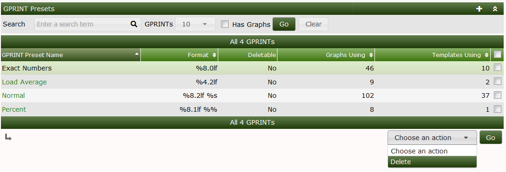
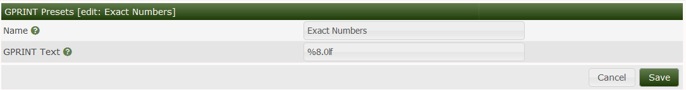

# GPRINT Presets

GPRINT Presets are an object in Cacti used for formatting
Legend output on RRDtool Graphs.  These GPrint Presets
closely fillow printf(), sprintf() ANSI syntax.  They
are simple to create and edit.  You can find the format
strings on the [RRDtool Website](https://oss.oetiker.ch/rrdtool/doc/rrdgraph_graph.en.html#PRINT).

The stock GPrint Presets are generally sufficient for most
**Graph Templates**, but they can easily be extended,
and are a part of the Graph Template Export XML file.  So,
they are portable once created.

In the image below, you can see the default GPrint Presets
and the actions that can be taken on them.  Keep in mind
that once a GPrint Preset is being used by a **Graph**
or a **Graph Template**.  It can not be removed.

Below you can see the GPrint Preset edit screeen.

---
Copyright (c) 2004-2023 The Cacti Group
