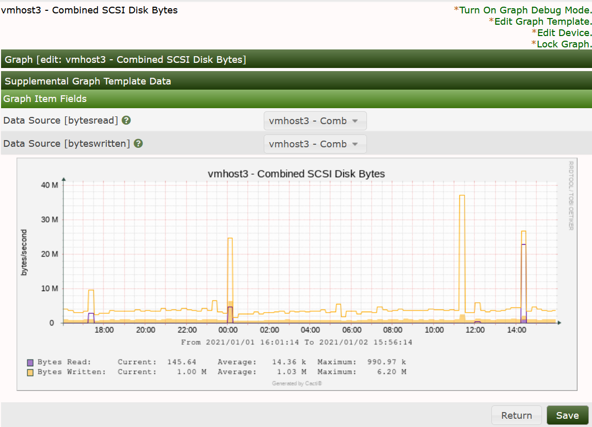

# Graph Overview

Almost everything in Cacti is somehow related to a **Graph**. At any time, you can
list all available **Graph** by clicking on `Console > Management > Graphs` menu
pick. While it is possible to manually create graphs through this interface,
new users should follow the instructions provided in the next chapter for
creating **New Graphs** in Cacti.

For users who are familiar with [RRDTool](http://www.RRDTool.org/), you will
immediately recognize that a **Graph** in Cacti is closely modeled after RRDTool's
graphs. This makes sense since Cacti provides a user friendly interface to
RRDTool without requiring users to understand how RRDTool works. With this in
mind, every **Graph** in Cacti has certain settings and at least one **Graph Item**
associated with it. While graph settings define the overall properties of a
**Graph**, the **Graph Items** define the data that is to be represented on the **Graph**.
So the **Graph Items** define which data to display and how it should displayed,
and also define what should be displayed on the legend.

Each **Graph** and **Graph Item** has a set of parameters which control various aspects
of the **Graph**. Fortunately through the use of **Graph Templates**, it is not
necessary to understand the function of each field to create **Graphs** for your
network. When you are ready to take on the task of creating your own **Graph
Templates**, extensive field descriptions for both **Graphs** and **Graph Items** are
provided in that section of the manual.

Below, you can see a simple version of the Graph Management interface found
by going to `Console > Management > Graphs`

From this interface, you can see the Name, and ID of the **Graph**,
the Source **Graph Template**, and it's size.  At the bottom of the page, there
is a list of Action that can be taken on **Graphs**.  These actions are fairly
extensive, and are also extended as you add **Plugins** to Cacti.

When you click on the Name of the **Graph**, you will be taken to a `Graph Edit`
page as shown below.

In most cases, where the **Graph** is owned by a **Graph Template**, there is
not much your can do on this page.  However, in the case that a **Graph**
is not managed by a template as in the image below, there are many more
options you will have when working with the **Graph**.  The downside of
not leveraging a **Graph Template** for your **Graphs** is that you have
to duplicate the work for each **Graph** created.

When viewing a Non-Templated **Graph**, you have complete control of the
**Graphs** Canvas and all the **Graph Items** as you would in a **Graph Template**,
and the Graph Configuration as shown below.

The settings in both the Canvas and Configuration components of the **Graph**
will be covered in the **Graph Template** section of the manual and not
covered here.

---
Copyright (c) 2004-2021 The Cacti Group
