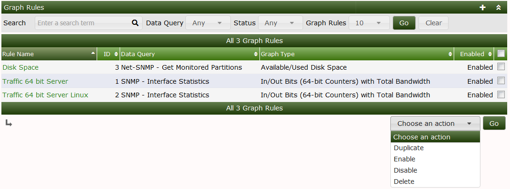
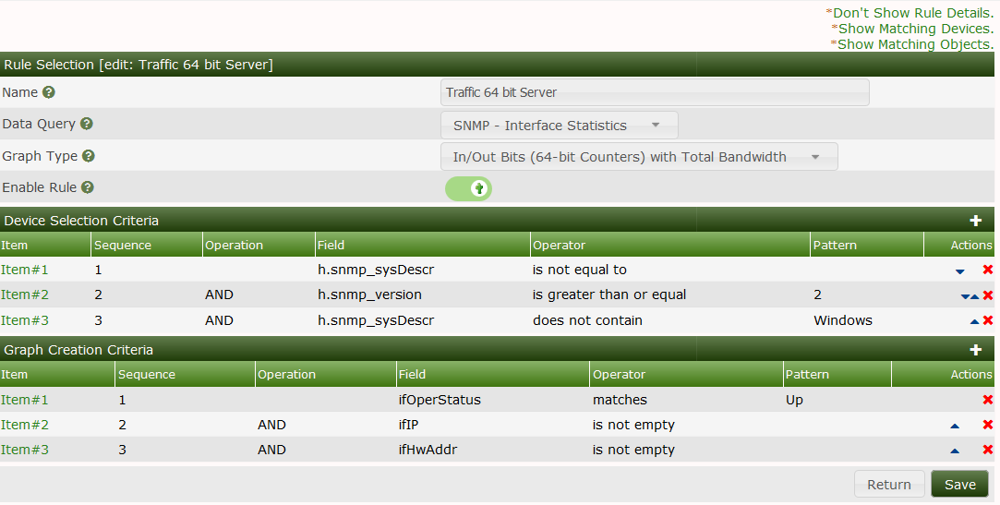
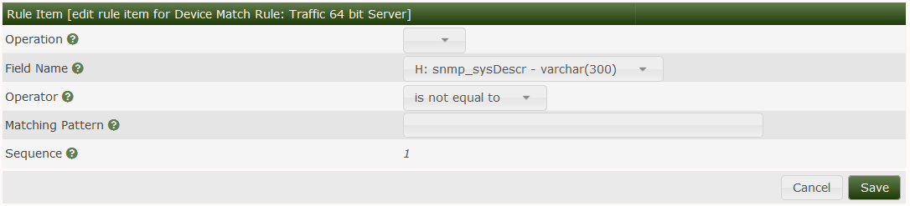
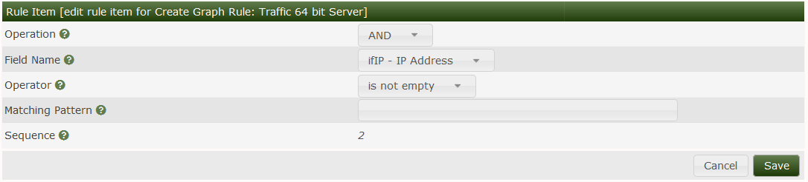
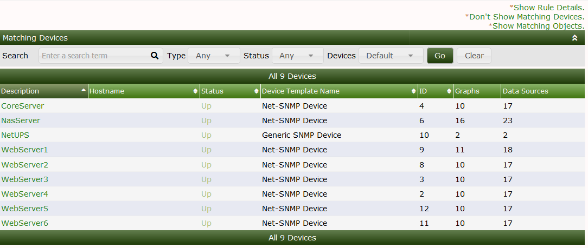
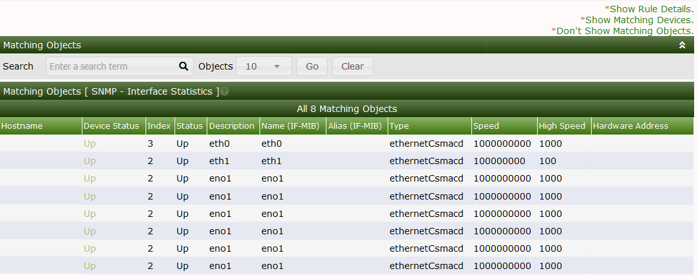

# Automation Graph Rules

This section will describe **Graph Rules** in Cacti.

Graph rules are used by the Cacti automation process after a device has been
identified and a template has been applied the next step is graph creation.
Graph rules are processed from top to bottom.

The graph rule matches the graph template by looking at the data fields
chosen that are available in the data query for example below we are creating
graphs for interface traffic the data query has several fields available to
match on.

You can see how these rules would take place by clicking the show matching
objects link.

A practical example if you want to create graphs for interfaces that are in
up/up status you would choose the ifOperstatus field and match the status to
UP this would tell automation to create the graph for that interface only if
the data query discovers the operational status is equal to up.

A device selection Criteria is also important Cacti needs a way to find which
device it needs to match.  In the below example we are matching any device
that has an interface that is up and is not a Windows server.

You can preview which devices this will apply to by clicking the Show matching
devices link.

This output shows us which devices match our devices rules this can help with
tweaking rules as needed.

This output shows which interfaces,drives,sensors etc will be graphed based
on the graph rules.

---
<copy>Copyright (c) 2004-2021 The Cacti Group</copy>
