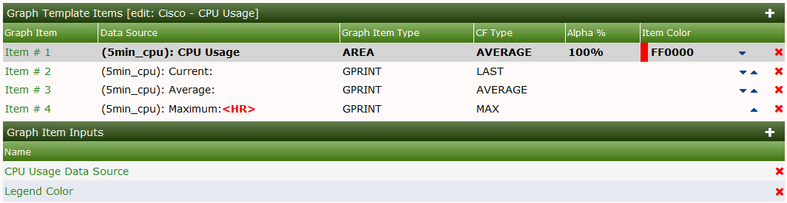
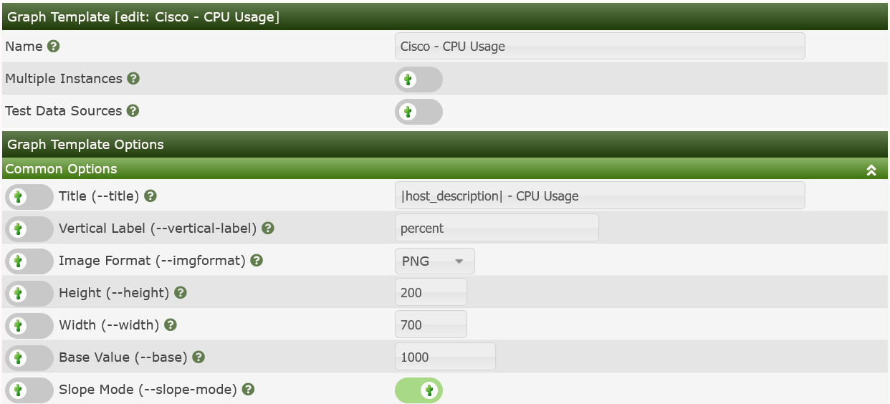
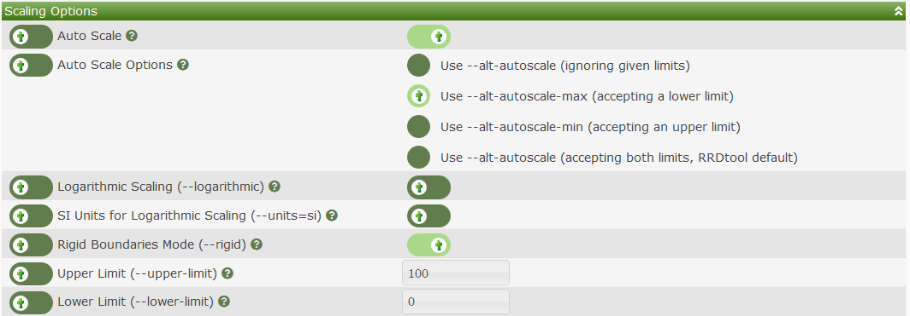
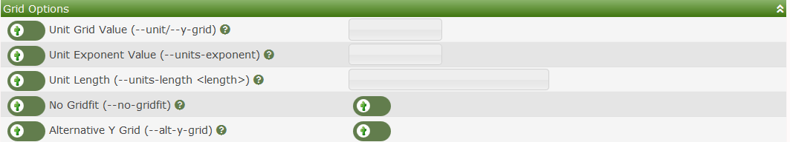
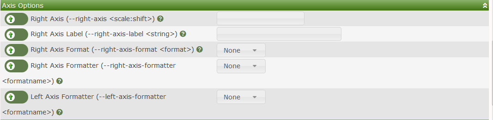
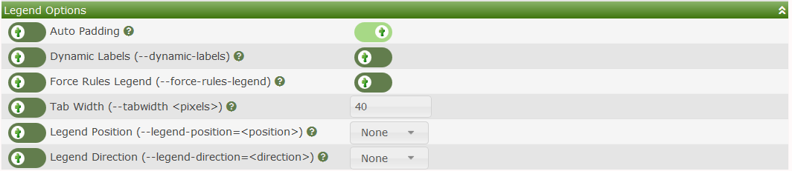

# Graph Templates

**Graph Templates** are Cacti objects that allows you to define how RRDTool is
to render a Cacti **Graph**.  Most RRDTool options are supported including
CDEF's and VDEF's, Left and Right Axis, Ticks and Dashes, multiple Auto Scaling,
Grid, and Legend Options.

The purpose of **Graph Templates** is to simplify the **Automation** process by
pre-defining the layout of **Graphs** for various metrics that are to be
monitored in Cacti.  When used in Conjunction with Cacti's **Graph Rules**, you
can automatically create just about any **Data Query** based **Graph** during
Cacti's **Network Discovery** process.

The **Graph Templates** main screen looks like the image below:

From this page, you can see the title of each **Graph Template**, it's ID which
is important for the Cacti CLI scripts.  You can see if the **Graph Template**
can be removed, and the number of **Graphs** using the **Graph Template** as
well as the *Size* of the **Graphs** that will be created, the *Image Format*,
and *Vertical Label*.  Templates that are used by **Devices** can not be removed
and therefore if you attempt to remove one of these Templates, you will receive
and error message.

From the drop down there are three options, they are:

Option | Description
--- | ---
*Delete* | Remove the **Graph Template** if it's *Deletable*
*Duplicate* | Make an exact copy of the **Graph Template**
*Resize* | Make a resize decision that affects both the **Graph Template** and any **Graphs** created using this **Graph Template**
*Sync Graphs* | Update all **Graphs** using this **Graph Template** with the latest definition, adding new *Graph Items* and removing orphaned *Graph Items*

When Editing a **Graph Template**, there will be several sections that will
require information from the Administrator.  Those sections include:

Section | Description
--- | ---
*Graph Template Items* | These items paint inside the canvas of the **Graph**
*Graph Item Inputs* | This list is created automatically when you add **Data Sources** to a **Graph Template**.  However, you can also override certain **Data Template** and **Graph Template** fields by adding specifically named objects to this section as well.
*Graph Template* | Allows you to name the **Graph Template**, and whether or not you will allow multiple instances of this **Graph Template** to be used for a **Device**.
*Common Options* | Things like Title, Vertical Label, Image Format, Height and Width, Base Value and Slope Mode
*Scaling Options* | Which determine if the Graph is auto-scaled and by what means.  Determines if the Graph will have fixed upper and lower limits
*Grid Options* | Defines how the Graph canvas grid is rendered
*Axis Options* | Defines if there should be a right Axis and how it should be formatted
*Legend Options* | Defines how the Legends should be formatted

Each of these sections are displayed below for reference.  For more information
on how to use these options, please visit the [RRDTool
Website](http://RRDTool.org).

The *Graph Items* make up what is draw within the canvas of the Graph.  There
are several *Graph Item* types including:

Type | Description
--- | ---
*AREA* | Place an *Area Fill* on the canvas
*AREA:STACK* | The second item of an *Area Fill* to be stacked upon the first
*COMMENT* | A written comment.  Can include: |host_*|, |query_*|, |input_*| *Replacement Variables*
*GPRINT* | Print a numeric value from the RRDfile with an optional **CDEF** or **VDEF** and formatted using a **GPRINT Preset**.
*GPRINT:AVERAGE* | Print a numeric value from the RRDfile from the *AVERAGE* *Consolidation Function* within the RRA, modified by an optional **CDEF**, or **VDEF**, and formatted using a **GPRINT Preset**.
*GPRINT:LAST* | Print a numeric value from the RRDfile from the *LAST* *Consolidation Function* within the RRA, modified by an optional **CDEF**, or **VDEF**, and formatted using a **GPRINT Preset**.
*GPRINT:MAX* | Print a numeric value from the RRDfile from the *MAX* *Consolidation Function* within the RRA, modified by an optional **CDEF**, or **VDEF**, and formatted using a **GPRINT Preset**.
*GPRINT:MIN* | Print a numeric value from the RRDfile from the *MIN* *Consolidation Function* within the RRA, modified by an optional **CDEF**, or **VDEF**, and formatted using a **GPRINT Preset**.
*HRULE* | Draw an *Horizontal Rule* at the given point on the canvas.  You can NOT use any Data Source element or an optional **CDEF** or **VDEF**, but may be able to use either a |query_*|, or |input_*| *Replacement Variable*.
*LEGEND* | Draw a *Legend* from three *GPRINTS* using the same **GPRINT Preset**, and **VDEF** or **CDEF**.  The *Current*, *Average*, and *Max* *Consolidation Functions* are used.
*LEGEND_CAMM* | Draw a *Legend* from four *GPRINTS* using the same **GPRINT_Preset**, and **VDEF** or **CDEF**.  The *Current*, *Average*, "Min*, and "Max" functions are used for this *Legend*.
*LINE[1|2|3]* | Draw a 1, 2, 3 or used defined thickness pixel *Line* from the RRDfile onto the canvas, modified by an optional **CDEF**, or **VDEF**.
*LINE:STACK* | Stack a Line of a user defined thickness on top of another *Line*, modified by an optional **CDEF**, or **VDEF**.
*TEXTALIGN* | Modify future text using the alignment provided.
*VRULE* | Place a *Vertical Rule* on the canvas of a specific color and time position.

The canvas is painted from the first *Graph Item* till the last with each
successive *Graph Item* rendered on top of the previous.  Please keep this in
mind when creating a **Graph Template**.

Under the *Common Options*, you will create a template for the *Graph Name*,
assign it's *Veritcal Label*, specify the *Width* and *Height*, and *Image
Format* for the resulting **Graph**.  The *Base Value* is important as some
units of measure can be for example: MB (for Mega Bytes - 1024) and MiB (for
Mega integer Bytes - 1000).  Lastly, the *Slope Mode* gives the resulting
**Graphs** a smoother look.

The *Scaling Options* allow the Administrator to apply either *Rigid* or *Auto
Scaling* settings to the resulting *Graph*.  These options are fairly self
explanatory.  However, you can always view the RRDTool Documentation online for
more information.

The *Grid Options* are rarely necessary unless you have specific requirements to
render the resulting **Graphs** with some exotic unit.

The *Axis Options* allow you to define a *Right Axis* and optional *Formatters*.

The *Legend* options allow you to specify how the *Legend* should be placed on
the resulting **Graph** modern RRDTool has several options that were not
available in Cacti prior to Cacti 1.0.

---
Copyright (c) 2004-2021 The Cacti Group
