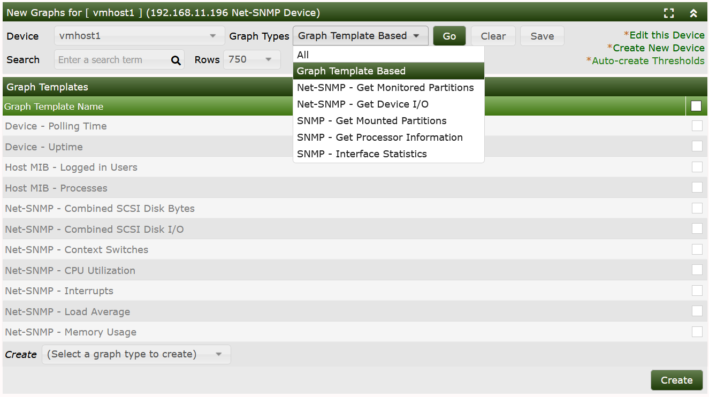
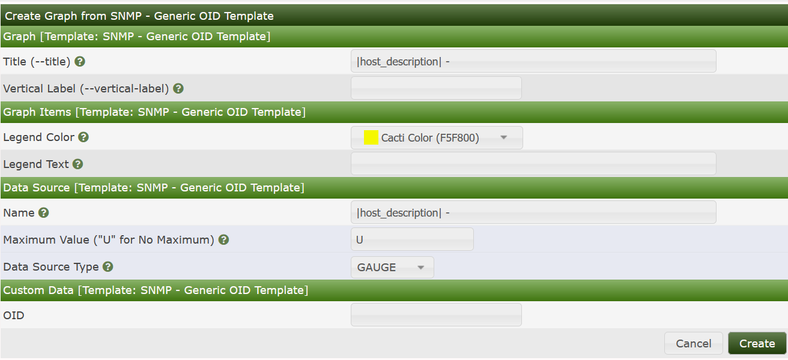
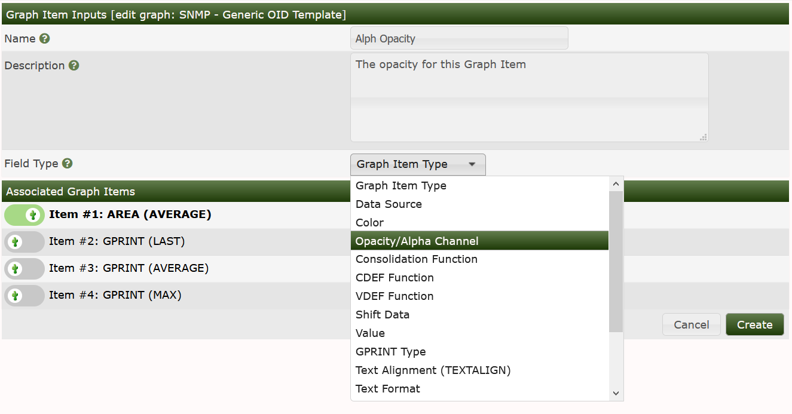

# Creating a Graph for a Single SNMP OID

When dealing with SNMP-enabled **Devices**, there are often times when you want to
graph the value of a single OID. This tutorial explains how to do this in
Cacti. It also assumes that you have the "SNMP - Generic OID Template" **Graph
Template** which is available in the **Generic SNMP Device Package**. 
If you do not see this **Graph Template** listed under **Graph Templates**, 
install the **Generic SNMP Device Package** using the `import_package.php`
command line script located in Cacti's cli directory.

To start the process of creating a new graph for your OID, click go to
`Cosnole > Create > New Graphs`, and from there find the **Device**
you would like to add the **Graph** to.

From the image below, you can see the **New Graphs** interface.

In this image, only the "Graph Template Based` **Graph Templates** are displayed.
Had the `Graph Types` been switched to any of the **Data Query** based ``Graph Types``
the interface would look a bit different.

From that Interface, to create a `Generic SNMP OID` based Graph, you need to first
select it from the `Select a graph type to create` drop-down.  Once you have selected
it, you may press the `Create` button, at which point in time, you will see the
image below.

From this interface, you must define various attributes for your resulting **Graph**
as shown in the table below.

###### Table 10-1. Field Description: SNMP - Generic OID Template

Name | Description
--- | ---
(Graph) Title | The title that is to be used for the new graph. It is generally a good idea to keep `|host_description|` in the title, as to make the graph easier to identify later.
(Graph) Vertical Label | The text that will be printed along the y-axis of the graph. It is generally used to describe units, such as 'bytes' or 'percent'.
(Graph Items) Legend Color | The color that will be used to represent the data on the graph.
(Graph Items) Opacity/Alpha Channel | This optionally provides an opacity (not available with RRDTool-1.0.x) for a colored item.
(Graph Items) Legend Text | The text that will be used to describe the data on the graph legend.
(Data Source) Name | The title that is to be used for the new data source. It is generally a good idea to keep |host_description| in the title, as to make the data source easier to identify later.
(Data Source) Maximum Value [snmp_oid] | The maximum value that will be accepted from the OID. Make sure you choose a value that is reasonable for the data you are trying to graph because anything larger than the maximum will be ignored. If you are graphing a percentage, you should use '100' as the value should never exceed this.
(Data Source) Data Source Type [snmp_oid] | How the data from the OID should be stored by RRDTool and interpreted on the graph. If the value of the OID represents the actual data, you should use GAUGE for this field. If the OID value is a constantly incremented number, you should use COUNTER for this field. The two remaining field values, DERIVE and ABSOLUTE can be ignored in most situations.
(Custom Data) OID | The actual SNMP OID to graph. It is typically a good idea to enter the number OID here as opposed to using MIB names. For instance, to get the number of open files on a Netware server, you would use ".1.3.6.1.4.1.23.2.28.2.7.0" as the OID.

So, based upon your specific OID that you are graphing, You will need to fill out these
fields before the new graph can be created properly.

When finished filling in values for these fields, click the Create button. Your
new **Graph** can now be accessed through the `Cosole > Management > Graphs` menu pick.

> **NOTE**: When comparing the Table above, to the image, you will see that the 
> `Opacity/Alpha Channel` pick is missing from the interface.  To add it, you simply need
> to edit the `Generic SNMP OID` **Graph Template**, add a new **Graph Item Input** 
> override to the Alpha/Opacity on the Graph Template as shown below.  We will cover
> that topic in the **Graph Template** section of the manual though.

#### Important Note on graphing single OID's with Cacti

In order to ensure that Spine and cmd.php will process single OID's correctly,
They should be written using numeric format separated by dots, such as `1.3.6.1.4.1.9.9.97.`
At this time, ASN's (named OID's) such as `enterprise.9.9.97` (Cisco Switch) or
`enterprises.cisco.ciscoMgnt.ciscoSwitchEngineMIB` are not supported.

---
Copyright (c) 2004-2021 The Cacti Group
