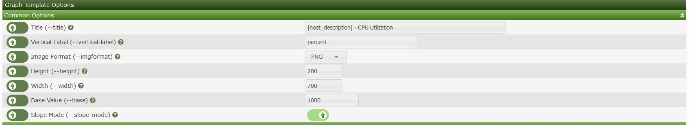

# Graph Management

This section will describe **Graph** management in Cacti.

Cacti features a way to view the graphs per device via the console. This allows
the administrator to view the graphs that are attached to a specific device. You
can also search by type of graph. Below we search for graphs that are
associated with the local linux server

Clicking on one of the graphs in the list shows the below menu. From this menu
you can enable debugging on the specific graph you can also change the template
of the graph amongst other things

### Modifying the graph template

Cacti allows you to change many aspects of the graph template.  You can
change parameters such the title of the graph as well the size of the graphs.
These changes will be pushed to the graph template so other devices using the
template will also be updated.

---
<copy>Copyright (c) 2004-2021 The Cacti Group</copy>
