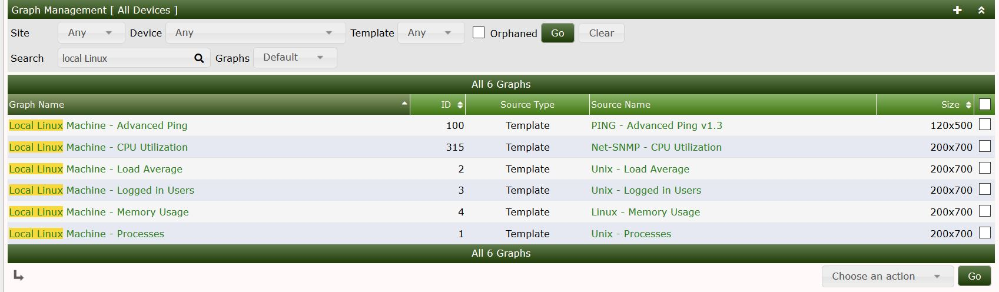
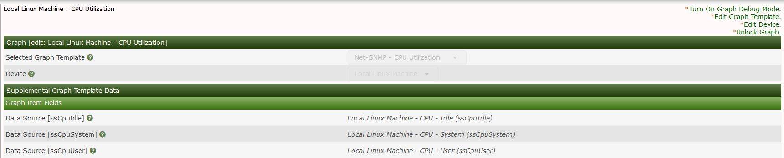

# Graph Management

This section will describe **Graph** management in Cacti.

Cacti features a way to view the graphs per device via the console this allows the administrator to view the graphs that are attached to a specific device you can also search by type of graph shown below we search for graphs that are associated with the local linux server

Clicking on one of the graphs in the list shows the below menu from this menu you can enable debugging on the specific graph
you can also change the template of the graph amongst other things

---
Copyright (c) 2004-2019 The Cacti Group
