# Data Input Methods - From Script Output to Complete Graph

In this How-To we will take you through the process of creating a script
and then from the scripts output generate a complete **Graph Template**
that you can apply to your Cacti system.  You should be able to reproduce
this process regardless of the script type in question.

## Data Input Method returning a single value

Lets start with a simple script that takes a hostname or IP address as input
parameter returning a single value. 

`<path_cacti>/scripts/ping.pl`:

```shell
#!/usr/bin/perl

# take care for tcp:hostname or TCP:ip@
$host = $ARGV[0];
$host =~ s/tcp:/$1/gis;

# old Linux version use "icmp_seq"
# newer use "icmp_req" instead
open(PROCESS, "ping -c 1 $host | grep 'icmp_[s|r]eq' | grep time |");
$ping = <PROCESS>;
close(PROCESS);
$ping =~ m/(.*time=)(.*) (ms|usec)/;

if ($2 == "") {
	print "U";              # avoid cacti errors, but do not fake RRDtool stats
}elsif ($3 eq "usec") {
	print $2/1000;  # re-calculate in units of "ms"
}else{
	print $2;
}
```

To define this script as a **Data Input Method** to Cacti go to **Data
Input Methods** and click **Add**. You should see:


Please fill in **Name**, select **Script/Command** as Input Type and provide the
command that should be used to retrieve the data. You may use `<path_cacti>` as
a symbolical name for the path_to_your_Cacti_installation. Those commands will
be executed from crontab; so pay attention to providing full path to binaries if
required (e.g. `/usr/bin/perl` instead of `perl`). Enter all **Input
Parameters** in `<>` brackets. Click create to see:


Now lets define the **Input Fields**. Click **Add** as given above to see:

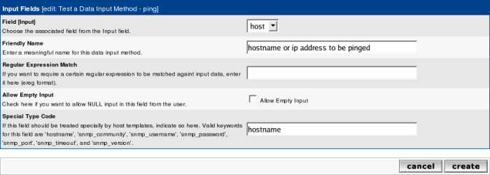

The drop down **Field [Input]** contains one single value only. This is taken
from the **Input String** `<host>` above. Fill **Friendly Name** to serve your
needs. The **Special Type** Code allows you to provide parameters from the
current Device to be queried. In this case, the **hostname** will be taken from
the current device. Click create to see:

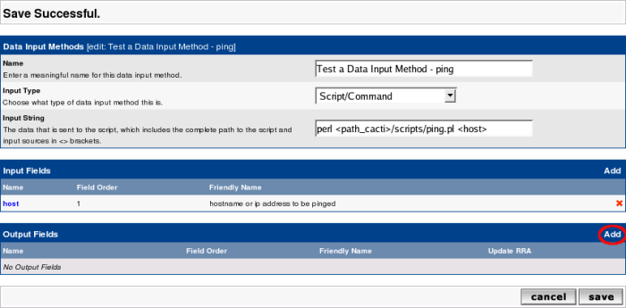

At least, define the **Output Fields**. Again, click **Add** as described above:


Provide a short **Field [Output]** name and a more meaningful **Friendly Name**.
As you will want to save those data, select **Update RRDfile**. Create to see:

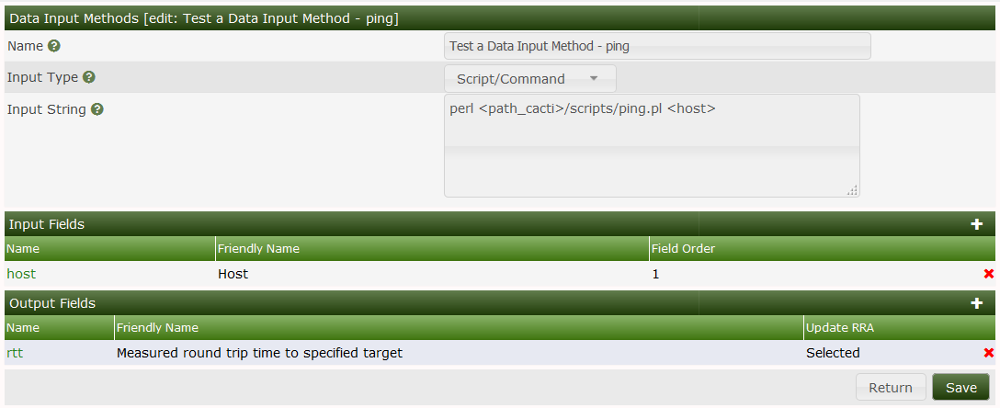

Click **Save** and you're done.

## Creating the Data Template

Now you want to tell Cacti, how to store the data retrieved from this script.
Please go to **Data Templates** and click Add. You should see:


Fill in the **Data Templates Name** with a reasonable text. This name will be
used to find this Template among others. Then fill in the **Data Source
Name**. This is the name given to the host-specific **Data Source**. The
variable **|host_description|** is taken from the actual **Device**. This is to
distinguish **Data Sources** for different devices. The **Data Input Method** is
a drop down containing all known scripts and the like. Select the **Data Input
Method** you just created. The **Associated RRA's** is filled by default. At the
moment there's no need to change this. The lower part of the screen looks like:


The **Internal Data Source Name** may be defined at your wish. There's no need
to use the same name as the Output Field of the **Data Input Method**, but it
may look nicer. Click create to see:


Notice the new drop down **Output Field**. As there is only one Output Field
defined by our **Data Input Method**, you'll see only this. Here's how to
connect the **Data Source Name** (used in the RRDfile) to the Output Field of
the Script. Click **Save** and you're done.

## Creating the Graph Template

Now you want to tell Cacti, how to present the data retrieved from this script.
Please go to **Graph Templates** and click **Add**. You should see:

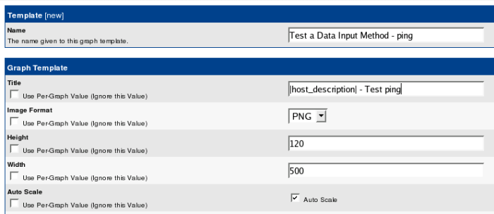

Fill in **Name** and **Title**. The variable `|host_description|` will again be
filled from the Device's definition when generating the **Graph**. Keep the rest
as is and **Create**. See:


Now click the plus (+) glyph to **Add** the first item to be shown on the
**Graphs**:


Select the correct **Data Source** from the drop down, fill in a color of your
liking and select AREA as a **Graph Item Type**. You want to fill in a **Text
Format** that will be shown underneath the **Graph** as a legend. Again,
**Create**:

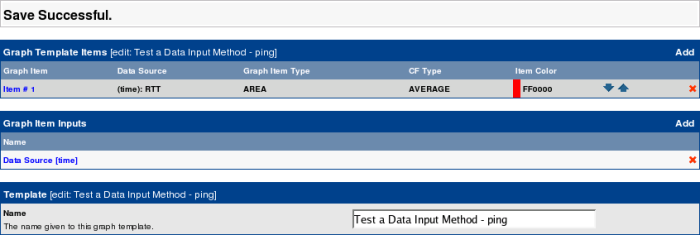

Notice, that not only an entry was made under **Graph Template Items**, but
under **Graph Item Inputs** as well. Don't bother with that now. Lets fill some
more nice legends, see:


Notice, that the **Data Source** is filled in automagically. Select LEGEND as
**Graph Item Type** (it is not really a **Graph Item Type** in RRDtool-speak,
but a nice time-saver), and click **Create** to see:

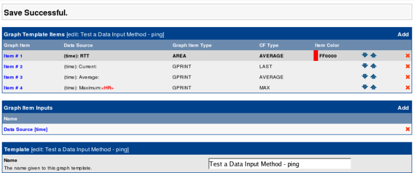

Wow! Three items filled with one action!

## Apply the Graph Template to a Device

Now go to the **Devices** and select the one of your choice. See the
**Associated Graph Templates** in the middle of this page:

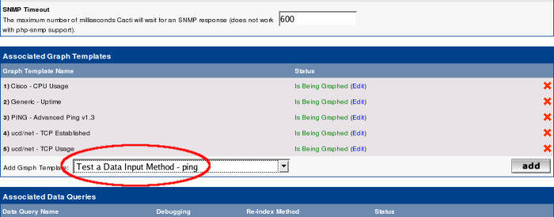

Select your newly created **Graph Template** from the Add **Graph Template**
drop down. Click the plus (+) glyph to see:

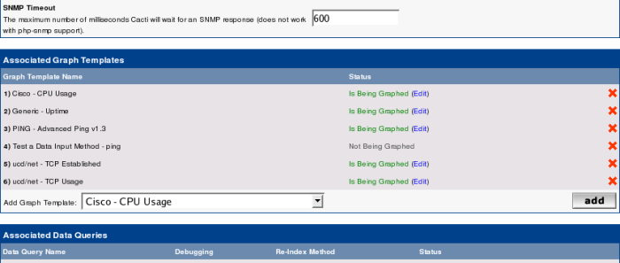

By default, the **Graph Template** is added and shown as **Is Being Graphed**.
The reason for this is that Cacti now automatically creates **Graphs**
automatically, unless disabled.  If the **Graph Template** shows **Not Being
Graphed**, you can create the **Graph** by pressing the **Create Graphs** at the
top of the **Devices** page. Click this link to see:

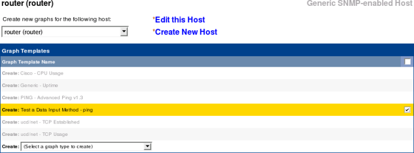

Check the box that belongs to the new template and Create. See the results:

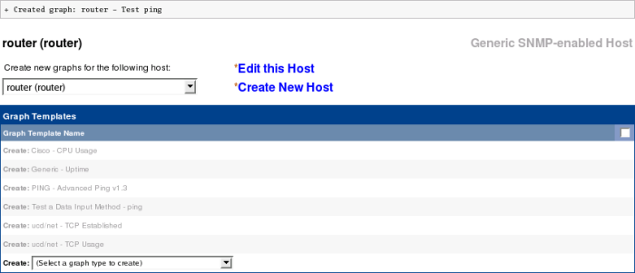

This will automatically

- Create the needed **Graph Description** from the **Graph Template**. As you
  may notice from the success message, this **Graph** takes the hosts name in
  it: **router - Test ping** (router is the hosts name of this example).

- Create the needed **Data Source Description** from the **Data Template**.
  Again, you will find the Hosts name replaced for |host_description|

- Create the needed RRDfile with definitions from the **Data Template**.  The
  name of this file is derived from the Host and the **Data Template** in
  conjunction with an auto-incrementing number.

- Create an entry to the poller_item to instruct Cacti to gather data on each
  polling cycle.

You'll have to wait at least two polling cycles to find data in the **Graph**.
Find your **Graph** by going to **Graph Management**, filtering for your host
and selecting the appropriate **Graph** (there are other methods as well). This
may look like:

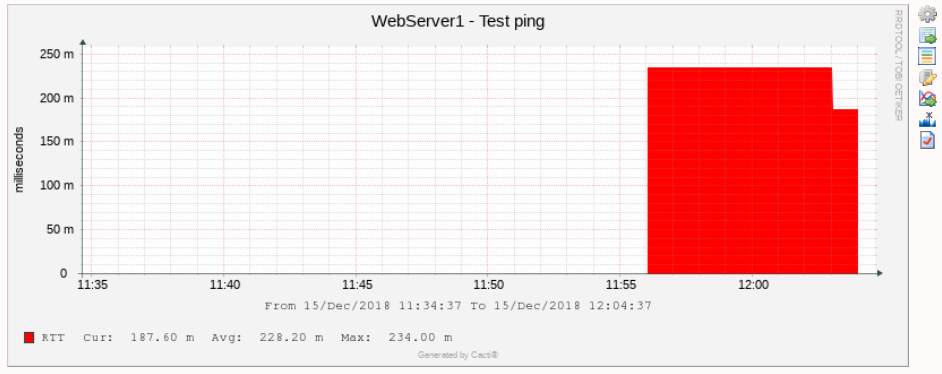

## Walkthrough: Script with more Output Parameters

The script below will be implemented in perl.  Please note that any supported
language is supported using Cacti from direct command execution to scripts
written in perl, python, php, bash, etc.

```shell
#!/usr/bin/perl -w

# --------------------------------------------------
# ARGV[0] = &lt;hostname&gt;     required
# ARGV[1] = &lt;snmp port&gt;    required
# ARGV[2] = &lt;community&gt;    required
# ARGV[3] = &lt;version&gt;      required
# --------------------------------------------------
use Net::SNMP;

# verify input parameters
my $in_hostname         = $ARGV[0] if defined $ARGV[0];
my $in_port             = $ARGV[1] if defined $ARGV[1];
my $in_community        = $ARGV[2] if defined $ARGV[2];
my $in_version          = $ARGV[3] if defined $ARGV[3];

# usage notes
if (
	( ! defined $in_hostname ) ||
	( ! defined $in_port ) ||
	( ! defined $in_community ) ||
	( ! defined $in_version )
) {
	print "usage:\n\n
		$0 &lt;host&gt; &lt;port&gt; &lt;community&gt; &lt;version&gt;\n\n";
	exit;
}

# list all OIDs to be queried
my $udpInDatagrams      = ".1.3.6.1.2.1.7.1.0";
my $udpOutDatagrams     = ".1.3.6.1.2.1.7.4.0";

# get information via SNMP
# create session object
my ($session, $error) = Net::SNMP->session(
	-hostname      => $in_hostname,
	-port          => $in_port,
	-version       => $in_version,
	-community     => $in_community,
	# add more parameters if there's a need for them:
	#   [-localaddr     => $localaddr,]
	#   [-localport     => $localport,]
	#   [-nonblocking   => $boolean,]
	#   [-domain        => $domain,]
	#   [-timeout       => $seconds,]
	#   [-retries       => $count,]
	#   [-maxmsgsize    => $octets,]
	#   [-translate     => $translate,]
	#   [-debug         => $bitmask,]
	#   [-username      => $username,]    # v3
	#   [-authkey       => $authkey,]     # v3
	#   [-authpassword  => $authpasswd,]  # v3
	#   [-authprotocol  => $authproto,]   # v3
	#   [-privkey       => $privkey,]     # v3
	#   [-privpassword  => $privpasswd,]  # v3
	#   [-privprotocol  => $privproto,]   # v3
);

# on error: exit
if (!defined($session)) {
	printf("ERROR: %s.\n", $error);
	exit 1;
}

# perform get requests for all wanted OIDs
my $result = $session->get_request(
	-varbindlist      => [$udpInDatagrams, $udpOutDatagrams]
);

# on error: exit
if (!defined($result)) {
	printf("ERROR: %s.\n", $session->error);
	$session->close;
	exit 1;
}

# print results
printf("udpInDatagrams:%s udpOutDatagrams:%s", # <<< cacti requires this format!
	$result->{$udpInDatagrams},
	$result->{$udpOutDatagrams},
);

$session->close;
```

It should produce following output, when executed from command line:

```console
[prompt]> perl udp_packets.pl localhost 161 public 1
udpInDatagrams:10121 udpOutDatagrams:11102
```

Where “public” would be replaced by your community string.  Those input
parameters again are controlled by the `Input Fields` in Cacti and the output
from the script will be mapped to `Output Fields`.  If you wish to return
multiple output values, they must be space delimited name value pairs in the
form of nameA:valueA nameB:valueB ...

## The Data Input Method

To define this script as a **Data Input Method** to Cacti go to **Data
Input Methods** and click the plus (+) glyph.


You should see:


Enter the name of the new **Data Input Method**, select **Script/Command** and
type in the command to call the script. Please use the **full path to the
command interpreter**. Instead of entering the specific parameters, type
`<symbolic variable name>` for each parameter the script needs. **Save**:

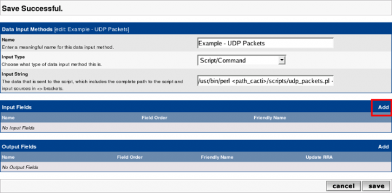

Now add each of the input parameters in the **Input Fields** section, one after
the other. All of them are listed in sequence, starting with `<host>`:


`<port>`


`<community>`

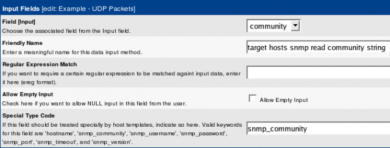

`<version>`

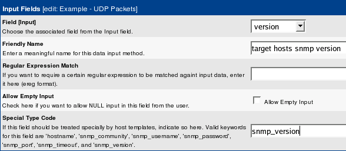

We've used some of Cacti builtin parameters. When applied to a host, those
variables will be replaced by the hosts actual settings. Then, this command will
be stored in the poller_command table. Now **Save** your work to see

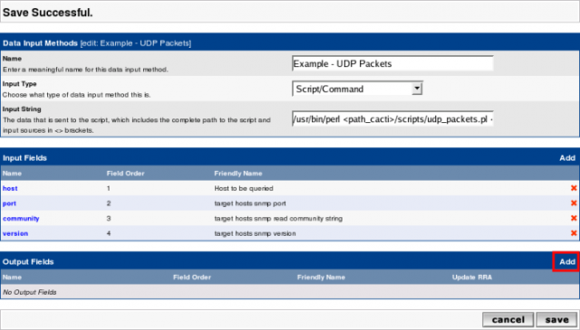

After having entered all **Input Fields**, let's now turn to the **Output
Fields**, respectively. Add the first one, udpInDatagrams:


Now udpOutDatagrams:


Be careful to avoid typos. The strings entered here must **exactly** match those
spitted out by the script. **Double check Output Fields**! Now, results should
be like

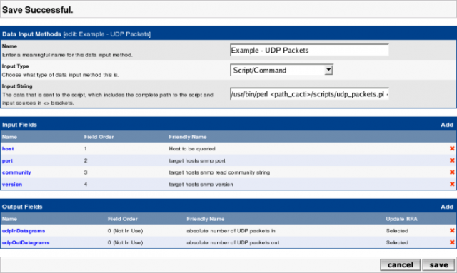

Finally Save and be proud!


## The Data Template

The previous step explained how to call the script that retrieves the data. Now
it's time to tell Cacti, how to store them in RRDfiles. You will need a single
**Data Template** only, even if two different output fields will be stored. RRD
files are able to store more than one output fields; RRDtool's name for those is
**Data Source**. So we will create

1. One single **Data Template** representing one RRDfile

2. Two output fields/data sources

The first step is quite the same as Create the **Data Template** for a simple
**Data Input Method**. For sure, we provide a different name, **Example - UDP
Packets**. Now, let's enter the first **Data Source**. Again, its like above.
But we now provide the name of **udpInPackets**, enter a **Maximum value** of
100,000 and select the **Data Source Type** of COUNTER.


Then save and find with the exception that the *Output Field* will be set to
*None Selected*.  Therefore, before adding the second *Data Source Item*, make
sure you select the *Output Field* of *udpInDatagrams* and press the Save button
to create the association.


Then, add the second **Data Source** by pressing the plus (+) glyph and
providing data for *udpOutPackets*. Pay attention to select the correct *Output
Field* defined by the **Data Input Method** as we did with the *udpInDatagrams*.


To deactivate maximum checking, enter 'U', else the desired number. Do not
forget to select the correct *Data Source Type* and the *Output Field* as
before.

## The Graph Template

Most of this task of creating a **Graph Template** has already been covered in
our example.  You will basically create a new **Graph Template**, provide a
*Line* or an *Area Fill* followed by a *Legend* for both the *udpInDatagrams*
and *udpOutDatagrams*.  The result of those actions will be the image below:


After you have created your **Graph Template** you can proceed to Add the
**Graph Template** to your **Device**, and either allow the automation to create
the **Graph** for you, or to manually add it from the **New Graphs** menu pick.

---
<copy>Copyright (c) 2004-2021 The Cacti Group</copy>
