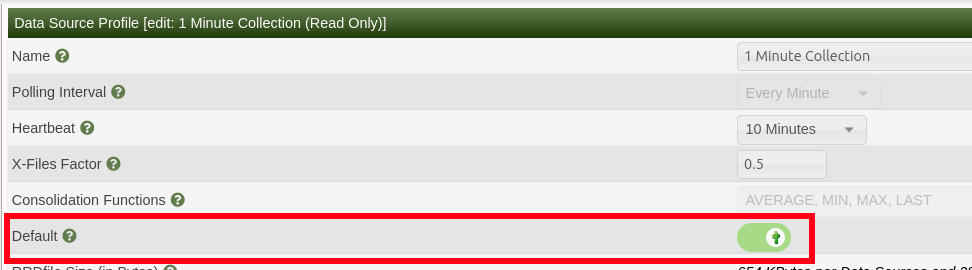

# Change poller interval from 5 minutes to 1 minute 

This howto describes all steps for convert everything to 1 minute poller interval.
There will be only one gap during the convert.

## Prerequisites and default values used in this howto
- Cacti installation directory is **/usr/local/share/cacti/**
- PHP binary is **/usr/local/bin/php**
- RRD files are in **/usr/local/share/cacti/rra**
- Poller is running by user **cacti**
- **Not structured RRDfile paths** (Configuration->Settings-> Data -> Structured RRDfile Paths). With structured path you will have more works with splice rrd files. You need change splice script.
- Crontab row looks like
```shell
*/5    *       *       *       *       cacti   /usr/local/bin/php /usr/local/share/cacti/poller.php 2>&1
```


## Backup your Cacti
Before this operation, backup Cacti database and all data in rra folder


## RRDCleaner (optional step)
You can run rrdcleaner and delete already deleted RRD files. It can decrease converting time.
[System Utilities](System-Utilities.md)


## Stop poller
Disable your poller in Crontab or via GUI `Console -> Configuration -> Settings -> Poller tab -> Data Collection Enabled`


## Prepare directory structure for RRD file convert
```shell
mkdir -p /tmp/cacti/rrd_old
mkdir -p /tmp/cacti/rrd_new
mkdir -p /tmp/cacti/rrd_fin
```

## Move rrd files
```shell
mv /usr/local/share/cacti/rra/* /tmp/cacti/rrd_old/
```

## Check or create Presets -> Data profiles
Go to `Console -> Presets -> Data Profiles`. Here should be at least 5 Minute Collection profile (because you are using it until now) and 1 Minute Collection profile.
If the second is missing, create it.


Remember Data profile ID - Edit your 1 minute collection again and in URL will be .../data_source_profiles.php?action=edit&**id=3**


## Switch to 1 min 
`Console -> Configuration -> Settings -> Poller tab`
- Poller interval = Every minute
- Cron/Daemon interval = Every minute


## Update database records
Run these SQL queries:
```shell
UPDATE data_template_data SET rrd_step=60 WHERE rrd_step=300;
UPDATE data_template_rrd SET rrd_heartbeat=600;
```
Here replace X with ID from Step "Check or create Presets -> Data profiles":
```shell
UPDATE data_template_data SET data_source_profile_id=X;
```

## Rebuild poller cache
`Console -> Utilities -> System utilities -> Rebuild Poller Cache`

## Set 1 min Data Profile as default
`Console -> Presets -> Data Profiles`

Edit profile **1 min Collection**, checkbox default.



## Change profile for all Data templates
`Console -> Templates -> Data Source`

Select all -> Change Profile


## Run the poller once
New rrd files with correct 1 min profile will be created in **/usr/local/share/cacti/rra** directory.
Log shouldn't contain errors.

## move new rrd files to temporary folder
```shell
mv /usr/local/share/cacti/rra/* /tmp/cacti/rrd_new/
```

## Run splice
You need run splice command for each rrd file. This could be time consuming, depends on number of files. You can use some tool for parallel tasks.

Basic script:
```shell
#!/bin/sh

cd /tmp/cacti/rrd_old/
for f in *.rrd
do
    echo $f
    /usr/local/bin/php /usr/local/share/cacti/cli/splice_rrd.php --oldrrd=/tmp/cacti/rrd_old/$f --newrrd=/tmp/cacti/rrd_new/$f --finrrd=/tmp/cacti/rrd_fin/$f
done
```

Run script and wait. My experience - 5200 files took 100 minutes without paralelisation. Script will be output sometning like:
```console
fortigate_1_-_fg200e4q17911506_traffic_in_7317.rrd
NOTE: Using Native Arrays due to lack of SQLite.
NOTE: Using RRDtool Version 1.8.0
NOTE: RRDfile will be written to '/tmp/cacti/rrd_fin/fortigate_1_-_fg200e4q17911506_traffic_in_7317.rrd'
NOTE: Re-Importing '/tmp/fortigate_1_-_fg200e4q17911506_traffic_in_7317.dump.27482713' to '/tmp/cacti/rrd_fin/fortigate_1_-_fg200e4q17911506_traffic_in_7317.rrd'
NOTE: Time:0.88, RUsage:18 MB
```


## Move spliced files back to cacti
```shell
mv /tmp/cacti/rrd_fin/* /usr/local/share/cacti/rra/
```
File owner should be cacti.
```shell
chown cacti /usr/local/share/cacti/rra/*
```

## Enable poller in Cron again
Change your cron settings from 5 minutes to 1 minute and enable (uncomment). Old row:
```shell
#*/5    *       *       *       *       cacti   /usr/local/bin/php /usr/local/share/cacti/poller.php 2>&1
```
New row
```shell
*    *       *       *       *       cacti   /usr/local/bin/php /usr/local/share/cacti/poller.php 2>&1
```

