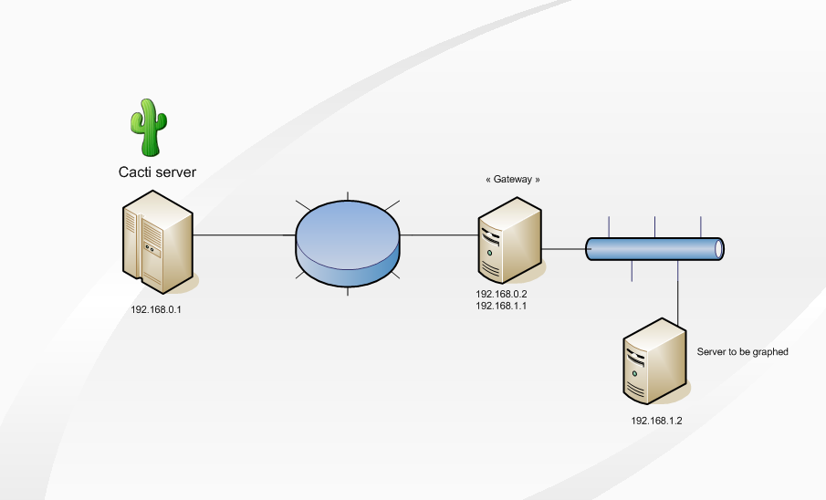
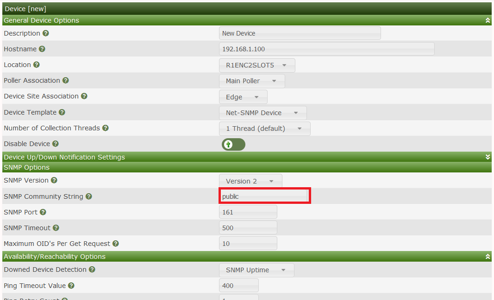

# How To Set Up SSH Tunnels to Graph a Remote Unix Server

Howto created by `fmangeant` at the
[Cacti Forum](https://forums.cacti.net/viewtopic.php?t=24960)

This guide explains how to use SSH tunnels to graph a Unix server that is not
directly reachable by your Cacti server.



In this example, the Cacti server can reach the Gateway, which can reach the
target server.

> **Important — TCP vs UDP**: SSH port forwarding (`-L`) is TCP-only. Standard
> SNMP uses UDP port 161 and **cannot** be tunneled this way. This guide works
> only when the target's `snmpd` is explicitly configured to accept TCP
> transport (as shown below). It is **not** suitable for most network devices
> (routers, switches, etc.), which support UDP SNMP only. For UDP SNMP across
> untrusted networks, use a VPN instead.

## Configuring the SSH tunnel

On the Gateway, create a `cactiuser` account:

```console
# useradd -d /home/cactiuser -m cactiuser
```

Generate an SSH key pair (no passphrase, so the tunnel can start
unattended). The modern recommendation is ed25519:

```console
# su - cactiuser
$ ssh-keygen -t ed25519
Generating public/private ed25519 key pair.
Enter file in which to save the key (/home/cactiuser/.ssh/id_ed25519):
Enter passphrase (empty for no passphrase):
Enter same passphrase again:
Your identification has been saved in /home/cactiuser/.ssh/id_ed25519.
Your public key has been saved in /home/cactiuser/.ssh/id_ed25519.pub.
```

Authorize the public key for login:

```console
$ cd $HOME/.ssh
$ cp -p id_ed25519.pub authorized_keys
```

Create the SSH tunnel:

```console
# su - cactiuser -c "ssh -f -N -g -L 192.168.0.2:10000:192.168.1.2:161 cactiuser@localhost"
```

This forwards all TCP traffic sent to `192.168.0.2:10000` on the Gateway to
`192.168.1.2:161` on the target server.

Option summary:

```
-f  Go to background before executing the command
-N  Do not execute a remote command
-g  Allow remote hosts to connect to locally forwarded ports
-L  Forward the given local port to the given host and port on the remote side
```

### Making the tunnel persistent (systemd)

On systemd-based hosts (Ubuntu 16.04+, Debian 9+, most current distros),
`/etc/rc.local` is deprecated and disabled by default. Use a systemd service
instead.

Create `/etc/systemd/system/cacti-ssh-tunnel.service`:

```ini
[Unit]
Description=SSH tunnel for Cacti SNMP polling
After=network.target

[Service]
User=cactiuser
ExecStart=/usr/bin/ssh -N -g -L 192.168.0.2:10000:192.168.1.2:161 cactiuser@localhost
Restart=always
RestartSec=10

[Install]
WantedBy=multi-user.target
```

Enable and start it:

```console
# systemctl daemon-reload
# systemctl enable cacti-ssh-tunnel
# systemctl start cacti-ssh-tunnel
```

## Configuring Net-SNMP on the target server

By default, the Net-SNMP agent listens on **UDP** port 161. For this SSH
tunnel approach you must configure it to listen on **TCP** port 161 instead.

In `snmpd.conf` on the target server:

```ini
agentaddress tcp:161
rocommunity mycommunity
```

For a more detailed `snmpd.conf` reference, see the
[Net-SNMP snmpd.conf man page](https://net-snmp.sourceforge.io/docs/man/snmpd.conf.html).

### Testing SNMP connectivity

From the Gateway host:

```console
$ snmpwalk -v 1 -c mycommunity tcp:192.168.1.2 sysname
SNMPv2-MIB::sysName.0 = STRING: target_server
```

From the Cacti server:

```console
$ snmpwalk -v 1 -c mycommunity tcp:192.168.0.2:10000 sysname
SNMPv2-MIB::sysName.0 = STRING: target_server
```

If these succeed, the host is ready to be added to Cacti. If not, review
your firewall rules and verify `snmpd` is listening on TCP.

## Adding the device to Cacti

In Cacti, create a new device as shown:



Your target server is now graphed by Cacti.

---
Copyright (c) 2004-2026 The Cacti Group
