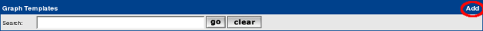
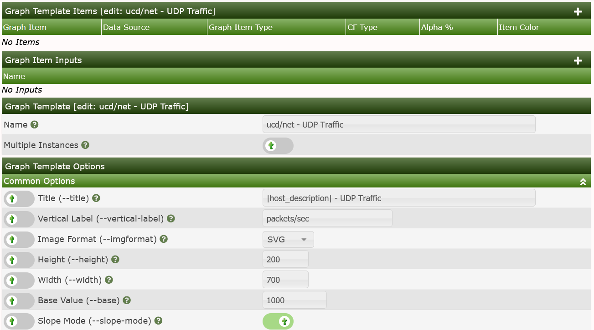
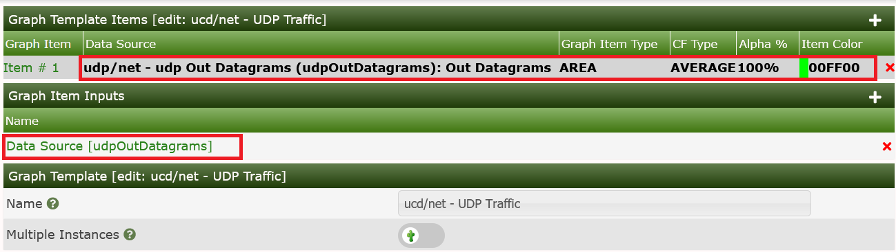
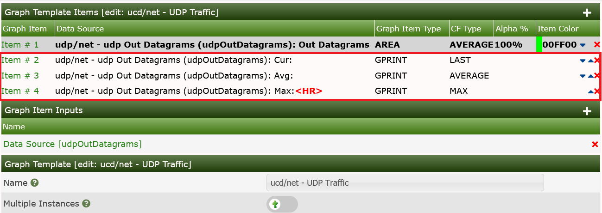

# How To Work with Templates

We will follow the following process in this example:

- **Create Data Template** - Defines how we store the data in the RRDfile
- **Create Graph Template** - Defines how we graph the data in the RRDfile
- **Device Template** - Defines which Graphs to associate with a Device Type

## Data Template Creation

For this task, let's stick to SNMP stuff. For you to be able to reproduce this
example, I've chosen the **UDP** information of the IP MIB.

```console
snmpwalk -c <community string> -v1 <device> udp
UDP-MIB::udpInDatagrams.0 = Counter32: 7675
UDP-MIB::udpNoPorts.0 = Counter32: 128
UDP-MIB::udpInErrors.0 = Counter32: 0
UDP-MIB::udpOutDatagrams.0 = Counter32: 8406
```

As cacti does not use the MIBs but pure ASN.1 OIDs, let's search the OID used as
`udpInDatagrams`:

```console
snmpwalk -c <community string> -v1 -On <device> udp
.1.3.6.1.2.1.7.1.0 = Counter32: 7778
.1.3.6.1.2.1.7.2.0 = Counter32: 129
.1.3.6.1.2.1.7.3.0 = Counter32: 0
.1.3.6.1.2.1.7.4.0 = Counter32: 8514
```

The needed OID is .1.3.6.1.2.1.7.1.0. Now learn how to enter this into a new
Cacti Data Template: Please proceed to Data Templates and filter for SNMP. Check
the SNMP - Generic OID Template


After clicking Go, you're prompted with a new page to enter
`udp/net - udp Out Datagrams` as the `Title Format` for the
new **Data Template**:


Due to the filter defined above, you won't see the new Template at once, so
please enter `udp Out` as a new filter to find:


Now select this entry to change some definitions according to the following
images:


for the lower one. Please pay attention to change the MAXIMUM value to 0 to
prevent data suppression for values exceeding 100. And you saw the OID
`.1.3.6.1.2.1.7.1.0` from above, didn't you? Please copy another one for OID
`.1.3.6.1.2.1.7.4.0`, using the description **udpOutDatagrams**

## Graph Template Creation

Now let's generate the **Graph Template** for those already generated Data
Templates. Please go to **Graph Templates** and **Add** a new one:



Now you have to fill in some global parameters:


and **Create** to see:



Now let's add some **Graph Template** **Graph Items**. They will specify,
which **Data Sources** defined by some **Data Template** should be displayed
on the **Graph**. Please click Add as shown on the last image:


Now click Save to see the resulting image below.  Not that both the
**Graph Item** and the **Graph Item Input** have been created.



Next, we have to add a Legend in order for people viewing the **Graph** in the
future to obtain numeric data about the **Graph** contents.  We will create
a very simple one, though Graph Legends can be a very complex subject.

To add the Graph Legend, simply press the Add button again and fill out
the **Graph Item** as shown in the image below.  You should note that
for this second **Graph Item**, it remembered the previous **Data Source**.


Press Save to see three legend items created in one step!



Now we could have continued to add the UDP Datagrams In by adding a second
RRDfile Data Source to our **Data Template**, but we will skip that for this
exercise and continue now that our **Graph Template** is reasonably completed.

At this point, since we only added **Graph Items** to the **Graph Template**
there is no need to resave it at this point.  We can simply continue to the
next step.

Now, you may add this new **Graph Template** to any **Devices** that
responds to the udp OID we specified in the **Data Template**. But in this
case, please wait a moment. Let's first proceed to the **Device Template**
and use this new **Graph Gemplate** for our first own **Device Template**.

## Device Template Creation

The next task is to create a new **Device Template**. So, select **Device**
under `Console > Templates` and press the Add button as in previous
examples.  When you do that, you will be presented with an page that
resembles the one below.


and fill in the name of this new Template:


Now you'll find two sections added. First, let's deal with
**Associated Graph Templates**. The Add **Graph template** select drop-down
contains all existing **Graph Templates**. In the images, you will see that
we are creating a **Device Template** for a NetApp Filer and adding some
common Graph Templates and Data Queries from the Cacti built-in collection.


and Add it:


Next, let's add the Data Query already selected above:


Keep in mind, this is one of the more simple Template examples.  Topics such
as **Data Queries**, **Data Input Methods**, and **Script Server** add a few
steps to the Template creation process.

---
<copy>Copyright (c) 2004-2022 The Cacti Group</copy>
