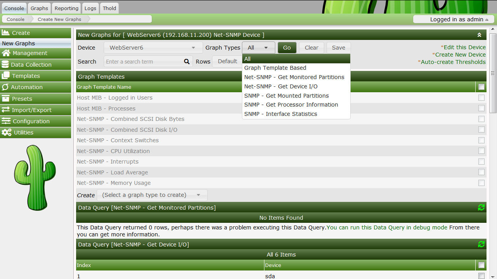

# How to Graph Your Network

At this point, you probably realize that graphing is Cacti's greatest strength.
Cacti has many powerful features that provide complex graphing and data
acquisition, some which have a slight learning curve. Do not let that stop you
however, because graphing your network is incredibly simple.

The next two sections will outline the two basic steps which are typically
required to create graphs for most devices.

## Creating a Device

The first step to creating graphs for your network is adding a device for each
network device that you want to create graphs for. A device specifies important
details such as the network hostname, SNMP parameters, and host type.

To manage devices within Cacti, click on the Devices menu item. Clicking Add
will bring up a new device form. The first two fields, Description and Hostname
are the only two fields that require your input beyond the defaults. If your
host type is defined under the host template dropdown, be sure to select it
here. You can always choose "Generic SNMP-enabled Host" if you are just
graphing traffic or "None" if you are unsure. It is important to remember that
the host template you choose will not lock you into any particular
configuration, it will just provide more intelligent defaults for that type of
host.


The field definitions are as follows

###### Table 7-1. Device Field Definitions

Field | Description
--- | ---
Description | This description will show up in the first column of the device list. You may refer to it e.g. in graph titles
Hostname | Either an IP address or a hostname. The hostname will be resolved using the standard host resolving mechanisms, e.g. Dynamic Name Services (DNS)
Host Template | A Host Template is a container for a list of graph templates that will be related to this host.
Notes | New with cacti 0.8.7. Add notes to a host to add arbitrary text.
Disable Host | Exclude this host from being polled. This is of particular value, if a device is no longer available, but should be kept e.g. as a reference.

###### Table 7-2. Availability/Reachability Options

Field | Description
--- | ---
Downed Device Detection | NONE: Deactivate downed host detection PING and SNMP: perform both tests SNMP: verify SNMP check on OID .1 and .1.3 ICMP: perform a ping test, see below
Ping Method | Available only for "PING and SNMP" or "PING" ICMP: perform ICMP tests. Requires permissions UDP: perform a UDP test TCP: perform a TCP test
Ping Port | Available only for UDP/TCP PING test types. Please define the port to be tested here. Make sure, that no firewall intercepts the tests Ping
Timeout Value | After this time, the test fails. Measured in units of milliseconds
Ping Retry Count | The number of times Cacti will attempt to ping a host before failing.

###### Table 7-3. SNMP Options

Field | Description
--- | ---
SNMP Version | Version 1: Use SNMP Version 1. Be aware, that 64bit counters are not supported in this SNMP version Version 2: Referred to as SNMP V2c in most SNMP documentations Version 3: SNMP V3, supporting authentication and encryption
SNMP Community | SNMP read community for this device.
SNMP Port | Enter the UDP port number to use for SNMP (default is 161).
SNMP Timeout | The maximum number of milliseconds Cacti will wait for an SNMP response (does not work with php-snmp support). Maximum OID's Per Get Request | This is a performance feature. Specifies the number of OID's that can be obtained in a single SNMP Get request. NOTE: This feature only works when using Spine NOTE: Some devices do not support values > 1
Security Options for SNMP V3 |
SNMP Username | The username of an SNMP V3 createUser statement or equivalent SNMP Password | The authpassphrase of an SNMP V3 createUser statement or equivalent
SNMP Auth Protocol | The authentication type of an SNMP V3 createUser statement or equivalent. Select either MD5 or SHA. This entry defaults to MD5.
SNMP Privacy Passphrase | The privacy passphrase of an SNMP V3 createUser statement or equivalent.
SNMP Privacy Protocol | The privacy protocol of an SNMP V3 createUser statement or equivalent. Select either DES or AES. This entry defaults to DES.
SNMP Context | When using the View-Based Access Control Model (VACM), it is possible to specify an SNMP Context when mapping a community name to a security name with a com2sec directive, with the group directive and the access directive. This allows for defining special access models. If using such a parameter with your target's SNMP configuration, specify the context name to be used to access that target here.

After saving your new device, you should be redirected back to the same edit
form with some additional information. If you configured SNMP for this host by
providing a valid community string, you should see various statistics listed at
the top of the page. If you see "SNMP error" instead, this indicates an SNMP
problem between Cacti and your device.

Towards the bottom of the page there will be two addition boxes, Associated
Data Queries, and Associated Graph Templates. If you selected a host template
on the previous page, there will probably be a few items in each box. If there
is nothing listed in either box, you will need to associate at least one data
query or graph template with your new device or you will not be able to create
graphs in the next step. If no available graph template or data query applies
to your device, you can check the Cacti templates repository or create your own
if nothing currently exists.

### A Word About SNMP

The SNMP version that you choose can have a great effect on how SNMP works for
you in Cacti. Version 1 should be used for everything unless you have reason to
choose otherwise. If you plan on utilizing (and your device supports)
high-speed (64-bit) counters, you must select version 2. Starting with Cacti
0.8.7, version 3 is fully implemented.

The way in which Cacti retrieves SNMP information from a host has an effect on
which SNMP-related options are supported. Currently there are three types of
SNMP retrieval methods in Cacti and are outlined below.

###### Table 7-4. SNMP Retrieval Types

Type | Description | Supported Options | Places Used
--- | --- | --- | --- |
External SNMP | Calls the net-snmp snmpwalk and snmpget binaries that are installed on your system. | All SNMP options | Web interface and PHP poller (poller.php)
Internal SNMP (php-snmp) | Uses PHP's SNMP functions which are linked against net-snmp or ucd-snmp at compile time. | Version 1 Only (Community and Port) | Web interface and PHP poller (poller.php)
Spine SNMP | Links directly against net-snmp or ucd-snmp and calls the API directly. | All SNMP options | C-Based Poller (Spine)

### SNMP V3 Options Explained

SNMP supports authentication and encryption features when using SNMP protocol
version 3 known as *View-Based Access Control Model (VACM)*. This requires,
that the target device in question supports and is configured for SNMP V3 use.
In general, configuration of V3 options is target type dependant. The following
is cited from `man snmpd.conf` concerning user definitions

```sh
SNMPv3 Users
    createUser [-e ENGINEID] username (MD5|SHA) authpassphrase [DES|AES] [privpassphrase]

           MD5 and SHA are the authentication types to use.  DES and AES are the privacy
           protocols  to  use. If  the  privacy  passphrase  is not specified, it is assumed
           to be the same as the authentication passphrase.  Note that the users created will
           be useless unless they are also added  to  the  VACM accesscontrol tables
           described above.

           SHA  authentication  and DES/AES privacy require OpenSSL to be installed and the
           agent to be built with OpenSSL support.  MD5 authentication may be used without
           OpenSSL.

           Warning: the minimum pass phrase length is 8 characters.
```

VACM directives are explained from `man snmpd.conf` as follows

```sh
VACM Configuration
    The full flexibility of the VACM is available using four configuration directives -
    com2sec, group,  view and access.  These provide direct configuration of the underlying
    VACM tables.

    com2sec  [-Cn CONTEXT] SECNAME SOURCE COMMUNITY
           map  an  SNMPv1 or SNMPv2c community string to a security name - either from a
           particular range of source addresses, or globally ("default").  A restricted
           source can either be a specific  hostname (or  address), or a subnet -
           represented as IP/MASK (e.g. 10.10.10.0/255.255.255.0), or IP/BITS
           (e.g. 10.10.10.0/24), or the IPv6 equivalents.

           The same community string can be specified in several separate directives
           (presumably with different  source  tokens), and the first source/community
           combination that matches the incoming request will be selected.  Various
           source/community combinations can also map to the same security name.

           If a CONTEXT is specified (using -Cn), the community string will be mapped
           to a security  name  in the named SNMPv3 context. Otherwise the default
           context ("") will be used.

    group GROUP {v1|v2c|usm} SECNAME
           maps  a  security name (in the specified security model) intoa named group.
           Several group directives can specify the same group name, allowing a single
           access setting to apply to several  users and/or community strings.

           Note  that  groups must be set up for the two community-based models separately -
           a single com2sec (or equivalent) directive will typically be accompanied by two
           group directives.

    view VNAME TYPE OID [MASK]
           defines a named "view" - a subset of the overall OID tree. This is most commonly
           a single subtree, but  several view directives can be given with the same view
           name, to build up a more complex collection of OIDs.  TYPE is either included
           or excluded, which can again define a more complex view (e.g by excluding certain
           sensitive objects from an otherwise accessible subtree).

           MASK is a list of hex octets (separated by . or :)
           with the set bits indicating which subidentifiers in the view OID to match against.
           This can be used to define a view covering a particular row (or  rows) in a table.
           If not specified, this defaults to matching the OID exactly (all bits set), thus
           defining a simple OID subtree.

    access GROUP CONTEXT {any|v1|v2c|usm} LEVEL PREFX READ WRITE NOTIFY
           maps from a group of users/communities (with a particular security model
           and  minimum  security level, and in a specific context) to one of three views,
           depending on the request being processed.

           LEVEL is one of noauth, auth, or priv.  PREFX specifies how CONTEXT should be
           matched against  the context  of  the  incoming  request, either exact or prefix.
           READ, WRITE and NOTIFY specifies the view to be used for GET*, SET and
           TRAP/INFORM requests (althought the NOTIFY view is not currently used).  For
           v1 or v2c access, LEVEL will need to be noauth.
```

As an example, following definitions in the snmpd configuration create a set of
definitions for use with SNMP V3

```ini
# sample configuration for SNMP V3

# create an SNMP V3 user with an authpassphrase and a privacy passphrase
##         username   authProto  authpassphrase  privProto  privpassphrase
##         --------   ---------  --------------  ---------  --------------
createUser gandalf    MD5        myauthpass      DES        myprivpass


# Second, map the security name into a group name:
##    groupName    securityModel  securityName
##    ---------    -------------  ------------
group groupv3      usm            gandalf


# Third, create a view for us to let the group have rights to:
##          incl/excl  subtree   mask
##          ---------  -------   ----
view    all included   .iso      80


# Fourth, create the access for that group without context
##                context sec.model sec.level prefix read   write  notif
##                ------- --------- --------- ------ ----   -----  -----
access groupv3    ""      any       auth      exact  all    all    all
```

When adding this stuff to your snmp configuration, please remember to restart
the agent. Verify this setting using

```sh
shell>snmpwalk -v 3 -a MD5 -A myauthpass -x DES -X myprivpass -u gandalf -l authpriv localhost interface
IF-MIB::ifNumber.0 = INTEGER: 3
IF-MIB::ifIndex.1 = INTEGER: 1
IF-MIB::ifIndex.2 = INTEGER: 2
IF-MIB::ifIndex.3 = INTEGER: 3
IF-MIB::ifDescr.1 = STRING: lo
IF-MIB::ifDescr.2 = STRING: irda0
IF-MIB::ifDescr.3 = STRING: eth0
IF-MIB::ifType.1 = INTEGER: softwareLoopback(24)
IF-MIB::ifType.2 = INTEGER: other(1)
IF-MIB::ifType.3 = INTEGER: ethernetCsmacd(6)
...
```

## Creating the Graphs

Now that you have created some devices, it is time to create graphs for these
devices. To do this, select the New Graphs menu option under the Create
heading. If you're still at the device edit screen, select Create Graphs for
this Host to see a screen similar to the image pictured below.



The dropdown menu that contains each device should be used to select the host
that you want to create new graphs for. The basic concept to this page is
simple, place a check in each row that you want to create a graph for and click
Create.

If you are creating graphs from inside a "Data Query" box, there are a few
additional things to keep in mind. First is that you may encounter the
situation as pictured above with the "SNMP - Interface Statistics" data query.
If this occurs you may want to consult the section on debugging data queries to
see why your data query is not returning any results. Also, you may see a
"Select a graph type" dropdown box under some data query boxes. Changing the
value of this dropdown box affects which type of graph Cacti will make after
clicking the Create button. Cacti only displays this dropdown box when there is
more than one type to choose from, so it may not be displayed in all cases.

Once you have selected the graphs that you want to create, simply click the
Create button at the bottom of the page. You will be taken to a new page that
allows you to specify additional information about the graphs you are about to
create. You only see the fields here that are not part of each template,
otherwise the value automatically comes from the template. When all of the
values on this page look correct, click the Create button one last time to
actually create your graphs.

If you would like to edit or delete your graphs after they have been created,
use the Graph Management item on the menu. Likewise, the Data Source menu item
allows you to manage your data sources in Cacti.

Copyright (c) 2018 Cacti Group
