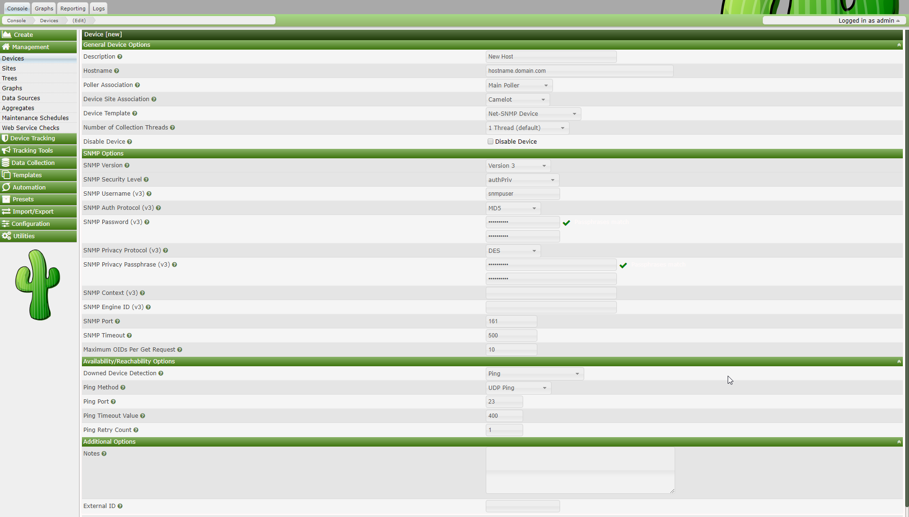

# How to Graph Your Network

At this point, you probably realize that graphing is Cacti's greatest strength.
Cacti has many powerful features that provide complex graphing and data
acquisition, some which have a slight learning curve. Do not let that stop you
however, because graphing your network is incredibly simple.

The next two sections will outline the two basic steps which are typically
required to create graphs for most devices.

## Creating a Device

The first step to creating graphs for your network is adding a device for each
network device that you want to create graphs for. A device specifies important
details such as the network hostname, SNMP parameters, and host type.

To manage devices within Cacti, click on the Devices menu item. Clicking Add
will bring up a new device form. The first two fields, Description and Hostname
are the only two fields that require your input beyond the defaults. If your
host type is defined under the host template dropdown, be sure to select it
here. You can always choose "Generic SNMP-enabled Host" if you are just
graphing traffic or "None" if you are unsure. It is important to remember that
the host template you choose will not lock you into any particular
configuration, it will just provide more intelligent defaults for that type of
host.

The field definitions are as follows

###### Table 7-1. Device Field Definitions

Field | Description
--- | ---
Description | This description will show up in the first column of the device list. You may refer to it e.g. in graph titles
Hostname | Either an IP address or a hostname. The hostname will be resolved using the standard host resolving mechanisms, e.g. Dynamic Name Services (DNS)
Host Template | A Host Template is a container for a list of graph templates that will be related to this host.
Notes | New with cacti 0.8.7. Add notes to a host to add arbitrary text.
Disable Host | Exclude this host from being polled. This is of particular value, if a device is no longer available, but should be kept e.g. as a reference.

###### Table 7-2. Availability/Reachability Options

Field | Description
--- | ---
Downed Device Detection | NONE: Deactivate downed host detection PING and SNMP: perform both tests SNMP: verify SNMP check on OID .1 and .1.3 ICMP: perform a ping test, see below
Ping Method | Available only for "PING and SNMP" or "PING" ICMP: perform ICMP tests. Requires permissions UDP: perform a UDP test TCP: perform a TCP test
Ping Port | Available only for UDP/TCP PING test types. Please define the port to be tested here. Make sure, that no firewall intercepts the tests Ping
Timeout Value | After this time, the test fails. Measured in units of milliseconds
Ping Retry Count | The number of times Cacti will attempt to ping a host before failing.

###### Table 7-3. SNMP Options

Field | Description
--- | ---
SNMP Version | Version 1: Use SNMP Version 1. Be aware, that 64bit counters are not supported in this SNMP version Version 2: Referred to as SNMP V2c in most SNMP documentations Version 3: SNMP V3, supporting authentication and encryption
SNMP Community | SNMP read community for this device.
SNMP Port | Enter the UDP port number to use for SNMP (default is 161).
SNMP Timeout | The maximum number of milliseconds Cacti will wait for an SNMP response (does not work with php-snmp support). Maximum OID's Per Get Request | This is a performance feature. Specifies the number of OID's that can be obtained in a single SNMP Get request. NOTE: This feature only works when using Spine NOTE: Some devices do not support values > 1
Security Options for SNMP V3 |
SNMP Username | The username of an SNMP V3 createUser statement or equivalent SNMP Password | The authpassphrase of an SNMP V3 createUser statement or equivalent
SNMP Auth Protocol | The authentication type of an SNMP V3 createUser statement or equivalent. Select either MD5 or SHA. This entry defaults to MD5.
SNMP Privacy Passphrase | The privacy passphrase of an SNMP V3 createUser statement or equivalent.
SNMP Privacy Protocol | The privacy protocol of an SNMP V3 createUser statement or equivalent. Select either DES or AES. This entry defaults to DES.
SNMP Context | When using the View-Based Access Control Model (VACM), it is possible to specify an SNMP Context when mapping a community name to a security name with a com2sec directive, with the group directive and the access directive. This allows for defining special access models. If using such a parameter with your target's SNMP configuration, specify the context name to be used to access that target here.

After saving your new device, you should be redirected back to the same edit
form with some additional information. If you configured SNMP for this host by
providing a valid community string, you should see various statistics listed at
the top of the page. If you see "SNMP error" instead, this indicates an SNMP
problem between Cacti and your device.

Towards the bottom of the page there will be two addition boxes, Associated
Data Queries, and Associated Graph Templates. If you selected a host template
on the previous page, there will probably be a few items in each box. If there
is nothing listed in either box, you will need to associate at least one data
query or graph template with your new device or you will not be able to create
graphs in the next step. If no available graph template or data query applies
to your device, you can check the Cacti templates repository or create your own
if nothing currently exists.

### A Word About SNMP

The SNMP version that you choose can have a great effect on how SNMP works for
you in Cacti. Version 1 should be used for everything unless you have reason to
choose otherwise. If you plan on utilizing (and your device supports)
high-speed (64-bit) counters, you must select version 2. Starting with Cacti
0.8.7, version 3 is fully implemented.

The way in which Cacti retrieves SNMP information from a host has an effect on
which SNMP-related options are supported. Currently there are three types of
SNMP retrieval methods in Cacti and are outlined below.

###### Table 7-4. SNMP Retrieval Types

Type | Description | Supported Options | Places Used
--- | --- | --- | --- |
External SNMP | Calls the net-snmp snmpwalk and snmpget binaries that are installed on your system. | All SNMP options | Web interface and PHP poller (poller.php)
Internal SNMP (php-snmp) | Uses PHP's SNMP functions which are linked against net-snmp or ucd-snmp at compile time. | Version 1 Only (Community and Port) | Web interface and PHP poller (poller.php)
Spine SNMP | Links directly against net-snmp or ucd-snmp and calls the API directly. | All SNMP options | C-Based Poller (Spine)
