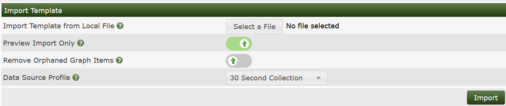

# Template Import

This section will describe **Template Import** in Cacti.

Template Import files are XML files used to add support for more graph types and
different devices that can be shared with others. These template files can
either be custom made or you could download them from the community on the cacti
forums.

Once you have downloaded the graph/device template you are looking for you will
need to import the template into the cacti system. To import a device/graph
template go to `Console > Import/Export > Import Templates` you will now see the below page

.

*Important note:* When importing the template be sure to match the data source
profile with your polling time.

First you must click on **Select File** and browse to where the XML file is
located on your computer.  Cacti will default to preview the import to check for
any issues. If none are found, you can select the same file and then untick the
preview option to import after which the template should be available.

---
Copyright (c) 2004-2021 The Cacti Group
