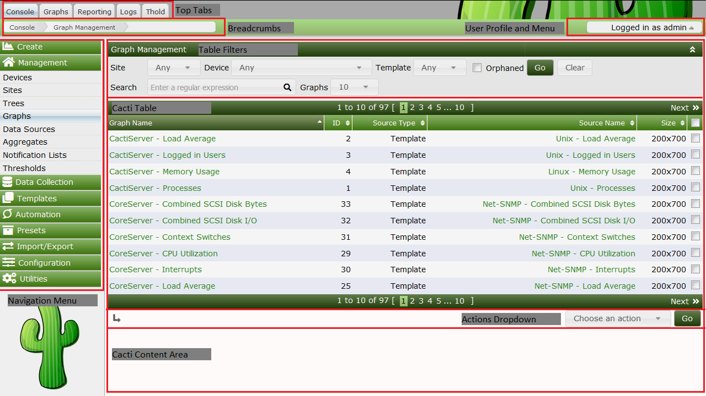

# Navigating the Cacti User Interface

The Cacti User Interface is visually broken into multiple sections.  Each major section is navigated to by clicking on a **Top Tab**.  By default, Cacti has four major sections called *Console*, *Graphs*, *Reporting* and *Logs*, though Administrators can add additional **Top Tab** sections through both installing and enabling **Plugins** or by adding **External Links** to Cacti.

Inside each of these sections, the page is broken into sub-sections.  These Subsections include the *Navigation Area* and the *Content Area*.

All pages include a *Breadcrumb* area a *User Profile and Menu* area, and in some themes a *Footer* area is also included.  Additionally, in some *Themes* the *Breadcrumb* area is hidden.

To use Cacti properly, you should first understand these sections.  We will start by describing the Cacti *Console*.

## The Cacti Console Top Tab

The image below is of the Cacti *Console*.  From the Cacti Console, we can see many of Cacti's User Interface areas.

- **Top Tabs** - Cacti **Top Tabs** provide Cacti with multiple **Navigation Areas**.  By default, Cacti includes four **Top Tabs**.  They are *Console*, *Graphs*, *Log* and *Reports*.
- **Breadcrumbs** - **Breadcrumbs** appear directly below the **Top Tabs**.  Note that some Cacti *Themes* disable the **Breadcrumbs**.  You can click on a **Breadcrumb** area to navigate to that area if desired.
- **Cacti Content Area** - This is where the main page content will be displayed.  It is directly below the **Breadcrumbs** or the **Top Tabs** with some Cacti *Themes*.  They can include any HTML that the **Plugin Author** or Cacti Administrator desires in the case of **External Links**.
- **Navigation Menu** - If you click on the Cacti *Console*, you will see an example **Navigation Menu**.  These menus can appear on any Plugin based **Top Tab** page in addition to the Cacti *Console*.
- **Cacti Tables** - These tables are where table based data is rendered in Cacti.  **Cacti Tables** are presented using an arcane, though easy to use API.
- **Table Filters** - Any **Cacti Table** can include a **Table Filters**.  These filters can be used to limit the data returned to a **Cacti Table**.
- **Actions Dropdown** - Any page that includes a **Cacti Table** will generally include an **Actions Dropdown**.  These **Actions Dropdown** menus allow you to take action on a table row or rows.
- **User Profile and Menu** - This is where a **Cacti User** can edit their profile, change their password, logout, or find links to other Cacti information and support.

Normal users, such as the Cacti Guest account should not have access to the Cacti *Console*.

## The Cacti Graphs Top Tab

The Cacti Graphs **Top Tab** is where most Cacti **Graphs** are viewed.  By default, the Cacti Graphs **Top Tab** includes three distinct views.  They include:

- **Tree View** - Allows Cacti Users to view **Graphs** in the form of hierarchical **Trees**.  These **Trees** are generally constructed by the Cacti Administrator and are controlled either at the **User** or **User Group** level.
- **Preview View** - The **Preview View** provides a view of all **Graphs** that a Cacti User has access to.  **Table Filters** are provided to constrain the list of **Graphs** returned to the page.
- **List View** - The **List View** allows the Cacti user to Create their own **Preview Page** by allowing them to select graphs from various pages, and then finally view those pages from the **Preview View**.

In the example **Tree View** page below, you can see the **Tree Navigation Area** to the left, and in the **Cacti Content Area**, you can see the **Graphs** and a **Table Filter** area for constraining the list of **Graphs** returned.  You can *Search* the Tree View from the *Search* area above the **Tree Navigation Area**.

---
Copyright (c) 2018 Cacti Group
