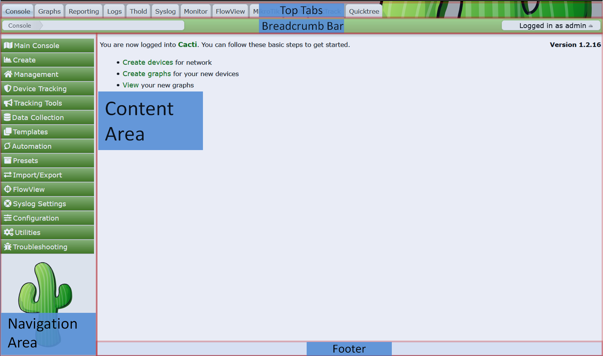
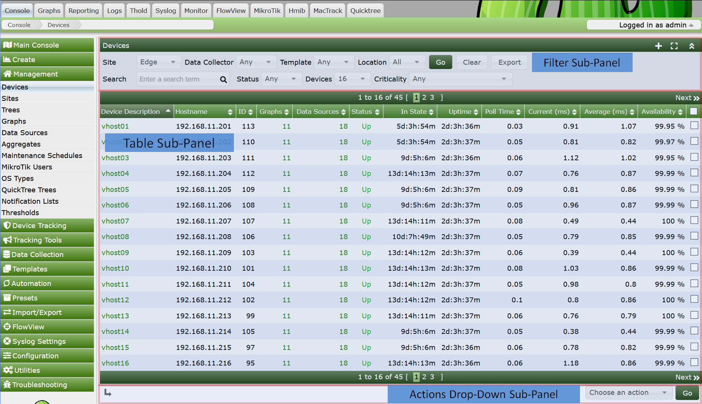
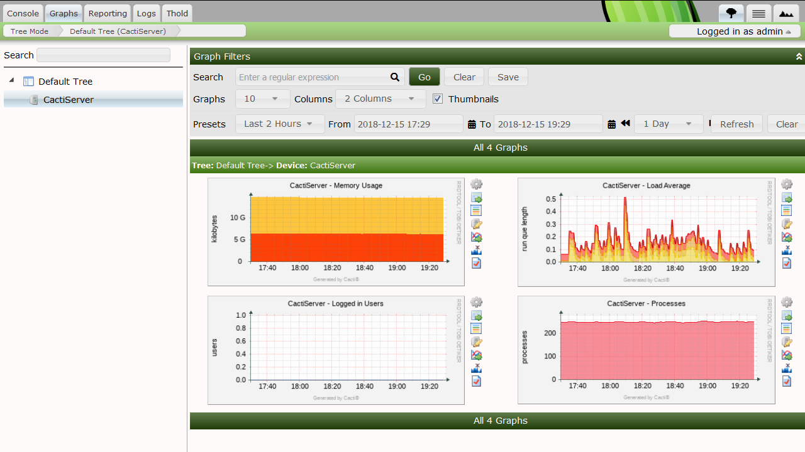
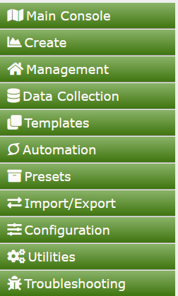

# Navigating the Cacti User Interface

The Cacti User Interface is visually broken into multiple panels.  Each major
major panel is designed to hold content.  Depending on the Cacti Theme you use
some of these panel may not be visible at the Theme Developers discretion.  The
common panels are:

- **Top Tabs** - Where you perform major navigation separate content
- **Navigation Area** - If the content in navigated to by the Top Tab has a menu,
  it will be found here.
- **Breadcrumb Bar** - This is where you can see where in the Cacti interface you
  are currently pointed to
- **Content Area** - This is where you present tables, charts, forms, etc.  It is
  where your main Content resides
- **Footer** - This section is left for Theme Developers to insert content
  that belongs at the bottom of the screen.

You can see the default Cacti layout with its various panels in the image below.
You will note, in this `Modern` Theme, the Theme Author has decided to dispense
with the Footer.

In Cacti, when you click on the **Top Tab**, you will by default enter a
completely different section of Cacti.  Cacti's Top Taps are Designed
to mimic browser tabs, this helps with users orienting themselves to the
various sections of Cacti.  When you have many **Plugins** installed as
in the example above, you can see clearly the benefit of these
navigation aids.

Inside each of these panels, a page can be broken into sub-panels.  Two
panels customarily broken into sub-panels include the *Navigation Area*
and the *Content Area*.

In the example below, we show the **Device** page in Cacti calling out the
various sub-panels.

Most of Cacti's pages are laid out in this fashion.  However, what goes into
the Cacti **Content Area** is completely under the **Plugin** authors
control.

At the Theme developers discretion, all pages should include both the **Top Tab**
and **Breadcrumb Bar**.  Inside of the **Breadcrumb Bar** or **Top Tap** panels
you should always see the *User Profile and Menu* on the right.

To use Cacti properly, you should first understand these sections.  We will
start by describing the Cacti *Console*.

## Cacti Core Panels and Sub-Panels

- **Top Tabs**

  Cacti **Top Tabs** provide Cacti with multiple **Navigation Areas**.  By
  default, Cacti includes four **Top Tabs**.  They are *Console*, *Graphs*,
  *Log* and *Reports*.

- **Breadcrumbs**

  **Breadcrumbs** appear directly below the **Top Tabs**.  Note that some Cacti
  *Themes* disable the **Breadcrumbs**.  You can click on a **Breadcrumb** area
  to navigate to that area if desired.

- **Cacti Content Area**

  This is where the main page content will be displayed.  It is directly below
  the **Breadcrumbs** or the **Top Tabs** with some Cacti *Themes*.  They can
  include any HTML that the **Plugin Author** or Cacti Administrator desires in
  the case of **External Links**.

- **Navigation Menu**

  If you click on the Cacti *Console*, you will see an example **Navigation
  Menu**.  These menus can appear on any Plugin based **Top Tab** page in
  addition to the Cacti *Console*.

- **Cacti Tables**

  These tables are where table based data is rendered in Cacti.  **Cacti
  Tables** are presented using an arcane, though easy to use API.

- **Table Filters**

  Any **Cacti Table** can include a **Table Filters**.  These filters can be
  used to limit the data returned to a **Cacti Table**.

- **Actions Dropdown**

  Any page that includes a **Cacti Table** will generally include an **Actions
  Dropdown**.  These **Actions Dropdown** menus allow you to take action on a
  table row or rows.

- **User Profile and Menu**

  This is where a **Cacti User** can edit their profile, change their password,
  logout, or find links to other Cacti information and support.

Non-Administrative users, such as the Cacti Guest account *should* not have
access to the Cacti *Console*.  The Cacti Guest account should additionally
not have access to their *User Profile* as that account is shared with
many users.

## The Cacti Graphs Top Tab

The Cacti Graphs **Top Tab** is where most Cacti **Graphs** are viewed.  By
default, the Cacti Graphs **Top Tab** includes three distinct views.  They
include:

- **Tree View**

  Allows Cacti Users to view **Graphs** in the form of hierarchical **Trees**.
  These **Trees** are generally constructed by the Cacti Administrator and are
  controlled either at the **User** or **User Group** level.

- **Preview View**

  The **Preview View** provides a view of all **Graphs** that a Cacti User has
  access to.  **Table Filters** are provided to constrain the list of **Graphs**
  returned to the page.

- **List View**

  The **List View** allows the Cacti user to Create their own **Preview Page**
  by allowing them to select graphs from various pages, and then finally view
  those pages from the **Preview View**.

In the example **Tree View** page below, you can see the **Tree Navigation
Area** to the left, and in the **Cacti Content Area**, you can see the
**Graphs** and a **Table Filter** area for constraining the list of **Graphs**
returned.  You can *Search* the Tree View from the *Search* area above the
**Tree Navigation Area**.

## The Cacti Console

In the image below, you can see a basic Cacti Console menu area.  It is divided
into separate sub-menus.  We will describe the purpose of each next.

- **Main Console** - This sub-menu pick is fairly benign.  It provides
  an open area.  This screen feels like it needs more content if it's
  the *Main Console*. Fortunately, **Plugin** developers have solved
  this problem.  The **intropage plugin** for example can fulfill that need.
- **Create** - This sub-menu allows you to create both **Devices** and
  **Graphs**.  They are essentially shortcuts to other sub-menu picks.
- **Management** - This is where all core Cacti **Site**, **Graph**,
  **Device**, **Tree**, **Data Source**, and **Aggregate** non-templated
  objects reside.  When you install Cacti **Plugins**, you will find
  they they extend this sub-menu.
- **Data Collection** - This is where you define rules for **Data Collection**
  Examples include: **Data Collectors**, **Data Input Methods** and
  **Data Queries**
- **Templates** - This is where you find all of Cacti's various Templates
  outside of Automation.  By default, You will find Templates for
  **Graphs**, **Data Sources**, **Devices**, **Aggregates**, and **Colors**.
- **Automation** - This sub-menu is where you find rules for automating
  **Device** Discovery, and Rules for creating **Devices**, **Graphs**,
  and **Trees**.
- **Presets** - This area contains meta objects that cross Template
  boundaries and are Global in nature.  They include; **Data Source Profiles**,
  **CDEFs**, **VDEFs**, **GPrint Presets**, and **Colors**
- **Import Export** - This is how you can import and export various Cacti
  Template objects.
- **Configuration** - This is where you manage **Users**, **User Groups**,
  **User Domains**, **Global Settings**, and **Plugins**.
- **Utilities** - This is where Cacti includes common utilities that can be use
  in the Web Portal without having to goto the Command line.
- **Troubleshooting** - There are some handy utilities here that help
  diagnose common problems with Cacti.

All of these objects types will be explained in subsequent sections of the
Cacti documentation.  For now, it's important just to know that these pages
exist.

---
Copyright (c) 2004-2024 The Cacti Group
