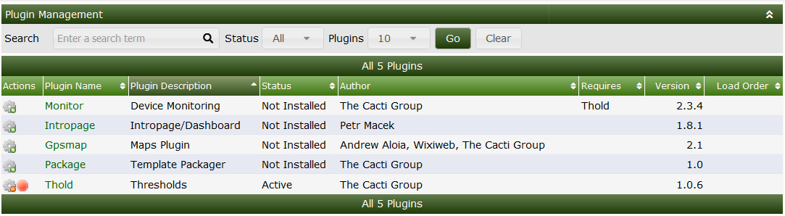
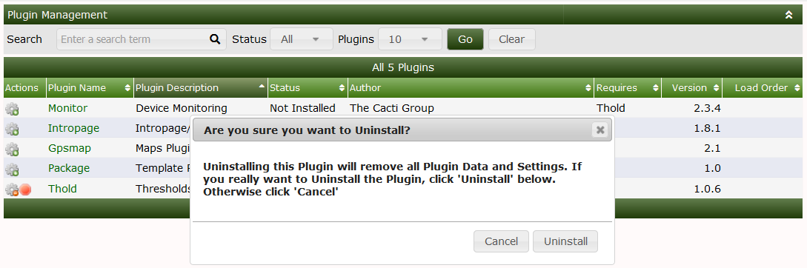
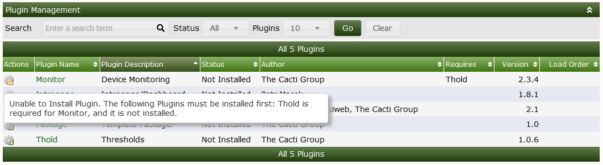

# Plugin Management

## Installing Plugins



Installing plugins on cacti is a simple procedure

1. Download the plugin to cactidir/cacti/plugins

   ```console
   git clone https://github.com/Cacti/plugin_thold.git
   ```

   ```console
   mv plugin_thold /var/www/html/cacti/plugins
   ```

2. Now assign the proper permissions to the folder

   ```console
   chown -R apache:apache plugin_thold
   ```

3. From `Console > Configuration > Plugins` Install the plugin by Clicking on
   the wrench Icon as showng below.

   Below you will now see the THOLD plugin available to install in this case we
   are installing thold

   

4. After installing the plugin by clicking on the grey gear you will now how to
   enable it this can be done via clicking on the green check mark

   

After this, the **Plugin** is installed and enabled. However, there will likely
be onfiguration that must take place after the **Plugin** is enabled. See the
**Plugin** documentation for instructions on how to configure and use them.

## Updating a Plugin

Updating a plugin not only keeps you up to date with the latest release of the
code for that plugin. It also allows you to keep all of your settings for that
plugin ensure you DO NOT UNINSTALL the plugin. You must instead disable the
plugin which will not drop the SQL tables and thus save your settings.

1. Disable the **Plugin** you want to update

2. Backup the current **Plugin** folder typically in
   `<path_cacti>/plugins/plugin_name`

   ```console
   cp -R /var/www/html/cacti/plugin/thold /tmp
   ```

3. git pull or download the new version of the **Plugin**

   ```console
   git pull
   ```

4. Change name of **Plugin** folder i.e plugin_thold to thold

   ```console
   mv plugin_thold thold
   ```

5. Assign proper permissions usually either www-data for Ubuntu/debian or apache
   for CentOS/RHEL

   ```console
   chown -R apache:apache thold
   ```

6. Re-enable the **Plugin** in the **Console**

### Video Walkthrough

[](https://youtu.be/TPKu-2XYKok)

## Unistall a Plugin

To uninstall a plugin go into the plugins page
`Console > Configuration > Plugins` Click on the plugin to Disable the plugin.

Click on the red dot beside the plugin to uninstall the plugin a dialogue box
will appear now click uninstall.



This will uninstall the plugin from cacti but will NOT remove the files from the
server to do that you must manually remove the plugin until you remove the files
the plugin will show to be available to be installed.

> **WARNING**: Uninstalling a Cacti **Plugin** generally also removes any
> database tables that that **Plugin** created, which means your data! Before
> uninstalling **Plugins**, it would be wise to have a backup strategy in place
> in case you accidentally uninstall a **Plugin** and loose your data!

### Dependecies in plugins

Some dependencies such as THOLD aka Thresholds rely on another plugin in this
case thold reliese on the monitor plugin which is missing in this case you will
see the below messege box in order to continue you must install the required
plugin.



---

Copyright (c) 2004-2023 The Cacti Group
