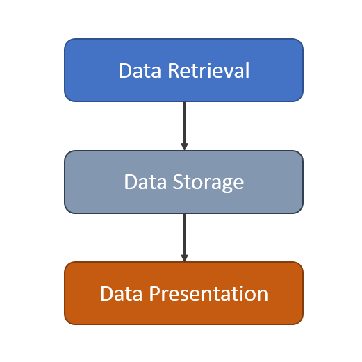
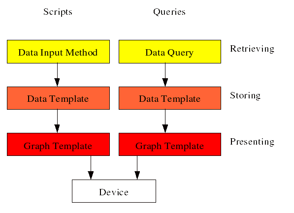

# Principles of Operation

To understand Cacti's principal of operation, you have to start
at the top and work down.  Cacti's operational model is
divided into multiple layers.  They include

- Devices
- Sites
- Data Collectors (Pollers)
- Data Retrieval
- Data Storage
- Graphing

## Devices

Cacti **Devices** are either physical hosts, sensors, clusters,
services, or any type of object with a name and that can
provide information about it self that should go into a
**Graph** or could be used to provide additional information
useful for Operations.

The Cacti **Device** object serves as the center Cacti's world
it's where stores information on how gather data about it.  You
can have from one to tens of thousands of **Devices** monitored
from one Cacti system.  It's very scalable.  They can be
discovered using Cacti's Automation sub-system, added manually,
or gathered from a CMDB and added to Cacti using it's command
line interface.

## Sites

Cacti works with **Sites**.  So, when you add a phyical **Device**
to Cacti, you can associate it with a **Site**.  Sites are designed
to be physical locations.  Cacti can organize **Devices** and it's
**Graphs** by Site in a convenient fashion.

## Data Collectors

These are the physical or virtual hosts or containers that gather
data about a group of devices either within a network or a site.
They are resiliant in that if the central Cacti server is not reachable,
they will cache data and wait for it to become available again.

Cacti supports upto dozens of Data Collectors today.  Some customers
use somethings as simple as a Rasberry Pi or Nuk for
Data Collectors.  However, Virtual Machines are preferred as they
can be migrated live which does not interrupt data collection.

## Data Retrieval

The Data Collectors first and foremost task it to retrieve data and
forward it to the main Cacti server for storage. Cacti will do so
using its poller which is a part of the Data Collector. The Poller
is executed from the operating system's scheduler or from systemd
depending on the OS and the version of the OS.  It collects data
as frequently as every 10 seconds to hours dynamically in the same
system.  So, one Cacti system can be monitoring objects at a
10 second granularity, a 30 second granularity, 1 minute all the
way to once per several hours.

In the image below, you can see the general flow of data from
the device to the Cacti database.

In enterprise installations, you're dealing with potentially
thousands of devices of different type, e.g. Servers, Network
Equipment, Appliances, Sensors, PDU's, Static Transfer Switches
and the like. To retrieve data from remote targets/hosts, Cacti
will mainly use the Simple Network Management Protocol SNMP.
Thus, all devices capable of using SNMP will be eligible to be
monitored by Cacti.  But that's just the simplest case.

Many customers gather data using out of band processes like
using the Cacti hmib Plugin, which stores data in transient
tables, and then Cacti can do device data collection directly
from those transient tables.  That design, since no device
can be nearer in latency than the database, can scale to 30,
40, even 50 thousand devices with relative ease in Cacti
depending on the size of your database and data collector
infrastructure (sockets, cores, threads).  When using this
N-Tiered methology, most customers will use Cacti's
`script server` which is pool of memory resident PHP
interpretors that preloads all scripts used to gather data,
therefore, it's super fast, and parallel in nature.
However, most customers will use SNMP, or SSH to gather
metrics from their Devices.  I mean, how many companies
have 50 thousand devices that they monitor with regularity?

Once the data has been gathered, Cacti then uses either an
out-of-band or in-band process to store the data into Round
Robin Archive files, which represent a flat very well performing
Time Series Databases called RRDfiles.  See below for details
on that storage mechanism.

## Data Storage

In the industry, storage of the resulting data can take meny forms.
In Cacti, the RRDfile has been the tool of choice for many years.
There are only so many ways to make a hammer, and RRDtool's a great
hammer.  Other approaches in the industry use SQL database,
others flat files or document stores like Elastic Search, Splunk,
Mongo DB, InfluxDB.  There are a number of options out there.
You can get more information about RRDfile from the
[RRDtool Website](http://www.RRDtool.org/).

`RRD` is an acronym for **Round Robin Database**. RRD is a system to store and
display time-series data (i.e. network bandwidth, machine-room temperature,
server load average). It stores the data in a very compact way that will not
expand over time, and it can create beautiful graphs.  Data that ages
beyond a certain point is consolidated and very old data just rolls off
the end of the RRDfile.  It ages out.  This keeps storage requirements at bay.

As mentioned, performs consolidation to combine raw data (a `primary data point`
in RRDtool lingo) to consolidated data (a `consolidated data point`).
This way, historical data is compressed to save space. RRDtool knows
different consolidation functions: AVERAGE, MAXIMUM, MINIMUM and LAST.

## Data Presentation

One of the most appreciated features of [RRDtool](http://www.RRDtool.org/) is
the built-in graphing function. This comes in useful when combining this with
some commonly used web server. Such, it is possible to access the graphs from
merely any browser on any platform.

The Graphing engine is quite flexible. It is possible, to graph one or
many items in one graph. Auto-scaling is supported and logarithmic y-axis,
left and right axes, and much much more. You may stack items onto another
and print pretty legends denoting characteristics such as minimum,
average, maximum and lots more.

## Extending Built-in capabilities

As mentioned, scripts and Queries extend Cacti's capabilities beyond
just SNMP. They allow for data retrieval using custom-made code.
This is not even restricted to certain programming languages;
you will find PHP, Perl, Python, shell/batch
and more. These scripts and queries are executed locally by Cacti's Poller.
But they may retrieve data from remote hosts by different protocols, e.g.

Protocol | Description
--- | ---
ICMP | ping to measure round trip times and availability
telnet | programming telnet scripts to retrieve data available to sysadmins only
ssh | much like telnet, but more secure (and more complicated)
http(s) | invoke remote cgi scripts to retrieve data via a web server or parse web pages for statistical data (e.g. some network printers)
snmp | use Net-SNMP's exec/pass functions to call remote scripts and get data
ldap | to retrieve statistical about your ldap server's activities
use your own | invoke Nagios agents

and much more...

There a two ways extending Cacti's build-in capabilities:

[Data Input Methods](Data-Input-Methods.md) for querying **single or
multiple**, but **non-indexed** readings

- temperature, humidity, wind, ...
- cpu, memory usage
- number of users logged in
- IP readings like ipInReceives (number of ip packets received per host)
- TCP readings like tcpActiveOpens (number of tcp open sockets)
- UDP readings like udpInDatagrams (number of UDP packets received)

[Data Queries](Data-Queries.md) for **indexed** readings

- network interfaces with e.g. traffic, errors, discards
- other SNMP Tables, e.g. hrStorageTable for disk usage
- you may even create Data Queries as scripts e.g. for querying a
 name server (index = domain) for requests per domain

By using the Exporting and Importing facilities, it is possible to share your
results with others.

## Beyond Graphs

Cacti is not just a Graphing platform, it's also a Network Operations
Framework.  Thought the dozens of plugins and user contributed
Graph Templates, the sky is the limit as to what can be done using the
Cacti Framework.  It's stood the test of time now in it's 19th year
of existence in the Open Source world.

---
Copyright (c) 2004-2021 The Cacti Group
