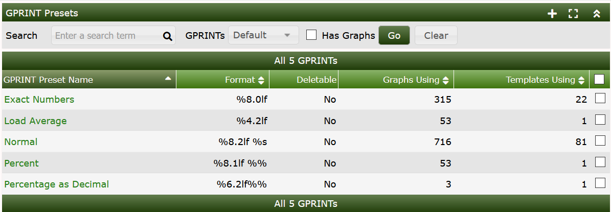
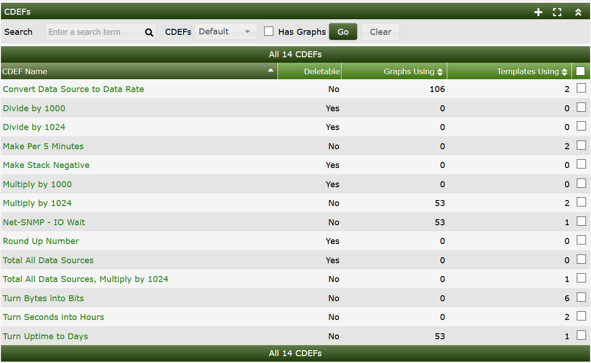
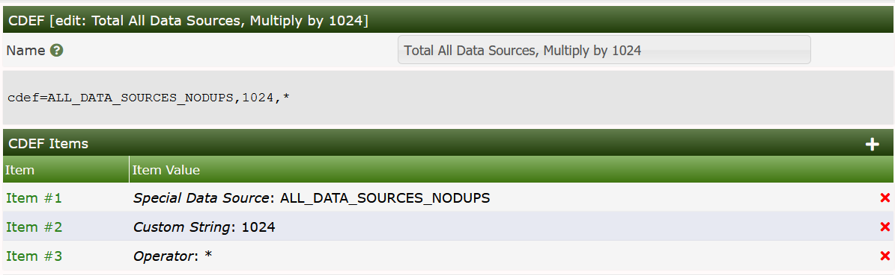
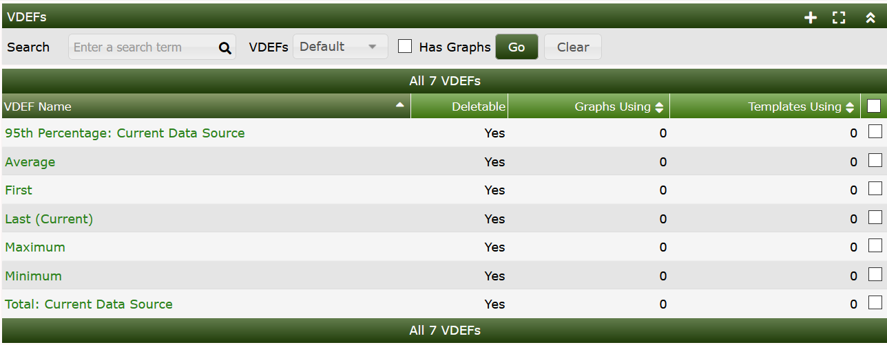
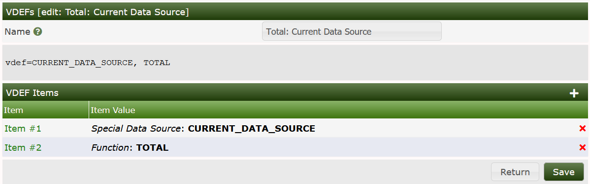

# RRDtool Specific Features

Cacti supports most RRDtool features.  In this chapter, many of those features,
and some Cacti implementation specifics around them will be discussed.  As
RRDtool is a continually changing Times Series Database (TSDB) and **Graph**
rendering framework, this guide may be a little behind on all the RRDtool
features that Cacti supports.

## Database Data Types

There are several different Database **Data Types** that RRDfile supports.
They include all those listed below.  Cacti claims to support all, but `COMPUTE`
remains untested.

Type | Supported | Description
--- | --- | ---
GAUGE | Yes | This is as the term refers to a floating point number that tracks the value reported directly.  Unlike the COUNTER, it has not comprehension of past data.
COUNTER | Yes | This is a floating point number that tracks the different between samples to come up with effectively a rate calculation.  Used for things like Traffic Graphs where the number reported in SNMP continually increases
DCOUNTER | Yes | This is the same as a COUNTER, but in Double Precision.
DERIVE | Yes | This data type measures the Rate of Change of a value, otherwise known as the first derivative to the value.  As such, it relies on previous data in order to report the change.
DDERIVE | Yes | This is the same as the DERIVE, but in Double Precision
ABSOLUTE | Yes | Is for counters that get reset upon reading.  This is often used for fast counters.  It is also similar to the DERIVE, or acts very much like it.
COMPUTE | Yes | Though Cacti claims to support this Data Type.  It's not clear that it's presently working.

> **NOTE**: Presently `Holt-Winters Forecasting` is not supported in Cacti
> and The Cacti Group has no plans on supporting it.  If you would like
> `Holt-Winters Forecasting` supported in Cacti, you will need to submit a
> pull request including documentation if you require it's functionality.

## GPRINT Presets

A GPRINT is a graph item type that enables you to print the values of data
sources on a graph. They are typically used to represent legend values on the
graph. The output format of these numbers are controlled by a printf-like
format string. Cacti enables you to keep a global list of these strings that
can be applied to any graph item throughout Cacti.  You can see the list of
available formats described on the [RRDtool Website](https://oss.oetiker.ch/rrdtool/doc/rrdgraph_graph.en.html#PRINT).

### Creating a GPRINT Preset

To create a new GPRINT preset, select the Graph Management menu item under the
Management heading, and select GPRINT Presets. Click Add to the right and you
will be presented with an edit page containing two fields. Enter a name for
your GPRINT preset, and the actual printf-like string in the GPRINT Text field.
When you are finished, click the Create button to create your new GPRINT preset.

In the image below, you can see the default GPRINT Presets included in the
base Cacti.  These generally cover just about all use cases presently.



## CDEF's

CDEF's allow you to apply mathematical functions to graph data to alter output.
The concept of a CDEF comes straight from RRDtool, and are written in reverse
polish notation (RPN). For more information regarding the syntax of CDEF's,
check out the [CDEF tutorial](https://oss.oetiker.ch/rrdtool/tut/cdeftutorial.en.html).

From the image below, you can see that Cacti provides a rich set of CDEF's out
of the box.  These CDEF's can be imported and exported and are globally assigned
for portability.



### Creating a CDEF

To create a new CDEF in Cacti, select CDEF's under `Console > Presets` sub-menu
section. Once at this screen, click Add to the right. You will be prompted for
a CDEF name, for which you can type anything used to describe your CDEF.
Click the Create button so you are redirected back to the edit page, now with
an empty CDEF Items box. Construct your CDEF by adding an item for each
element in the CDEF string, common types such as operators and functions
are enumerated for your convenience. Below is a basic description of each
CDEF item type.  You can see from the image below that CDEF's follow a
Reverse Polish Notation (RPN), which was a very popular way of computing
back in the 70's and 80's when computing devices had much less memory.
However, RPN is elegant in it's simplicity.



###### Table 19-1. CDEF Item Types

Cacti provides several CDEF Item Types to represent a **Data Source**
in order to provide additional functionality.  See below for the
documentation.  Cacti presently does not allow you to specify a VNAME for
your DEFS, CDEF's and VDEF's, but instead uses a string pattern to assign
them.  You will have to take note of then when creating a **Graph Template**.
Those Special Data Source types are documented below in the next few sections.

Type | Description
--- | ---
Function | You can choose a CDEF function to use as the item. [The RRDtool's graph manual](https://oss.oetiker.ch/rrdtool/doc/rrdgraph_data.en.html#CDEF) describes the purpose of each CDEF function.
Operator | Just your standard math operators, including modulo (%).
Special Data Source | A special data source is basically a flag to tell Cacti to do some special processing when it encounters this CDEF item. The "Current Graph Item Data Source" type basically inserts the name of the data source that is referenced by the graph item that references to this CDEF. Both of the "All Data Sources" types insert a summation of all data sources used on a graph.
Another CDEF | You can recursively use another CDEF within this CDEF.
Custom String | Sometimes it's just easier to type out the literal CDEF string manually. When referencing to data sources on the graph, remember that Cacti names them 'a', 'b', 'c', '...', starting with the first data source on the graph.

## VDEF's

VDEF's provide greater functionality then their ancestor CDEF's and may be able to
replace some legacy Cacti functionality like Nth Percentile **Graph Template**
logic.  They should be used whenever possible for your **Graph Templates**.

You can see from the image below, that 95th percentile and total bandwidth
could be replace by using one of the VDEF's below.



### Creating a VDEF

To create a new VDEF in Cacti, select VDEF's under `Console > Presets` sub-menu
section. Once at this screen, click Add to the right. You will be prompted
for a VDEF name, for which you can type anything used to describe your VDEF.
Click the Create button so you are redirected back to the edit page, now with
an empty VDEF Items box. Construct your VDEF by adding an item for each element
in the VDEF string, common types such as operators and functions are
enumerated for your convenience. Below is a basic description of each
VDEF item type.  The image below shows an example VDEF for the Bandwidth
type VDEF.



For additional information on CDEF's and VDEF's see that specific section
of the documentation.  Additionally, you can find examples on the
[RRDtool Website](https://oss.oetiker.ch/rrdtool/doc/rrdgraph_data.en.html#VDEF)

### Special Data Sources

The Special Data Source selection introduces some variables not known to plain
vanilla RRDtool. Let's spend some few words of them to unleash their power.

###### Table 19-2. CDEF Special Data Source

Special Data Source | Description
--- | ---
Current Graph Item Data Source | Will be replaced by the DEF name of the RRDtool data source referred by the graph item this CDEF is associated to.
All Data Sources (Don't Include Duplicates) | Will add up all data sources of the whole graph to form a total. A data source that appears more than once will be counted only once. Data sources that differ by consolidation functions only are NOT counted as different data sources (e.g. traffic_in:AVERAGE and traffic_in:MAX are counted only once). It is NOT required to associate the graph item to any data source!
All Data Sources (Include Duplicates) | Will add up all data sources of the whole graph to form a total. A data source that appears more than once will be counted for each time of it's appearance. Data sources that differ by consolidation functions only are NOT counted as different data sources (e.g. traffic_in:AVERAGE and traffic_in:MAX are counted only once). It is NOT required to associate the graph item to any data source!
Similar Data Sources (Don't Include Duplicates) | It is REQUIRED to associate the graph item to the data source that shall be totaled! Let's assume the data source is named "traffic_in". Then, cacti will add up all data sources "traffic_in" of the whole graph to form a data source specific total (e.g. Total traffic In). Data sources with different consolidation functions are counted as same data sources (e.g. traffic_in:AVERAGE and traffic_in:MAX are counted once)
Similar Data Sources (Include Duplicates) | It is REQUIRED to associate the graph item to the data source that shall be totaled! If a data source appears multiple times, it will be added this many times.
Current Data Source Item: Minimum Value | Taken from the Data Template - Data Source Item related to this graph item: fetches the minimum value defined for the given data template. Caution: This is NOT the smallest entry of the given data source!
Current Data Source Item: Maximum Value | Taken from the Data Template - Data Source Item related to this graph item: fetches the maximum value defined for the given data template. Caution: This is NOT the highest entry of the given data source!
Graph: Lower Limit | Taken from the Graph Template: fetches the Lower Limit defined to the Graph Template. This is independent of all --alt-autoscaling options. It is NOT the dynamically determined lower boundary of the graph!
Graph: Upper Limit | Taken from the Graph Template: fetches the Upper Limit defined to the Graph Template. This is independent of all --alt-autoscaling options. It is NOT the dynamically determined upper boundary of the graph!
Count of All Data Sources (Don't Include Duplicates) | Will count the number of all data sources of the whole graph. A data source that appears more than once will be counted only once. Data sources that differ by consolidation functions only are NOT counted as different data sources (e.g. traffic_in:AVERAGE and traffic_in:MAX are counted only once). It is NOT required to associate the graph item to any data source!
Count of All Data Sources (Include Duplicates) | Will count the number of all data sources of the whole graph. A data source that appears more than once will be counted for each time of it's appearance. Data sources that differ by consolidation functions only are NOT counted as different data sources (e.g. traffic_in:AVERAGE and traffic_in:MAX are counted only once). It is NOT required to associate the graph item to any data source!
Count of Similar Data Sources (Don't Include Duplicates) | It is REQUIRED to associate the graph item to the data source that shall be counted! Let's assume the data source is named "traffic_in". Then, cacti will count all data sources "traffic_in" of the whole graph. Data sources with different consolidation functions are counted as same data sources (e.g. traffic_in:AVERAGE and traffic_in:MAX are counted once)
Count of Similar Data Sources (Include Duplicates) | It is REQUIRED to associate the graph item to the data source that shall be counted! If a data source appears multiple times, it will be counted this many times.

While the `All Data Sources/Similar Data Sources` pseudo CDEF variables perform
*totaling*, the `Count All Data Sources/Count Similar Data Sources` pseudo CDEF
Variables simply *count* the occurrences of the related data sources. Thus, it
is easy to compute e.g. an average of all similar data sources by creating the
CDEF:

   `CDEF=SIMILAR_DATA_SOURCES_NODUPS,COUNT_SIMILAR_DS_NODUPS,/`

### Using Special Data Source

Let's have some examples:

This is the list of graph items defined. Please note, that Item numbers 17-20
are duplicates of Item numbers 1-4. Even if it usually does not make sense,
for this discussion it is very valuable. Item numbers 21-24 are related to a
`cdef=ALL_DATA_SOURCES_NODUPS`.

| Graph Item | Data Source                        | Graph Item Type | CF Type |
|:-----------|:-----------------------------------|----------------:|--------:|
| Item # 1   | (traffic_in): 1. Target Traffic In          |  LINE1 | AVERAGE |
| Item # 2   | (traffic_in): Current:                      | GPRINT |    LAST |
| Item # 3   | (traffic_in): Average:                      | GPRINT | AVERAGE |
| Item # 4   | (traffic_in): Maximum:[HR]                  | GPRINT |     MAX |
| Item # 5   | (traffic_in): 2. Target Traffic In          |  LINE1 | AVERAGE |
| Item # 6   | (traffic_in): Current:                      | GPRINT |    LAST |
| Item # 7   | (traffic_in): Average:                      | GPRINT | AVERAGE |
| Item # 8   | (traffic_in): Maximum:[HR]                  | GPRINT |     MAX |
| Item # 9   | (traffic_out): 1. Target Traffic Out        |  LINE1 | AVERAGE |
| Item # 10  | (traffic_out): Current:                     | GPRINT |    LAST |
| Item # 11  | (traffic_out): Average:                     | GPRINT | AVERAGE |
| Item # 12  | (traffic_out): Maximum:[HR]                 | GPRINT |     MAX |
| Item # 13  | (traffic_out): 2. Target Traffic Out        |  LINE1 | AVERAGE |
| Item # 14  | (traffic_out): Current:                     | GPRINT |    LAST |
| Item # 15  | (traffic_out): Average:                     | GPRINT | AVERAGE |
| Item # 16  | (traffic_out): Maximum:[HR]                 | GPRINT |     MAX |
| Item # 17  | (traffic_in): 1. Target Again Traffic In    |  LINE1 | AVERAGE |
| Item # 18  | (traffic_in): Current:                      | GPRINT |    LAST |
| Item # 19  | (traffic_in): Average:                      | GPRINT | AVERAGE |
| Item # 20  | (traffic_in): Maximum:[HR]                  | GPRINT |     MAX |
| Item # 21  | (No Task): AllDsNoDups                      |  LINE1 | AVERAGE |
| Item # 22  | (No Task): Current:                         | GPRINT |    LAST |
| Item # 23  | (No Task): Average:                         | GPRINT | AVERAGE |
| Item # 24  | (No Task): Maximum:[HR]                     | GPRINT |     MAX |

And this is the rrd graph statement:

```sh
/usr/bin/rrdtool graph - \
--imgformat=PNG \
--start=-86400 \
--end=-300 \
--title="Traffic AllDsNoDups" \
--base=1000 \
--height=120 \
--width=500 \
--alt-autoscale-max \
--lower-limit=0 \
--vertical-label="" \
--slope-mode \
--font TITLE:12: \
--font AXIS:8: \
--font LEGEND:8: \
--font UNIT:8: \
DEF:a="/var/www/html/cacti/rra/target1_traffic_in_235.rrd":traffic_in:AVERAGE \
DEF:b="/var/www/html/cacti/rra/target1_traffic_in_235.rrd":traffic_in:MAX \
DEF:c="/var/www/html/cacti/rra/target2_traffic_in_8.rrd":traffic_in:AVERAGE \
DEF:d="/var/www/html/cacti/rra/target2_traffic_in_8.rrd":traffic_in:MAX \
DEF:e="/var/www/html/cacti/rra/target1_traffic_in_235.rrd":traffic_out:AVERAGE \
DEF:f="/var/www/html/cacti/rra/target1_traffic_in_235.rrd":traffic_out:MAX \
DEF:g="/var/www/html/cacti/rra/target2_traffic_in_8.rrd":traffic_out:AVERAGE \
DEF:h="/var/www/html/cacti/rra/target2_traffic_in_8.rrd":traffic_out:MAX \
CDEF:cdefca=TIME,1202925514,GT,a,a,UN,0,a,IF,IF,TIME,1202925514,GT,c,c,UN,0,c,IF,IF,TIME,1202925514,GT,e,e,UN,0,e,IF,IF,TIME,1202925514,GT,g,g,UN,0,g,IF,IF,+,+, \
LINE1:a#FFFF00FF:"1. Target Traffic In" \
GPRINT:a:LAST:"   Current:%8.2lf%s" \
GPRINT:a:AVERAGE:"Average:%8.2lf%s" \
GPRINT:b:MAX:"Maximum:%8.2lf%sn" \
LINE1:c#FFD660FF:"2. Target Traffic In" \
GPRINT:c:LAST:"     Current:%8.2lf%s" \
GPRINT:c:AVERAGE:"Average:%8.2lf%s" \
GPRINT:d:MAX:"Maximum:%8.2lf%sn" \
LINE1:e#CAF100FF:"1. Target Traffic Out" \
GPRINT:e:LAST:"   Current:%8.2lf%s" \
GPRINT:e:AVERAGE:"Average:%8.2lf%s" \
GPRINT:f:MAX:"Maximum:%8.2lf%sn" \
LINE1:g#CCBB00FF:"2. Target Traffic Out" \
GPRINT:g:LAST:"     Current:%8.2lf%s" \
GPRINT:g:AVERAGE:"Average:%8.2lf%s" \
GPRINT:h:MAX:"Maximum:%8.2lf%sn" \
LINE1:a#FF0000FF:"1. Target Again Traffic In" \
GPRINT:a:LAST:"Current:%8.2lf%s" \
GPRINT:a:AVERAGE:"Average:%8.2lf%s" \
GPRINT:b:MAX:"Maximum:%8.2lf%sn" \
LINE1:cdefca#000000FF:"AllDsNoDups" \
GPRINT:cdefca:LAST:"        Current:%8.2lf%s" \
GPRINT:cdefca:AVERAGE:"Average:%8.2lf%s" \
GPRINT:cdefca:MAX:"Maximum:%8.2lf%sn"
```

The data sources are denoted by the letters `a` to `h`. `cdefca` represents
the important part. You surely notice, that all data sources using
consolidation function `AVERAGE` are taken into account while `MAX` is skipped.
Please pay attention to the data source denoted by `a`. Even though the data
source appears twice, the cdef shows it only once. This is due to the duplicate
suppression.

This is the list of graph items defined. Please note, that Item numbers 17-20
are duplicates of Item numbers 1-4. Even if it usually does not make sense, for
this discussion it is very valuable. Item numbers 21-24 are related to a
`cdef=ALL_DATA_SOURCES_DUPS`

| Graph Item | Data Source                        | Graph Item Type | CF Type |
|:-----------|:-----------------------------------|----------------:|--------:|
| Item # 1   | (traffic_in): 1. Target Traffic In          |  LINE1 | AVERAGE |
| Item # 2   | (traffic_in): Current:                      | GPRINT |    LAST |
| Item # 3   | (traffic_in): Average:                      | GPRINT | AVERAGE |
| Item # 4   | (traffic_in): Maximum:[HR]                  | GPRINT |     MAX |
| Item # 5   | (traffic_in): 2. Target Traffic In          |  LINE1 | AVERAGE |
| Item # 6   | (traffic_in): Current:                      | GPRINT |    LAST |
| Item # 7   | (traffic_in): Average:                      | GPRINT | AVERAGE |
| Item # 8   | (traffic_in): Maximum:[HR]                  | GPRINT |     MAX |
| Item # 9   | (traffic_out): 1. Target Traffic Out        |  LINE1 | AVERAGE |
| Item # 10  | (traffic_out): Current:                     | GPRINT |    LAST |
| Item # 11  | (traffic_out): Average:                     | GPRINT | AVERAGE |
| Item # 12  | (traffic_out): Maximum:[HR]                 | GPRINT |     MAX |
| Item # 13  | (traffic_out): 2. Target Traffic Out        |  LINE1 | AVERAGE |
| Item # 14  | (traffic_out): Current:                     | GPRINT |    LAST |
| Item # 15  | (traffic_out): Average:                     | GPRINT | AVERAGE |
| Item # 16  | (traffic_out): Maximum:[HR]                 | GPRINT |     MAX |
| Item # 17  | (traffic_in): 1. Target Again Traffic In    |  LINE1 | AVERAGE |
| Item # 18  | (traffic_in): Current:                      | GPRINT |    LAST |
| Item # 19  | (traffic_in): Average:                      | GPRINT | AVERAGE |
| Item # 20  | (traffic_in): Maximum:[HR]                  | GPRINT |     MAX |
| Item # 21  | (No Task): AllDsDups                        |  LINE1 | AVERAGE |
| Item # 22  | (No Task): Current:                         | GPRINT |    LAST |
| Item # 23  | (No Task): Average:                         | GPRINT | AVERAGE |
| Item # 24  | (No Task): Maximum:[HR]                     | GPRINT |     MAX |

And this is the rrd graph statement:

```sh
/usr/bin/rrdtool graph - \
--imgformat=PNG \
--start=-86400 \
--end=-300 \
--title="Traffic AllDsDups" \
--base=1000 \
--height=120 \
--width=500 \
--alt-autoscale-max \
--lower-limit=0 \
--vertical-label="" \
--slope-mode \
--font TITLE:12: \
--font AXIS:8: \
--font LEGEND:8: \
--font UNIT:8: \
DEF:a="/var/www/html/cacti/rra/target1_traffic_in_235.rrd":traffic_in:AVERAGE \
DEF:b="/var/www/html/cacti/rra/target1_traffic_in_235.rrd":traffic_in:MAX \
DEF:c="/var/www/html/cacti/rra/target2_traffic_in_8.rrd":traffic_in:AVERAGE \
DEF:d="/var/www/html/cacti/rra/target2_traffic_in_8.rrd":traffic_in:MAX \
DEF:e="/var/www/html/cacti/rra/target1_traffic_in_235.rrd":traffic_out:AVERAGE \
DEF:f="/var/www/html/cacti/rra/target1_traffic_in_235.rrd":traffic_out:MAX \
DEF:g="/var/www/html/cacti/rra/target2_traffic_in_8.rrd":traffic_out:AVERAGE \
DEF:h="/var/www/html/cacti/rra/target2_traffic_in_8.rrd":traffic_out:MAX \
CDEF:cdefca=TIME,1202925583,GT,a,a,UN,0,a,IF,IF,TIME,1202925583,GT,c,c,UN,0,c,IF,IF,TIME,1202925583,GT,e,e,UN,0,e,IF,IF,TIME,1202925583,GT,g,g,UN,0,g,IF,IF,TIME,1202925583,GT,a,a,UN,0,a,IF,IF,+,+,+,+ \
LINE1:a#FFFF00FF:"1. Target Traffic In" \
GPRINT:a:LAST:"      Current:%8.2lf%s" \
GPRINT:a:AVERAGE:"Average:%8.2lf%s" \
GPRINT:b:MAX:"Maximum:%8.2lf%sn" \
LINE1:c#FFD660FF:"2. Target Traffic In" \
GPRINT:c:LAST:"      Current:%8.2lf%s" \
GPRINT:c:AVERAGE:"Average:%8.2lf%s" \
GPRINT:d:MAX:"Maximum:%8.2lf%sn" \
LINE1:e#CAF100FF:"1. Target Traffic Out" \
GPRINT:e:LAST:"     Current:%8.2lf%s" \
GPRINT:e:AVERAGE:"Average:%8.2lf%s" \
GPRINT:f:MAX:"Maximum:%8.2lf%sn" \
LINE1:g#CCBB00FF:"2. Target Traffic Out" \
GPRINT:g:LAST:"     Current:%8.2lf%s" \
GPRINT:g:AVERAGE:"Average:%8.2lf%s" \
GPRINT:h:MAX:"Maximum:%8.2lf%sn" \
LINE1:a#FF0000FF:"1. Target Again Traffic In" \
GPRINT:a:LAST:"Current:%8.2lf%s" \
GPRINT:a:AVERAGE:"Average:%8.2lf%s" \
GPRINT:b:MAX:"Maximum:%8.2lf%sn" \
LINE1:cdefca#000000FF:"AllDsDups" \
GPRINT:cdefca:LAST:"             Current:%8.2lf%s" \
GPRINT:cdefca:AVERAGE:"Average:%8.2lf%s" \
GPRINT:cdefca:MAX:"Maximum:%8.2lf%sn"
```

Again, the data sources are denoted by the letters `a` to `h` and `cdefca`
represents the important part. Please pay attention to the data source denoted
by `a` appearing twice in this cdef. This is, because it appears twice (Item
numbers 17-20) in the graph item list and duplicate suppression is not in
effect.

Everything is very much like the above; again Item numbers 17-20 are duplicates
of Item numbers 1-4. Item numbers 21-24 are related to a
`cdef=SIMILAR_DATA_SOURCES_NODUPS` and are associated with the data source
`traffic_in` of the `1`. target (it does not matter, which target is chosen, as
long as you only choose a `traffic_in` data source)

| Graph Item | Data Source                        | Graph Item Type | CF Type |
|:-----------|:-----------------------------------|----------------:|--------:|
| Item # 1   | (traffic_in): 1. Target Traffic In          |  LINE1 | AVERAGE |
| Item # 2   | (traffic_in): Current:                      | GPRINT |    LAST |
| Item # 3   | (traffic_in): Average:                      | GPRINT | AVERAGE |
| Item # 4   | (traffic_in): Maximum:[HR]                  | GPRINT |     MAX |
| Item # 5   | (traffic_in): 2. Target Traffic In          |  LINE1 | AVERAGE |
| Item # 6   | (traffic_in): Current:                      | GPRINT |    LAST |
| Item # 7   | (traffic_in): Average:                      | GPRINT | AVERAGE |
| Item # 8   | (traffic_in): Maximum:[HR]                  | GPRINT |     MAX |
| Item # 9   | (traffic_out): 1. Target Traffic Out        |  LINE1 | AVERAGE |
| Item # 10  | (traffic_out): Current:                     | GPRINT |    LAST |
| Item # 11  | (traffic_out): Average:                     | GPRINT | AVERAGE |
| Item # 12  | (traffic_out): Maximum:[HR]                 | GPRINT |     MAX |
| Item # 13  | (traffic_out): 2. Target Traffic Out        |  LINE1 | AVERAGE |
| Item # 14  | (traffic_out): Current:                     | GPRINT |    LAST |
| Item # 15  | (traffic_out): Average:                     | GPRINT | AVERAGE |
| Item # 16  | (traffic_out): Maximum:[HR]                 | GPRINT |     MAX |
| Item # 17  | (traffic_in): 1. Target Again Traffic In    |  LINE1 | AVERAGE |
| Item # 18  | (traffic_in): Current:                      | GPRINT |    LAST |
| Item # 19  | (traffic_in): Average:                      | GPRINT | AVERAGE |
| Item # 20  | (traffic_in): Maximum:[HR]                  | GPRINT |     MAX |
| Item # 21  | (traffic_in): SimilarDsNoDups               |  LINE1 | AVERAGE |
| Item # 22  | (traffic_in): Current:                      | GPRINT |    LAST |
| Item # 23  | (traffic_in): Average:                      | GPRINT | AVERAGE |
| Item # 24  | (traffic_in): Maximum:[HR]                  | GPRINT |     MAX |

And this is the rrd graph statement:

```sh
/usr/bin/rrdtool graph - \
--imgformat=PNG \
--start=-86400 \
--end=-300 \
--title="Traffic SimilarDsNoDups" \
--base=1000 \
--height=120 \
--width=500 \
--alt-autoscale-max \
--lower-limit=0 \
--vertical-label="" \
--slope-mode \
--font TITLE:12: \
--font AXIS:8: \
--font LEGEND:8: \
--font UNIT:8: \
DEF:a="/var/www/html/cacti/rra/target1_traffic_in_235.rrd":traffic_in:AVERAGE \
DEF:b="/var/www/html/cacti/rra/target1_traffic_in_235.rrd":traffic_in:MAX \
DEF:c="/var/www/html/cacti/rra/target2_traffic_in_8.rrd":traffic_in:AVERAGE \
DEF:d="/var/www/html/cacti/rra/target2_traffic_in_8.rrd":traffic_in:MAX \
DEF:e="/var/www/html/cacti/rra/target1_traffic_in_235.rrd":traffic_out:AVERAGE \
DEF:f="/var/www/html/cacti/rra/target1_traffic_in_235.rrd":traffic_out:MAX \
DEF:g="/var/www/html/cacti/rra/target2_traffic_in_8.rrd":traffic_out:AVERAGE \
DEF:h="/var/www/html/cacti/rra/target2_traffic_in_8.rrd":traffic_out:MAX \
CDEF:cdefca=TIME,1202924474,GT,a,a,UN,0,a,IF,IF,TIME,1202924474,GT,c,c,UN,0,c,IF,IF,+ \
CDEF:cdefcd=TIME,1202924474,GT,b,b,UN,0,b,IF,IF,TIME,1202924474,GT,d,d,UN,0,d,IF,IF,+ \
LINE1:a#FFFF00FF:"1. Target Traffic In" \
GPRINT:a:LAST:"    Current:%8.2lf%s" \
GPRINT:a:AVERAGE:"Average:%8.2lf%s" \
GPRINT:b:MAX:"Maximum:%8.2lf%sn" \
LINE1:c#FFD660FF:"2. Target Traffic In" \
GPRINT:c:LAST:"      Current:%8.2lf%s" \
GPRINT:c:AVERAGE:"Average:%8.2lf%s" \
GPRINT:d:MAX:"Maximum:%8.2lf%sn" \
LINE1:e#CAF100FF:"1. Target Traffic Out" \
GPRINT:e:LAST:" \
Current:%8.2lf%s" \
GPRINT:e:AVERAGE:"Average:%8.2lf%s" \
GPRINT:f:MAX:"Maximum:%8.2lf%sn" \
LINE1:g#CCBB00FF:"2. Target Traffic Out" \
GPRINT:g:LAST:"     Current:%8.2lf%s" \
GPRINT:g:AVERAGE:"Average:%8.2lf%s" \
GPRINT:h:MAX:"Maximum:%8.2lf%sn" \
LINE1:a#FF0000FF:"1. Target Again Traffic In" \
GPRINT:a:LAST:"Current:%8.2lf%s" \
GPRINT:a:AVERAGE:"Average:%8.2lf%s" \
GPRINT:b:MAX:"Maximum:%8.2lf%sn" \
LINE1:cdefca#000000FF:"SimilarDsNoDups" \
GPRINT:cdefca:LAST:"           Current:%8.2lf%s" \
GPRINT:cdefca:AVERAGE:"Average:%8.2lf%s" \
GPRINT:cdefcd:MAX:"Maximum:%8.2lf%sn"
```

`cdefca` calculates the `SUM` of `all traffic_in` data sources, but pays
attention only to consolidation function `AVERAGE`. Duplicate suppression makes
sure, that the second occurrence of the `1`. target is not taken into account.
So it's only summing data source `a` and `c`. `cdefca` is used the the `LINE1`
graph item with exact match for consolidation function `AVERAGE` as well as for
the best matched consolidation functions `LAST` and `MIN`.

`cdefcd` calculates the `SUM` of all `traffic_in` data sources, but pays
attention only to consolidation function `MAX`. Again, duplicate suppression is
in effect. So it's only summing data source `b` and `d`. `cdefcd` is used for
the graph item with exact match for consolidation function `MAX` only. This is,
because my rra settings only define `AVERAGE` and `MAX`, where `LAST` and `MIN`
are omitted. This may differ for installations defining `LAST` and `MIN` as
well.

Again, please note, that Item numbers 17-20 are duplicates of Item numbers 1-4.
Item numbers 21-24 are related to a `cdef=SIMILAR_DATA_SOURCES_DUPS` and are
associated with the data source `traffic_in` of the `1` target (it does not
matter, which target is chosen, as long as you only choose a `traffic_in`
data source)

| Graph Item | Data Source                        | Graph Item Type | CF Type |
|:-----------|:-----------------------------------|----------------:|--------:|
| Item # 1   | (traffic_in): 1. Target Traffic In          |  LINE1 | AVERAGE |
| Item # 2   | (traffic_in): Current:                      | GPRINT |    LAST |
| Item # 3   | (traffic_in): Average:                      | GPRINT | AVERAGE |
| Item # 4   | (traffic_in): Maximum:[HR]                  | GPRINT |     MAX |
| Item # 5   | (traffic_in): 2. Target Traffic In          | LINE1  | AVERAGE |
| Item # 6   | (traffic_in): Current:                      | GPRINT |    LAST |
| Item # 7   | (traffic_in): Average:                      | GPRINT | AVERAGE |
| Item # 8   | (traffic_in): Maximum:[HR]                  | GPRINT |     MAX |
| Item # 9   | (traffic_out): 1. Target Traffic Out        | LINE1  | AVERAGE |
| Item # 10  | (traffic_out): Current:                     | GPRINT |    LAST |
| Item # 11  | (traffic_out): Average:                     | GPRINT | AVERAGE |
| Item # 12  | (traffic_out): Maximum:[HR]                 | GPRINT |     MAX |
| Item # 13  | (traffic_out): 2. Target Traffic Out        | LINE1  | AVERAGE |
| Item # 14  | (traffic_out): Current:                     | GPRINT |    LAST |
| Item # 15  | (traffic_out): Average:                     | GPRINT | AVERAGE |
| Item # 16  | (traffic_out): Maximum:[HR]                 | GPRINT |     MAX |
| Item # 17  | (traffic_in): 1. Target Again Traffic In    | LINE1  | AVERAGE |
| Item # 18  | (traffic_in): Current:                      | GPRINT |    LAST |
| Item # 19  | (traffic_in): Average:                      | GPRINT | AVERAGE |
| Item # 20  | (traffic_in): Maximum:[HR]                  | GPRINT |     MAX |
| Item # 21  | (traffic_in): SimilarDsDups                 | LINE1  | AVERAGE |
| Item # 22  | (traffic_in): Current:                      | GPRINT |    LAST |
| Item # 23  | (traffic_in): Average:                      | GPRINT | AVERAGE |
| Item # 24  | (traffic_in): Maximum:[HR]                  | GPRINT |     MAX |

And this is the rrd graph statement:

```sh
/usr/bin/rrdtool graph - \
--imgformat=PNG \
--start=-86400 \
--end=-300 \
--title="Traffic SimilarDsDups" \
--base=1000 \
--height=120 \
--width=500 \
--alt-autoscale-max \
--lower-limit=0 \
--vertical-label="" \
--slope-mode \
--font TITLE:12: \
--font AXIS:8: \
--font LEGEND:8: \
--font UNIT:8: \
DEF:a="/var/www/html/cacti/rra/target1_traffic_in_235.rrd":traffic_in:AVERAGE \
DEF:b="/var/www/html/cacti/rra/target1_traffic_in_235.rrd":traffic_in:MAX \
DEF:c="/var/www/html/cacti/rra/target2_traffic_in_8.rrd":traffic_in:AVERAGE \
DEF:d="/var/www/html/cacti/rra/target2_traffic_in_8.rrd":traffic_in:MAX \
DEF:e="/var/www/html/cacti/rra/target1_traffic_in_235.rrd":traffic_out:AVERAGE \
DEF:f="/var/www/html/cacti/rra/target1_traffic_in_235.rrd":traffic_out:MAX \
DEF:g="/var/www/html/cacti/rra/target2_traffic_in_8.rrd":traffic_out:AVERAGE \
DEF:h="/var/www/html/cacti/rra/target2_traffic_in_8.rrd":traffic_out:MAX \
CDEF:cdefca=TIME,1202925634,GT,a,a,UN,0,a,IF,IF,TIME,1202925634,GT,c,c,UN,0,c,IF,IF,TIME,1202925634,GT,a,a,UN,0,a,IF,IF,+,+ \
CDEF:cdefcd=TIME,1202925634,GT,b,b,UN,0,b,IF,IF,TIME,1202925634,GT,d,d,UN,0,d,IF,IF,TIME,1202925634,GT,b,b,UN,0,b,IF,IF,+,+ \
LINE1:a#FFFF00FF:"1. Target Traffic In" \
GPRINT:a:LAST:"      Current:%8.2lf%s" \
GPRINT:a:AVERAGE:"Average:%8.2lf%s" \
GPRINT:b:MAX:"Maximum:%8.2lf%sn" \
LINE1:c#FFD660FF:"2. Target Traffic In" \
GPRINT:c:LAST:"    Current:%8.2lf%s" \
GPRINT:c:AVERAGE:"Average:%8.2lf%s" \
GPRINT:d:MAX:"Maximum:%8.2lf%sn" \
LINE1:e#CAF100FF:"1. Target Traffic Out" \
GPRINT:e:LAST:"     Current:%8.2lf%s" \
GPRINT:e:AVERAGE:"Average:%8.2lf%s" \
GPRINT:f:MAX:"Maximum:%8.2lf%sn" \
LINE1:g#CCBB00FF:"2. Target Traffic Out" \
GPRINT:g:LAST:"   Current:%8.2lf%s" \
GPRINT:g:AVERAGE:"Average:%8.2lf%s" \
GPRINT:h:MAX:"Maximum:%8.2lf%sn" \
LINE1:a#FF0000FF:"1. Target Again Traffic In" \
GPRINT:a:LAST:"Current:%8.2lf%s" \
GPRINT:a:AVERAGE:"Average:%8.2lf%s" \
GPRINT:b:MAX:"Maximum:%8.2lf%sn" \
LINE1:cdefca#000000FF:"SimilarDsDups" \
GPRINT:cdefca:LAST:Current:%8.2lf%s" \
GPRINT:cdefca:AVERAGE:"Average:%8.2lf%s" \
GPRINT:cdefcd:MAX:"Maximum:%8.2lf%sn"
```

`cdefca` and `cdefcd` represents the important part. You surely notice, that all
data sources using consolidation function AVERAGE are taken into account for
calculation `cdefca`, while `MAX` is calculated with `cdefcd`. Please pay
attention to the data source denoted by `a` and `b`, respectively, appearing
twice in those CDEFs as expected.

### More CDEF Examples

This example is based on the standard data template `ucd/net - Hard Drive
Space`. Cacti ships an associated graph template named `ucd/net - Available
Disk Space`. Often, users complain about the fact, that this template prints
free and used space as absolute figures only. But instead of knowing, that your
data partition has about 10GB used space, you may be interested in the
percentage used. So let's create a simple example to show the power of the
recently introduced special data sources.

To make it work, we need two new CDEFs. The first one may come in useful for a
bunch of different graph templates. It's named `Make Current Data Source 0`. On
a first glance, you may wonder why this CDEF is needed. It is used for those
data sources, that will be used for calculations but shall not show up
themselves. Here's the definition

`cdef=CURRENT_DATA_SOURCE,0,*`

Now, the other one, named `Current DS as Percentage of all DS`

`cdef=CURRENT_DATA_SOURCE,ALL_DATA_SOURCES_NODUPS,/,100,*`

Here's a short discussion. The first three elements read: Take the current data
source and divide it by `Sum of All Data Sources (Don't include
Duplicates)`. To form a percentage, you will have to multiply by 100. This is
done by adding the elements four and five.

Now, let's build up the new graph

| Graph Item | Data Source        | Graph Item Type | CF Type | Item Color |
|:-----------|:-------------------|----------------:|--------:|:-----------|
| Item # 1   | (hdd_used):        | LINE1           | AVERAGE |            |
| Item # 2   | (hdd_free):        | LINE1           | AVERAGE |            |
| Item # 3   | (hdd_used): % Used | AREA            | AVERAGE | FF0000     |

Item numbers 1 and 2 in most cases will exceed the maximum percentage of 100 by
magnitudes. So they are associated with the CDEF named
`Make Current Data Source 0` to make them zero. This adds the data sources to
the graph but avoids them showing up. The pseudo-color of `None` is associated
to both of them.

Item number 3 is associated to the data source `hdd_used` as we want to print
the `% Used` of the partition. The CDEF is `Current DS as Percentage of all DS`,
the color is set to `red (FF0000)`.

And this is the rrd graph statement:

```sh
/usr/bin/rrdtool graph - \
--imgformat=PNG \
--start=-86400 \
--end=-300 \
--title="gandalf - Disk Space - / %used" \
--rigid \
--base=1024 \
--height=120 \
--width=500 \
--alt-autoscale-max \
--lower-limit=0 \
--vertical-label="Percent" \
--slope-mode \
--font TITLE:12: \
--font AXIS:8: \
--font LEGEND:8: \
--font UNIT:8: \
DEF:a="/var/www/html/cacti/rra/target1_hdd_free_236.rrd":hdd_used:AVERAGE \
DEF:b="/var/www/html/cacti/rra/target1_hdd_free_236.rrd":hdd_free:AVERAGE \
CDEF:cdefa=a,0,* \
CDEF:cdefb=b,0,* \
CDEF:cdefc=a,TIME,1203272123,GT,a,a,UN,0,a,IF,IF,TIME,1203272123,GT,b,b,UN,0,b,IF,IF,+,/,100,* \
LINE1:cdefa:"" \
LINE1:cdefb:"" \
AREA:cdefc#FF0000FF:"% Used"
```

`cdefa` and `cdefb` are used to make the according graph items zero. `cdefc`
performs the percentage calculation.

You may of course add `GPRINT` legends as usual. If you do this for the "% Used"
entry only, you will get surprising results, if your RRDfile holds either
`MAXIMUM`, `LAST` and/or `MINIMUM` consolidation function(s). This is left as
an exercise to you :)

This set of CDEFs is used to colorize the background of a graph with different
colors for day, night and weekends. The CDEFs are created as usual, we will
show the CDEF definition only. Examples are taken from RRDtool-users mailing
list courtesy Erik de Mare. Here are the definitions

#### Background for Daytime

`cdef=LTIME,86400,%,28800,GT,LTIME,86400,%,64800,LT,INF,UNKN,CURRENT_DATA_SOURCE,*,IF,UNKN,CURRENT_DATA_SOURCE,*,IF`

#### Background for Nighttime

cdef=LTIME,86400,%,28800,LT,INF,LTIME,86400,%,64800,GT,INF,UNKN,CURRENT_DATA_SOURCE,*,IF,IF`

#### Background for Weekend

`cdef=LTIME,604800,%,172800,GT,LTIME,604800,%,345600,LT,INF,UNKN,CURRENT_DATA_SOURCE,*,IF,UNKN,CURRENT_DATA_SOURCE,*,IF`

The value of `86400` represents the number of seconds of a day, whereas `28800`
represents `8:00`, defined as the start of the day. End of the day, `64800` is
assumed at `18:00`. Please replace those values if required. For weekends, same
logic applies.

Now, let's apply those new CDEFs to a Graph Template. For this example, I've
chosen the `Unix - Processes` that applies to `localhost` only. In turn, please
create three new graph items, associate the processes data source, make them
AREAs, select a color and opacity. Choose the `daytime`, `nighttime` and
`weekend` CDEF in this sequence. As a last step, move those three new graph
items to the top. I've chosen opacity of `20%` for Item numbers 1 to 3.

| Graph Item | Data Source               | Graph Item Type | CF Type | Item Color |
|:-----------|:--------------------------|----------------:|--------:|:-----------|
| Item # 1   | (proc):                   | AREA            | AVERAGE | FFFF00     |
| Item # 2   | (proc):                   | AREA            | AVERAGE | 0000FF     |
| Item # 3   | (proc):                   | AREA            | AVERAGE | 2E3127     |
| Item # 4   | (proc): Running Processes | AREA            | AVERAGE | F51D30     |
| Item # 5   | (proc): Current:          | GPRINT          | LAST    |            |
| Item # 6   | (proc): Average:          | GPRINT          | AVERAGE |            |
| Item # 7   | (proc): Maximum:          | GPRINT          | MAX     |            |

---
<copy>Copyright (c) 2004-2022 The Cacti Group</copy>
