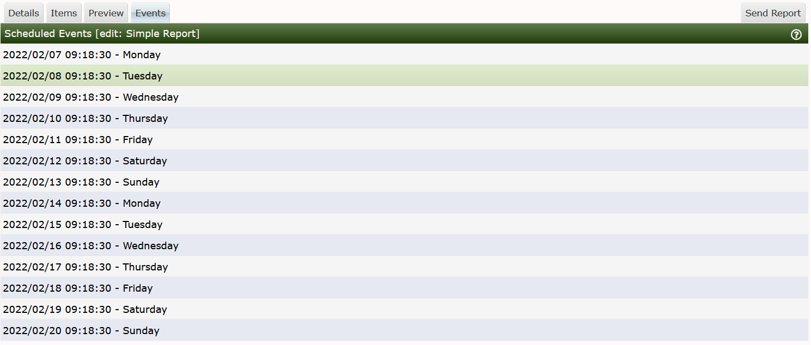

# Report Events

On this page, you can simply see on what dates and approximate times that the
**Reports** scheduler will send future report.  You can see from the image below
this the report will be sent every day at approximately 09:18:30.  The poller frequency
or Data Collector interval is 30 seconds on this system.

Currently Cacti does not record past events in a Database table or store the published
report in either PDF or other document format in a Database for historical reference.

---
Copyright (c) 2004-2024 The Cacti Group
