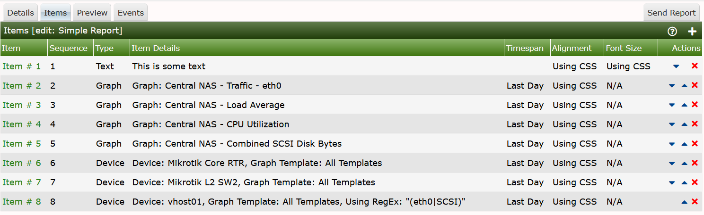
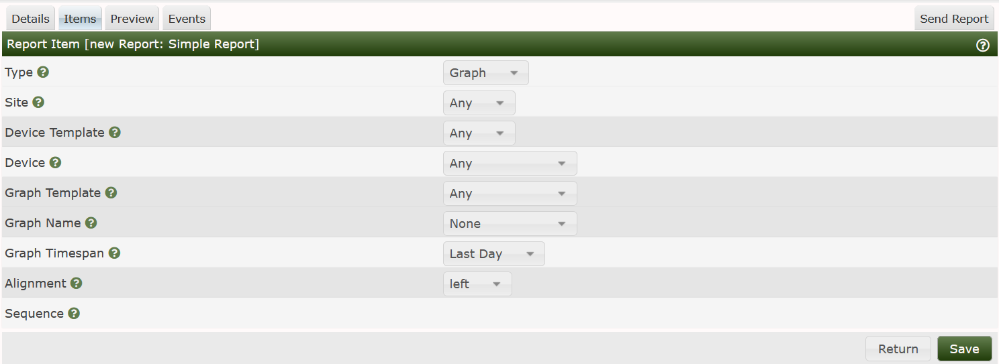
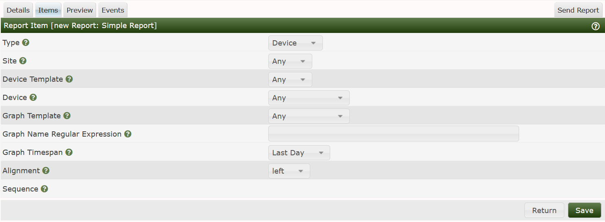
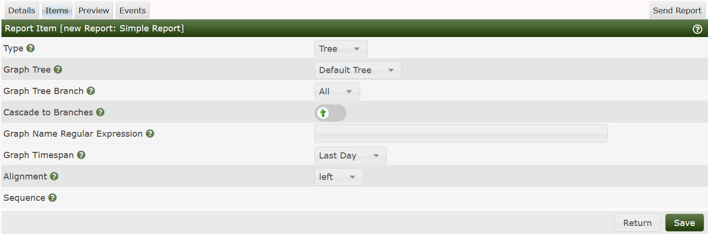

# Report Items

This section will describe the **Report Edit Items** Sub-Tab.

From this Sub-Tab, you can add, remove, and if **Drag and Drop** is enabled, easily
reorder any **Report Item**.  **Report Items** include:

- **Trees** - Including one or more Branches, which include Devices as a Branch Type.

- **Graphs** - One or more Graphs from a Device.

- **Devices** - One or more Cacti Devices with Graphs whose titles
  may include a Regular Expression.

- **Text** - For example to sub-section a Report and add a Title

- **Horizontal Rule** - For separating sections of a **Report**.

An example **Report Items** interface can be seen below.

From this image, you can see a combination of **Graphs**, **Devices**, and a **Device**
showing only **Graphs** that include *eth0*, and *SCSI* in their titles indicating
something about Interface Graphs and Disk Utilization Graphs.

## Item Edit Page

When you either add a new Item by pressing the Add button on the right,
Clicking on the Item # on the left, you will be presented a page
that is personalized depending on the *Item Type*.
When you add an item for the first time, you will see the image below.

Again, the user interface will change layout depending on the *Item Type*
that you select which happens to be the first drop-down on that page.

The columns for a **Graph** Type **Report Item** include:

- **Site** - A filter that will show only Devices and Graphs from a specific site.
- **Device Template** - A filter that will only show Devices and Graphs from a
  specific Device Template
- **Device** - A filter that will show only Graphs from a specific Device.
- **Graph Template** - A filter that will show only Graphs
   from a specific Graph Template.

The options above are only Filter to reduce the Graph list when you
actually select the **Graph Name**, it will apply those filters
to narrow in on the Graphs to display in the drop-down.
All of the filters above are *optional*.

The last sections are for the specific Graph in question including:

- **Graph Name** - The name of the Graph to include.
- **Graph Timespan** - The time range to show for the Graph.
- **Alignment** - Should the Graph be Center, Left or Right Aligned on the page.
- **Sequence**  - The Graph Items Sequence number.  This is a Read Only variable.

When, you change the **Report Item** to **Device** the layout of the page will
change and you will see the form shown below.

In this case, the **Site**, and **Device Template** both remain Filters, the **Device**
represents the **Device** to include on the **Report**.
After that, the options below define what Graphs from the Device are to be included.

- **Graph Template** - Either Any Graph Template, or a Specific Graph Template.
- **Graph Name Regular Expression** - A regular expression that limits the **Graphs**
  to only those matching the Regular Expression.
- **Graph Timespan** - The time range to show for the Graph.
- **Alignment** - Should the Graph be Center, Left or Right Aligned on the page.
- **Sequence**  - The Graph Items Sequence number.  This is a Read Only variable.

The last **Report Item** that we will document here is the **Tree** type.
The Text and Horizontal Rule types are pretty much self explanitory.
The image below is the layout that will be shown
when you change the **Report Item** to **Tree**.

In this case, there are no filter, just selections.  They include:

- **Graph Tree** - The name of the Cacti Tree to include in the report.

- **Graph Tree Branch** - The specific Branch to include

if you are only wanting to include aportion of the **Tree**

- **Cascade to Branches** - Walk all the **Graph Trees** branches

- **Graph Name Regular Expression** - A MySQL/MariaDB compatible Regular

Expression of Graph Names to include in the Report.

- **Graph Timespan** - The time range to show for the Graph.

- **Alignment** - Should the Graph be Center, Left or Right Aligned on the page.

- **Sequence**  - The Graph Items Sequence number.  This is a Read Only variable.

---
Copyright (c) 2004-2023 The Cacti Group
