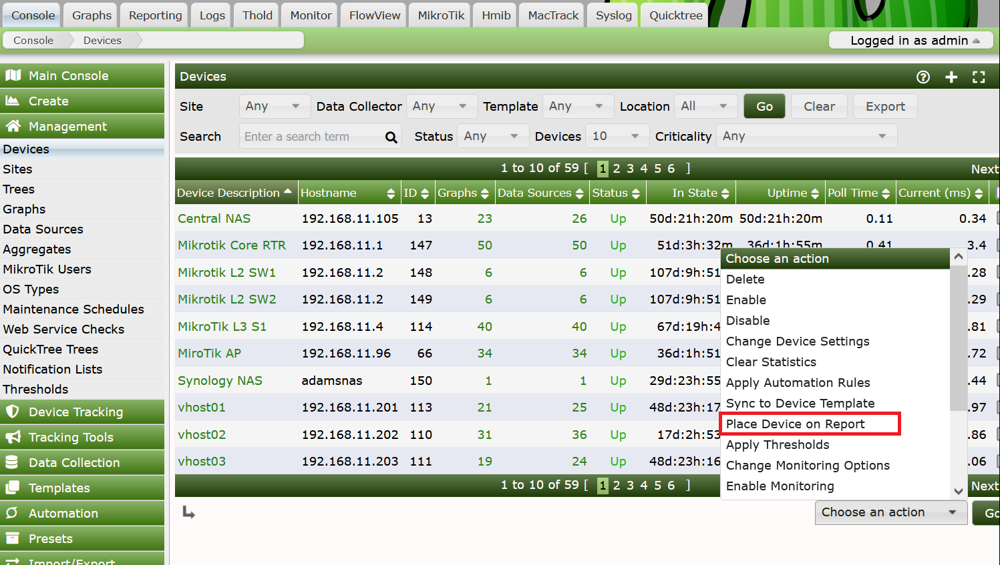
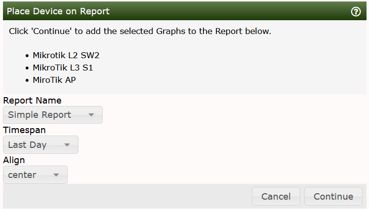

# Other Report Management Options

Not only can you add and remove **Report Items** from the **Reports** interface,
but you can also add **Graphs**, **Devices**, and **Trees** to a **Report** from
the Cacti Console under **Graphs**, **Devices** and **Trees** pages.

For each Management section, you will find a drop-down that looks similar to the
Drop down below.  Note that from this interface, you will not be able to add any
object type more than once.  If you need to add a **Device** more than once to
more precisely choose filtering attributes, you will have to perform that from
the Reports interface itself.

We have future plans to add an icon to the right of the Graph on the Graph Tree and
Preview pages.

Regardless of the page type, when you select this option, upon clicking the *Go* button you will be presented with the following page.

From there, select your destination Report, Timespan, and Alignment.

---
Copyright (c) 2004-2024 The Cacti Group
