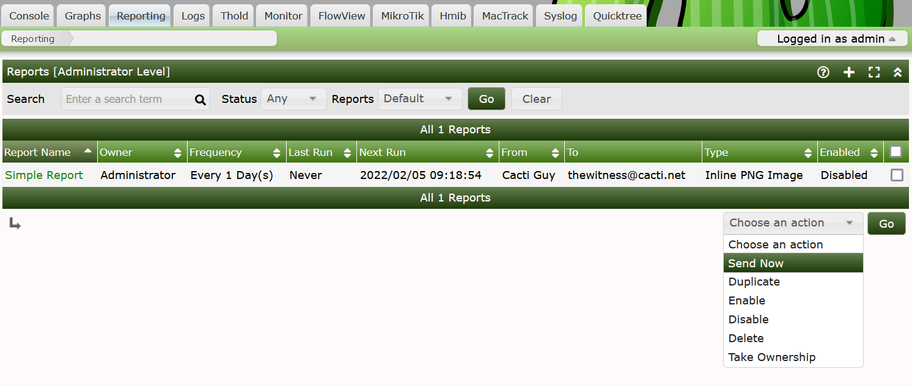
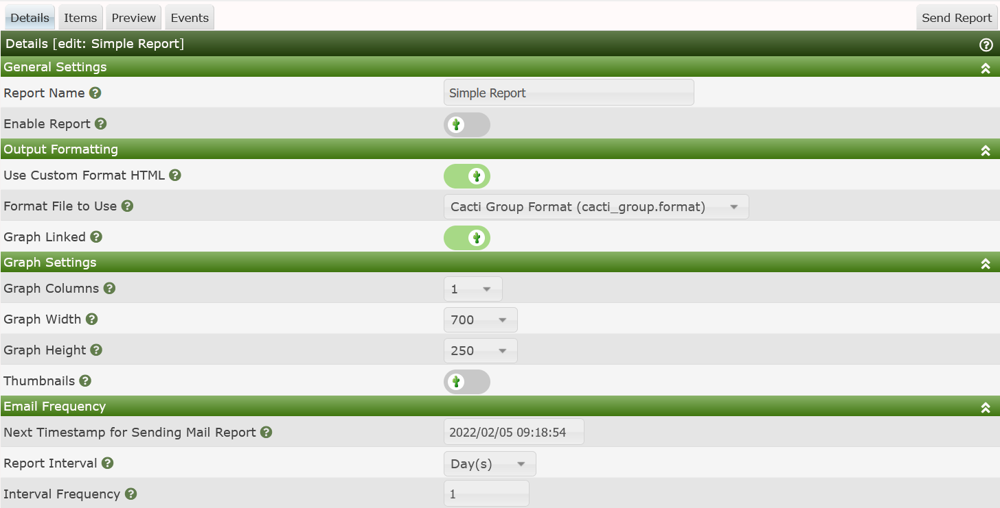
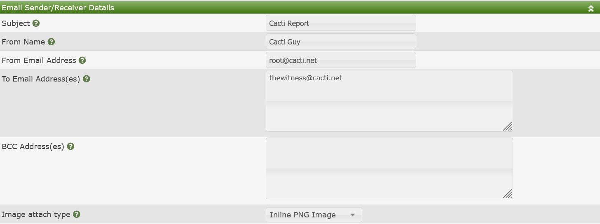

# Reports User

This section will describe the user view to Cacti's **Reports** feature.

The **Reports User** interface allows you to see and manage your own reports.
This is unlike the **Reports Administration** interface that allows you to
manage others reports in addition to your own.

## The Web Interface

The user of any **Report** begins on the main Reports tab in Cacti. A screen
shot of the Reports tab is shown below.

When viewing any **Reports** from this interface, you will see the following
columns:

- **Report Name** - The name of the Report.
- **Owner** - The Cacti account that has ownership of the Report.
- **Frequency** - How often the Report is to be sent to the distribution.
- **Last Run** - The last time that the Report was sent to the distribution.
- **Next Run** - The approximate next time that the report is to be sent. this
  is not an exact number. It does depend on the poller first running. So,
  depending on how long your poller runs for, this time could be off by a few
  minutes.
- **From** - The From Name portion of the From Email address
- **To** - The list of Emails that the reports is to be sent to.
- **Type** - The Image format and the type of embedding done in the Email.
- **Enabled** - Is the Report able to be sent on the Schedule.

The actions that you can take on an existing Report as an Administrator include:

- **Send Now** - Force send one or more **Reports** now
- **Duplicate** - Duplicate one or more **Reports**
- **Enable** - Enable one or more **Reports**
- **Disable** - Disable one or more **Reports**
- **Delete** - Delete one or more **Reports**

## Report Editing

When you click the Add button on the right side of the **Reports** page, or
Click on the Report Name of an existing Report, you will be presented with the
interface below.

This section includes:

- **Report Name** - The Name of the **Report**
- **Enable Report** - Is the **Report** Enabled
- **Use Custom Format HTML** - This is an indication that you wish to use a
  custom html/css document that you can use to customize the layout of your
  reports and add corporate branding for example.
- **Format File to Use** - The specific html/css file to use.
- **Graphs Linked** - Provide the recipient of the report a ling back to the
  actual graph in Cacti.
- **Graph Columns** - The number of Graph columns to use per row.
- **Graph Width** - The width of each Graph
- **Graph Height** - The height of each Graph
- **Thumbnails** - Should the Graphs be rendered in Thumbnail mode
- **Next Timestamp of Sending Mail Report** - The approximate next time to send
  out the **Report**.
- **Report Interval** - The frequency to send the report. Options are every X
  Minute, Hours, Days, Weeks, Months on a Day of the Month, Months on the Day of
  the Week, and Years.
- **Interval Frequency** - How often to send, for example if you select Days,
  and the Interval is one, it means every day, if you select 2, it means every
  other day.

The **Email Frequency** section does not use the same layout as does our
**Automation Networks**. Correcting that is a future project for the team.

The last section of the **Report Details** is the **Email Sender/Receiver**
section as shown below.

From here you can set the following columns.

- **Subject** - The Email subject.
- **From Name** - The From Name on the Email. For example **Cacti
  Administrator**
- **From Email Address** - The From Email address. For example
  `noreply@mydomain.com`
- **To Email Address(es)** - A comma delimited list of Email addresses that
  should receive the Report.
- **BCC Address(es)** - An anonymized list of Email recipients
- **Image attach type** - This defines how the Cacti Graph images get attached
  to the Email. Maybe are for legacy purposes. Most users will use Inline PNG or
  Inline JPG.

Once you save a new **Report** additional Tabs will show up. Those tabs are:

- **Items** - The Graph's, Tree's, Text, Horizontal Rules, and Device's to place
  on the Report.
- **Preview** - See a Preview of your Report
- **Events** - Approximate Future Event Days for your Report to be sent. This
  helps interpret the idiosyncrasies of the scheduler design.

---

Copyright (c) 2004-2023 The Cacti Group
