# SNMP Data Queries

## Walkthrough: A New SNMP Data Query

For SNMP Queries, you won't need to create a data retrieval script. Cacti will
use SNMP to retrieve information. But cacti will need additional information on
how the indexed data is structured. Think about a table (a MIB table in this
case); you'll have to tell cacti about the table structure. This is done by
defining an XML file. Basically, you have to define the index to tell cacti
about the number of rows and about their unique index. This index is later used
to access each rows data. Furthermore, you may define columns, that serve as
**descriptive fields** to be shown in the selection table. The XML file knows
them as

```xml
<direction>input</direction>
```

You will have to define those fields, that will be queried for the readings,
e.g. ifInOctets, ifOutOctets, ifInErrors, …The XML file knows them as

```xml
<direction>output</direction>
```

Lets have an example: standard Interface MIB with the corresponding part of the
`<path_cacti>/resources/snmp_queries/interfaces.xml` file are displayed using
the following table:

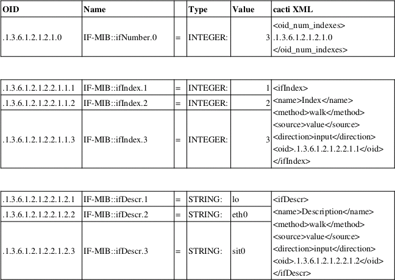

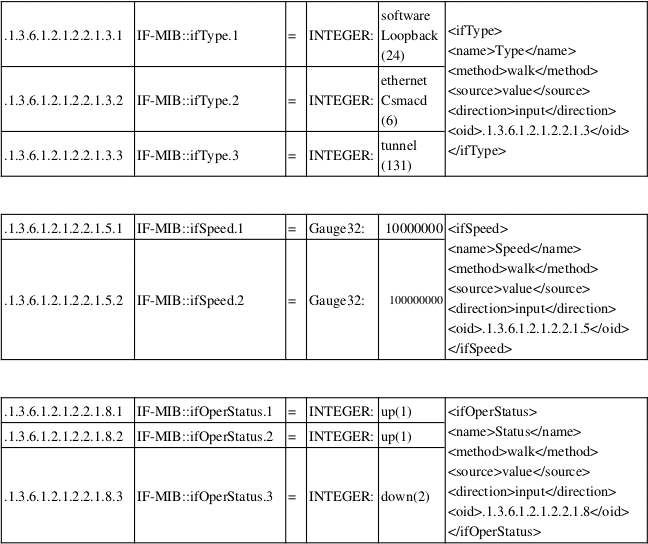

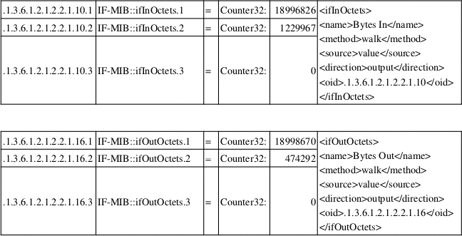

and see the corresponding table structure when defining **New Graphs** for that
**Device** (my laptop):

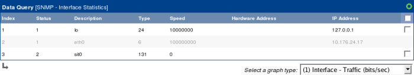

Now you can map

- Index: IF-MIB::ifIndex

- Status: IF-MIB::ifOperStatus

- Description: IF-MIB::ifDescr

- Type: IF-MIB::ifType

- Speed: IF-MIB::ifSpeed

All those are `<direction>input</direction>` Parameters. They serve as
descriptive information to each row to help you identify the proper interface to
use. Those parameters of `<direction>output</direction>` can be compared to
output parameters of a script (see ping.pl script above). These are the readings
from the device. By selecting the appropriate row (the one grayed out had been
selected by me), you tell cacti to retrieve data from the interface defined by
this index. But how does cacti know, what output parameters it shall retrieve?
See the Select a Graph type dropdown. It specifies a **Graph Template** defined
for this Data Query. The Graph Template in turn references a **Data Template**
which incorporates the needed output parameters as Data Sources. This works
quite the same way as defined for a Data Input Method.

To sum up: the SNMP XML file is somehow a **replacement** for the **Data Input
Method** described above to be used on indexed values. It tells cacti, what data
it should retrieve (direction: output). To help you identifying the relevant
indexes, the XML defines descriptive parameters (direction: input) to be
displayed in the selection table.

A walkthrough for this is given now. It is based on the already supplied
interfaces.xml XML file.

## Create a Data Query to tell cacti how to retrieve data

Go to **Data Queries** and click the plus (+) glyph to see:

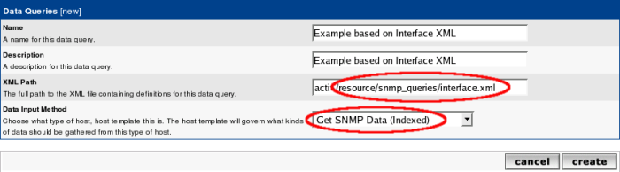

Here, we are using the already existing interface.xml file. Select **Get SNMP
Data (Indexed)** as **Data Input Method**. Press **Create** to see:

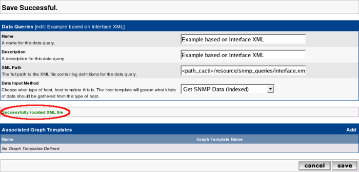

See, that cacti found the XML file. Don't bother with the Associated Graph
Templates at the moment. The success message does not include checking of the
XML file's content. Not lets proceed to the next definitions.

## Create a Data Template to tell Cacti how to store data

This is the exact copy of the definitions made above. So I do not repeat
everything here. **Data Input Method** must be selected as **Get SNMP Data
(Indexed)**. As this data source is a COUNTER type, select this as the *Data
Source Type*. But after saving the new Data Source definition, you may want to
define a second Data Source to the same **Data Template**. To do so, select New
from the *Data Source Item* heading to see:

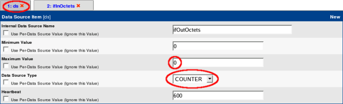

The name of the internal RRDtool Data Source (ifOutOctets) is not replaced in
the Tab until you save your work. By default, *Maximum Value* is set to 100.
This is way too low for an interface. All readings above this value will be
stored as NaN by RRDtool. To avoid this, set to 0 (no clipping) or to a
reasonable value (e.g. interface speed). Don't forget to specify COUNTER! You
will have noticed, that the name of the data source does not match the Name in
the interface.xml. Don't worry, the solution to this is given later on. Before
leaving, pay attention to the bottom of the page:

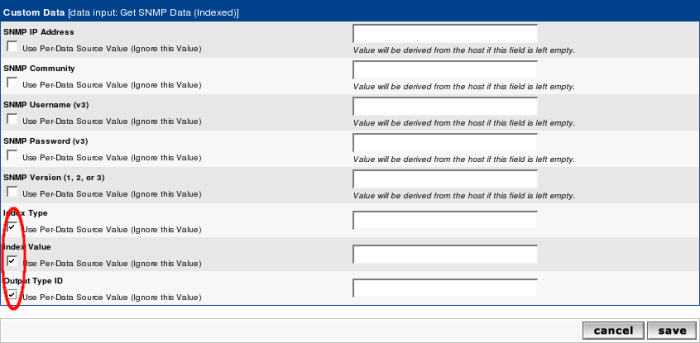

This is specific to indexed **Data Queries**. You will have to check the last
three items to make indexing work. All other items should be left alone, there
values will be taken from the appropriate device definitions. Now click **Save**
and you're done with this step.

> Note that if you wish to hand Edit mappings of various indexed interfaces
> manually for each **Graph** in the future, you should check the following
> three fields *Index Type*, *Index Value* and *Output Type ID* as shown below.
> Do this for each **Data Template** *Data Source Items* in the **Data
> Template**.

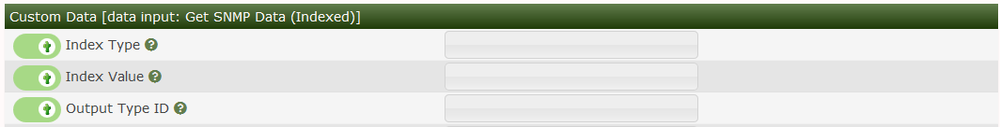

## Create a Graph Template to tell cacti how to present the data

Since creating a new **Data Query** based upon an existing Data Query called
*SNMP - Interface Statistics* we don't need to create any **Graph Templates**,
we can use the ones created for the other **Data Query**.

### Add Graph Template to the Data Query

Now it's time to re-visit our **Data Query**. Remember the **Associated Graph
Template** we've left alone in the very first step? Now it will get a meaning.
Go to **Data Queries** and select our new one. Then press the plus (+) glyph,
and select *Interface - Traffic (bits/second)* from the drop down as shown
below.  Press **Create** to initialize the association of this **Graph
Template** with out new **Data Query**.


Once we press the **Create** button, we should get an image like the one below.
From here, it's important that we associate the *Data Sources* to the XML file
columns that retrieve the data using SNMP.  Press the **Save** button to
complete the mapping of *Data Sources* to the XML file *Data Source Output
Values*.

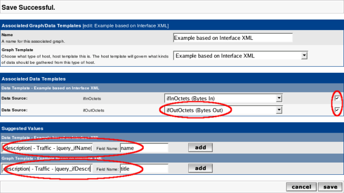

In addition, we need to setup any *Suggested Values* as you can see from the
example below.  *Suggested Values* are optional when the **Data Query** can have
a multitude of suggested names based upon the output from the **Data Query**.
For both the *Suggested Values - Graphs* and *Suggested Values - Data Sources*,
we must include the name of the column, and the *Suggested Value* which can
includes the special tag *|query_xmlcolumn|* as shown in the examples below.


Once the **Associated Graph Template** mappings have been completed, you should
see the image below, where we have:

- Mapped the internal **Data Template** *Data Sources* to the XML file *Input
  Data Sources*

- Added any *Suggested Values* for the *Graph Title* or other **Graph** fields

- Added any *Suggested Values* for the *Data Source* name or other **Data
  Source** fields

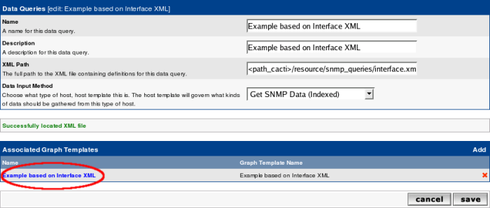

Once you have confirmed all the values, you can press **Return** to return to
the **Data Query** page for our Example **Data Query** as shown below.

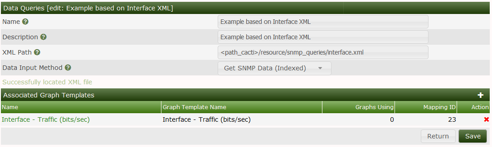

## Apply the Data Query to your Device

Now go to your **Device** to add the **Associated Data Query**:

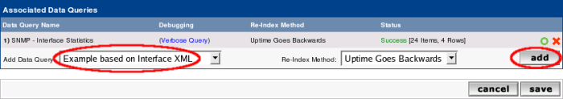

Click **Add** and then **Create Graphs for this Host** to see:

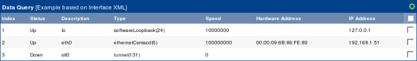

Now select the wanted *Interfaces* and press **Create** to generate the Traffic
Graph. As long as there's only one **Associated Graph Template** for that **Data
Query**, there will be no *Associated Graph Type* drop down.  Once you create
more than one **Associated Graph Template** for the **Data Query**, you will see
a drop down just above the **Create** button showing the available **Graph
Templates** for the **Data Query** in question, like the *SNMP - Interface
Statistics* as show below.

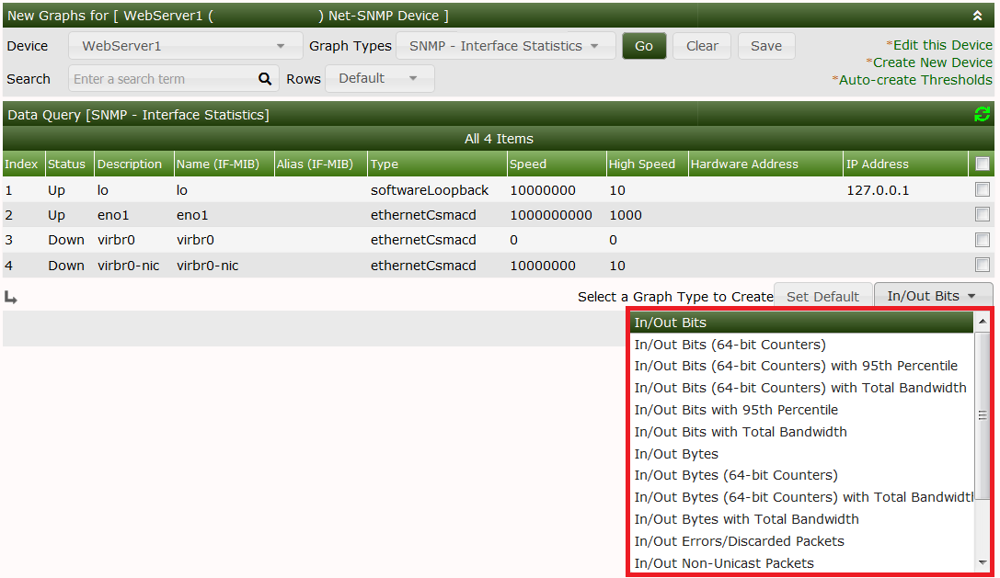

Pressing the *Set Default* button will set the selected *Graph Type* to be the
default for this **Data Query**.

---
Copyright (c) 2004-2021 The Cacti Group
