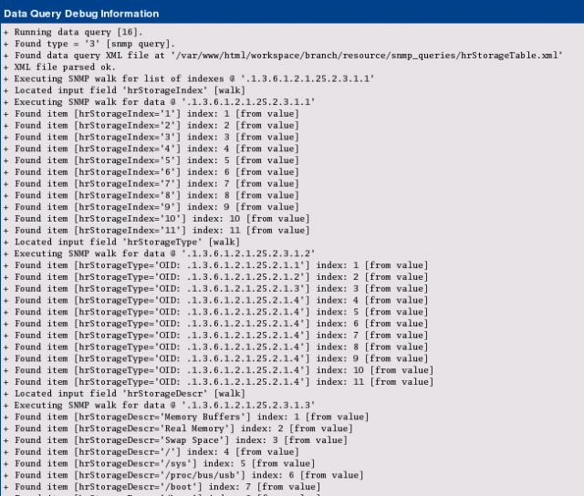
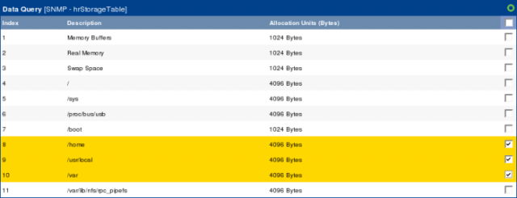

# SNMP Data Query Walkthrough

This walkthrough will show you how to implement a new SNMP Data Query.
Assuming, you know the SNMP table, the next steps show how to proceed.

## Building Raw XML File

The starting point will be snmptable for a well know table of the HOSTS MIB:

```console
snmptable -c <community> -v 1 <host> HOST-RESOURCES-MIB::hrStorageTable
SNMP table: HOST-RESOURCES-MIB::hrStorageTable

 hrStorageIndex                                hrStorageType hrStorageDescr hrStorageAllocationUnits hrStorageSize hrStorageUsed hrStorageAllocationFailures
              1         HOST-RESOURCES-TYPES::hrStorageOther Memory Buffers               1024 Bytes       1035356         59532                           ?
              2           HOST-RESOURCES-TYPES::hrStorageRam    Real Memory               1024 Bytes       1035356        767448                           ?
              3 HOST-RESOURCES-TYPES::hrStorageVirtualMemory     Swap Space               1024 Bytes       1048568   0                           ?
              4     HOST-RESOURCES-TYPES::hrStorageFixedDisk              /               4096 Bytes       2209331        826154                           ?
              5     HOST-RESOURCES-TYPES::hrStorageFixedDisk           /sys               4096 Bytes             0   0                           ?
              6     HOST-RESOURCES-TYPES::hrStorageFixedDisk  /proc/bus/usb               4096 Bytes             0   0                           ?
              7     HOST-RESOURCES-TYPES::hrStorageFixedDisk          /boot               1024 Bytes        102454          9029                           ?
              8     HOST-RESOURCES-TYPES::hrStorageFixedDisk          /home               4096 Bytes        507988        446407                           ?
              9     HOST-RESOURCES-TYPES::hrStorageFixedDisk     /usr/local               4096 Bytes        507988         17133                           ?
             10     HOST-RESOURCES-TYPES::hrStorageFixedDisk           /var               4096 Bytes        507988        129429                           ?
             11     HOST-RESOURCES-TYPES::hrStorageFixedDisk /var/lib/nfs/rpc_pipefs               4096 Bytes             0            0                           ?**
```

This given, the first step will be the definition of an XML file based on those
OIDs. So change to your `<path_cacti>/resources/snmp_queries` directory and
create a file named **hrStorageTable.xml**. You may of course choose your own
name, but for me it seems appropriate to take the name of the SNMP Table
itself. Before doing so, it is necessary to identify the Index of that table.
Without looking at the MIB file, simply perform

```console
snmpwalk -c <community> -v 1 -On <host> HOST-RESOURCES-MIB::hrStorageTable|more
.1.3.6.1.2.1.25.2.3.1.1.1 = INTEGER: 1
.1.3.6.1.2.1.25.2.3.1.1.2 = INTEGER: 2
.1.3.6.1.2.1.25.2.3.1.1.3 = INTEGER: 3
.1.3.6.1.2.1.25.2.3.1.1.4 = INTEGER: 4
.1.3.6.1.2.1.25.2.3.1.1.5 = INTEGER: 5
.1.3.6.1.2.1.25.2.3.1.1.6 = INTEGER: 6
.1.3.6.1.2.1.25.2.3.1.1.7 = INTEGER: 7
.1.3.6.1.2.1.25.2.3.1.1.8 = INTEGER: 8
.1.3.6.1.2.1.25.2.3.1.1.9 = INTEGER: 9
.1.3.6.1.2.1.25.2.3.1.1.10 = INTEGER: 10
.1.3.6.1.2.1.25.2.3.1.1.11 = INTEGER: 11
.1.3.6.1.2.1.25.2.3.1.2.1 = OID: .1.3.6.1.2.1.25.2.1.1
.1.3.6.1.2.1.25.2.3.1.2.2 = OID: .1.3.6.1.2.1.25.2.1.2
```

The first index is `.1.3.6.1.2.1.25.2.3.1.1.1`, but the Index Base is
`.1.3.6.1.2.1.25.2.3.1.1.` This OID is needed for the XML file:

```xml
<interface>
        <name>Get hrStoragedTable Information</name>
        <description>Get SNMP based Partition Information out of hrStorageTable</description>
        <index_order>hrStorageDescr:hrStorageIndex</index_order>
        <index_order_type>numeric</index_order_type>
        <oid_index>.1.3.6.1.2.1.25.2.3.1.1</oid_index>

        <fields>
                <hrStorageIndex>
                        <name>Index</name>
                        <method>walk</method>
                        <source>value</source>
                        <direction>input</direction>
                        <oid>.1.3.6.1.2.1.25.2.3.1.1</oid>
                </hrStorageIndex>
        </fields>
</interface>
```

Lets talk about the header elements

Field | Description
--- | ---
Name | Short Name; choose your own one if you want
Description | Long Name
index_order | tells us, which field shall be selected to index on; evaluated from left to right
index_order_type | numeric instead of alphabetic sorting
oid_index | the index of the table

There are more header elements, but for sake of simplification, we'll stick to
that for now.

Lets turn to the fields. They correspond to the columns of the snmptable. For
debugging purpose it is recommended to start with the Index field first. This
will keep the XML as tiny as possible. The `<fields>` section contains one or
more fields, each beginning with `<field_description>` and ending with
`</field_description>`. It is recommended but not necessary to take the textual
representation of the OID or an abbreviation of that.

Field | Description
--- | ---
Name | Short Name
Method | Walk or get (representing snmpwalk or snmpget to fetch the values)
Source | Value = take the value of that OID as the requested value. Sounds ugly, but there are more options that we won't need for the purpose of this example
Direction | Input (for values that may be printed as COMMENTs or the like). Output (for values that shall be graphed, e.g. COUNTERs or GAUGEs).
OID | the real OID as numeric representation

Now save this file and lets turn to cacti to implement this one. First, go to
**Data Queries** to see


and **Add** a new one:


Fill in Short and Long Names at your wish. Enter the file name of the XML file
and don't forget to choose **Get SNMP Data (indexed)**. **Create** to see


It has now **Successfully located XML file**. But this does not mean that there
are no errors. So lets go on with that. Turn to the **Device** you want to
query and add the new **Data Query** as shown:


**Index Count Changed** was chosen on purpose to tell cacti to re-index not
only on reboot but each time the Index Count (e.g. number of partitions)
changed. When done, see the results as


You'll notice, that on my laptop there are 11 indices = 11 partitions. So the
XML worked up to now! To make this clear, select **Verbose Query** to see:


## Insert all descriptive table columns

Now lets put all descriptive table columns into the SNMP Query XML file. This
refers to

- hrStorageType

- hrStorageDescr

- hrStorageAllocationUnits

I like to take the XML field names from the snmptable output, but this is not a
must.

```xml
<interface>
        <name>Get hrStoragedTable Information</name>
        <description>Get SNMP based Partition Information out of hrStorageTable</description>
        <index_order>hrStorageDescr:hrStorageIndex</index_order>
        <index_order_type>numeric</index_order_type>
        <oid_index>.1.3.6.1.2.1.25.2.3.1.1</oid_index>

        <fields>
                <hrStorageIndex>
                        <name>Index</name>
                        <method>walk</method>
                        <source>value</source>
                        <direction>input</direction>
                        <oid>.1.3.6.1.2.1.25.2.3.1.1</oid>
                </hrStorageIndex>
                <hrStorageType>
                        <name>Type</name>
                        <method>walk</method>
                        <source>value</source>
                        <direction>input</direction>
                        <oid>.1.3.6.1.2.1.25.2.3.1.2</oid>

                </hrStorageType>
                <hrStorageDescr>
                        <name>Description</name>
                        <method>walk</method>
                        <source>value</source>
                        <direction>input</direction>
                        <oid>.1.3.6.1.2.1.25.2.3.1.3</oid>
                </hrStorageDescr>
                <hrStorageAllocationUnits>
                        <name>Allocation Units (Bytes)</name>
                        <method>walk</method>
                        <source>value</source>
                        <direction>input</direction>
                        <oid>.1.3.6.1.2.1.25.2.3.1.4</oid>
                </hrStorageAllocationUnits>
        </fields>
</interface>
```

The `<name></name>` information will later show up as a column heading. Don't
forget to provide the correct base OIDs. Remember, that the **Index** will
always be appended to those OIDs, e.g. the first Description will be fetched
from OID = `.1.3.6.1.2.1.25.2.3.1.3.1` (that is base OID =
`.1.3.6.1.2.1.25.2.3.1.3` together with the appended index `.1` will form the
complete OID `.1.3.6.1.2.1.25.2.3.1.3.1.`

Please notice, that all fields that will yield descriptive columns only take
`<direction>input</direction>`

If you have completed your work, turn to the cacti web interface and select
your host from the **Devices** list to see:


Select the little green circle next to our SNMP XML to update your last
changes. Then you'll see something like:


When using **Verbose Query**, you'll now find



And clicking **Create Graphs for this host** will result in


You're not supposed to really create graphs at this moment, cause the XML is
not yet complete. And you'll notice, that the second column does not present
very useful information. So it may be omitted in later steps.

## Getting the Output Values

Now lets modify the XML again. As said earlier, the second column is not very
meaningful, so lets drop it. To get the output values, I appended the last two
XML field descriptions, see:

```xml
<interface>
        <name>Get hrStoragedTable Information</name>
        <description>Get SNMP based Partition Information out of hrStorageTable</description>
        <index_order>hrStorageDescr:hrStorageIndex</index_order>
        <index_order_type>numeric</index_order_type>
        <oid_index>.1.3.6.1.2.1.25.2.3.1.1</oid_index>

        <fields>
                <hrStorageIndex>
                        <name>Index</name>
                        <method>walk</method>
                        <source>value</source>
                        <direction>input</direction>
                        <oid>.1.3.6.1.2.1.25.2.3.1.1</oid>
                </hrStorageIndex>
                <hrStorageDescr>
                        <name>Description</name>
                        <method>walk</method>
                        <source>value</source>
                        <direction>input</direction>
                        <oid>.1.3.6.1.2.1.25.2.3.1.3</oid>
                </hrStorageDescr>
                <hrStorageAllocationUnits>
                        <name>Allocation Units (Bytes)</name>
                        <method>walk</method>
                        <source>value</source>
                        <direction>input</direction>
                        <oid>.1.3.6.1.2.1.25.2.3.1.4</oid>
                </hrStorageAllocationUnits>
                <hrStorageSize>
                        <name>Total Size (Units)</name>
                        <method>walk</method>
                        <source>value</source>
                        <direction>output</direction>
                        <oid>.1.3.6.1.2.1.25.2.3.1.5</oid>
                </hrStorageSize>
                <hrStorageUsed>
                        <name>Used Space (Units)</name>
                        <method>walk</method>
                        <source>value</source>
                        <direction>output</direction>
                        <oid>.1.3.6.1.2.1.25.2.3.1.6</oid>
                </hrStorageUsed>
        </fields>
</interface>
```

This works very much the same way as above.

- Provide the fields hrStorageSize and hrStorageUsed

- Provide a useful name

- Don't forget to specify `<direction>output</direction>`

- Give the corresponding base OIDs

Now we may proceed as said above: Pressing the green circle runs that XML
definitions against the host and updates the rows/columns. You will notice the
“missing” second column only when Create Graphs for this Host is selected.

---
Note: Don't forget to set `<direction>output</direction>` for all
variables/fields, that should be stored in RRDfiles and be graphed!. This is
the mistake that occurs most often.

### Defining the Data Template

The Data Template will define, how the data is retrieved by the XML Query is
saved. For more information about the principles of operation, please see
Common Tasks. Please go to **Data Templates** and **Add**:


Define the **Name** of the Data Template. When defining the Name of the **Data
Source**, do not forget to check the **Use Per-Data Source Value (Ignore this
Value)** checkbox. This will come in useful later. Data Input Method will read
**Get SNMP Data (Indexed)**. Select **Associated RRAs** as usual (don't bother
with my settings):


Now to the **Data Source Items**. I like giving them the names of the MIB OIDs,
see:


and **Create**. Now enter the second **Data Source Item**:


Please pay attention to setting the **Maximum Value** to 0 (zero). Else, all
values exceeding the pre-defined value of 100 would be stored as **NaN**. Now
scroll down to the bottom of the page and check **Index Type, Index Value and
Output Type Id**


**Save** and the Data Template is done.

### Defining the Graph Template

The Graph Template will define, how the data is presented. For more information
about the principles of operation, please see [Common Tasks](Common-Tasks.md).
Please go to Graph Templates and Add:


Fill in the header names and don't forget to check the **Use Per-Graph Value
(Ignore this Value)** for the **Graph Template Title**:


and **Create**.


Now **Add** the first Graph Item as usual:


Add the Legend and the second Graph Item:


Again, add the Legend to end up with


### Revisiting The Data Query

We'll now have to revisit the **Data Query**


**Create**:


Select the correct **Data Sources** and check the boxes on the right. **Save**.
Now fill in some useful **Suggested Values**, at first for the **Data
Template**:


Now apply suggested values for the **Graph Template**:


Now the **Data Query** is complete:


## Create Graphs for this Host

Now we're almost done. Everything's ready for use now. So go to your device and
select **Create Graphs for this Host**. Select some of the partitions you're
interested in:



and **Create** to see:


Lets visit the **Data Sources**:


As you can see, the **Suggested Values** of the Data Query defined the Name of
the Data Template. So lets go to **Graph Management**:


to see the title defined by the **Suggested Values**. When turning to the
**Graphs**, you may see something like


This might be the end of the show. While it should be enough to define some
“easy” SNMP XML based Data Queries, there are some tricks and hints left to
explain.

As you may have noticed, the quantities defined by this example are counted in
Units, not Bytes. This is somewhat inconvenient but may be changed. Lets wait
for the next Section...

### VALUE/REGEXP in Action

As said above, with the current XML size values are measured in **Units**. The
current Unit Size is given by **hrStorageAllocationUnits**, but the reading of
it is like **4096 Bytes**. To use this in any calculations, we must get rid of
the string **Bytes**. This can be done by the **VALUE/REGEXP** Feature of
Cacti's XML definitions. So please change

```xml
<hrStorageAllocationUnits>
   <name>Allocation Units (Bytes)</name>
   <method>walk</method>
   <source>value</source>
   <direction>input</direction>
   <oid>.1.3.6.1.2.1.25.2.3.1.4</oid>
</hrStorageAllocationUnits>
```

By

```xml
<hrStorageAllocationUnits>
   <name>Allocation Units (Bytes)</name>
   <method>walk</method>
   <source>VALUE/REGEXP:([0-9]*) Bytes</source>
   <direction>input</direction>
   <oid>.1.3.6.1.2.1.25.2.3.1.4</oid>
</hrStorageAllocationUnits>
```

To prove this, go to your device and again **Verbose Query** our Data Query to see:


Now select **Create Graphs for this Host** and notice the change of the column
**Allocation Units (Bytes)**. The string “Bytes” has gone:


To use these values, we define a CDEF:


Notice, that with recent releases of cacti, it is possible to use `|query_*|`
values within CDEFs. Finally, go to **Graph Templates** and use this CDEF with
all **Graph Items**:


Change the **Base Value** to 1024 for Bytes → kBytes and the y-axis description
to **Bytes**:


Now the Graph looks like


Please find the resources attached. Due to upload limitations, I had to rename
them to *.txt. Please save them as pure *.xml files. Save hrStorageTable.xml
into ./resource/snmp/queries and import all templates from
cacti_graph_template_host_mib_hrstoragetable.xml.

[Cacti Graph Template Host MIB hrStorageTable](resource/xml/cacti_graph_template_host_mib_hrstoragetable.xml_.txt)

[hrStorageTable](resource/xml/hrStorageTable.xml.gz) Unzip and store into resource/snmp_queries.

---
Copyright (c) 2004-2021 The Cacti Group
