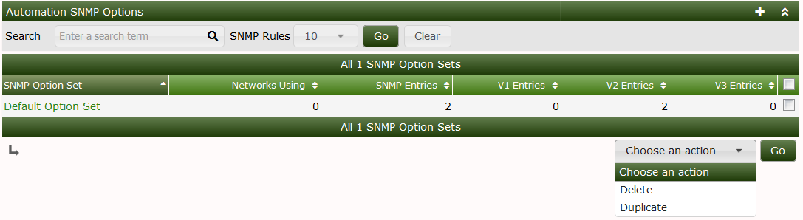
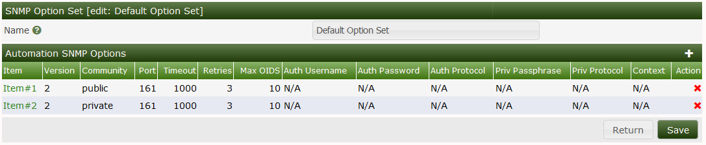
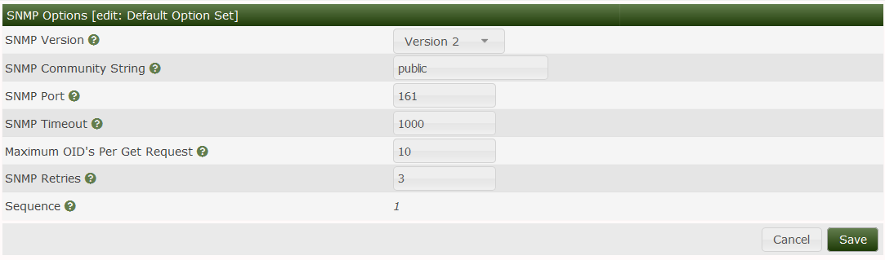
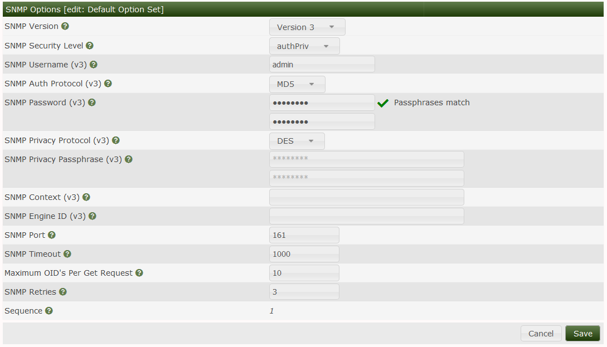

# Automation SNMP Options

This section will describe **SNMP Options** in Cacti.

The SNMP options page is used to enter your SNMP Strings and Credentials to be
used for the automation plugin in Cacti cacti support SNMP V1/V2/V3 below you
will enter your networks specific SNMP details for the devices you will be
polling

.

.

.

.

Important: When performing a network scan ensure that you select the SNMP
options that contain the SNMP strings you want to use

---
Copyright (c) 2004-2024 The Cacti Group
