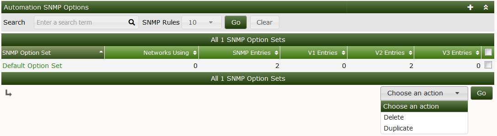
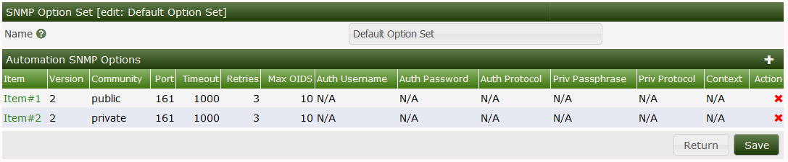
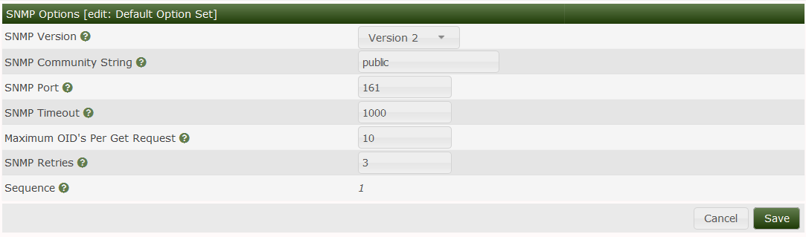
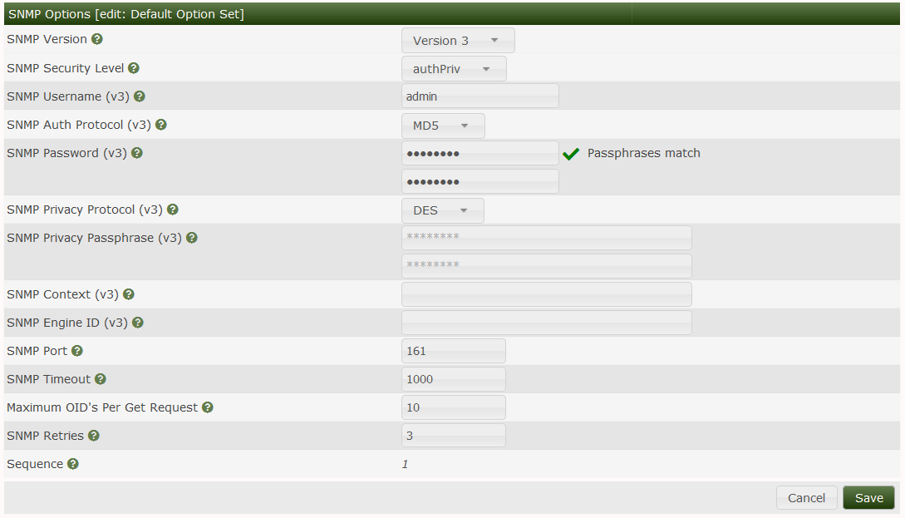

# Automation SNMP Options

This section will describe **SNMP Options** in Cacti.

The SNMP Options page stores the SNMP strings and credentials used by Cacti's
automation features. Cacti supports SNMP v1, v2, and v3. Enter the
network-specific SNMP details for the devices you will be polling below.

.

.

.

.

Important: When performing a network scan ensure that you select the SNMP
options that contain the SNMP strings you want to use

---
Copyright (c) 2004-2026 The Cacti Group
