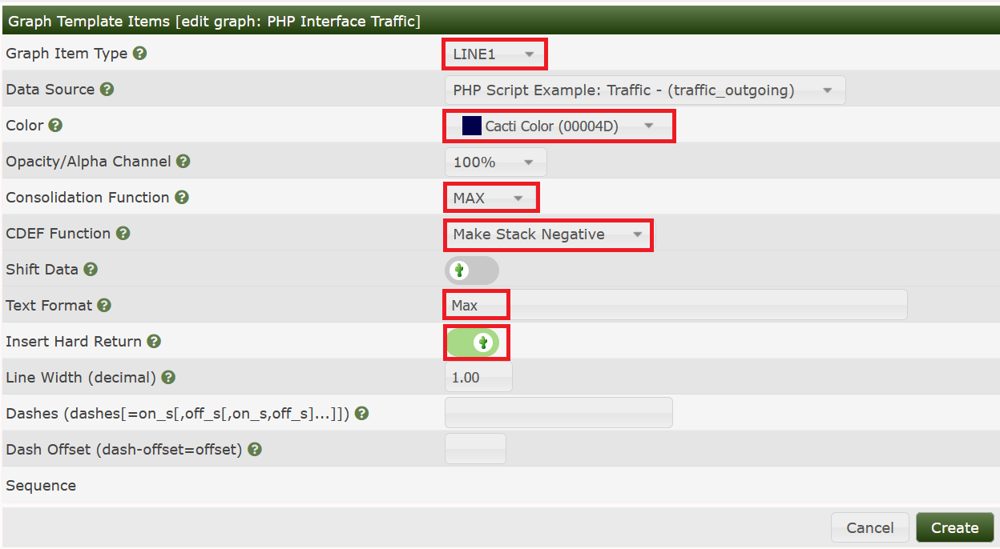
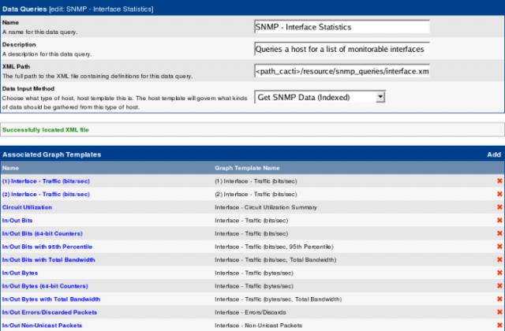

# Script Data Query Walkthrough

Goal of this HowTo will be to show the **principles of writing a Script
Query**, including script, xml and all needed templates. Why should you create
such a thing? Suppose, your target features some indexed readings, that are
**not** available via SNMP but by some other method (e.g. wget/cgi, ssh, NRPE,
…). Writing a Script Data Queries works very much the same way as SNMP Data
Queries. But nevertheless, I'll take you through all of the steps now.

The example uses PHP. Why PHP? First, it's easier to copy stuff from already
existing PHP scripts. Second, it would be possible to use cacti functions. It
should be possible to imagine, how this works with other programming languages.
Strictly speaking, I'm not that PHP expert. So be patient with me.

Please pay attention. This HowTo will not explain how to write a **Script
Server Data Query** (yes, there is such a thing!). It would not introduce that
many changes. But this will be left to some other HowTo.

Personally, my primary goal was to use an example, that all users should be
able to copy to execute each and every step on its own. Unfortunately, there
seems to be no example, that is common enough and interesting at the same time.
So I'm sorry to announce, that this HowTo will show “Interface Traffic Data
Gathering”. Yes, I know, this is not that new. And surely, it will not be as
fast as pure SNMP. So, to my shame, I suppose that this will never make it into
any production environment. But, again, this is not the primary goal.

Before starting the work, I feel encouraged to point out a drawback of this
approach. Cacti will start a PHP instance, each time it has to fetch a value
from the target device. This is not that fast, obviously. And it will not
prosper from the performance boost when switching over from cmd.php to Spine.
Of course, even Spine will need to start php! And that's exactly, where the
thingy called **Script Server Data Query** drops in. But let's leave this for
the next main chapter.

The code runs on Cacti 0.8.7 versions.

## Basic Script

The starting point will be some very basic php script. Put it into
`<path_cacti>/scripts/query_interface_traffic.php`. It will show interface
indices only for the given target host. The script takes two parameters as
input, the **hostname** of the target and the string **index**. You have to
implement the **index method**, as OO programmers would say. In this case,
there's an “if” clause to process index requests. Output is a list of indices,
each one on a separate line.

```php
<?php

/* do NOT run this script through a web browser */
if (!isset($_SERVER["argv"][0]) || isset($_SERVER['REQUEST_METHOD'])  || isset($_SERVER['REMOTE_ADDR'])) {
   die("<br><strong>This script is only meant to run at the command line.</strong>");
}

# deactivate http headers
$no_http_headers = true;
# include some cacti files for ease of use
include(dirname(__FILE__) . "/../include/global.php");
include(dirname(__FILE__) . "/../lib/snmp.php");

# define all OIDs we need for further processing
$oids = array(
        "index"         => ".1.3.6.1.2.1.2.2.1.1",
        );
$xml_delimiter          =  "!";

# all required input parms
$hostname       = $_SERVER["argv"][1];        # hostname/IP@
$cmd            = $_SERVER["argv"][2];        # one of: index/query/get

# put your own community string here
$snmp_community  = "public";            # community string
$snmp_version    = 1;                # snmp version
$snmp_port       = 161;              # snmp port
$snmp_timeout    = 500;              # snmp timeout
$snmp_retries    = 3;                # snmp retries
$max_oids        = 1;                # max oids for V2/V3 hosts
# required for SNMP V3
$snmp_auth_username       = "";
$snmp_auth_password       = "";
$snmp_auth_protocol       = "";
$snmp_priv_passphrase     = "";
$snmp_priv_protocol       = "";
$snmp_context             = "";

# -------------------------------------------------------------------------
# main code starts here
# -------------------------------------------------------------------------


# -------------------------------------------------------------------------
# script MUST respond to index queries
#       the command for this is defined within the XML file as
#       <arg_index>index</arg_index>
#       you may replace the string "index" both in the XML and here
# -------------------------------------------------------------------------
#       php -q <script> <parms> index
# will list all indices of the target values
# e.g. in case of interfaces
#      it has to respond with the list of interface indices
# -------------------------------------------------------------------------
if ($cmd == "index") {
        # retrieve all indices from target
        $return_arr = reindex(cacti_snmp_walk($hostname, $snmp_community,
        $oids["index"], $snmp_version, $snmp_auth_username,
        $snmp_auth_password, $snmp_auth_protocol, $snmp_priv_passphrase, $snmp_priv_protocol,
        $snmp_context, $snmp_port, $snmp_timeout, $snmp_retries, $max_oids, SNMP_POLLER));

        # and print each index as a separate line
        for ($i=0;($i<sizeof($return_arr));$i++) {
                print $return_arr[$i] . "\n";
        }

# -------------------------------------------------------------------------
# -------------------------------------------------------------------------
} else {
        print "Invalid use of script query, required parameters:\n\n";
        print "    <hostname> <cmd>\n";
}

function reindex($arr) {
        $return_arr = array();

        for ($i=0;($i<sizeof($arr));$i++) {
                $return_arr[$i] = $arr[$i]["value"];
        }

        return $return_arr;
}
```

It will be called like this

```shell
php -q query_interface_traffic.php <your target host> index
1
2
3
4
```

As you see, my `<target>` has 4 indices (interfaces).

### Discussion: function_reindex

You may wonder why this function drops in. Well, lets have a look at
`cacti_snmp_walk`. This function is part of cacti itself and eases the use of
SNMP. That's why I call it here. But unfortunately, it's output looks like

```php
Array
(
    [0] => Array
        (
            [oid] => 1.3.6.1.2.1.2.2.1.1.1
            [value] => 1
        )

    [1] => Array
        (
            [oid] => 1.3.6.1.2.1.2.2.1.1.2
            [value] => 2
        )

    [2] => Array
        (
            [oid] => 1.3.6.1.2.1.2.2.1.1.3
            [value] => 3
        )

    [3] => Array
        (
            [oid] => 1.3.6.1.2.1.2.2.1.1.4
            [value] => 4
        )

)
```

The values of interest are stored in `$return_arr[$i] = $arr[$i][“value”];`.
The **function_reindex** gets them all.

## XML File

This given, the first step will be the xml file defining how to access index
values only. So change to your `<path_cacti>/resources/script_queries`
directory and create a file named **ifTraffic.xml**. You may of course choose
your own name.

```xml
<interface>
        <name>Get Interface Traffic Information</name>
        <script_path>|path_php_binary| -q |path_cacti|/scripts/query_interface_traffic.php</script_path>
        <arg_prepend>|host_hostname|</arg_prepend>
        <arg_index>index</arg_index>

        <fields>
                <ifIndex>
                        <name>Index</name>
                        <direction>input</direction>
                        <query_name>index</query_name>
                </ifIndex>
        </fields>
</interface>
```

Lets talk about the header elements

Field | Description
--- | ---
name | Short Name; chose your own one if you want
script_path | Whole command to execute the script from cli. `|path_php_binary|` is a cacti builtin variable for `/the/full/path/to/php`. `|path_cacti|` in turn gives the path of the current cacti installation directory.
arg_prepend | All arguments passed to the script go here. There are some builtin variables, again. |host_hostname| represents the hostname of the device this query will be associated to.
arg_index | The string given here will be passed just after all `<arg_prepend>` to the script for indexing requests. Up to now, this is the only method our script will answer to.
fields | All fields will be defined in this section. Up to now, only the index field is defined
name | The name of this very field
query_name | Name of this field when performing a query or a get request (will be shown later, don't worry now).

direction | Description
--- | ---
input | defines all fields that serve as a descriptive information to a specific table index. These values will not be graphed but may be printed in e.g.graph titles by means of `|query_<name>|`
output | defines all fields that will yield a number that should be stored in some RRD file

Now save this file and lets turn to cacti to implement this one. First, go to
**Data Queries** to see


and **Add** a new one:


Fill in Short and Long Names at your wish. Enter the file name of the XML file
and don't forget to choose **Get Script Data (indexed)**. **Create** to see


It has now **Successfully located XML file**. But this does not mean that there
are no errors. So lets go on with that. Turn to the **Device** you want to
query and add the new **Data Query** as shown:


**Index Count Changed** was chosen on purpose to tell cacti to re-index not
only on reboot but each time the Index Count (e.g. number of interfaces)
changed. When done, see the results as


To see your script at work, select **Verbose Query** to see:


## Completing the Script

Now, lets improve our basic script. First, lets define all the variables
(OIDs), this script should ask for.

```php
<?php

/* do NOT run this script through a web browser */
if (!isset($_SERVER["argv"][0]) || isset($_SERVER['REQUEST_METHOD'])  || isset($_SERVER['REMOTE_ADDR'])) {
   die("<br><strong>This script is only meant to run at the command line.</strong>");
}

# deactivate http headers
$no_http_headers = true;
# include some cacti files for ease of use
include(dirname(__FILE__) . "/../include/global.php");
include(dirname(__FILE__) . "/../lib/snmp.php");

# define all OIDs we need for further processing
$oids = array(
        "index"         => ".1.3.6.1.2.1.2.2.1.1",
        "ifstatus"      => ".1.3.6.1.2.1.2.2.1.8",
        "ifdescription" => ".1.3.6.1.2.1.2.2.1.2",
        "ifname"        => ".1.3.6.1.2.1.31.1.1.1.1",
        "ifalias"       => ".1.3.6.1.2.1.31.1.1.1.18",
        "iftype"        => ".1.3.6.1.2.1.2.2.1.3",
        "ifspeed"       => ".1.3.6.1.2.1.2.2.1.5",
        "ifHWaddress"   => ".1.3.6.1.2.1.2.2.1.6",
        "ifInOctets"    => ".1.3.6.1.2.1.2.2.1.10",
        "ifOutOctets"   => ".1.3.6.1.2.1.2.2.1.16",
        );
$xml_delimiter          =  "!";
```

The next step removes all the builtin “magic strings” and replaces them by
parameters. We'll have to change the XML template for that (see: `<arg_prepend>`
later on). Cacti supports more SNMP parameters since version 0.8.7:

```php
# all required input parms
$hostname               = $_SERVER["argv"][1];
$snmp_community         = $_SERVER["argv"][2];
$snmp_version           = $_SERVER["argv"][3];
$snmp_port              = $_SERVER["argv"][4];
$snmp_timeout           = $_SERVER["argv"][5];
$max_oids               = $_SERVER["argv"][6];
# required for SNMP V3
$snmp_auth_username     = $_SERVER["argv"][7];
$snmp_auth_password     = $_SERVER["argv"][8];
$snmp_auth_protocol     = $_SERVER["argv"][9];
$snmp_priv_passphrase   = $_SERVER["argv"][10];
$snmp_priv_protocol     = $_SERVER["argv"][11];
$snmp_context           = $_SERVER["argv"][12];
$cmd                    = $_SERVER["argv"][13];
if (isset($_SERVER["argv"][14])) { $query_field = $_SERVER["argv"][14]; };
if (isset($_SERVER["argv"][15])) { $query_index = $_SERVER["argv"][15]; };

# get number of snmp retries from global settings
$snmp_retries   = read_config_option("snmp_retries");
```

The code responsible for the “index” option is left unchanged:

```php
# -------------------------------------------------------------------------
# script MUST respond to index queries
#       the command for this is defined within the XML file as
#       <arg_index>index</arg_index>
#       you may replace the string "index" both in the XML and here
# -------------------------------------------------------------------------
#       php -q <script> <parms> index
# will all indices of the target values
# e.g. in case of interfaces
#      it has to respond with the list of interface indices
# -------------------------------------------------------------------------
if ($cmd == "index") {
        # retrieve all indices from target
        $return_arr = reindex(cacti_snmp_walk($hostname, $snmp_community,
        $oids["index"], $snmp_version, $snmp_auth_username,
        $snmp_auth_password, $snmp_auth_protocol, $snmp_priv_passphrase, $snmp_priv_protocol,
        $snmp_context, $snmp_port, $snmp_timeout, $snmp_retries, $max_oids, SNMP_POLLER));

        # and print each index as a separate line
        for ($i=0;($i<sizeof($return_arr));$i++) {
                print $return_arr[$i] . "\n";
        }
```

The new code implements the **query** function as follows

```php
#
# -------------------------------------------------------------------------
# script MUST respond to query requests
#       the command for this is defined within the XML file as
#       <arg_query>query</arg_query>
#       you may replace the string "query" both in the XML and here
# -------------------------------------------------------------------------
#       php -q <script> <parms> query <function>
# where <function> is a parameter that tells this script,
# which target value should be retrieved
# e.g. in case of interfaces, <function> = ifdescription
#      it has to respond with the list of
#      interface indices along with the description of the interface
# -------------------------------------------------------------------------
}elseif ($cmd == "query" && isset($query_field)) {
        $arr_index = reindex(cacti_snmp_walk($hostname, $snmp_community,
        $oids["index"], $snmp_version, $snmp_auth_username,
        $snmp_auth_password, $snmp_auth_protocol, $snmp_priv_passphrase, $snmp_priv_protocol,
        $snmp_context, $snmp_port, $snmp_timeout, $snmp_retries, $max_oids, SNMP_POLLER));
        $arr = reindex(cacti_snmp_walk($hostname, $snmp_community,
        $oids[$query_field], $snmp_version, $snmp_auth_username,
        $snmp_auth_password, $snmp_auth_protocol, $snmp_priv_passphrase, $snmp_priv_protocol,
        $snmp_context, $snmp_port, $snmp_timeout, $snmp_retries, $max_oids, SNMP_POLLER));

        for ($i=0;($i<sizeof($arr_index));$i++) {
                print $arr_index[$i] . $xml_delimiter . $arr[$i] . "\n";
        }
```

Last option is the **get** function

```php
#
# -------------------------------------------------------------------------
# script MUST respond to get requests
#       the command for this is defined within the XML file as
#       <arg_get>get</arg_get>
#       you may replace the string "get" both in the XML and here
# -------------------------------------------------------------------------
#       php -q <script> <parms> get <function> <index>
# where <function> is a parameter that tells this script,
# which target value should be retrieved
# and   <index>    is the index that should be queried
# e.g. in case of interfaces, <function> = ifdescription
#                             <index>    = 1
#      it has to respond with
#      the description of the interface for interface #1
# -------------------------------------------------------------------------
}elseif ($cmd == "get" $$ isset($query_field) && isset($query_index)) {
        print (cacti_snmp_get($hostname, $snmp_community,
        $oids[$query_field] . ".$query_index", $snmp_version, $snmp_auth_username,
        $snmp_auth_password, $snmp_auth_protocol, $snmp_priv_passphrase, $snmp_priv_protocol,
        $snmp_context, $snmp_port, $snmp_timeout, $snmp_retries, $max_oids, SNMP_POLLER));
```

The rest of it is left unchanged. For sake of completeness, I repeat it here

```php
# -------------------------------------------------------------------------
# -------------------------------------------------------------------------
} else {
        print "Invalid use of script query, required parameters:\n\n";
        print "    <hostname> <community> <version> <snmp_port> <timeout>
                   <max_oids> <auth_user> <auth_passphrase> <auth_proto>
                   <priv_passphrase> <priv_proto> <context> <cmd>\n";
}

function reindex($arr) {
        $return_arr = array();

        for ($i=0;($i<sizeof($arr));$i++) {
                $return_arr[$i] = $arr[$i]["value"];
        }

        return $return_arr;
}

?>
```

You may want to copy all those fragments together and replace the basic script.
Now, lets have a try using the command line. The “index” option was already
shown, but is repeated here

```console
[me@gandalf scripts]$ php -q query_interface_traffic.php <target> <community> 1 161 500 "" "" "" "" "" "" "" index
1
2
3
4
```

### The Complete XML File

Of course, we now will have to complete the XML file given in Chapter II. Find
it at `<path_cacti>/resources/script_queries/ifTraffic.xml`.

```xml
<interface>
        <name>Get Interface Traffic Information</name>
        <script_path>|path_php_binary| -q |path_cacti|/scripts/query_interface_traffic.php</script_path>
        <arg_prepend>|host_hostname| |host_snmp_community| |host_snmp_version| |host_snmp_port| |host_snmp_timeout| |host_max_oids| "|host_snmp_username|" "|host_snmp_password|" "|host_snmp_auth_protocol|" "|host_snmp_priv_passphrase|" "|host_snmp_priv_protocol|" "|host_snmp_context|"</arg_prepend>
        <arg_index>index</arg_index>
        <arg_query>query</arg_query>
        <arg_get>get</arg_get>
        <output_delimeter>!</output_delimeter>
        <index_order>ifIndex</index_order>
        <index_order_type>numeric</index_order_type>
        <index_title_format>|chosen_order_field|</index_title_format>
```

Let's discuss the changes

Field | Description
--- | ---
arg_prepend | some more parameters were added to provide all necessary values for the script. They are position-dependent. You may notice the strange tics I've added to e.g. host_snmp_username and host_snmp_password. If you're not using those SNMP V3 parameters, they must be quoted, else the script would fail because two parameters would be missing.
arg_query | The string passed to the query to perform query requests is given here. So you may modify it to your liking (in this case, the script has to be modified accordingly).
arg_get | Some as above for get requests
output_delimiter | The delimiter used for query requests to separate index and value
index_order (optional) | Cacti will attempt to find the best field to index off of based on whether each row in the query is unique and non-null. If specified, Cacti will perform this check on the fields listed here in the order specified. Only input fields can be specified and multiple fields should be delimited with a comma.
index_title_format (optional) | Specify the title format to use when representing an index to the user. Any input field name can be used as a variable if enclosed in pipes (|). The variable |chosen_order_field| will be substituted with the field chosen by Cacti to index off of (see index_order above). Text constants are allowed as well
index_order_type (optional) | For sorting purposes, specify whether the index is numeric or alphanumeric.

Type | Description
--- | ---
numeric | The indexes in this script query are to be sorted numerically (ie. 1,2,3,10,20,31)
alphabetic | The indexes in this script query are to be sorted alphabetically (1,10,2,20,3,31)

Now lets turn to the fields section:

```xml
 <fields>
                <ifIndex>
                        <name>Index</name>
                        <direction>input</direction>
                        <query_name>index</query_name>
                </ifIndex>

                <ifstatus>
                        <name>Status</name>
                        <direction>input</direction>
                        <query_name>ifstatus</query_name>
                </ifstatus>

                <ifdescription>
                        <name>Description</name>
                        <direction>input</direction>
                        <query_name>ifdescription</query_name>
                </ifdescription>

                <ifname>
                        <name>Name</name>
                        <direction>input</direction>
                        <query_name>ifname</query_name>
                </ifname>

                <ifalias>
                        <name>Alias</name>
                        <direction>input</direction>
                        <query_name>ifalias</query_name>
                </ifalias>

                <iftype>
                        <name>Type</name>
                        <direction>input</direction>
                        <query_name>iftype</query_name>
                </iftype>

                <ifspeed>
                        <name>Speed</name>
                        <direction>input</direction>
                        <query_name>ifspeed</query_name>
                </ifspeed>

                <ifHWaddress>
                        <name>HWaddress</name>
                        <direction>input</direction>
                        <query_name>ifHWaddress</query_name>
                </ifHWaddress>

                <ifInOctets>
                        <name>InOctets</name>
                        <direction>output</direction>
                        <query_name>ifInOctets</query_name>
                </ifInOctets>

                <ifOutOctets>
                        <name>OutOctets</name>
                        <direction>output</direction>
                        <query_name>ifOutOctets</query_name>
                </ifOutOctets>
        </fields>
</interface>
```

These fields are related to the **OID** array of the script. **Attention**: The
**query_name** strings must match the OID names **exactly!** Please notice,
that all but the last two fields use **direction input**. All variables
representing numeric values to be graphed must be defined as **direction
output** instead.

Now, lets test the “query” option. The keyword “query” must be given along with
the variable, that should be queried. The script now will scan all indices and
report the contents of the given variable as follows:

```console
[me@gandalf scripts]$ php -q query_interface_traffic.php <target> <community> 1 161 500 "" "" "" "" "" "" "" query iftype
1!ethernetCsmacd(6)
2!0
3!0
4!ethernetCsmacd(6)
```

The output reports the index, followed by the chosen delimiter. Then, the
content of the requested variable is printed

Last, the “get” option is shown. The keyword “get” is required, followed again
by the variable (see above). Last needed option is the index, for which the
“get” should be performed. Contrary to the “query” option, only one index is
scanned. So the index number is not required and will not be printed.

```console
[me@gandalf scripts]$ php -q query_interface_traffic.php <target> <community> 1 161 500 "" "" "" "" "" "" "" get iftype 1
ethernetCsmacd(6)
```

The output is not followed by a “newline”!

## See it at work

Lets return to the **Device** and perform a **Verbose Query** again. The result
is as follows

```console
+ Running data query [21].
+ Found type = '4 '[script query].
+ Found data query XML file at '/var/www/html/cacti/resource/script_queries/ifTraffic.xml'
+ XML file parsed ok.
+ Executing script for list of indexes '/usr/bin/php -q /var/www/html/cacti/scripts/query_interface_traffic.php router snmp-get 1 161 600 10 "admin" "admin" "MD5" "" "DES" "" index'
+ Executing script query '/usr/bin/php -q /var/www/html/cacti/scripts/query_interface_traffic.php router snmp-get 1 161 600 10 "admin" "admin" "MD5" "" "DES" "" query index'
+ Found item [ifIndex='1'] index: 1
+ Found item [ifIndex='2'] index: 2
+ Found item [ifIndex='3'] index: 3
+ Found item [ifIndex='4'] index: 4
+ Executing script query '/usr/bin/php -q /var/www/html/cacti/scripts/query_interface_traffic.php router snmp-get 1 161 600 10 "admin" "admin" "MD5" "" "DES" "" query ifstatus'
+ Found item [ifstatus='up(1)'] index: 1
+ Found item [ifstatus='up(1)'] index: 2
+ Found item [ifstatus='up(1)'] index: 3
+ Found item [ifstatus='up(1)'] index: 4
+ Executing script query '/usr/bin/php -q /var/www/html/cacti/scripts/query_interface_traffic.php router snmp-get 1 161 600 10 "admin" "admin" "MD5" "" "DES" "" query ifdescription'
+ Found item [ifdescription='Ethernet0'] index: 1
+ Found item [ifdescription=''] index: 2
+ Found item [ifdescription=''] index: 3
+ Found item [ifdescription='Ethernet1'] index: 4
+ Executing script query '/usr/bin/php -q /var/www/html/cacti/scripts/query_interface_traffic.php router snmp-get 1 161 600 10 "admin" "admin" "MD5" "" "DES" "" query ifname'
+ Found item [ifname=''] index: 1
+ Found item [ifname=''] index: 2
+ Found item [ifname=''] index: 3
+ Found item [ifname=''] index: 4
+ Executing script query '/usr/bin/php -q /var/www/html/cacti/scripts/query_interface_traffic.php router snmp-get 1 161 600 10 "admin" "admin" "MD5" "" "DES" "" query ifalias'
+ Found item [ifalias=''] index: 1
+ Found item [ifalias=''] index: 2
+ Found item [ifalias=''] index: 3
+ Found item [ifalias=''] index: 4
+ Executing script query '/usr/bin/php -q /var/www/html/cacti/scripts/query_interface_traffic.php router snmp-get 1 161 600 10 "admin" "admin" "MD5" "" "DES" "" query iftype'
+ Found item [iftype='ethernetCsmacd(6)'] index: 1
+ Found item [iftype='0'] index: 2
+ Found item [iftype='0'] index: 3
+ Found item [iftype='ethernetCsmacd(6)'] index: 4
+ Executing script query '/usr/bin/php -q /var/www/html/cacti/scripts/query_interface_traffic.php router snmp-get 1 161 600 10 "admin" "admin" "MD5" "" "DES" "" query ifspeed'
+ Found item [ifspeed='100000000'] index: 1
+ Found item [ifspeed='0'] index: 2
+ Found item [ifspeed='0'] index: 3
+ Found item [ifspeed='10000000'] index: 4
+ Executing script query '/usr/bin/php -q /var/www/html/cacti/scripts/query_interface_traffic.php router snmp-get 1 161 600 10 "admin" "admin" "MD5" "" "DES" "" query ifHWaddress'
+ Found item [ifHWaddress='00:30:30:2E:35:30:2E:37:46:2E:30:43:2E:30:30:2E:44:16:00:00:00:01:00'] index: 1
+ Found item [ifHWaddress=''] index: 2
+ Found item [ifHWaddress=''] index: 3
+ Found item [ifHWaddress=''] index: 4
+ Found data query XML file at '/var/www/html/cacti/resource/script_queries/ifTraffic.xml'
+ Found data query XML file at '/var/www/html/cacti/resource/script_queries/ifTraffic.xml'
+ Found data query XML file at '/var/www/html/cacti/resource/script_queries/ifTraffic.xml'
```

Of course, snmp_username and snmp_user_password and more may differ from your
installation defaults. Read it carefully, and you'll notice, that all XML
**fields** were scanned and the output shown. All? No, not all. The **direction
output** fields are missing! But this is on purpose as those won't make sense
as header fields but will be written to RRD files.

## Create the Data Template

As usual, next step is to create the **Data Template**. Select that menu item
and **Add**:


and find:


fill in **Data Template Name**, **Data Source Name**, and, most important,
select **Data Input Method** to read **Get Script Data (Indexed)**. Leave
**Associated RRAs** as is.

When creating the data template and graph template, you SHOULD check the “Use
Per Data Source Value” checkbox for name & title. When you first create
graphs using the data query, it will use the “Suggested Values” to name the
templates. But then if you ever edit the templates and leave the “Use Per Data
Source Value” unchecked, then saving will overwrite all the data source and
graph names.

Now, please proceed to the lower half


enter the **Internal Data Source Name**. You may select this name freely.
There's no need to match it to any of the XML field names. As the OID is a
**COUNTER**, the **Data Source Type** must be selected appropriately. **Save**.


For the second data source item, please select **New**.


Again, fill in the Data Source Name. Pay attention to set the maximum value to
0 to avoid clipping it off during updating of the RRD file. COUNTER has to be
set as done above. **Important!** You have to select the marked Index fields!
Now, save again and you're done.

## Create the Graph Template

Now, its time for the **Graph Template**. Select this menu item and **Add**.


and fill in the values as usual:


Now **Save**. Next, fill in the **Graph Items**


Select the Data Source from our Data Template, take the color and select AREA,
enter some text


Save and add the next graph item. Now, we're going to use the “LEGEND”
time saver again:


For the next step, it's necessary to remove the newline added with the last
action. Please select the 4th item as follows


and remove the newline by deselecting the checkbox


Now lets add the same data source again, but as a LINE1, MAXimum with a
slightly changed color. Newline is checked this time


Pooh. Now lets apply the same procedure for the **Outgoing Traffic**.
Personally, I love those outgoing stuff to be presented on the negative y-axis.
So we'll have to apply some CDEF magic to some items. Lets see


Please pay attention when adding the “LEGEND” stuff. No CDEF to be applied in
this case (else, legends will show negative values)


Again, select last legend item


to remove the newline


and add a new LINE1, MAXimum, “Make Stack Negative” CDEF with some text and a
newline



Hoping, you've got all those steps correctly, finally **Save** your work. Take
a cup of coffee to get your brains free again, kiss your wife, hug your
children and/or pet your dog; sequence is arbitrary.

## Associate Graph Template with Data Query

Huh, that sound complicated. Why would it be necessary to do so? Let me
explain: You remember the **Data Template**, do you? The names of the data
source item was chosen arbitrary. The Graph Items were associated with those
data source items, but those in turn were not related to anything in the XML
file. Not related? Not yet! So, let's revisit the **Data Query**. Remember the
lower part on **Associated Graph Templates**. Click **Add**


fill in a name for your choice and select the Graph Template that we have
created in the last step.


**Create** to see


First, let's have a look at the upper half of the screen. The red box to the
left show the **Internal Data Source Names** names taken from the **Data
Template** that is associated with the **Graph template** we've just added. The
red box to the middle has a dropdown for each data source item. The dropdown
list contains all **output** fields taken from the XML file. In our case, there
are only two of them. The red box to the right must be checked on each line, to
make the association valid. Now, lets turn to the lower half of the screen,
denoted **Suggested Values**


The example shows `|host_description| - Traffic - |query_ifdescription|`
entered both for **name** of the Data Template and **title** of the Graph
Template. Click **Add**, one by one


Notice the second **title** I've added here. If more than one entry is present,
they are applied from top to bottom, until a match is found. Match means, that
all variables present are filled. Of course, you may add more than one variable
taken from the XML file. But pay attention, that not all devices will fill all
those variables. So my router does, sigh. You may use all **input** variables
listed in the XML file. A `<variable>` may be listed as `|query_<variable>|`,
e.g. for ifalias write `|query_ifalias|` and so forth.

Click **Save**, and find the new Graph Template added to the list of
**Associated Graph Templates**.


You may continue to add more **Graph Templates**, each of them may be related
to other output field of the XML file. Find, as an example, lots of graph
templates associated to the standard `Interface Statistics` Data Query to get
an idea what I'm talking about



Don't worry about the first two entries; they are home-made.

## Creating the Images

Now, let's return to the **Device**, that we've already have used for this Data
Query. **Create Graphs for this Host**


to see


I've left the standard Interface Statistics in the screenshot. So you may
compare both Queries. Our PHP Interface Traffic stuff has two more header
items, Name and Alias. But all data seen equals the standard SNMP Data Query;
not that bad, eh?

Now, select one item


and **Create**


You'll have to wait a bit, at least two polling cycles. Then, you may notice
some data in your new graph. The next image shows both our new graph (the first
one) and a standard interface traffic graph. The latter one holds more data in
this example, don't worry about that.


Having a closer view, you may notice a difference in magnitude (y-axis). But
please compare the units used. The first graph uses **Bytes**, the latter one
uses **Bits**. For comparison, it would be necessary to multiply the first one
with 8. This may be done using a CDEF Turn Bytes into Bits, applied to all
items of the **Graph Template**. This task is left to you.

---
Copyright (c) 2004-2019 The Cacti Group
