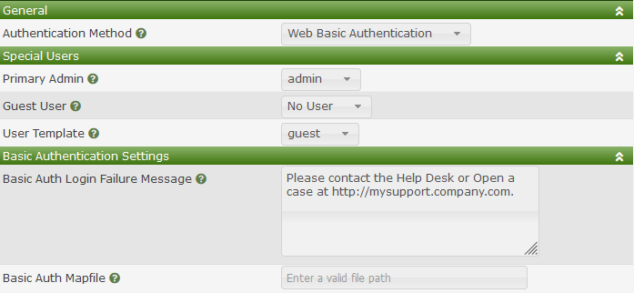

# Basic Authentication

## Overview

Basic Auth settings leverage both Apache's and NGINX Authentication modules
to grant a user access to the Cacti Website.  The various configuration steps
for these modules will not be covered in the Cacti documentation.  Therefore,
if you wish to use this authentication method, it is recommended that
you test your configuration on a development server before putting this
method into production.

> **NOTE**: Before enabling the **Basic Authentication Method**, you must 
> always verify that you are prompted for a password before getting the
> normal Cacti login prompt, and that you have setup a new user account
> with Admin privileges that matches your login account.  Otherwise
> when you enable Basic Authentication, you can lock yourself out of the
> Cacti Website.

## Special Users

The image below shows the settings for **Web Basic Authentication** which
includes the `Special Users` sub-section.

Those settings include:

- **Primary Admin** - This is the Cacti primary administrative account
  this account will receive Cacti notifications and can not be deleted.
- **Guest Account** - This is a special account that allows users to
  access certain pages without being prompted for a login and password.
  Setting to `None`, disables this feature.
- **User Template** - All new users who login for the first time will
  have their initial settings based upon this **User Template**.
- **Basic Auth Login Failure Message** - This textbox can be customized
  in order to provide a useful message to users who have no access to
  Cacti via Basic Authentication and how to resolve the issue.
- **Basic Auth Mapfile** - If your basic users do not match OS users
  you can force a basic account to login with an alternate account.

## Basic Auth Mapfile

This settings is important for plugins that grant certain features
to accounts, but those accounts do not match the login account.  For
example, your basic account maybe: joe.schmoe@company.com, and your
UNIX login account may be `jschmoe`, which grants you certain
plugin permissions, like controlling your own workload.

The mapfile is a file in CSV format, with the first column
being the Basic account (aka joe.schmoe@company.com), and the second 
column being the login account (jschmoe).  It is up-to the Cacti 
administrator to manage and update this file per their local 
site practices.

---
<copy>Copyright (c) 2004-2023 The Cacti Group</copy>
